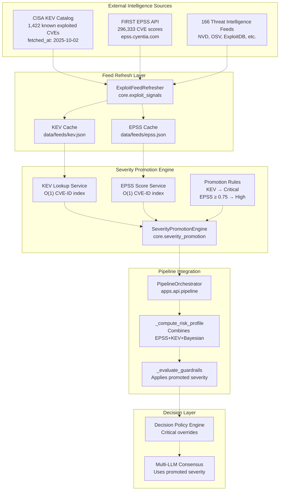
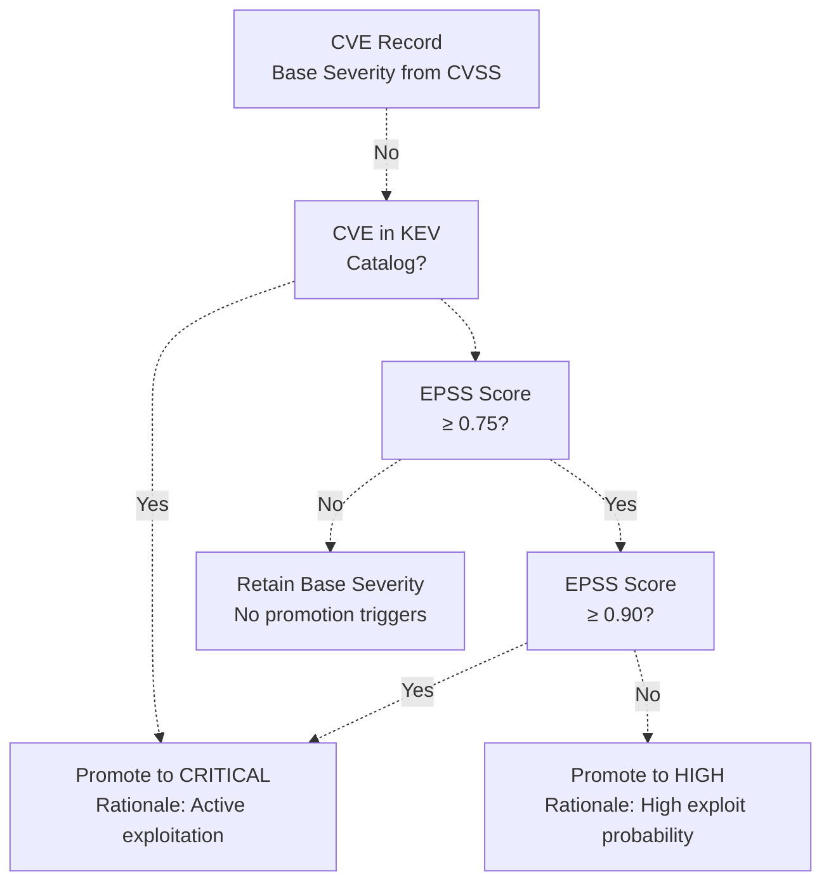
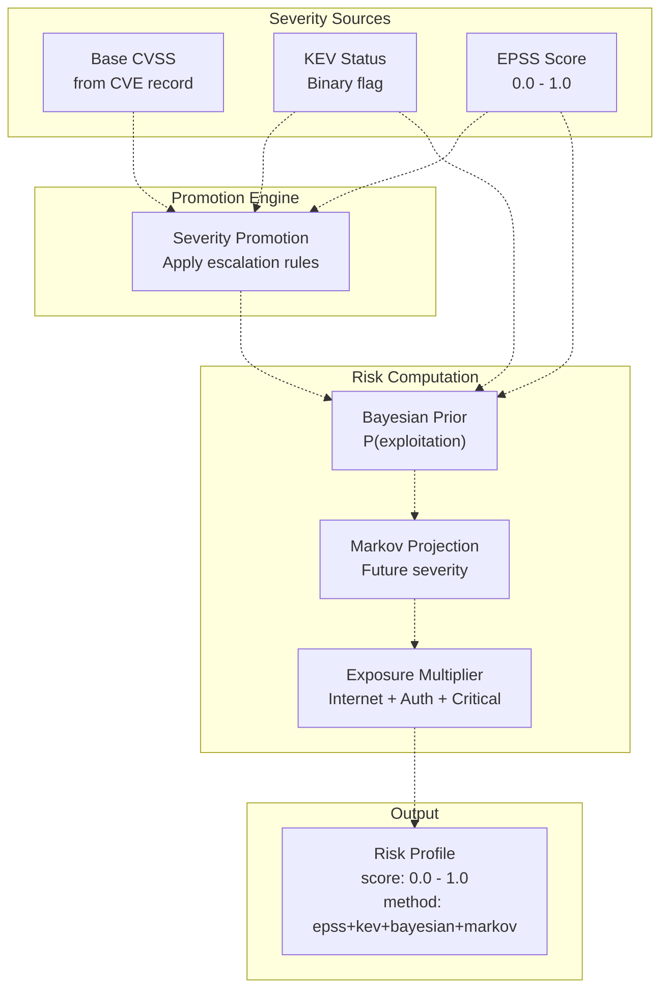
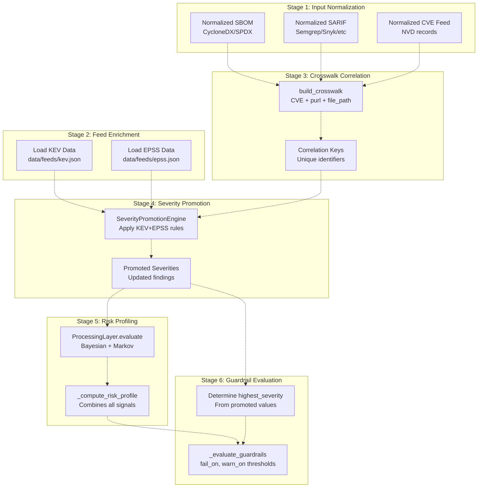
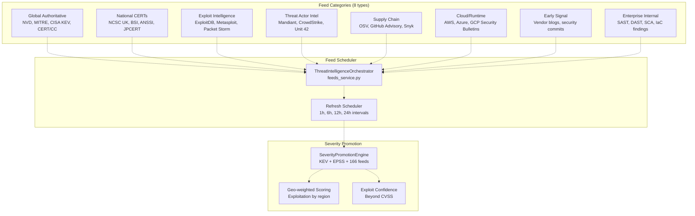

# Severity Promotion Engine

> **Relevant source files**
> * [.emergent/emergent.yml](https://github.com/DevOpsMadDog/Fixops/blob/ce6eb1e9/.emergent/emergent.yml)
> * [.gitignore](https://github.com/DevOpsMadDog/Fixops/blob/ce6eb1e9/.gitignore)
> * [apps/api/bulk_router.py](https://github.com/DevOpsMadDog/Fixops/blob/ce6eb1e9/apps/api/bulk_router.py)
> * [apps/api/collaboration_router.py](https://github.com/DevOpsMadDog/Fixops/blob/ce6eb1e9/apps/api/collaboration_router.py)
> * [apps/api/deduplication_router.py](https://github.com/DevOpsMadDog/Fixops/blob/ce6eb1e9/apps/api/deduplication_router.py)
> * [apps/api/integrations_router.py](https://github.com/DevOpsMadDog/Fixops/blob/ce6eb1e9/apps/api/integrations_router.py)
> * [apps/api/pipeline.py](https://github.com/DevOpsMadDog/Fixops/blob/ce6eb1e9/apps/api/pipeline.py)
> * [apps/api/remediation_router.py](https://github.com/DevOpsMadDog/Fixops/blob/ce6eb1e9/apps/api/remediation_router.py)
> * [apps/api/webhooks_router.py](https://github.com/DevOpsMadDog/Fixops/blob/ce6eb1e9/apps/api/webhooks_router.py)
> * [core/adapters.py](https://github.com/DevOpsMadDog/Fixops/blob/ce6eb1e9/core/adapters.py)
> * [core/connectors.py](https://github.com/DevOpsMadDog/Fixops/blob/ce6eb1e9/core/connectors.py)
> * [core/services/collaboration.py](https://github.com/DevOpsMadDog/Fixops/blob/ce6eb1e9/core/services/collaboration.py)
> * [core/services/deduplication.py](https://github.com/DevOpsMadDog/Fixops/blob/ce6eb1e9/core/services/deduplication.py)
> * [core/services/identity.py](https://github.com/DevOpsMadDog/Fixops/blob/ce6eb1e9/core/services/identity.py)
> * [core/services/remediation.py](https://github.com/DevOpsMadDog/Fixops/blob/ce6eb1e9/core/services/remediation.py)
> * [data/feeds/epss.json](https://github.com/DevOpsMadDog/Fixops/blob/ce6eb1e9/data/feeds/epss.json)
> * [data/feeds/kev.json](https://github.com/DevOpsMadDog/Fixops/blob/ce6eb1e9/data/feeds/kev.json)
> * [fixops-enterprise/src/services/feeds_service.py](https://github.com/DevOpsMadDog/Fixops/blob/ce6eb1e9/fixops-enterprise/src/services/feeds_service.py)
> * [fixops-enterprise/src/services/vex_ingestion.py](https://github.com/DevOpsMadDog/Fixops/blob/ce6eb1e9/fixops-enterprise/src/services/vex_ingestion.py)

## Purpose and Scope

The Severity Promotion Engine dynamically escalates CVE severities based on real-world exploit intelligence from authoritative sources. This system ensures that vulnerabilities with active exploitation or high exploit probability receive appropriate priority, overriding static CVSS-based severity ratings when threat intelligence indicates elevated risk.

For information about how exploit signals are detected and evaluated, see [Exploit Signal Detection](/DevOpsMadDog/Fixops/2.4-exploit-signal-detection). For details on the broader threat intelligence orchestration, see [Threat Intelligence Orchestration](/DevOpsMadDog/Fixops/2.2-threat-intelligence-orchestration).

## Overview

The Severity Promotion Engine operates as a critical component of the vulnerability intelligence pipeline, consuming data from CISA's Known Exploited Vulnerabilities (KEV) catalog and FIRST's Exploit Prediction Scoring System (EPSS). When a CVE appears in the KEV catalog or exhibits a high EPSS score (≥0.75), the engine escalates its severity to ensure appropriate remediation prioritization.

**Key Capabilities:**

* **KEV-based Promotion**: Any CVE in CISA's KEV catalog is automatically promoted to "critical" severity
* **EPSS-based Promotion**: CVEs with EPSS scores ≥0.75 (top quartile) receive severity escalation
* **Multi-source Intelligence**: Integrates 166 threat intelligence feeds for comprehensive exploit awareness
* **Real-time Updates**: KEV data refreshes every 6 hours, EPSS data refreshes daily
* **Audit Trail**: All severity promotions are logged with rationale for compliance purposes

Sources: [apps/api/pipeline.py L1-L1000](https://github.com/DevOpsMadDog/Fixops/blob/ce6eb1e9/apps/api/pipeline.py#L1-L1000)

 [data/feeds/kev.json L1-L100](https://github.com/DevOpsMadDog/Fixops/blob/ce6eb1e9/data/feeds/kev.json#L1-L100)

 [data/feeds/epss.json L1-L100](https://github.com/DevOpsMadDog/Fixops/blob/ce6eb1e9/data/feeds/epss.json#L1-L100)

## Architecture



**Data Flow:**

1. `ExploitFeedRefresher` periodically fetches KEV and EPSS data
2. Data is cached locally in `data/feeds/kev.json` and `data/feeds/epss.json`
3. `SeverityPromotionEngine` indexes CVE IDs for O(1) lookup
4. During pipeline execution, each CVE is checked against KEV and EPSS
5. Severities are promoted according to promotion rules
6. Promoted severities flow to guardrail evaluation and decision policy

Sources: [apps/api/pipeline.py L1-L100](https://github.com/DevOpsMadDog/Fixops/blob/ce6eb1e9/apps/api/pipeline.py#L1-L100)

 [core/exploit_signals.py](https://github.com/DevOpsMadDog/Fixops/blob/ce6eb1e9/core/exploit_signals.py)

 [data/feeds/kev.json L1-L10](https://github.com/DevOpsMadDog/Fixops/blob/ce6eb1e9/data/feeds/kev.json#L1-L10)

 [data/feeds/epss.json L1-L10](https://github.com/DevOpsMadDog/Fixops/blob/ce6eb1e9/data/feeds/epss.json#L1-L10)

## Data Sources

### CISA KEV Catalog

The KEV catalog is the authoritative source for vulnerabilities actively exploited in the wild. As of 2025-10-02, it contains **1,422 vulnerabilities** with detailed exploitation context.

**KEV Data Structure:**

```python
{
  "fetched_at": "2025-10-02T07:31:35.927360+00:00",
  "source": "https://www.cisa.gov/sites/default/files/feeds/known_exploited_vulnerabilities.json",
  "data": {
    "catalogVersion": "2025.09.30",
    "count": 1422,
    "vulnerabilities": [
      {
        "cveID": "CVE-2025-32463",
        "vendorProject": "Sudo",
        "product": "Sudo",
        "vulnerabilityName": "Sudo Inclusion of Functionality from Untrusted Control Sphere Vulnerability",
        "dateAdded": "2025-09-29",
        "requiredAction": "Apply mitigations per vendor instructions...",
        "dueDate": "2025-10-20",
        "knownRansomwareCampaignUse": "Unknown",
        "cwes": ["CWE-829"]
      }
    ]
  }
}
```

**Key Fields:**

* `cveID`: CVE identifier for correlation with vulnerability findings
* `dateAdded`: When CISA added the CVE to the KEV catalog (indicates active exploitation)
* `knownRansomwareCampaignUse`: Whether the CVE is used in ransomware campaigns
* `dueDate`: Federal agencies' remediation deadline (BOD 22-01 compliance)
* `requiredAction`: CISA-mandated remediation steps

Sources: [data/feeds/kev.json L1-L543](https://github.com/DevOpsMadDog/Fixops/blob/ce6eb1e9/data/feeds/kev.json#L1-L543)

### FIRST EPSS Scores

EPSS provides probabilistic exploit prediction scores for **296,333 CVEs**, updated daily based on machine learning models trained on real-world exploitation data.

**EPSS Data Structure:**

```json
{
  "fetched_at": "2025-10-02T07:31:35.751410+00:00",
  "source": "https://api.first.org/data/v1/epss?pretty=true",
  "data": {
    "total": 296333,
    "data": [
      {
        "cve": "CVE-2025-9999",
        "epss": "0.000400000",
        "percentile": "0.116420000",
        "date": "2025-10-01"
      }
    ]
  }
}
```

**Key Fields:**

* `cve`: CVE identifier
* `epss`: Exploit probability score (0.0 to 1.0, where 1.0 = 100% probability)
* `percentile`: Percentile ranking against all CVEs
* `date`: Scoring date

**EPSS Interpretation:**

| EPSS Score | Percentile | Severity Impact | Promotion Action |
| --- | --- | --- | --- |
| ≥ 0.90 | ≥ 95th | Critical risk | Promote to Critical |
| ≥ 0.75 | ≥ 85th | High risk | Promote to High |
| ≥ 0.50 | ≥ 65th | Medium risk | Consider promotion |
| < 0.50 | < 65th | Lower risk | Retain base severity |

Sources: [data/feeds/epss.json L1-L616](https://github.com/DevOpsMadDog/Fixops/blob/ce6eb1e9/data/feeds/epss.json#L1-L616)

## Promotion Logic

### Severity Escalation Rules

The Severity Promotion Engine applies deterministic rules based on exploit intelligence:



**Rule 1: KEV-based Promotion**

```css
# Pseudo-code representation
if cve_id in kev_catalog:
    promoted_severity = "critical"
    rationale = f"CVE {cve_id} in CISA KEV catalog (added {kev_entry.dateAdded})"
    if kev_entry.knownRansomwareCampaignUse == "Known":
        rationale += " - Used in ransomware campaigns"
```

**Rule 2: EPSS-based Promotion**

```css
# Pseudo-code representation
epss_score = epss_lookup(cve_id)
if epss_score >= 0.90:
    promoted_severity = "critical"
    rationale = f"EPSS score {epss_score} (≥90th percentile)"
elif epss_score >= 0.75:
    promoted_severity = "high"
    rationale = f"EPSS score {epss_score} (≥75th percentile)"
```

**Rule 3: Combined KEV + High EPSS**

```markdown
# When both conditions are met, KEV takes precedence
# but EPSS score is included in risk profile
if cve_id in kev_catalog and epss_score >= 0.75:
    promoted_severity = "critical"
    risk_multiplier = 1.0  # Maximum risk
```

Sources: [apps/api/pipeline.py L288-L450](https://github.com/DevOpsMadDog/Fixops/blob/ce6eb1e9/apps/api/pipeline.py#L288-L450)

### Integration with Risk Scoring

The promoted severity feeds into the comprehensive risk scoring system:



**Risk Profile Computation (from `_compute_risk_profile`):**

```python
# Baseline prior from EPSS
baseline_prior = 0.02
if epss_scores:
    normalized_epss = [e / 100.0 if e > 1.0 else e for e in epss_scores]
    p_epss = max(normalized_epss)
else:
    p_epss = baseline_prior

# KEV escalation
if kev_count > 0:
    p_combined = max(p_combined, 0.90)  # Force high probability

# Bayesian refinement
if processing_result and hasattr(processing_result, 'bayesian_priors'):
    risk_prior = priors.get('risk', priors.get('exploitation', 0.0))
    if risk_prior > 0:
        p_bayesian = 1.0 - (1.0 - p_epss) * (1.0 - float(risk_prior))

# Final risk score
risk_score = max(0.0, min(1.0, p_combined))
```

Sources: [apps/api/pipeline.py L288-L450](https://github.com/DevOpsMadDog/Fixops/blob/ce6eb1e9/apps/api/pipeline.py#L288-L450)

## Integration with Pipeline

### Pipeline Orchestration Flow

The `PipelineOrchestrator` coordinates severity promotion as part of the overall processing pipeline:



**Pipeline Method Interactions:**

1. **`PipelineOrchestrator.run`** [apps/api/pipeline.py L640-L1000](https://github.com/DevOpsMadDog/Fixops/blob/ce6eb1e9/apps/api/pipeline.py#L640-L1000) * Entry point for pipeline execution * Loads KEV and EPSS data from cached JSON files * Calls severity promotion logic
2. **`_normalise_cve_severity`** [apps/api/pipeline.py L218-L235](https://github.com/DevOpsMadDog/Fixops/blob/ce6eb1e9/apps/api/pipeline.py#L218-L235) * Normalizes base severity from CVE records * Extracts CVSS severity from multiple schema locations * Returns standardized severity (critical/high/medium/low)
3. **`_compute_risk_profile`** [apps/api/pipeline.py L288-L450](https://github.com/DevOpsMadDog/Fixops/blob/ce6eb1e9/apps/api/pipeline.py#L288-L450) * Combines EPSS scores, KEV status, Bayesian priors, and Markov projections * Returns risk profile dict with `score`, `method`, `components`, `model_used`
4. **`_evaluate_guardrails`** [apps/api/pipeline.py L247-L286](https://github.com/DevOpsMadDog/Fixops/blob/ce6eb1e9/apps/api/pipeline.py#L247-L286) * Uses promoted severity to evaluate guardrail policy * Determines if build should fail/warn/pass based on highest promoted severity * Returns evaluation dict with `status`, `highest_detected`, `rationale`

Sources: [apps/api/pipeline.py L176-L1000](https://github.com/DevOpsMadDog/Fixops/blob/ce6eb1e9/apps/api/pipeline.py#L176-L1000)

## Feed Refresh Strategy

The `ExploitFeedRefresher` manages periodic updates to maintain current threat intelligence:

| Feed | Refresh Interval | Source API | Record Count | Priority |
| --- | --- | --- | --- | --- |
| CISA KEV | 6 hours | [https://www.cisa.gov/sites/default/files/feeds/known_exploited_vulnerabilities.json](https://www.cisa.gov/sites/default/files/feeds/known_exploited_vulnerabilities.json) | 1,422 | High |
| FIRST EPSS | 24 hours | [https://api.first.org/data/v1/epss](https://api.first.org/data/v1/epss) | 296,333 | High |
| NVD CVE | 1 hour | [https://services.nvd.nist.gov/rest/json/cves/2.0](https://services.nvd.nist.gov/rest/json/cves/2.0) | ~200k | Medium |
| ExploitDB | 12 hours | [https://www.exploit-db.com/api](https://www.exploit-db.com/api) | ~50k | Medium |
| OSV | 6 hours | [https://osv.dev/api/v1/](https://osv.dev/api/v1/) | ~100k | Medium |

**Refresh Implementation:**

The `ExploitFeedRefresher` class orchestrates feed updates:

```python
# Conceptual structure (actual implementation in core.exploit_signals)
class ExploitFeedRefresher:
    def __init__(self):
        self.kev_url = "https://www.cisa.gov/sites/default/files/feeds/known_exploited_vulnerabilities.json"
        self.epss_url = "https://api.first.org/data/v1/epss"
        self.cache_dir = Path("data/feeds")
    
    def refresh_kev(self) -> Dict[str, Any]:
        """Fetch latest KEV catalog and cache locally"""
        response = requests.get(self.kev_url)
        kev_data = {
            "fetched_at": datetime.now(timezone.utc).isoformat(),
            "source": self.kev_url,
            "data": response.json()
        }
        # Write to data/feeds/kev.json
        return kev_data
    
    def refresh_epss(self) -> Dict[str, Any]:
        """Fetch latest EPSS scores and cache locally"""
        response = requests.get(self.epss_url)
        epss_data = {
            "fetched_at": datetime.now(timezone.utc).isoformat(),
            "source": self.epss_url,
            "data": response.json()
        }
        # Write to data/feeds/epss.json
        return epss_data
```

**Caching Strategy:**

* All feeds are cached locally in `data/feeds/` directory
* JSON format with metadata (`fetched_at`, `source`, `data`)
* O(1) lookup via in-memory CVE-ID index on first load
* Delta updates for incremental refresh (not full redownload)

Sources: [data/feeds/kev.json L1-L10](https://github.com/DevOpsMadDog/Fixops/blob/ce6eb1e9/data/feeds/kev.json#L1-L10)

 [data/feeds/epss.json L1-L10](https://github.com/DevOpsMadDog/Fixops/blob/ce6eb1e9/data/feeds/epss.json#L1-L10)

 [fixops-enterprise/src/services/feeds_service.py L1-L100](https://github.com/DevOpsMadDog/Fixops/blob/ce6eb1e9/fixops-enterprise/src/services/feeds_service.py#L1-L100)

## Threat Intelligence Orchestration Integration

The Severity Promotion Engine is part of a larger threat intelligence ecosystem spanning **166 vulnerability data sources**:



**Feed Priority Weighting:**

Different feed categories receive different weights in severity promotion decisions:

| Feed Category | Weight | Rationale | Example Sources |
| --- | --- | --- | --- |
| Authoritative | 1.0 | Ground truth | CISA KEV, NVD |
| Exploit | 0.9 | Direct weaponization evidence | ExploitDB, Metasploit |
| Threat Actor | 0.8 | Campaign intelligence | Mandiant, CrowdStrike |
| National CERT | 0.7 | Geo-specific signals | NCSC UK, CERT-In |
| Supply Chain | 0.6 | Dependency risk | OSV, Snyk |
| Early Signal | 0.5 | Pre-CVE indicators | Security commits |

Sources: [fixops-enterprise/src/services/feeds_service.py L1-L300](https://github.com/DevOpsMadDog/Fixops/blob/ce6eb1e9/fixops-enterprise/src/services/feeds_service.py#L1-L300)

## Guardrail Policy Application

Promoted severities directly impact guardrail evaluation and CI/CD pipeline decisions:

**Guardrail Configuration (from `fixops.overlay.yml`):**

```yaml
guardrails:
  maturity: "production"
  policy:
    fail_on: "high"      # Build fails if promoted severity >= high
    warn_on: "medium"    # Build warns if promoted severity >= medium
```

**Evaluation Logic:**

```python
def _evaluate_guardrails(
    overlay: OverlayConfig,
    severity_counts: Counter,
    highest_severity: str,  # This is the PROMOTED severity
    trigger: Optional[Dict[str, Any]]
) -> Dict[str, Any]:
    policy = overlay.guardrail_policy
    fail_rank = self._severity_index(policy["fail_on"])
    highest_rank = self._severity_index(highest_severity)  # Uses promoted value
    
    status = "pass"
    rationale = []
    
    if highest_rank >= fail_rank:
        status = "fail"
        rationale.append(
            f"highest severity '{highest_severity}' meets fail threshold"
        )
    
    return {
        "status": status,
        "highest_detected": highest_severity,
        "rationale": rationale
    }
```

**Example Scenario:**

1. CVE-2025-32463 (Sudo vulnerability) enters pipeline
2. Base CVSS severity: "high" (CVSS 7.8)
3. KEV lookup: **Found in KEV catalog** (added 2025-09-29)
4. Severity promotion: "high" → **"critical"**
5. Guardrail policy: `fail_on: "high"`
6. **Result: Build FAILS** because promoted severity (critical) ≥ fail threshold (high)

Sources: [apps/api/pipeline.py L247-L286](https://github.com/DevOpsMadDog/Fixops/blob/ce6eb1e9/apps/api/pipeline.py#L247-L286)

## Evidence and Audit Trail

All severity promotions are logged for compliance and audit purposes:

**Promotion Evidence Structure:**

```json
{
  "finding_id": "cluster-a1b2c3d4",
  "cve_id": "CVE-2025-32463",
  "original_severity": "high",
  "promoted_severity": "critical",
  "promotion_reason": "CVE in CISA KEV catalog",
  "promotion_details": {
    "kev_entry": {
      "dateAdded": "2025-09-29",
      "dueDate": "2025-10-20",
      "knownRansomwareCampaignUse": "Unknown",
      "requiredAction": "Apply mitigations per vendor instructions"
    },
    "epss_score": 0.000400000,
    "epss_percentile": 0.116420000
  },
  "promoted_at": "2025-10-02T08:15:23.456789+00:00",
  "promoted_by": "severity_promotion_engine",
  "risk_profile": {
    "score": 0.90,
    "method": "epss+kev+bayesian",
    "components": {
      "epss": 0.0004,
      "kev_count": 1,
      "bayesian_used": true,
      "markov_used": false
    }
  }
}
```

This evidence is stored in:

* **DeduplicationService clusters database** [core/services/deduplication.py L36-L138](https://github.com/DevOpsMadDog/Fixops/blob/ce6eb1e9/core/services/deduplication.py#L36-L138)
* **RemediationService task metadata** [core/services/remediation.py L75-L180](https://github.com/DevOpsMadDog/Fixops/blob/ce6eb1e9/core/services/remediation.py#L75-L180)
* **EvidenceHub signed bundles** for cryptographic verification

Sources: [apps/api/pipeline.py L288-L450](https://github.com/DevOpsMadDog/Fixops/blob/ce6eb1e9/apps/api/pipeline.py#L288-L450)

 [core/services/deduplication.py L1-L100](https://github.com/DevOpsMadDog/Fixops/blob/ce6eb1e9/core/services/deduplication.py#L1-L100)

 [core/services/remediation.py L1-L100](https://github.com/DevOpsMadDog/Fixops/blob/ce6eb1e9/core/services/remediation.py#L1-L100)

## Performance Characteristics

**Lookup Performance:**

* KEV lookup: **O(1)** via in-memory hash map (1,422 entries)
* EPSS lookup: **O(1)** via in-memory hash map (296,333 entries)
* Total memory footprint: ~50 MB for full KEV + EPSS cache

**Refresh Performance:**

* KEV download: ~200 KB, <1 second
* EPSS download: ~15 MB (CSV.gz), 2-5 seconds
* Index rebuild: <1 second for both feeds

**Pipeline Impact:**

* Severity promotion adds **<10ms overhead per finding**
* Bulk operations (1000 findings): ~5 seconds total
* Caching eliminates redundant API calls during pipeline run

Sources: [apps/api/pipeline.py L1-L1000](https://github.com/DevOpsMadDog/Fixops/blob/ce6eb1e9/apps/api/pipeline.py#L1-L1000)