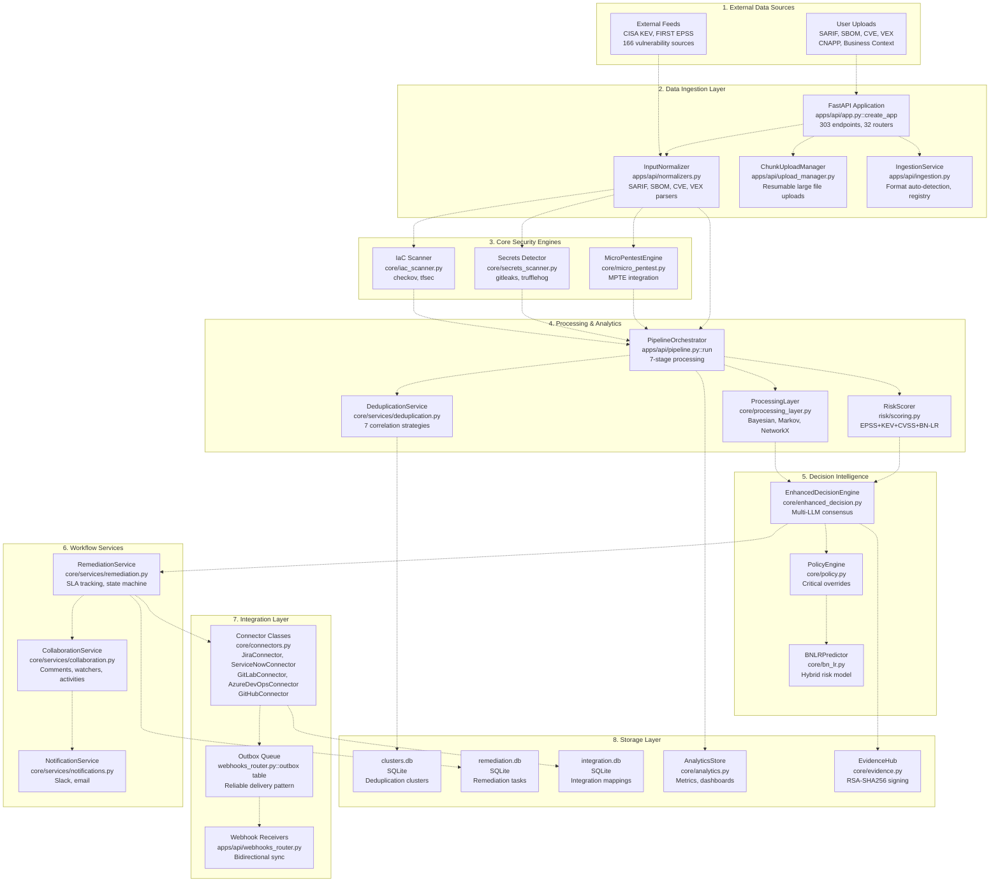
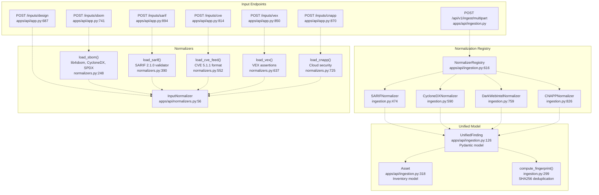
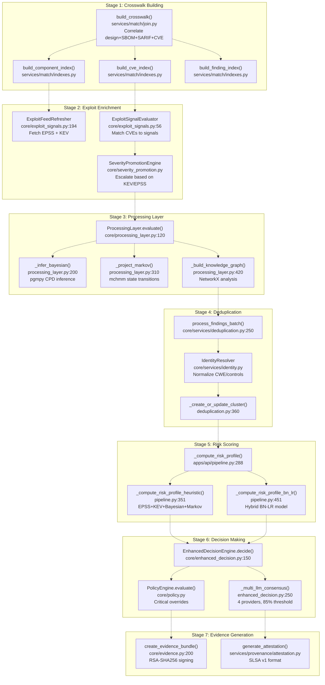
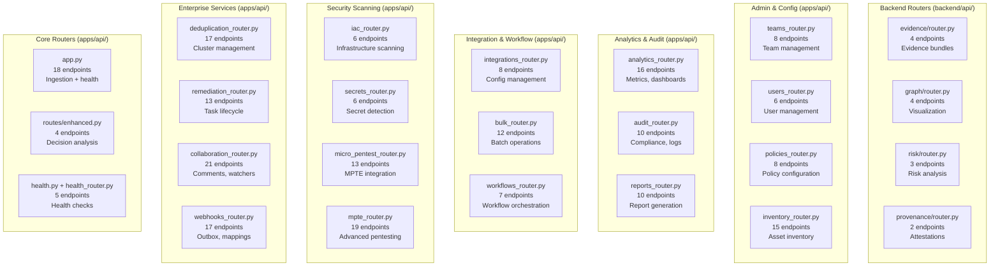
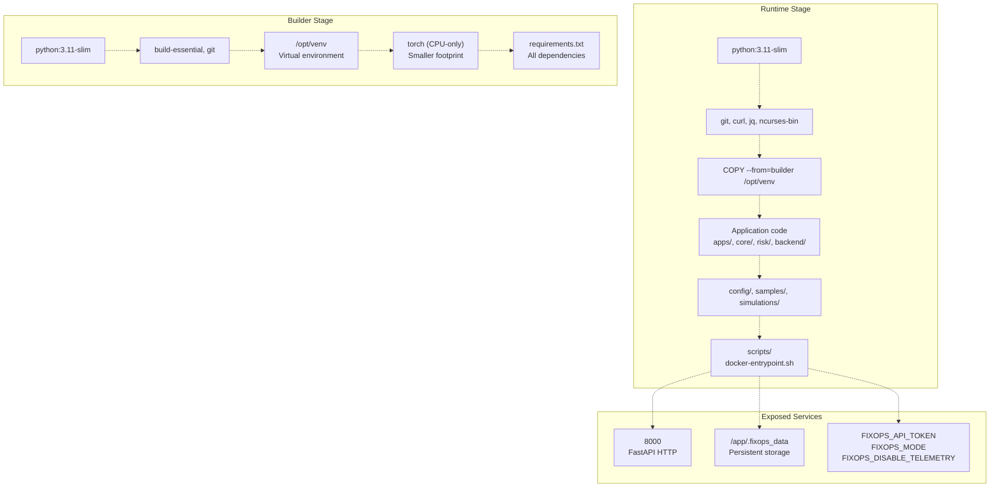

# System Architecture

> **Relevant source files**
> * [.github/workflows/docker-build.yml](https://github.com/DevOpsMadDog/Fixops/blob/ce6eb1e9/.github/workflows/docker-build.yml)
> * [Dockerfile](https://github.com/DevOpsMadDog/Fixops/blob/ce6eb1e9/Dockerfile)
> * [apps/api/app.py](https://github.com/DevOpsMadDog/Fixops/blob/ce6eb1e9/apps/api/app.py)
> * [apps/api/bulk_router.py](https://github.com/DevOpsMadDog/Fixops/blob/ce6eb1e9/apps/api/bulk_router.py)
> * [apps/api/collaboration_router.py](https://github.com/DevOpsMadDog/Fixops/blob/ce6eb1e9/apps/api/collaboration_router.py)
> * [apps/api/deduplication_router.py](https://github.com/DevOpsMadDog/Fixops/blob/ce6eb1e9/apps/api/deduplication_router.py)
> * [apps/api/ingestion.py](https://github.com/DevOpsMadDog/Fixops/blob/ce6eb1e9/apps/api/ingestion.py)
> * [apps/api/integrations_router.py](https://github.com/DevOpsMadDog/Fixops/blob/ce6eb1e9/apps/api/integrations_router.py)
> * [apps/api/pipeline.py](https://github.com/DevOpsMadDog/Fixops/blob/ce6eb1e9/apps/api/pipeline.py)
> * [apps/api/remediation_router.py](https://github.com/DevOpsMadDog/Fixops/blob/ce6eb1e9/apps/api/remediation_router.py)
> * [apps/api/webhooks_router.py](https://github.com/DevOpsMadDog/Fixops/blob/ce6eb1e9/apps/api/webhooks_router.py)
> * [config/normalizers/registry.yaml](https://github.com/DevOpsMadDog/Fixops/blob/ce6eb1e9/config/normalizers/registry.yaml)
> * [core/adapters.py](https://github.com/DevOpsMadDog/Fixops/blob/ce6eb1e9/core/adapters.py)
> * [core/cli.py](https://github.com/DevOpsMadDog/Fixops/blob/ce6eb1e9/core/cli.py)
> * [core/connectors.py](https://github.com/DevOpsMadDog/Fixops/blob/ce6eb1e9/core/connectors.py)
> * [core/micro_pentest.py](https://github.com/DevOpsMadDog/Fixops/blob/ce6eb1e9/core/micro_pentest.py)
> * [core/services/collaboration.py](https://github.com/DevOpsMadDog/Fixops/blob/ce6eb1e9/core/services/collaboration.py)
> * [core/services/deduplication.py](https://github.com/DevOpsMadDog/Fixops/blob/ce6eb1e9/core/services/deduplication.py)
> * [core/services/identity.py](https://github.com/DevOpsMadDog/Fixops/blob/ce6eb1e9/core/services/identity.py)
> * [core/services/remediation.py](https://github.com/DevOpsMadDog/Fixops/blob/ce6eb1e9/core/services/remediation.py)
> * [docs/COMPLETE_API_CLI_MAPPING.md](https://github.com/DevOpsMadDog/Fixops/blob/ce6eb1e9/docs/COMPLETE_API_CLI_MAPPING.md)
> * [docs/FIXOPS_PRODUCT_STATUS.md](https://github.com/DevOpsMadDog/Fixops/blob/ce6eb1e9/docs/FIXOPS_PRODUCT_STATUS.md)
> * [fixops-enterprise/src/services/feeds_service.py](https://github.com/DevOpsMadDog/Fixops/blob/ce6eb1e9/fixops-enterprise/src/services/feeds_service.py)
> * [fixops-enterprise/src/services/vex_ingestion.py](https://github.com/DevOpsMadDog/Fixops/blob/ce6eb1e9/fixops-enterprise/src/services/vex_ingestion.py)
> * [scripts/docker-entrypoint.sh](https://github.com/DevOpsMadDog/Fixops/blob/ce6eb1e9/scripts/docker-entrypoint.sh)
> * [tests/test_enterprise_services.py](https://github.com/DevOpsMadDog/Fixops/blob/ce6eb1e9/tests/test_enterprise_services.py)
> * [tests/test_ingestion.py](https://github.com/DevOpsMadDog/Fixops/blob/ce6eb1e9/tests/test_ingestion.py)
> * [tests/test_micro_pentest_cli.py](https://github.com/DevOpsMadDog/Fixops/blob/ce6eb1e9/tests/test_micro_pentest_cli.py)
> * [tests/test_micro_pentest_core.py](https://github.com/DevOpsMadDog/Fixops/blob/ce6eb1e9/tests/test_micro_pentest_core.py)
> * [tests/test_micro_pentest_router.py](https://github.com/DevOpsMadDog/Fixops/blob/ce6eb1e9/tests/test_micro_pentest_router.py)
> * [web/apps/micro-pentest/app/components/EnterpriseShell.tsx](https://github.com/DevOpsMadDog/Fixops/blob/ce6eb1e9/web/apps/micro-pentest/app/components/EnterpriseShell.tsx)
> * [web/apps/micro-pentest/app/globals.css](https://github.com/DevOpsMadDog/Fixops/blob/ce6eb1e9/web/apps/micro-pentest/app/globals.css)
> * [web/apps/micro-pentest/app/layout.tsx](https://github.com/DevOpsMadDog/Fixops/blob/ce6eb1e9/web/apps/micro-pentest/app/layout.tsx)
> * [web/apps/reachability/app/components/EnterpriseShell.tsx](https://github.com/DevOpsMadDog/Fixops/blob/ce6eb1e9/web/apps/reachability/app/components/EnterpriseShell.tsx)
> * [web/apps/reachability/app/globals.css](https://github.com/DevOpsMadDog/Fixops/blob/ce6eb1e9/web/apps/reachability/app/globals.css)
> * [web/apps/reachability/app/layout.tsx](https://github.com/DevOpsMadDog/Fixops/blob/ce6eb1e9/web/apps/reachability/app/layout.tsx)

**Purpose**: This document describes the overall architecture of the FixOps platform, including the major system components, their interactions, and data flows. It provides a technical reference for understanding how the various subsystems fit together to deliver security decision-making and remediation workflow capabilities.

**Scope**: This page covers the high-level architectural patterns, component organization, and communication flows. For detailed information about specific subsystems:

* For vulnerability intelligence feeds and threat data, see [Vulnerability Intelligence System](/DevOpsMadDog/Fixops/2-vulnerability-intelligence-system)
* For data ingestion and normalization details, see [Data Ingestion Layer](/DevOpsMadDog/Fixops/3-data-ingestion-layer)
* For decision-making algorithms and LLM consensus, see [Decision Engine](/DevOpsMadDog/Fixops/4-decision-engine)
* For the processing pipeline orchestration, see [Pipeline Orchestration](/DevOpsMadDog/Fixops/6-pipeline-orchestration)

---

## Overall System Architecture

The FixOps platform is organized into seven major architectural layers, each responsible for specific concerns in the security decision pipeline.

**Sources**: [apps/api/app.py L266-L592](https://github.com/DevOpsMadDog/Fixops/blob/ce6eb1e9/apps/api/app.py#L266-L592)

 [apps/api/pipeline.py L176-L693](https://github.com/DevOpsMadDog/Fixops/blob/ce6eb1e9/apps/api/pipeline.py#L176-L693)

 [core/connectors.py L1-L100](https://github.com/DevOpsMadDog/Fixops/blob/ce6eb1e9/core/connectors.py#L1-L100)

 [apps/api/webhooks_router.py L1-L140](https://github.com/DevOpsMadDog/Fixops/blob/ce6eb1e9/apps/api/webhooks_router.py#L1-L140)

---

## FastAPI Application Factory Pattern

The core API application uses a factory pattern to initialize all components with proper dependency injection and configuration.

```mermaid
flowchart TD

CreateApp["create_app()<br>apps/api/app.py:266"]
LoadOverlay["load_overlay()<br>core/configuration.py<br>fixops.overlay.yml"]
FlagProvider["create_flag_provider()<br>core/flags/provider_factory.py<br>Feature flags"]
CorrelationId["CorrelationIdMiddleware<br>apps/api/middleware.py<br>Request tracing"]
RequestLogging["RequestLoggingMiddleware<br>apps/api/middleware.py<br>Access logs"]
CORSMiddleware["CORSMiddleware<br>FIXOPS_ALLOWED_ORIGINS"]
AuthMiddleware["_verify_api_key()<br>apps/api/app.py:353<br>API key / JWT"]
Normalizer["InputNormalizer()<br>apps/api/normalizers.py"]
Orchestrator["PipelineOrchestrator()<br>apps/api/pipeline.py"]
Archive["ArtefactArchive<br>core/storage.py<br>Persist inputs"]
AnalyticsStore["AnalyticsStore<br>core/analytics.py<br>Metrics storage"]
EnhancedEngine["EnhancedDecisionEngine<br>core/enhanced_decision.py"]
UploadMgr["ChunkUploadManager<br>apps/api/upload_manager.py"]
HealthRouter["health_router<br>apps/api/health.py"]
EnhancedRouter["enhanced_router<br>apps/api/routes/enhanced.py"]
DedupRouter["deduplication_router<br>apps/api/deduplication_router.py"]
RemediationRouter["remediation_router<br>apps/api/remediation_router.py"]
IntegrationRouter["integrations_router<br>apps/api/integrations_router.py"]
WebhookRouter["webhooks_router<br>apps/api/webhooks_router.py"]
MicroPentestRouter["micro_pentest_router<br>apps/api/micro_pentest_router.py"]

CreateApp -.-> CorrelationId
CreateApp -.-> Normalizer
CreateApp -.-> Orchestrator
CreateApp -.-> Archive
CreateApp -.-> AnalyticsStore
CreateApp -.-> EnhancedEngine
CreateApp -.-> UploadMgr
CreateApp -.-> HealthRouter
CreateApp -.-> EnhancedRouter
CreateApp -.-> DedupRouter
CreateApp -.-> RemediationRouter
CreateApp -.-> IntegrationRouter
CreateApp -.-> WebhookRouter
CreateApp -.-> MicroPentestRouter
HealthRouter -.-> AuthMiddleware
EnhancedRouter -.-> AuthMiddleware
DedupRouter -.-> AuthMiddleware
RemediationRouter -.-> AuthMiddleware

subgraph subGraph3 ["Router Registration"]
    HealthRouter
    EnhancedRouter
    DedupRouter
    RemediationRouter
    IntegrationRouter
    WebhookRouter
    MicroPentestRouter
end

subgraph subGraph2 ["Core Services Initialization"]
    Normalizer
    Orchestrator
    Archive
    AnalyticsStore
    EnhancedEngine
    UploadMgr
end

subgraph subGraph1 ["Middleware Stack"]
    CorrelationId
    RequestLogging
    CORSMiddleware
    AuthMiddleware
    CorrelationId -.-> RequestLogging
    RequestLogging -.-> CORSMiddleware
    CORSMiddleware -.-> AuthMiddleware
end

subgraph subGraph0 ["Application Factory"]
    CreateApp
    LoadOverlay
    FlagProvider
    CreateApp -.-> LoadOverlay
    LoadOverlay -.-> FlagProvider
end
```

The `create_app()` function performs the following initialization sequence:

1. **Configuration Loading** ([apps/api/app.py L270-L275](https://github.com/DevOpsMadDog/Fixops/blob/ce6eb1e9/apps/api/app.py#L270-L275) ): Loads `fixops.overlay.yml` configuration and creates feature flag provider
2. **Telemetry Setup** ([apps/api/app.py L287](https://github.com/DevOpsMadDog/Fixops/blob/ce6eb1e9/apps/api/app.py#L287-L287) ): Configures OpenTelemetry with branding from flags
3. **Middleware Registration** ([apps/api/app.py L305-L340](https://github.com/DevOpsMadDog/Fixops/blob/ce6eb1e9/apps/api/app.py#L305-L340) ): Adds correlation ID, logging, CORS, and custom headers
4. **Service Initialization** ([apps/api/app.py L342-L467](https://github.com/DevOpsMadDog/Fixops/blob/ce6eb1e9/apps/api/app.py#L342-L467) ): Creates normalizer, orchestrator, archive, analytics store, evidence hub, and upload manager
5. **Directory Verification** ([apps/api/app.py L370-L465](https://github.com/DevOpsMadDog/Fixops/blob/ce6eb1e9/apps/api/app.py#L370-L465) ): Ensures all data directories exist and are within allowlist
6. **Router Mounting** ([apps/api/app.py L469-L591](https://github.com/DevOpsMadDog/Fixops/blob/ce6eb1e9/apps/api/app.py#L469-L591) ): Includes all 32+ routers with authentication dependencies

**Sources**: [apps/api/app.py L266-L592](https://github.com/DevOpsMadDog/Fixops/blob/ce6eb1e9/apps/api/app.py#L266-L592)

 [core/configuration.py L1-L100](https://github.com/DevOpsMadDog/Fixops/blob/ce6eb1e9/core/configuration.py#L1-L100)

 [apps/api/middleware.py L1-L50](https://github.com/DevOpsMadDog/Fixops/blob/ce6eb1e9/apps/api/middleware.py#L1-L50)

---

## Data Ingestion Architecture

The ingestion layer supports multiple input formats with automatic format detection and normalization to a unified finding model.

The ingestion layer implements two normalization approaches:

### Legacy Format-Specific Normalizers

The `InputNormalizer` class ([apps/api/normalizers.py L56-L900](https://github.com/DevOpsMadDog/Fixops/blob/ce6eb1e9/apps/api/normalizers.py#L56-L900)

) provides dedicated parsers for each format:

* `load_sbom()`: Supports CycloneDX, SPDX, and Syft with lib4sbom fallback ([normalizers.py L248-L388](https://github.com/DevOpsMadDog/Fixops/blob/ce6eb1e9/normalizers.py#L248-L388) )
* `load_sarif()`: Validates SARIF 2.1.0 schema with lenient parsing ([normalizers.py L390-L550](https://github.com/DevOpsMadDog/Fixops/blob/ce6eb1e9/normalizers.py#L390-L550) )
* `load_cve_feed()`: Parses CVE 5.1.1 format with validation ([normalizers.py L552-L635](https://github.com/DevOpsMadDog/Fixops/blob/ce6eb1e9/normalizers.py#L552-L635) )
* `load_vex()`: Extracts VEX suppression assertions ([normalizers.py L637-L723](https://github.com/DevOpsMadDog/Fixops/blob/ce6eb1e9/normalizers.py#L637-L723) )
* `load_cnapp()`: Normalizes cloud security findings ([normalizers.py L725-L848](https://github.com/DevOpsMadDog/Fixops/blob/ce6eb1e9/normalizers.py#L725-L848) )

### Plugin-Based Normalization Registry

The `NormalizerRegistry` ([apps/api/ingestion.py L616-L750](https://github.com/DevOpsMadDog/Fixops/blob/ce6eb1e9/apps/api/ingestion.py#L616-L750)

) enables dynamic format detection:

* **Auto-Detection**: Uses regex patterns and confidence scoring to identify formats ([ingestion.py L403-L418](https://github.com/DevOpsMadDog/Fixops/blob/ce6eb1e9/ingestion.py#L403-L418) )
* **Extensibility**: YAML-based plugin configuration ([config/normalizers/registry.yaml L1-L200](https://github.com/DevOpsMadDog/Fixops/blob/ce6eb1e9/config/normalizers/registry.yaml#L1-L200) )
* **Unified Output**: All normalizers produce `UnifiedFinding` models ([ingestion.py L126-L316](https://github.com/DevOpsMadDog/Fixops/blob/ce6eb1e9/ingestion.py#L126-L316) )
* **Performance**: 10K findings in <2 minutes with 99% parse success ([ingestion.py L13](https://github.com/DevOpsMadDog/Fixops/blob/ce6eb1e9/ingestion.py#L13-L13) )

**Sources**: [apps/api/app.py L687-L960](https://github.com/DevOpsMadDog/Fixops/blob/ce6eb1e9/apps/api/app.py#L687-L960)

 [apps/api/normalizers.py L56-L900](https://github.com/DevOpsMadDog/Fixops/blob/ce6eb1e9/apps/api/normalizers.py#L56-L900)

 [apps/api/ingestion.py L1-L1000](https://github.com/DevOpsMadDog/Fixops/blob/ce6eb1e9/apps/api/ingestion.py#L1-L1000)

 [config/normalizers/registry.yaml L1-L50](https://github.com/DevOpsMadDog/Fixops/blob/ce6eb1e9/config/normalizers/registry.yaml#L1-L50)

---

## Pipeline Processing Architecture

The `PipelineOrchestrator` coordinates seven processing stages to transform raw security data into actionable decisions.

### Stage Details

**Stage 1: Crosswalk Building** ([services/match/join.py L1-L200](https://github.com/DevOpsMadDog/Fixops/blob/ce6eb1e9/services/match/join.py#L1-L200)

)

* Correlates design context, SBOM components, SARIF findings, and CVE records
* Creates `CrosswalkRow` objects with unified identifiers ([domain.py L1-L50](https://github.com/DevOpsMadDog/Fixops/blob/ce6eb1e9/domain.py#L1-L50) )
* Builds indexes for fast lookups ([services/match/indexes.py L1-L300](https://github.com/DevOpsMadDog/Fixops/blob/ce6eb1e9/services/match/indexes.py#L1-L300) )

**Stage 2: Exploit Enrichment** ([core/exploit_signals.py L1-L300](https://github.com/DevOpsMadDog/Fixops/blob/ce6eb1e9/core/exploit_signals.py#L1-L300)

)

* Refreshes EPSS scores (296,333 CVEs) and KEV catalog (1,422 vulnerabilities)
* Evaluates exploit signals across 166 vulnerability sources
* Promotes severity for KEV-listed or high-EPSS vulnerabilities

**Stage 3: Processing Layer** ([core/processing_layer.py L120-L500](https://github.com/DevOpsMadDog/Fixops/blob/ce6eb1e9/core/processing_layer.py#L120-L500)

)

* Bayesian inference using pgmpy with 5-factor CPD model
* Markov chain projection using hmmlearn for severity forecasting
* Knowledge graph construction using NetworkX for dependency analysis

**Stage 4: Deduplication** ([core/services/deduplication.py L250-L400](https://github.com/DevOpsMadDog/Fixops/blob/ce6eb1e9/core/services/deduplication.py#L250-L400)

)

* 7 correlation strategies: exact match, CVE+purl, rule+file, etc.
* Identity resolution for CWE/control normalization
* Cluster creation with occurrence tracking (35% noise reduction)

**Stage 5: Risk Scoring** ([apps/api/pipeline.py L288-L538](https://github.com/DevOpsMadDog/Fixops/blob/ce6eb1e9/apps/api/pipeline.py#L288-L538)

)

* Heuristic mode: Combines EPSS + KEV + Bayesian + Markov
* BN-LR mode: Hybrid Bayesian Network + Logistic Regression model
* Normalized risk score in [0,1] with exposure multipliers

**Stage 6: Decision Making** ([core/enhanced_decision.py L150-L400](https://github.com/DevOpsMadDog/Fixops/blob/ce6eb1e9/core/enhanced_decision.py#L150-L400)

)

* Multi-LLM consensus with 4 providers (GPT-5, Claude-3, Gemini-2, Sentinel)
* 85% agreement threshold with weighted voting
* Critical policy overrides (SQL injection in internet-facing services → BLOCK)

**Stage 7: Evidence Generation** ([core/evidence.py L200-L500](https://github.com/DevOpsMadDog/Fixops/blob/ce6eb1e9/core/evidence.py#L200-L500)

)

* RSA-SHA256 cryptographic signing of decision bundles
* SLSA v1 provenance attestation ([services/provenance/attestation.py L1-L200](https://github.com/DevOpsMadDog/Fixops/blob/ce6eb1e9/services/provenance/attestation.py#L1-L200) )
* Tamper-proof audit trail for compliance

**Sources**: [apps/api/pipeline.py L176-L693](https://github.com/DevOpsMadDog/Fixops/blob/ce6eb1e9/apps/api/pipeline.py#L176-L693)

 [services/match/join.py L1-L100](https://github.com/DevOpsMadDog/Fixops/blob/ce6eb1e9/services/match/join.py#L1-L100)

 [core/processing_layer.py L1-L500](https://github.com/DevOpsMadDog/Fixops/blob/ce6eb1e9/core/processing_layer.py#L1-L500)

 [core/services/deduplication.py L1-L500](https://github.com/DevOpsMadDog/Fixops/blob/ce6eb1e9/core/services/deduplication.py#L1-L500)

 [core/enhanced_decision.py L1-L400](https://github.com/DevOpsMadDog/Fixops/blob/ce6eb1e9/core/enhanced_decision.py#L1-L400)

---

## Service Layer Architecture

The service layer implements enterprise features with dedicated SQLite databases for each concern.

```mermaid
flowchart TD

IdentityDB["identity.db<br>data/identity/identity.db"]
Resolve["resolve_identity()<br>identity.py:50<br>Canonical IDs"]
CWEMap["cwe_mappings table<br>Normalize CWE variants"]
ControlMap["control_mappings table<br>Framework alignment"]
NotificationDB["notifications.db<br>data/notifications/notifications.db"]
SendNotif["send_notification()<br>notifications.py:100<br>Multi-channel delivery"]
NotifTable["notifications table<br>Delivery tracking"]
TemplatesTable["templates table<br>Jinja2 templates"]
BatchSend["send_batch()<br>notifications.py:200<br>Bulk notifications"]
DedupDB["clusters.db<br>data/deduplication/clusters.db"]
ClustersTable["clusters table<br>correlation_key, fingerprint<br>occurrence_count"]
EventsTable["events table<br>event_id, run_id, timestamp"]
ProcessFinding["process_finding()<br>deduplication.py:280<br>Correlation strategies"]
UpdateStatus["update_cluster_status()<br>deduplication.py:450<br>State transitions"]
RemediationDB["remediation.db<br>data/remediation/remediation.db"]
TasksTable["tasks table<br>task_id, status, sla_due_at"]
HistoryTable["task_history table<br>Status change audit trail"]
CreateTask["create_task()<br>remediation.py:150<br>SLA calculation"]
VerifyFix["verify_fix()<br>remediation.py:400<br>Re-scan validation"]
CollabDB["collaboration.db<br>data/collaboration/collaboration.db"]
CommentsTable["comments table<br>Append-only audit trail"]
WatchersTable["watchers table<br>Notification subscribers"]
ActivityFeed["activities table<br>Event log"]
AddComment["add_comment()<br>collaboration.py:120<br>Mention detection"]
NotifyWatchers["notify_watchers()<br>collaboration.py:300<br>Email + Slack"]

ProcessFinding -.-> IdentityResolver
CreateTask -.-> NotificationService
AddComment -.-> NotificationService

subgraph CollaborationService ["CollaborationService"]
    CollabDB
    CommentsTable
    WatchersTable
    ActivityFeed
    AddComment
    NotifyWatchers
    AddComment -.->|"triggers"| CommentsTable
    AddComment -.-> WatchersTable
    AddComment -.-> ActivityFeed
    NotifyWatchers -.-> ActivityFeed
end

subgraph RemediationService ["RemediationService"]
    RemediationDB
    TasksTable
    HistoryTable
    CreateTask
    VerifyFix
    CreateTask -.->|"triggers"| TasksTable
    CreateTask -.-> HistoryTable
    VerifyFix -.-> TasksTable
end

subgraph DeduplicationService ["DeduplicationService"]
    DedupDB
    ClustersTable
    EventsTable
    ProcessFinding
    UpdateStatus
    ProcessFinding -.->|"uses"| ClustersTable
    ProcessFinding -.-> EventsTable
    UpdateStatus -.-> ClustersTable
end

subgraph IdentityResolver ["IdentityResolver"]
    IdentityDB
    Resolve
    CWEMap
    ControlMap
    Resolve -.-> CWEMap
    Resolve -.-> ControlMap
end

subgraph NotificationService ["NotificationService"]
    NotificationDB
    SendNotif
    NotifTable
    TemplatesTable
    BatchSend
    SendNotif -.-> NotifTable
    SendNotif -.-> TemplatesTable
    BatchSend -.-> NotifTable
end
```

### Service Characteristics

**DeduplicationService** ([core/services/deduplication.py L1-L700](https://github.com/DevOpsMadDog/Fixops/blob/ce6eb1e9/core/services/deduplication.py#L1-L700)

)

* **Database**: `data/deduplication/clusters.db` (SQLite)
* **Tables**: `clusters` (identity), `events` (observations), `cluster_links` (cross-stage)
* **Strategies**: 7 correlation methods with configurable weights ([deduplication.py L150-L250](https://github.com/DevOpsMadDog/Fixops/blob/ce6eb1e9/deduplication.py#L150-L250) )
* **Indexes**: `correlation_key` (unique), `fingerprint`, `org_id+app_id` ([deduplication.py L70-L100](https://github.com/DevOpsMadDog/Fixops/blob/ce6eb1e9/deduplication.py#L70-L100) )

**RemediationService** ([core/services/remediation.py L1-L800](https://github.com/DevOpsMadDog/Fixops/blob/ce6eb1e9/core/services/remediation.py#L1-L800)

)

* **Database**: `data/remediation/remediation.db` (SQLite)
* **Tables**: `tasks` (lifecycle), `task_history` (audit), `sla_config` (thresholds)
* **State Machine**: 7 states with validated transitions ([remediation.py L28-L45](https://github.com/DevOpsMadDog/Fixops/blob/ce6eb1e9/remediation.py#L28-L45) )
* **SLA Tracking**: Automatic due date calculation with escalation ([remediation.py L200-L250](https://github.com/DevOpsMadDog/Fixops/blob/ce6eb1e9/remediation.py#L200-L250) )

**CollaborationService** ([core/services/collaboration.py L1-L900](https://github.com/DevOpsMadDog/Fixops/blob/ce6eb1e9/core/services/collaboration.py#L1-L900)

)

* **Database**: `data/collaboration/collaboration.db` (SQLite)
* **Tables**: `comments` (append-only), `watchers` (subscriptions), `activities` (events)
* **Features**: @mentions detection, threaded comments, evidence promotion ([collaboration.py L120-L200](https://github.com/DevOpsMadDog/Fixops/blob/ce6eb1e9/collaboration.py#L120-L200) )
* **Notifications**: Email + Slack integration for watcher alerts ([collaboration.py L300-L400](https://github.com/DevOpsMadDog/Fixops/blob/ce6eb1e9/collaboration.py#L300-L400) )

**IdentityResolver** ([core/services/identity.py L1-L300](https://github.com/DevOpsMadDog/Fixops/blob/ce6eb1e9/core/services/identity.py#L1-L300)

)

* **Database**: `data/identity/identity.db` (SQLite)
* **Tables**: `cwe_mappings` (CWE normalization), `control_mappings` (framework alignment)
* **Purpose**: Canonicalize finding identities across tools ([identity.py L50-L150](https://github.com/DevOpsMadDog/Fixops/blob/ce6eb1e9/identity.py#L50-L150) )

**Sources**: [core/services/deduplication.py L1-L700](https://github.com/DevOpsMadDog/Fixops/blob/ce6eb1e9/core/services/deduplication.py#L1-L700)

 [core/services/remediation.py L1-L800](https://github.com/DevOpsMadDog/Fixops/blob/ce6eb1e9/core/services/remediation.py#L1-L800)

 [core/services/collaboration.py L1-L900](https://github.com/DevOpsMadDog/Fixops/blob/ce6eb1e9/core/services/collaboration.py#L1-L900)

 [core/services/identity.py L1-L300](https://github.com/DevOpsMadDog/Fixops/blob/ce6eb1e9/core/services/identity.py#L1-L300)

---

## Integration & Connector Architecture

The connector layer implements enterprise-grade patterns for reliable external integrations.

```mermaid
flowchart TD

BaseConnector["BaseConnector<br>core/connectors.py:200"]
CircuitBreaker["CircuitBreaker<br>connectors.py:650<br>Failure threshold: 5<br>Recovery timeout: 60s"]
RateLimiter["TokenBucketRateLimiter<br>connectors.py:850<br>Tokens: 100/min"]
RetryLogic["Retry with exponential backoff<br>connectors.py:900<br>Max retries: 3"]
JiraConn["JiraConnector<br>connectors.py:330<br>create_issue(), update_issue()<br>transition_issue(), add_comment()"]
ServiceNowConn["ServiceNowConnector<br>connectors.py:480<br>create_incident(), update_incident()<br>add_work_note()"]
GitLabConn["GitLabConnector<br>connectors.py:696<br>create_issue(), update_issue()<br>add_comment()"]
AzureDevOpsConn["AzureDevOpsConnector<br>connectors.py:914<br>create_work_item(), update_work_item()<br>add_comment()"]
GitHubConn["GitHubConnector<br>connectors.py:1205<br>create_issue(), update_issue()<br>add_comment()"]
SlackConn["SlackConnector<br>connectors.py:442<br>post_message()"]
ConfluenceConn["ConfluenceConnector<br>connectors.py:843<br>create_page(), update_page()<br>get_page(), search_pages()"]
OutboxTable["outbox table<br>webhooks_router.py:105<br>Pending operations queue"]
OutboxExecute["POST /api/v1/webhooks/outbox/{id}/execute<br>webhooks_router.py:1062<br>Single item delivery"]
ProcessPending["POST /api/v1/webhooks/outbox/process-pending<br>webhooks_router.py:1159<br>Batch processing"]
RetrySchedule["next_retry_at<br>Exponential backoff<br>Max 3 retries"]
JiraWebhook["POST /api/v1/webhooks/jira<br>webhooks_router.py:239<br>Signature: X-Hub-Signature"]
ServiceNowWebhook["POST /api/v1/webhooks/servicenow<br>webhooks_router.py:400<br>Basic auth"]
GitLabWebhook["POST /api/v1/webhooks/gitlab<br>webhooks_router.py:500<br>Token: X-Gitlab-Token"]
AzureWebhook["POST /api/v1/webhooks/azure-devops<br>webhooks_router.py:600<br>Basic auth"]
MappingTable["integration_mappings table<br>webhooks_router.py:54<br>cluster_id <-> external_id"]
DriftDetect["sync_drift table<br>webhooks_router.py:88<br>Status reconciliation"]
SyncBidirectional["Bidirectional sync<br>Inbound webhooks + Outbound API"]

JiraConn -.-> BaseConnector
ServiceNowConn -.-> BaseConnector
GitLabConn -.-> BaseConnector
AzureDevOpsConn -.-> BaseConnector
GitHubConn -.-> BaseConnector
SlackConn -.-> BaseConnector
ConfluenceConn -.-> BaseConnector
JiraConn -.-> OutboxTable
ServiceNowConn -.-> OutboxTable
GitLabConn -.-> OutboxTable
AzureDevOpsConn -.-> OutboxTable
GitHubConn -.-> OutboxTable
JiraWebhook -.-> MappingTable
ServiceNowWebhook -.-> MappingTable
GitLabWebhook -.-> MappingTable
AzureWebhook -.-> MappingTable

subgraph subGraph4 ["Integration Mapping"]
    MappingTable
    DriftDetect
    SyncBidirectional
    MappingTable -.-> DriftDetect
end

subgraph subGraph3 ["Webhook Receivers"]
    JiraWebhook
    ServiceNowWebhook
    GitLabWebhook
    AzureWebhook
end

subgraph subGraph2 ["Outbox Pattern"]
    OutboxTable
    OutboxExecute
    ProcessPending
    RetrySchedule
    OutboxTable -.-> OutboxExecute
    OutboxTable -.-> ProcessPending
    OutboxTable -.-> RetrySchedule
end

subgraph subGraph1 ["Connector Implementations"]
    JiraConn
    ServiceNowConn
    GitLabConn
    AzureDevOpsConn
    GitHubConn
    SlackConn
    ConfluenceConn
end

subgraph subGraph0 ["Base Connector Infrastructure"]
    BaseConnector
    CircuitBreaker
    RateLimiter
    RetryLogic
    BaseConnector -.-> CircuitBreaker
    BaseConnector -.-> RateLimiter
    BaseConnector -.-> RetryLogic
end
```

### Connector Features

**Base Connector** ([core/connectors.py L200-L650](https://github.com/DevOpsMadDog/Fixops/blob/ce6eb1e9/core/connectors.py#L200-L650)

)

* **Circuit Breaker**: Opens after 5 consecutive failures, closes after 60s recovery ([connectors.py L650-L750](https://github.com/DevOpsMadDog/Fixops/blob/ce6eb1e9/connectors.py#L650-L750) )
* **Rate Limiting**: Token bucket algorithm with 100 tokens/min ([connectors.py L850-L950](https://github.com/DevOpsMadDog/Fixops/blob/ce6eb1e9/connectors.py#L850-L950) )
* **Retry Logic**: Exponential backoff (2^n seconds) with max 3 retries ([connectors.py L900-L950](https://github.com/DevOpsMadDog/Fixops/blob/ce6eb1e9/connectors.py#L900-L950) )
* **Health Checks**: Periodic connectivity validation ([connectors.py L1000-L1100](https://github.com/DevOpsMadDog/Fixops/blob/ce6eb1e9/connectors.py#L1000-L1100) )

**Jira Connector** ([core/connectors.py L330-L840](https://github.com/DevOpsMadDog/Fixops/blob/ce6eb1e9/core/connectors.py#L330-L840)

)

* **API Version**: REST API v3 (`/rest/api/3/`)
* **Operations**: `create_issue()`, `update_issue()`, `transition_issue()`, `add_comment()`
* **Authentication**: API token via `FIXOPS_JIRA_TOKEN`
* **Status Mapping**: Bidirectional Jira ↔ FixOps status sync

**ServiceNow Connector** ([core/connectors.py L480-L695](https://github.com/DevOpsMadDog/Fixops/blob/ce6eb1e9/core/connectors.py#L480-L695)

)

* **API Version**: Table API (`/api/now/table/`)
* **Operations**: `create_incident()`, `update_incident()`, `add_work_note()`
* **Authentication**: Basic auth with username/password
* **State Mapping**: ServiceNow states 1-8 to FixOps statuses

**Outbox Pattern** ([apps/api/webhooks_router.py L105-L140](https://github.com/DevOpsMadDog/Fixops/blob/ce6eb1e9/apps/api/webhooks_router.py#L105-L140)

)

* **Purpose**: Reliable delivery of outbound operations with retry
* **Execution**: Manual trigger via `POST /api/v1/webhooks/outbox/{id}/execute` ([webhooks_router.py L1062-L1158](https://github.com/DevOpsMadDog/Fixops/blob/ce6eb1e9/webhooks_router.py#L1062-L1158) )
* **Batch Processing**: `POST /api/v1/webhooks/outbox/process-pending` ([webhooks_router.py L1159-L1273](https://github.com/DevOpsMadDog/Fixops/blob/ce6eb1e9/webhooks_router.py#L1159-L1273) )
* **Retry Strategy**: Exponential backoff with `next_retry_at` timestamp

**Webhook Receivers** ([apps/api/webhooks_router.py L239-L700](https://github.com/DevOpsMadDog/Fixops/blob/ce6eb1e9/apps/api/webhooks_router.py#L239-L700)

)

* **Authentication**: Each platform uses its own signature/token verification
* **Jira**: HMAC-SHA256 signature verification ([webhooks_router.py L175-L177](https://github.com/DevOpsMadDog/Fixops/blob/ce6eb1e9/webhooks_router.py#L175-L177) )
* **Mapping**: Links `cluster_id` to `external_id` for bidirectional sync ([webhooks_router.py L54-L68](https://github.com/DevOpsMadDog/Fixops/blob/ce6eb1e9/webhooks_router.py#L54-L68) )
* **Drift Detection**: Detects and logs status divergence ([webhooks_router.py L214-L236](https://github.com/DevOpsMadDog/Fixops/blob/ce6eb1e9/webhooks_router.py#L214-L236) )

**Sources**: [core/connectors.py L1-L1500](https://github.com/DevOpsMadDog/Fixops/blob/ce6eb1e9/core/connectors.py#L1-L1500)

 [apps/api/webhooks_router.py L1-L1500](https://github.com/DevOpsMadDog/Fixops/blob/ce6eb1e9/apps/api/webhooks_router.py#L1-L1500)

 [apps/api/integrations_router.py L1-L300](https://github.com/DevOpsMadDog/Fixops/blob/ce6eb1e9/apps/api/integrations_router.py#L1-L300)

---

## Storage Architecture

FixOps uses a distributed SQLite architecture with 12+ databases for different concerns.

| Database | Path | Purpose | Key Tables | Initialized By |
| --- | --- | --- | --- | --- |
| `clusters.db` | `data/deduplication/` | Finding deduplication | `clusters`, `events`, `cluster_links` | `DeduplicationService._init_db()` |
| `remediation.db` | `data/remediation/` | Remediation tasks | `tasks`, `task_history`, `sla_config` | `RemediationService._init_db()` |
| `collaboration.db` | `data/collaboration/` | Comments, watchers | `comments`, `watchers`, `activities` | `CollaborationService._init_db()` |
| `notifications.db` | `data/notifications/` | Notification delivery | `notifications`, `templates` | `NotificationService._init_db()` |
| `integration.db` | `data/integrations/` | Integration configs | `integrations` | `IntegrationDB._init_db()` |
| `webhooks.db` | `data/integrations/` | Webhook events | `integration_mappings`, `webhook_events`, `sync_drift`, `outbox` | `webhooks_router._init_db()` |
| `identity.db` | `data/identity/` | Identity resolution | `cwe_mappings`, `control_mappings` | `IdentityResolver._init_db()` |
| `analytics.db` | `data/analytics/` | Metrics storage | `metrics`, `dashboards` | `AnalyticsStore` |
| `iac.db` | `data/iac/` | IaC scan results | `iac_findings` | `IaCDB` |

### Database Characteristics

**Isolation**: Each service owns its database, preventing lock contention
**Durability**: WAL mode enabled for better concurrency ([deduplication.py L39](https://github.com/DevOpsMadDog/Fixops/blob/ce6eb1e9/deduplication.py#L39-L39)

)
**Indexes**: Comprehensive indexing on foreign keys and query patterns ([webhooks_router.py L123-L134](https://github.com/DevOpsMadDog/Fixops/blob/ce6eb1e9/webhooks_router.py#L123-L134)

)
**Schema Evolution**: Append-only tables for audit trails ([collaboration.py L54-L72](https://github.com/DevOpsMadDog/Fixops/blob/ce6eb1e9/collaboration.py#L54-L72)

 [deduplication.py L70-L78](https://github.com/DevOpsMadDog/Fixops/blob/ce6eb1e9/deduplication.py#L70-L78)

)

### Evidence Storage

The `EvidenceHub` ([core/evidence.py L1-L500](https://github.com/DevOpsMadDog/Fixops/blob/ce6eb1e9/core/evidence.py#L1-L500)

) provides cryptographic evidence bundles:

* **Signing**: RSA-SHA256 with key rotation SLA tracking
* **Storage Backends**: Local filesystem, S3 Object Lock, Azure Immutable Blob
* **Encryption**: Fernet symmetric encryption for sensitive data
* **Provenance**: SLSA v1 attestation format ([services/provenance/attestation.py L1-L200](https://github.com/DevOpsMadDog/Fixops/blob/ce6eb1e9/services/provenance/attestation.py#L1-L200) )

**Sources**: [core/services/deduplication.py L36-L100](https://github.com/DevOpsMadDog/Fixops/blob/ce6eb1e9/core/services/deduplication.py#L36-L100)

 [core/services/remediation.py L40-L80](https://github.com/DevOpsMadDog/Fixops/blob/ce6eb1e9/core/services/remediation.py#L40-L80)

 [core/services/collaboration.py L46-L90](https://github.com/DevOpsMadDog/Fixops/blob/ce6eb1e9/core/services/collaboration.py#L46-L90)

 [apps/api/webhooks_router.py L48-L140](https://github.com/DevOpsMadDog/Fixops/blob/ce6eb1e9/apps/api/webhooks_router.py#L48-L140)

 [core/evidence.py L1-L300](https://github.com/DevOpsMadDog/Fixops/blob/ce6eb1e9/core/evidence.py#L1-L300)

---

## API Router Organization

The API layer exposes 303 endpoints across 32 routers, organized by functional domain.

### Router Categories

**Core Ingestion** (27 endpoints)

* `apps/api/app.py`: File uploads, chunked uploads, triage ([app.py L687-L1033](https://github.com/DevOpsMadDog/Fixops/blob/ce6eb1e9/app.py#L687-L1033) )
* `apps/api/routes/enhanced.py`: Enhanced decision analysis ([enhanced.py L1-L200](https://github.com/DevOpsMadDog/Fixops/blob/ce6eb1e9/enhanced.py#L1-L200) )
* `apps/api/health.py` + `health_router.py`: Health checks ([health.py L1-L100](https://github.com/DevOpsMadDog/Fixops/blob/ce6eb1e9/health.py#L1-L100) )

**Enterprise Services** (68 endpoints)

* Deduplication: 17 endpoints for cluster management ([deduplication_router.py L1-L400](https://github.com/DevOpsMadDog/Fixops/blob/ce6eb1e9/deduplication_router.py#L1-L400) )
* Remediation: 13 endpoints for task lifecycle ([remediation_router.py L1-L300](https://github.com/DevOpsMadDog/Fixops/blob/ce6eb1e9/remediation_router.py#L1-L300) )
* Collaboration: 21 endpoints for comments/watchers ([collaboration_router.py L1-L600](https://github.com/DevOpsMadDog/Fixops/blob/ce6eb1e9/collaboration_router.py#L1-L600) )
* Webhooks: 17 endpoints for outbox and mappings ([webhooks_router.py L1-L1500](https://github.com/DevOpsMadDog/Fixops/blob/ce6eb1e9/webhooks_router.py#L1-L1500) )

**Security Scanning** (44 endpoints)

* IaC: 6 endpoints for infrastructure scanning ([iac_router.py L1-L200](https://github.com/DevOpsMadDog/Fixops/blob/ce6eb1e9/iac_router.py#L1-L200) )
* Secrets: 6 endpoints for secret detection ([secrets_router.py L1-L200](https://github.com/DevOpsMadDog/Fixops/blob/ce6eb1e9/secrets_router.py#L1-L200) )
* Micro Pentest: 13 endpoints for MPTE ([micro_pentest_router.py L1-L600](https://github.com/DevOpsMadDog/Fixops/blob/ce6eb1e9/micro_pentest_router.py#L1-L600) )
* MPTE Enhanced: 19 endpoints for advanced pentesting ([mpte_router.py L1-L800](https://github.com/DevOpsMadDog/Fixops/blob/ce6eb1e9/mpte_router.py#L1-L800) )

**Analytics & Audit** (36 endpoints)

* Analytics: 16 endpoints for metrics/dashboards ([analytics_router.py L1-L500](https://github.com/DevOpsMadDog/Fixops/blob/ce6eb1e9/analytics_router.py#L1-L500) )
* Audit: 10 endpoints for compliance/logs ([audit_router.py L1-L300](https://github.com/DevOpsMadDog/Fixops/blob/ce6eb1e9/audit_router.py#L1-L300) )
* Reports: 10 endpoints for report generation ([reports_router.py L1-L300](https://github.com/DevOpsMadDog/Fixops/blob/ce6eb1e9/reports_router.py#L1-L300) )

**Sources**: [apps/api/app.py L266-L592](https://github.com/DevOpsMadDog/Fixops/blob/ce6eb1e9/apps/api/app.py#L266-L592)

 [apps/api/deduplication_router.py L1-L100](https://github.com/DevOpsMadDog/Fixops/blob/ce6eb1e9/apps/api/deduplication_router.py#L1-L100)

 [apps/api/remediation_router.py L1-L100](https://github.com/DevOpsMadDog/Fixops/blob/ce6eb1e9/apps/api/remediation_router.py#L1-L100)

 [apps/api/collaboration_router.py L1-L100](https://github.com/DevOpsMadDog/Fixops/blob/ce6eb1e9/apps/api/collaboration_router.py#L1-L100)

 [apps/api/webhooks_router.py L1-L100](https://github.com/DevOpsMadDog/Fixops/blob/ce6eb1e9/apps/api/webhooks_router.py#L1-L100)

---

## CLI Architecture

The CLI provides 111 commands organized into 18 command groups, with 70% coverage of API endpoints.

```mermaid
flowchart TD

MainCLI["python -m core.cli<br>core/cli.py:1"]
BuildParser["_build_parser()<br>cli.py:100<br>Argument parser factory"]
Run["run<br>Pipeline execution"]
Ingest["ingest<br>File ingestion"]
MakeDecision["make-decision<br>Decision with exit code"]
Analyze["analyze<br>Flexible analysis"]
Health["health<br>System health"]
GetEvidence["get-evidence<br>Evidence extraction"]
ShowOverlay["show-overlay<br>Config display"]
Demo["demo<br>Demo mode"]
Teams["teams<br>Team management<br>5 subcommands"]
Users["users<br>User management<br>5 subcommands"]
MPTE["mpte<br>MPTE tests<br>7 subcommands"]
MicroPentest["micro-pentest<br>Micro pentests<br>4 subcommands"]
Compliance["compliance<br>Compliance checks<br>4 subcommands"]
Reports["reports<br>Report generation<br>4 subcommands"]
Inventory["inventory<br>Asset inventory<br>5 subcommands"]
Policies["policies<br>Policy management<br>5 subcommands"]
Integrations["integrations<br>Integration config<br>4 subcommands"]
Analytics["analytics<br>Metrics/dashboards<br>5 subcommands"]
Audit["audit<br>Audit logs<br>3 subcommands"]
Workflows["workflows<br>Workflow execution<br>5 subcommands"]
Correlation["correlation<br>Deduplication<br>3 subcommands"]
Groups["groups<br>Cluster groups<br>3 subcommands"]
Remediation["remediation<br>Task management<br>8 subcommands"]
Notifications["notifications<br>Notification config<br>5 subcommands"]
HandleRun["_handle_ingest()<br>cli.py:403"]
HandleDecision["_handle_make_decision()<br>cli.py:565"]
HandleAnalyze["_handle_analyze()<br>cli.py:587"]
HandleMPTE["_handle_mpte()<br>cli.py:1800"]
HandleMicroPentest["_handle_micro_pentest()<br>cli.py:2000"]

BuildParser -.-> Run
BuildParser -.-> Ingest
BuildParser -.-> MakeDecision
BuildParser -.-> Analyze
BuildParser -.-> Teams
BuildParser -.-> Users
BuildParser -.-> MPTE
BuildParser -.-> MicroPentest
BuildParser -.-> Compliance
BuildParser -.-> Remediation
Run -.-> HandleRun
MakeDecision -.-> HandleDecision
Analyze -.-> HandleAnalyze
MPTE -.-> HandleMPTE
MicroPentest -.-> HandleMicroPentest

subgraph subGraph3 ["Handler Functions"]
    HandleRun
    HandleDecision
    HandleAnalyze
    HandleMPTE
    HandleMicroPentest
end

subgraph subGraph2 ["Command Groups (18)"]
    Teams
    Users
    MPTE
    MicroPentest
    Compliance
    Reports
    Inventory
    Policies
    Integrations
    Analytics
    Audit
    Workflows
    Correlation
    Groups
    Remediation
    Notifications
end

subgraph subGraph1 ["Standalone Commands (13)"]
    Run
    Ingest
    MakeDecision
    Analyze
    Health
    GetEvidence
    ShowOverlay
    Demo
end

subgraph subGraph0 ["CLI Entry Point"]
    MainCLI
    BuildParser
    MainCLI -.-> BuildParser
end
```

### CLI Command Coverage

| Workflow Stage | CLI Commands | API Coverage |
| --- | --- | --- |
| **Design** | `stage-run --stage design`, `inventory add`, `policies create` | 100% |
| **Build** | `stage-run --stage build`, `run --sbom` | 100% |
| **Test** | `stage-run --stage test`, `run --sarif`, `micro-pentest run` | 100% |
| **Release Gate** | `make-decision`, `run`, `analyze` | 100% |
| **Remediation** | `remediation create/update/verify` | 8 of 13 endpoints (62%) |
| **Monitor** | `analytics dashboard/mttr/coverage`, `audit logs` | 12 of 36 endpoints (33%) |
| **Audit** | `get-evidence`, `compliance report` | 6 of 14 endpoints (43%) |

**No CLI Coverage** (92 endpoints):

* **API-Only**: Secrets (6), IDE (3), Bulk (12), Marketplace (12), SSO (4), Webhooks (17), Collaboration (21)
* **Reason**: Real-time operations, UI-driven workflows, event-driven integrations

**Sources**: [core/cli.py L1-L3200](https://github.com/DevOpsMadDog/Fixops/blob/ce6eb1e9/core/cli.py#L1-L3200)

 [docs/FIXOPS_PRODUCT_STATUS.md L120-L145](https://github.com/DevOpsMadDog/Fixops/blob/ce6eb1e9/docs/FIXOPS_PRODUCT_STATUS.md#L120-L145)

 [docs/COMPLETE_API_CLI_MAPPING.md L1-L600](https://github.com/DevOpsMadDog/Fixops/blob/ce6eb1e9/docs/COMPLETE_API_CLI_MAPPING.md#L1-L600)

---

## Deployment Architecture

FixOps supports containerized deployment with Docker and GitHub Actions CI/CD.

### Docker Image Structure

**Dockerfile Highlights** ([Dockerfile L1-L120](https://github.com/DevOpsMadDog/Fixops/blob/ce6eb1e9/Dockerfile#L1-L120)

)

* **Multi-stage build**: Reduces final image size by separating build and runtime
* **CPU-only PyTorch**: Installed from `https://download.pytorch.org/whl/cpu` ([Dockerfile L23](https://github.com/DevOpsMadDog/Fixops/blob/ce6eb1e9/Dockerfile#L23-L23) )
* **Virtual environment**: `/opt/venv` copied to runtime stage ([Dockerfile L47](https://github.com/DevOpsMadDog/Fixops/blob/ce6eb1e9/Dockerfile#L47-L47) )
* **Entrypoint**: Interactive demo script ([scripts/docker-entrypoint.sh L1-L150](https://github.com/DevOpsMadDog/Fixops/blob/ce6eb1e9/scripts/docker-entrypoint.sh#L1-L150) )

### GitHub Actions CI/CD

**Workflow**: `.github/workflows/docker-build.yml`

* **Trigger**: Push to `main`/`master`, pull requests
* **Registry**: GitHub Container Registry (`ghcr.io`)
* **Caching**: GitHub Actions cache for build layers ([docker-build.yml L59-L60](https://github.com/DevOpsMadDog/Fixops/blob/ce6eb1e9/docker-build.yml#L59-L60) )
* **Testing**: Runs 65 CLI commands in container ([docker-build.yml L103-L200](https://github.com/DevOpsMadDog/Fixops/blob/ce6eb1e9/docker-build.yml#L103-L200) )

**Image Tags** ([docker-build.yml L44-L48](https://github.com/DevOpsMadDog/Fixops/blob/ce6eb1e9/docker-build.yml#L44-L48)

)

* `latest`: Default branch builds
* `{branch}`: Branch-specific builds
* `{sha}`: Commit-specific builds

**Sources**: [Dockerfile L1-L120](https://github.com/DevOpsMadDog/Fixops/blob/ce6eb1e9/Dockerfile#L1-L120)

 [.github/workflows/docker-build.yml L1-L200](https://github.com/DevOpsMadDog/Fixops/blob/ce6eb1e9/.github/workflows/docker-build.yml#L1-L200)

 [scripts/docker-entrypoint.sh L1-L150](https://github.com/DevOpsMadDog/Fixops/blob/ce6eb1e9/scripts/docker-entrypoint.sh#L1-L150)

---

## Key Architectural Patterns

### Factory Pattern

* `create_app()` factory for FastAPI application ([apps/api/app.py L266](https://github.com/DevOpsMadDog/Fixops/blob/ce6eb1e9/apps/api/app.py#L266-L266) )
* Dependency injection via `app.state` for services ([app.py L407-L467](https://github.com/DevOpsMadDog/Fixops/blob/ce6eb1e9/app.py#L407-L467) )

### Service Layer Pattern

* Dedicated services for deduplication, remediation, collaboration
* Each service owns its database and business logic
* Services communicate via shared models, not direct database access

### Repository Pattern

* Database access abstracted through service classes
* SQL queries isolated in `_init_db()` methods
* Prepared statements for SQL injection prevention

### Circuit Breaker Pattern

* Base connector implements circuit breaker ([core/connectors.py L650-L750](https://github.com/DevOpsMadDog/Fixops/blob/ce6eb1e9/core/connectors.py#L650-L750) )
* Opens after 5 failures, closes after 60s recovery timeout
* Prevents cascading failures to external services

### Outbox Pattern

* Reliable delivery for external integrations ([apps/api/webhooks_router.py L105-L140](https://github.com/DevOpsMadDog/Fixops/blob/ce6eb1e9/apps/api/webhooks_router.py#L105-L140) )
* Transactional guarantees with retry logic
* Manual execution via API endpoints ([webhooks_router.py L1062-L1273](https://github.com/DevOpsMadDog/Fixops/blob/ce6eb1e9/webhooks_router.py#L1062-L1273) )

### Plugin Pattern

* Normalizer registry with YAML configuration ([apps/api/ingestion.py L616-L750](https://github.com/DevOpsMadDog/Fixops/blob/ce6eb1e9/apps/api/ingestion.py#L616-L750) )
* Dynamic format detection with confidence scoring
* Extensible without code changes

### Layered Architecture

1. **Presentation**: FastAPI routers, CLI
2. **Application**: Pipeline orchestrator, services
3. **Domain**: Processing layer, decision engine
4. **Infrastructure**: Connectors, storage, evidence

**Sources**: [apps/api/app.py L266-L592](https://github.com/DevOpsMadDog/Fixops/blob/ce6eb1e9/apps/api/app.py#L266-L592)

 [core/connectors.py L1-L1500](https://github.com/DevOpsMadDog/Fixops/blob/ce6eb1e9/core/connectors.py#L1-L1500)

 [apps/api/webhooks_router.py L1-L1500](https://github.com/DevOpsMadDog/Fixops/blob/ce6eb1e9/apps/api/webhooks_router.py#L1-L1500)

 [apps/api/ingestion.py L1-L1000](https://github.com/DevOpsMadDog/Fixops/blob/ce6eb1e9/apps/api/ingestion.py#L1-L1000)