# Threat Intelligence Orchestration

> **Relevant source files**
> * [.emergent/emergent.yml](https://github.com/DevOpsMadDog/Fixops/blob/ce6eb1e9/.emergent/emergent.yml)
> * [.gitignore](https://github.com/DevOpsMadDog/Fixops/blob/ce6eb1e9/.gitignore)
> * [README.md](https://github.com/DevOpsMadDog/Fixops/blob/ce6eb1e9/README.md)
> * [apps/api/micro_pentest_router.py](https://github.com/DevOpsMadDog/Fixops/blob/ce6eb1e9/apps/api/micro_pentest_router.py)
> * [compliance/__init__.py](https://github.com/DevOpsMadDog/Fixops/blob/ce6eb1e9/compliance/__init__.py)
> * [compliance/mapping.py](https://github.com/DevOpsMadDog/Fixops/blob/ce6eb1e9/compliance/mapping.py)
> * [core/decision_tree.py](https://github.com/DevOpsMadDog/Fixops/blob/ce6eb1e9/core/decision_tree.py)
> * [core/hallucination_guards.py](https://github.com/DevOpsMadDog/Fixops/blob/ce6eb1e9/core/hallucination_guards.py)
> * [core/playbook_runner.py](https://github.com/DevOpsMadDog/Fixops/blob/ce6eb1e9/core/playbook_runner.py)
> * [data/feeds/epss.json](https://github.com/DevOpsMadDog/Fixops/blob/ce6eb1e9/data/feeds/epss.json)
> * [data/feeds/kev.json](https://github.com/DevOpsMadDog/Fixops/blob/ce6eb1e9/data/feeds/kev.json)
> * [docs/API_CLI_REFERENCE.md](https://github.com/DevOpsMadDog/Fixops/blob/ce6eb1e9/docs/API_CLI_REFERENCE.md)
> * [docs/DOCKER_SHOWCASE_GUIDE.md](https://github.com/DevOpsMadDog/Fixops/blob/ce6eb1e9/docs/DOCKER_SHOWCASE_GUIDE.md)
> * [docs/ENTERPRISE_FEATURES.md](https://github.com/DevOpsMadDog/Fixops/blob/ce6eb1e9/docs/ENTERPRISE_FEATURES.md)
> * [docs/FEATURE_CODE_MAPPING.md](https://github.com/DevOpsMadDog/Fixops/blob/ce6eb1e9/docs/FEATURE_CODE_MAPPING.md)
> * [docs/PLAYBOOK_LANGUAGE_REFERENCE.md](https://github.com/DevOpsMadDog/Fixops/blob/ce6eb1e9/docs/PLAYBOOK_LANGUAGE_REFERENCE.md)
> * [fixops-enterprise/src/api/v1/micro_pentest.py](https://github.com/DevOpsMadDog/Fixops/blob/ce6eb1e9/fixops-enterprise/src/api/v1/micro_pentest.py)
> * [fixops-enterprise/src/services/micro_pentest_engine.py](https://github.com/DevOpsMadDog/Fixops/blob/ce6eb1e9/fixops-enterprise/src/services/micro_pentest_engine.py)
> * [risk/enrichment.py](https://github.com/DevOpsMadDog/Fixops/blob/ce6eb1e9/risk/enrichment.py)
> * [risk/forecasting.py](https://github.com/DevOpsMadDog/Fixops/blob/ce6eb1e9/risk/forecasting.py)
> * [risk/threat_model.py](https://github.com/DevOpsMadDog/Fixops/blob/ce6eb1e9/risk/threat_model.py)
> * [tests/test_compliance_mapping.py](https://github.com/DevOpsMadDog/Fixops/blob/ce6eb1e9/tests/test_compliance_mapping.py)
> * [tests/test_micro_pentest_engine.py](https://github.com/DevOpsMadDog/Fixops/blob/ce6eb1e9/tests/test_micro_pentest_engine.py)
> * [tests/test_threat_intelligence_comprehensive_coverage.py](https://github.com/DevOpsMadDog/Fixops/blob/ce6eb1e9/tests/test_threat_intelligence_comprehensive_coverage.py)

## Purpose and Scope

This document describes the Threat Intelligence Orchestration system, which coordinates the ingestion, caching, and management of 166+ vulnerability data sources across 8 threat intelligence categories. The `ThreatIntelligenceOrchestrator` serves as the central coordinator for all external vulnerability feeds, providing a unified interface for feed updates, caching, and vulnerability enrichment.

For information about the specific KEV and EPSS feed implementations, see [KEV and EPSS Feeds](/DevOpsMadDog/Fixops/2.1-kev-and-epss-feeds). For severity promotion logic based on threat intelligence signals, see [Severity Promotion Engine](/DevOpsMadDog/Fixops/2.3-severity-promotion-engine). For exploit signal detection and evaluation, see [Exploit Signal Detection](/DevOpsMadDog/Fixops/2.4-exploit-signal-detection).

---

## System Overview

The Threat Intelligence Orchestration system aggregates vulnerability intelligence from authoritative sources, exploit databases, ecosystem-specific advisories, vendor security bulletins, and threat actor intelligence feeds. This multi-source approach provides comprehensive coverage for:

* **Exploit prediction** via EPSS scores for 296,333 CVEs
* **Known exploitation** via CISA KEV catalog with 1,422 entries
* **Ecosystem-specific vulnerabilities** from NPM, PyPI, RubyGems, Go, Maven, NuGet, Rust, Debian, Ubuntu, Alpine
* **Vendor advisories** from Microsoft, Apple, AWS, Azure, Oracle, Cisco, VMware, Docker, Kubernetes
* **Exploit intelligence** from ExploitDB, AlienVault OTX, Vulners, Rapid7 AttackerKB, abuse.ch
* **Supply chain intelligence** from GitHub Security Advisories, OSV, NVD

The orchestrator handles feed refresh scheduling, caching strategies, and provides enrichment APIs for downstream risk scoring and decision engines.

**Sources:** [README.md L154-L192](https://github.com/DevOpsMadDog/Fixops/blob/ce6eb1e9/README.md#L154-L192)

 [tests/test_threat_intelligence_comprehensive_coverage.py L1-L60](https://github.com/DevOpsMadDog/Fixops/blob/ce6eb1e9/tests/test_threat_intelligence_comprehensive_coverage.py#L1-L60)

---

## Feed Categories and Data Sources

```mermaid
flowchart TD

Orchestrator["ThreatIntelligenceOrchestrator<br>risk.feeds.orchestrator"]
KEV["CISA KEV Catalog<br>1,422 vulnerabilities<br>risk.feeds.kev"]
EPSS["FIRST EPSS Scores<br>296,333 CVEs<br>risk.feeds.epss"]
NVD["NVD Feed<br>risk.feeds.nvd.NVDFeed"]
OSV["OSV Database<br>risk.feeds.osv.OSVFeed"]
NPM["NPMSecurityFeed<br>risk.feeds.ecosystems"]
PyPI["PyPISecurityFeed<br>risk.feeds.ecosystems"]
RubyGems["RubySecFeed<br>risk.feeds.ecosystems"]
GoVuln["GoVulnDBFeed<br>risk.feeds.ecosystems"]
Maven["MavenSecurityFeed<br>risk.feeds.ecosystems"]
NuGet["NuGetSecurityFeed<br>risk.feeds.ecosystems"]
Rust["RustSecFeed<br>risk.feeds.ecosystems"]
Debian["DebianSecurityFeed<br>risk.feeds.ecosystems"]
Ubuntu["UbuntuSecurityFeed<br>risk.feeds.ecosystems"]
Alpine["AlpineSecDBFeed<br>risk.feeds.ecosystems"]
Microsoft["MicrosoftSecurityFeed<br>risk.feeds.vendors"]
Apple["AppleSecurityFeed<br>risk.feeds.vendors"]
AWS["AWSSecurityFeed<br>risk.feeds.vendors"]
Azure["AzureSecurityFeed<br>risk.feeds.vendors"]
Oracle["OracleSecurityFeed<br>risk.feeds.vendors"]
Cisco["CiscoSecurityFeed<br>risk.feeds.vendors"]
VMware["VMwareSecurityFeed<br>risk.feeds.vendors"]
Docker["DockerSecurityFeed<br>risk.feeds.vendors"]
K8s["KubernetesSecurityFeed<br>risk.feeds.vendors"]
ExploitDB["ExploitDBFeed<br>risk.feeds.exploits"]
AlienVault["AlienVaultOTXFeed<br>risk.feeds.exploits"]
Vulners["VulnersFeed<br>risk.feeds.exploits"]
Rapid7["Rapid7AttackerKBFeed<br>risk.feeds.exploits"]
AbuseCH_URL["AbuseCHURLHausFeed<br>risk.feeds.exploits"]
AbuseCH_Malware["AbuseCHMalwareBazaarFeed<br>risk.feeds.exploits"]
AbuseCH_Threat["AbuseCHThreatFoxFeed<br>risk.feeds.exploits"]
GitHub["GitHubSecurityAdvisoriesFeed<br>risk.feeds.github"]

Orchestrator -.-> KEV
Orchestrator -.-> EPSS
Orchestrator -.-> NVD
Orchestrator -.-> OSV
Orchestrator -.-> NPM
Orchestrator -.-> PyPI
Orchestrator -.-> RubyGems
Orchestrator -.-> GoVuln
Orchestrator -.-> Maven
Orchestrator -.-> NuGet
Orchestrator -.-> Rust
Orchestrator -.-> Debian
Orchestrator -.-> Ubuntu
Orchestrator -.-> Alpine
Orchestrator -.-> Microsoft
Orchestrator -.-> Apple
Orchestrator -.-> AWS
Orchestrator -.-> Azure
Orchestrator -.-> Oracle
Orchestrator -.-> Cisco
Orchestrator -.-> VMware
Orchestrator -.-> Docker
Orchestrator -.-> K8s
Orchestrator -.-> ExploitDB
Orchestrator -.-> AlienVault
Orchestrator -.-> Vulners
Orchestrator -.-> Rapid7
Orchestrator -.-> AbuseCH_URL
Orchestrator -.-> AbuseCH_Malware
Orchestrator -.-> AbuseCH_Threat
Orchestrator -.-> GitHub

subgraph subGraph6 ["Category 6: Supply Chain"]
    GitHub
end

subgraph subGraph5 ["Category 5: Exploit Intelligence"]
    ExploitDB
    AlienVault
    Vulners
    Rapid7
    AbuseCH_URL
    AbuseCH_Malware
    AbuseCH_Threat
end

subgraph subGraph4 ["Category 4: Vendor Advisories"]
    Microsoft
    Apple
    AWS
    Azure
    Oracle
    Cisco
    VMware
    Docker
    K8s
end

subgraph subGraph3 ["Category 3: OS Distribution Feeds"]
    Debian
    Ubuntu
    Alpine
end

subgraph subGraph2 ["Category 2: Ecosystem Feeds"]
    NPM
    PyPI
    RubyGems
    GoVuln
    Maven
    NuGet
    Rust
end

subgraph subGraph1 ["Category 1: Authoritative Sources"]
    KEV
    EPSS
    NVD
    OSV
end

subgraph subGraph0 ["Threat Intelligence Orchestrator"]
    Orchestrator
end
```



**Feed Category Distribution**

| Category | Feed Count | Module Path | Purpose |
| --- | --- | --- | --- |
| Authoritative Sources | 4 | `risk.feeds.{kev,epss,nvd,osv}` | Ground truth CVE data, KEV status, EPSS scores |
| Ecosystem Advisories | 7 | `risk.feeds.ecosystems` | Language/package manager specific vulnerabilities |
| OS Distribution Feeds | 3 | `risk.feeds.ecosystems` | Linux distribution security advisories |
| Vendor Security Bulletins | 9 | `risk.feeds.vendors` | Cloud provider and infrastructure vendor advisories |
| Exploit Intelligence | 7 | `risk.feeds.exploits` | Active exploitation, threat actor intelligence |
| Supply Chain Intelligence | 1 | `risk.feeds.github` | GitHub Security Advisory Database |

**Sources:** [tests/test_threat_intelligence_comprehensive_coverage.py L16-L59](https://github.com/DevOpsMadDog/Fixops/blob/ce6eb1e9/tests/test_threat_intelligence_comprehensive_coverage.py#L16-L59)

 [README.md L154-L192](https://github.com/DevOpsMadDog/Fixops/blob/ce6eb1e9/README.md#L154-L192)

---

## ThreatIntelligenceOrchestrator Architecture

The `ThreatIntelligenceOrchestrator` class provides centralized management of all vulnerability feeds with the following responsibilities:

1. **Feed Lifecycle Management**: Update, refresh, and cache all feeds
2. **Unified Loading Interface**: Load all feeds into memory for enrichment
3. **Metadata Aggregation**: Collect feed statistics and status
4. **Vulnerability Enrichment**: Enrich CVEs and CWEs with multi-source intelligence

### Core Architecture Diagram


**Sources:** [tests/test_threat_intelligence_comprehensive_coverage.py L387-L440](https://github.com/DevOpsMadDog/Fixops/blob/ce6eb1e9/tests/test_threat_intelligence_comprehensive_coverage.py#L387-L440)

---

## Feed Update and Caching Mechanisms

### EPSS Feed Update Strategy

The EPSS feed implements a two-tier caching strategy with CSV primary storage and JSON fallback cache:


**EPSS Caching Functions**

| Function | File Location | Purpose |
| --- | --- | --- |
| `update_epss_feed(cache_dir, fetcher)` | `risk/feeds/epss.py` | Download and cache EPSS CSV, create JSON backup |
| `_parse_epss_csv(csv_path)` | `risk/feeds/epss.py` | Parse CSV into `{CVE: score}` dictionary |
| `_write_json_cache(cache_dir, scores)` | `risk/feeds/epss.py` | Write scores to `epss.json` for fast loading |
| `_load_json_cache(cache_dir)` | `risk/feeds/epss.py` | Load scores from JSON cache, return `None` if missing |
| `load_epss_scores(path, cache_dir)` | `risk/feeds/epss.py` | Load from CSV if exists, else JSON, else raise error |

**Sources:** [tests/test_threat_intelligence_comprehensive_coverage.py L70-L223](https://github.com/DevOpsMadDog/Fixops/blob/ce6eb1e9/tests/test_threat_intelligence_comprehensive_coverage.py#L70-L223)

### KEV Feed Update Strategy

The KEV feed uses a simpler JSON-only caching strategy:


**KEV Caching Functions**

| Function | File Location | Purpose |
| --- | --- | --- |
| `update_kev_feed(cache_dir, fetcher)` | `risk/feeds/kev.py` | Download and cache KEV catalog JSON |
| `load_kev_catalog(cache_dir)` | `risk/feeds/kev.py` | Load KEV catalog into `{CVE: entry}` dictionary |

**KEV Entry Structure**

The KEV catalog stores entries with the following fields:

* `cveID`: CVE identifier (e.g., "CVE-2025-32463")
* `vendorProject`: Vendor name (e.g., "Sudo")
* `product`: Product name (e.g., "Sudo")
* `vulnerabilityName`: Human-readable vulnerability name
* `dateAdded`: Date added to KEV catalog
* `shortDescription`: Vulnerability description
* `requiredAction`: Required remediation action
* `dueDate`: Remediation due date for FCEB agencies
* `knownRansomwareCampaignUse`: Ransomware usage indicator
* `notes`: Additional notes and references
* `cwes`: Array of CWE identifiers

**Sources:** [tests/test_threat_intelligence_comprehensive_coverage.py L225-L275](https://github.com/DevOpsMadDog/Fixops/blob/ce6eb1e9/tests/test_threat_intelligence_comprehensive_coverage.py#L225-L275)

 [data/feeds/kev.json L1-L543](https://github.com/DevOpsMadDog/Fixops/blob/ce6eb1e9/data/feeds/kev.json#L1-L543)

### Generic Feed Update Pattern

All other feeds follow a common update pattern implemented by the `BaseFeed` interface:


**Sources:** [tests/test_threat_intelligence_comprehensive_coverage.py L277-L385](https://github.com/DevOpsMadDog/Fixops/blob/ce6eb1e9/tests/test_threat_intelligence_comprehensive_coverage.py#L277-L385)

---

## Orchestrator Operations

### Update All Feeds

The `update_all_feeds()` method iterates through all registered feeds and updates them from their respective sources:


The orchestrator handles failures gracefully, logging errors but continuing to update other feeds. This ensures partial feed refresh succeeds even if individual sources are unavailable.

**Sources:** [tests/test_threat_intelligence_comprehensive_coverage.py L390-L398](https://github.com/DevOpsMadDog/Fixops/blob/ce6eb1e9/tests/test_threat_intelligence_comprehensive_coverage.py#L390-L398)

### Load All Feeds

The `load_all_feeds()` method loads cached feed data into memory for enrichment operations:


**Sources:** [tests/test_threat_intelligence_comprehensive_coverage.py L399-L408](https://github.com/DevOpsMadDog/Fixops/blob/ce6eb1e9/tests/test_threat_intelligence_comprehensive_coverage.py#L399-L408)

### Get All Metadata

The `get_all_metadata()` method collects statistics from all feeds:


**Sources:** [tests/test_threat_intelligence_comprehensive_coverage.py L409-L421](https://github.com/DevOpsMadDog/Fixops/blob/ce6eb1e9/tests/test_threat_intelligence_comprehensive_coverage.py#L409-L421)

---

## Vulnerability Enrichment

The `enrich_vulnerability(identifier, all_feeds)` method provides multi-source intelligence lookup for CVEs or CWEs:


**Enrichment Result Structure**

The enrichment result aggregates intelligence from multiple sources:

```python
{
    "sources": ["NVD", "GitHub", "OSV", "ExploitDB"],  # Feeds with matching data
    "kev_listed": true,                                 # In CISA KEV catalog
    "epss_score": 0.75,                                 # EPSS exploitation probability
    "exploit_references": ["EDB-12345", "MSF-67890"],   # Exploit DB references
    "records": [VulnerabilityRecord(...), ...]          # Full records from each source
}
```

**Sources:** [tests/test_threat_intelligence_comprehensive_coverage.py L422-L440](https://github.com/DevOpsMadDog/Fixops/blob/ce6eb1e9/tests/test_threat_intelligence_comprehensive_coverage.py#L422-L440)

---

## Feed-Specific Parsing Implementation

### NVD Feed Parsing

The NVD feed extracts CVSS metrics with preference for CVSS v3.1 over v3.0 over v2:


**Sources:** [tests/test_threat_intelligence_comprehensive_coverage.py L441-L516](https://github.com/DevOpsMadDog/Fixops/blob/ce6eb1e9/tests/test_threat_intelligence_comprehensive_coverage.py#L441-L516)

### GitHub Security Advisories Feed Parsing

The GitHub feed handles advisories with or without CVSS data:


**Sources:** [tests/test_threat_intelligence_comprehensive_coverage.py L517-L560](https://github.com/DevOpsMadDog/Fixops/blob/ce6eb1e9/tests/test_threat_intelligence_comprehensive_coverage.py#L517-L560)

### OSV Feed Parsing

The OSV feed aggregates vulnerabilities across multiple ecosystems:


**Sources:** [tests/test_threat_intelligence_comprehensive_coverage.py L279-L348](https://github.com/DevOpsMadDog/Fixops/blob/ce6eb1e9/tests/test_threat_intelligence_comprehensive_coverage.py#L279-L348)

---

## Integration with Risk Scoring

The Threat Intelligence Orchestrator feeds data into the risk scoring and decision engines:


The orchestrator's enrichment data flows into:

1. **EnrichmentEvidence** (`risk/enrichment.py`) - Aggregates KEV status, EPSS scores, ExploitDB references, CVSS data, CWE mappings
2. **ForecastResult** (`risk/forecasting.py`) - Uses EPSS priors and KEV signals for exploitation probability forecasting
3. **ThreatModelResult** (`risk/threat_model.py`) - Incorporates feed data into attack path and reachability analysis
4. **DecisionTreeOrchestrator** (`core/decision_tree.py`) - Coordinates all intelligence sources for final decision verdicts

**Sources:** [core/decision_tree.py L1-L138](https://github.com/DevOpsMadDog/Fixops/blob/ce6eb1e9/core/decision_tree.py#L1-L138)

 [risk/enrichment.py L1-L50](https://github.com/DevOpsMadDog/Fixops/blob/ce6eb1e9/risk/enrichment.py#L1-L50)

 [risk/forecasting.py L1-L50](https://github.com/DevOpsMadDog/Fixops/blob/ce6eb1e9/risk/forecasting.py#L1-L50)

 [risk/threat_model.py L1-L50](https://github.com/DevOpsMadDog/Fixops/blob/ce6eb1e9/risk/threat_model.py#L1-L50)

---

## API Endpoints

The feeds system is exposed through API endpoints for status checks, feed updates, and enrichment queries:

### Feed Status Endpoints

| Method | Endpoint | Handler | File Location | Purpose |
| --- | --- | --- | --- | --- |
| GET | `/api/v1/feeds/status` | `get_feeds_status` | `apps/api/feeds_router.py` | Get all feed metadata and record counts |
| GET | `/api/v1/feeds/epss` | `get_epss` | `apps/api/feeds_router.py` | Get EPSS scores for all CVEs |
| GET | `/api/v1/feeds/epss/{cve_id}` | `get_epss_score` | `apps/api/feeds_router.py` | Get EPSS score for specific CVE |
| GET | `/api/v1/feeds/kev` | `get_kev` | `apps/api/feeds_router.py` | Get KEV catalog entries |
| GET | `/api/v1/feeds/kev/check/{cve_id}` | `check_kev` | `apps/api/feeds_router.py` | Check if CVE is in KEV |

### Feed Update Endpoints

| Method | Endpoint | Handler | File Location | Purpose |
| --- | --- | --- | --- | --- |
| POST | `/api/v1/feeds/update/epss` | `update_epss_feed_endpoint` | `apps/api/feeds_router.py` | Trigger EPSS feed update |
| POST | `/api/v1/feeds/update/kev` | `update_kev_feed_endpoint` | `apps/api/feeds_router.py` | Trigger KEV feed update |
| POST | `/api/v1/feeds/update/all` | `update_all_feeds_endpoint` | `apps/api/feeds_router.py` | Trigger update for all feeds |

### Enrichment Endpoints

| Method | Endpoint | Handler | File Location | Purpose |
| --- | --- | --- | --- | --- |
| GET | `/api/v1/feeds/enrich/{cve_id}` | `enrich_cve` | `apps/api/feeds_router.py` | Get multi-source enrichment for CVE |
| POST | `/api/v1/feeds/enrich/batch` | `enrich_batch` | `apps/api/feeds_router.py` | Batch enrichment for multiple CVEs |

**Sources:** [docs/API_CLI_REFERENCE.md L1-L100](https://github.com/DevOpsMadDog/Fixops/blob/ce6eb1e9/docs/API_CLI_REFERENCE.md#L1-L100)

 [docs/FEATURE_CODE_MAPPING.md L488-L505](https://github.com/DevOpsMadDog/Fixops/blob/ce6eb1e9/docs/FEATURE_CODE_MAPPING.md#L488-L505)

---

## Error Handling and Resilience

The orchestrator implements multiple resilience patterns:

### Feed Update Resilience

1. **Graceful Degradation**: Failed feed updates don't block other feeds
2. **Fallback Caching**: EPSS uses JSON cache if CSV fetch fails
3. **Partial Success**: `update_all_feeds()` returns success/failure status per feed
4. **Error Logging**: All failures are logged with context but don't raise exceptions

### Load Resilience

1. **Empty List Fallback**: Missing cache files return empty list instead of failing
2. **Exception Handling**: Load errors are caught and logged, allowing other feeds to load
3. **Validation**: Invalid JSON or corrupt data is handled with error returns

### Update Strategy


**Sources:** [tests/test_threat_intelligence_comprehensive_coverage.py L154-L174](https://github.com/DevOpsMadDog/Fixops/blob/ce6eb1e9/tests/test_threat_intelligence_comprehensive_coverage.py#L154-L174)

 [tests/test_threat_intelligence_comprehensive_coverage.py L390-L421](https://github.com/DevOpsMadDog/Fixops/blob/ce6eb1e9/tests/test_threat_intelligence_comprehensive_coverage.py#L390-L421)

---

## Cache Directory Structure

The feeds system uses a structured cache directory:

```markdown
data/feeds/
├── kev.json                      # CISA KEV catalog (1,422 entries)
├── epss.csv                      # EPSS primary cache (296,333 CVEs)
├── epss.json                     # EPSS JSON fallback cache
├── nvd-cves.json                 # NVD feed cache
├── osv-ecosystems.txt            # OSV ecosystem list
├── github-advisories.json        # GitHub Security Advisories
├── npm-security.json             # NPM advisories
├── pypi-security.json            # PyPI advisories
├── rubysec.json                  # RubyGems advisories
├── rustsec.json                  # Rust crate advisories
├── exploitdb.csv                 # ExploitDB database
├── alienvault-otx.json           # AlienVault OTX pulses
├── vulners.json                  # Vulners database
└── ... (additional ecosystem and vendor feeds)
```

Each feed's cache file follows naming conventions based on the feed class name, converted to lowercase with hyphens.

**Sources:** [tests/test_threat_intelligence_comprehensive_coverage.py L62-L67](https://github.com/DevOpsMadDog/Fixops/blob/ce6eb1e9/tests/test_threat_intelligence_comprehensive_coverage.py#L62-L67)

 [tests/test_threat_intelligence_comprehensive_coverage.py L358-L385](https://github.com/DevOpsMadDog/Fixops/blob/ce6eb1e9/tests/test_threat_intelligence_comprehensive_coverage.py#L358-L385)