# Upload Endpoints

> **Relevant source files**
> * [apps/api/app.py](https://github.com/DevOpsMadDog/Fixops/blob/ce6eb1e9/apps/api/app.py)
> * [apps/api/ingestion.py](https://github.com/DevOpsMadDog/Fixops/blob/ce6eb1e9/apps/api/ingestion.py)
> * [config/normalizers/registry.yaml](https://github.com/DevOpsMadDog/Fixops/blob/ce6eb1e9/config/normalizers/registry.yaml)
> * [core/cli.py](https://github.com/DevOpsMadDog/Fixops/blob/ce6eb1e9/core/cli.py)
> * [core/micro_pentest.py](https://github.com/DevOpsMadDog/Fixops/blob/ce6eb1e9/core/micro_pentest.py)
> * [data/uploads/6c94680a-4934-447c-91bf-22ac1356a9e7/0.part](https://github.com/DevOpsMadDog/Fixops/blob/ce6eb1e9/data/uploads/6c94680a-4934-447c-91bf-22ac1356a9e7/0.part)
> * [data/uploads/6c94680a-4934-447c-91bf-22ac1356a9e7/meta.json](https://github.com/DevOpsMadDog/Fixops/blob/ce6eb1e9/data/uploads/6c94680a-4934-447c-91bf-22ac1356a9e7/meta.json)
> * [data/uploads/6c94680a-4934-447c-91bf-22ac1356a9e7/sample.json](https://github.com/DevOpsMadDog/Fixops/blob/ce6eb1e9/data/uploads/6c94680a-4934-447c-91bf-22ac1356a9e7/sample.json)
> * [data/uploads/upload_1759388274014/metadata.json](https://github.com/DevOpsMadDog/Fixops/blob/ce6eb1e9/data/uploads/upload_1759388274014/metadata.json)
> * [data/uploads/upload_1759388360124/metadata.json](https://github.com/DevOpsMadDog/Fixops/blob/ce6eb1e9/data/uploads/upload_1759388360124/metadata.json)
> * [tests/test_enterprise_services.py](https://github.com/DevOpsMadDog/Fixops/blob/ce6eb1e9/tests/test_enterprise_services.py)
> * [tests/test_http_metrics.py](https://github.com/DevOpsMadDog/Fixops/blob/ce6eb1e9/tests/test_http_metrics.py)
> * [tests/test_ingestion.py](https://github.com/DevOpsMadDog/Fixops/blob/ce6eb1e9/tests/test_ingestion.py)
> * [tests/test_micro_pentest_cli.py](https://github.com/DevOpsMadDog/Fixops/blob/ce6eb1e9/tests/test_micro_pentest_cli.py)
> * [tests/test_micro_pentest_core.py](https://github.com/DevOpsMadDog/Fixops/blob/ce6eb1e9/tests/test_micro_pentest_core.py)
> * [tests/test_micro_pentest_router.py](https://github.com/DevOpsMadDog/Fixops/blob/ce6eb1e9/tests/test_micro_pentest_router.py)

## Purpose and Scope

This document describes the upload endpoints in the FixOps Data Ingestion Layer that accept security artifacts from external sources. These endpoints handle file uploads for SBOM, SARIF, CVE feeds, VEX documents, CNAPP findings, design context, and business context. The upload system supports both direct single-file uploads and chunked multi-part uploads for large files.

For information about input normalization and format parsing, see [Input Normalization](/DevOpsMadDog/Fixops/3.4-input-normalization). For chunked upload management details, see [Chunked Upload System](/DevOpsMadDog/Fixops/3.3-chunked-upload-system). For pipeline orchestration after ingestion, see [Pipeline Orchestrator](/DevOpsMadDog/Fixops/6.2-pipeline-orchestrator).

---

## Upload Endpoint Architecture

The upload endpoints are defined in the FastAPI application and follow a consistent pattern for ingesting different artifact types. Each endpoint accepts file uploads, validates them against size limits, normalizes the content, and stores both the normalized data and raw bytes for archival.

### Endpoint Structure

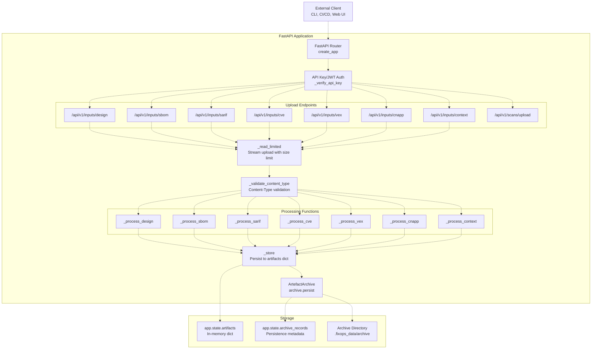

**Sources:** [apps/api/app.py L266-L1027](https://github.com/DevOpsMadDog/Fixops/blob/ce6eb1e9/apps/api/app.py#L266-L1027)

---

## Format-Specific Endpoints

### Design CSV Endpoint

**Endpoint:** `POST /api/v1/inputs/design`

Accepts CSV files containing design context with component metadata. The endpoint parses CSV rows and validates required columns in strict mode.

| Field | Type | Required | Description |
| --- | --- | --- | --- |
| `file` | UploadFile | Yes | CSV file with component design information |
| Content-Type | string | No | `text/csv` or `application/csv` |

**Processing Pipeline:**

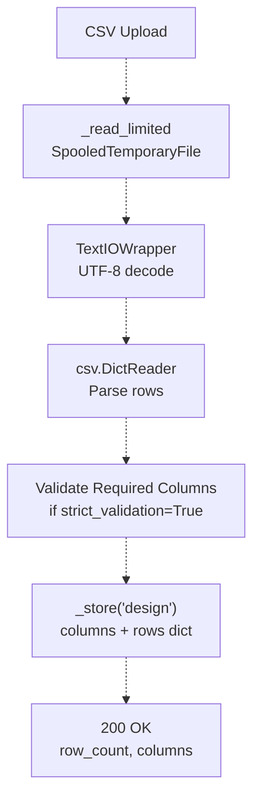

**Required Columns (strict mode):**

* `component`
* `subcomponent`
* `owner`
* `data_class`
* `description`
* `control_scope`

**Sources:** [apps/api/app.py L687-L739](https://github.com/DevOpsMadDog/Fixops/blob/ce6eb1e9/apps/api/app.py#L687-L739)

---

### SBOM Endpoint

**Endpoint:** `POST /api/v1/inputs/sbom`

Accepts SBOM files in CycloneDX, SPDX, or GitHub dependency snapshot formats. Uses `InputNormalizer.load_sbom()` with fallback parsers for format detection.

| Field | Type | Required | Description |
| --- | --- | --- | --- |
| `file` | UploadFile | Yes | JSON SBOM file |
| Content-Type | string | No | `application/json` |

**Supported Formats:**

* CycloneDX 1.4, 1.5, 1.6
* SPDX 2.2, 2.3
* GitHub dependency snapshot
* Syft JSON output

**Processing Pipeline:**

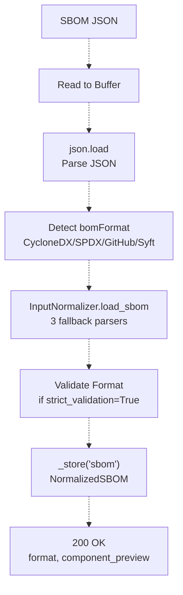

**Sources:** [apps/api/app.py L741-L812](https://github.com/DevOpsMadDog/Fixops/blob/ce6eb1e9/apps/api/app.py#L741-L812)

---

### SARIF Endpoint

**Endpoint:** `POST /api/v1/inputs/sarif`

Accepts SARIF 2.1.0 static analysis results from tools like Semgrep, Snyk, GitLab SAST, and Trivy.

| Field | Type | Required | Description |
| --- | --- | --- | --- |
| `file` | UploadFile | Yes | SARIF JSON file |
| Content-Type | string | No | `application/json` |

**Processing Pipeline:**

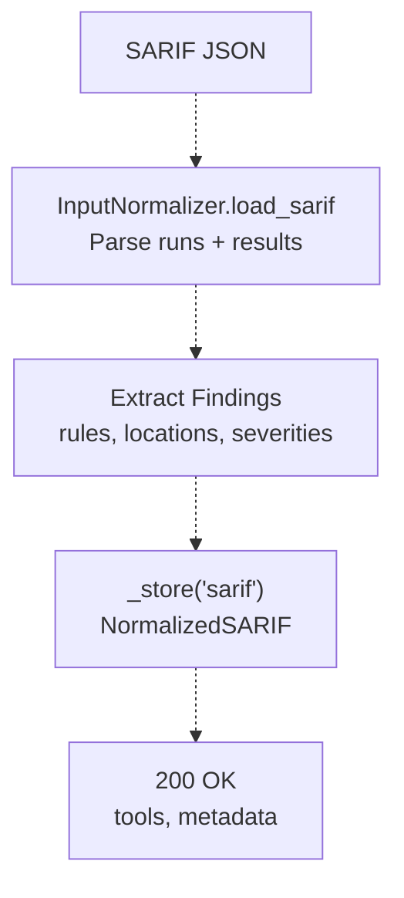

**Sources:** [apps/api/app.py L894-L912](https://github.com/DevOpsMadDog/Fixops/blob/ce6eb1e9/apps/api/app.py#L894-L912)

---

### CVE Feed Endpoint

**Endpoint:** `POST /api/v1/inputs/cve`

Accepts CVE feed data in NVD JSON or CVE JSON 5.1 formats.

| Field | Type | Required | Description |
| --- | --- | --- | --- |
| `file` | UploadFile | Yes | CVE JSON file |
| Content-Type | string | No | `application/json` |

**Processing Pipeline:**

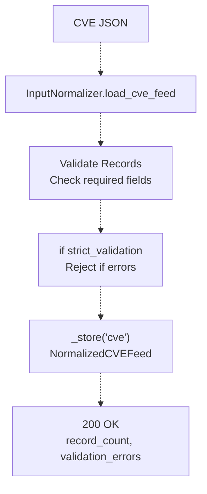

**Sources:** [apps/api/app.py L814-L848](https://github.com/DevOpsMadDog/Fixops/blob/ce6eb1e9/apps/api/app.py#L814-L848)

---

### VEX Endpoint

**Endpoint:** `POST /api/v1/inputs/vex`

Accepts VEX (Vulnerability Exploitability eXchange) documents for noise reduction by suppressing known false positives.

| Field | Type | Required | Description |
| --- | --- | --- | --- |
| `file` | UploadFile | Yes | VEX JSON file |
| Content-Type | string | No | `application/json` |

**Supported Formats:**

* CycloneDX VEX
* CSAF VEX
* OpenVEX

**Processing Pipeline:**

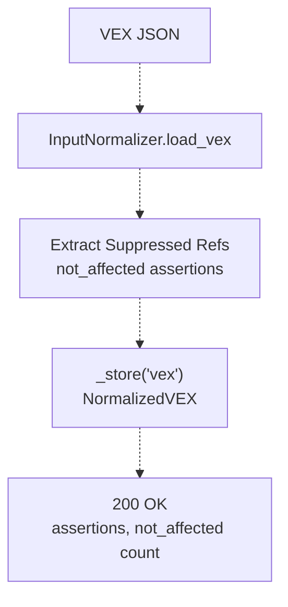

**Sources:** [apps/api/app.py L850-L868](https://github.com/DevOpsMadDog/Fixops/blob/ce6eb1e9/apps/api/app.py#L850-L868)

---

### CNAPP Endpoint

**Endpoint:** `POST /api/v1/inputs/cnapp`

Accepts Cloud-Native Application Protection Platform findings from tools like Wiz, Prisma Cloud, Aqua, and Orca.

| Field | Type | Required | Description |
| --- | --- | --- | --- |
| `file` | UploadFile | Yes | CNAPP findings JSON |
| Content-Type | string | No | `application/json` |

**Processing Pipeline:**

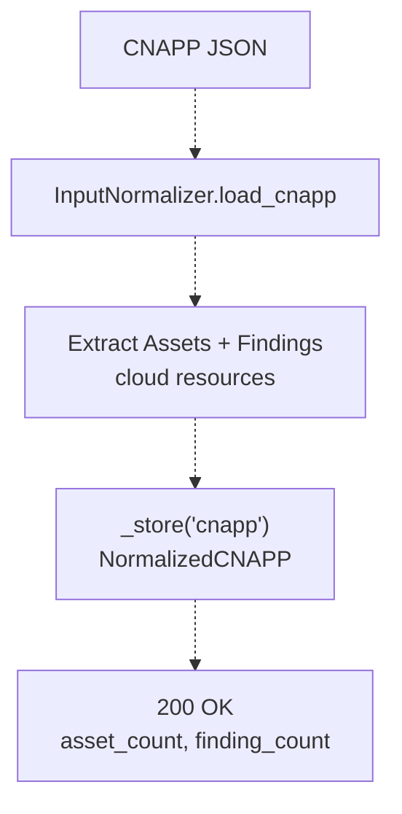

**Sources:** [apps/api/app.py L870-L892](https://github.com/DevOpsMadDog/Fixops/blob/ce6eb1e9/apps/api/app.py#L870-L892)

---

### Business Context Endpoint

**Endpoint:** `POST /api/v1/inputs/context`

Accepts business context in FixOps.yaml, OTM.json, or SSVC YAML formats to enrich vulnerability decisions with SSVC factors.

| Field | Type | Required | Description |
| --- | --- | --- | --- |
| `file` | UploadFile | Yes | Context file (YAML or JSON) |
| Content-Type | string | No | Detected from extension |

**Supported Formats:**

* FixOps.yaml (custom format)
* OTM.json (Open Threat Model)
* SSVC YAML (CISA SSVC decision points)

**Processing Pipeline:**

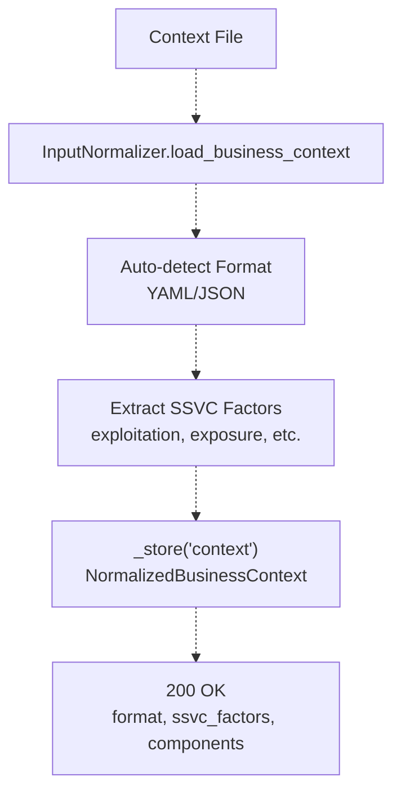

**Sources:** [apps/api/app.py L914-L938](https://github.com/DevOpsMadDog/Fixops/blob/ce6eb1e9/apps/api/app.py#L914-L938)

---

## Upload Size Limits and Validation

### Size Limit Configuration

Each upload stage has configurable size limits defined in the overlay configuration:

| Stage | Default Limit | Configuration Key |
| --- | --- | --- |
| design | 8 MB | `upload_limits.design` |
| sbom | 8 MB | `upload_limits.sbom` |
| sarif | 8 MB | `upload_limits.sarif` |
| cve | 8 MB | `upload_limits.cve` |
| vex | 8 MB | `upload_limits.vex` |
| cnapp | 8 MB | `upload_limits.cnapp` |
| context | 8 MB | `upload_limits.context` |

### Upload Streaming

The `_read_limited()` function implements chunked streaming to prevent memory exhaustion:

```

```

**Configuration:**

* `_CHUNK_SIZE = 1024 * 1024` (1 MB)
* `_RAW_BYTES_THRESHOLD = 4 * 1024 * 1024` (4 MB for in-memory storage)

**Sources:** [apps/api/app.py L593-L642](https://github.com/DevOpsMadDog/Fixops/blob/ce6eb1e9/apps/api/app.py#L593-L642)

---

### Content Type Validation

The `_validate_content_type()` function enforces expected MIME types:

**Validation Rules:**

| Stage | Expected Content Types |
| --- | --- |
| design | `text/csv`, `application/csv` |
| sbom | `application/json` |
| sarif | `application/json` |
| cve | `application/json` |
| vex | `application/json` |
| cnapp | `application/json` |
| context | `application/json`, `application/x-yaml`, `text/yaml` |

**Error Response:**

```json
{
  "message": "Unsupported content type",
  "received": "text/plain",
  "expected": ["application/json"]
}
```

**Sources:** [apps/api/app.py L643-L652](https://github.com/DevOpsMadDog/Fixops/blob/ce6eb1e9/apps/api/app.py#L643-L652)

---

## Chunked Upload System

For large files exceeding single request limits, the system provides chunked upload support via `ChunkUploadManager`.

### Chunked Upload Flow

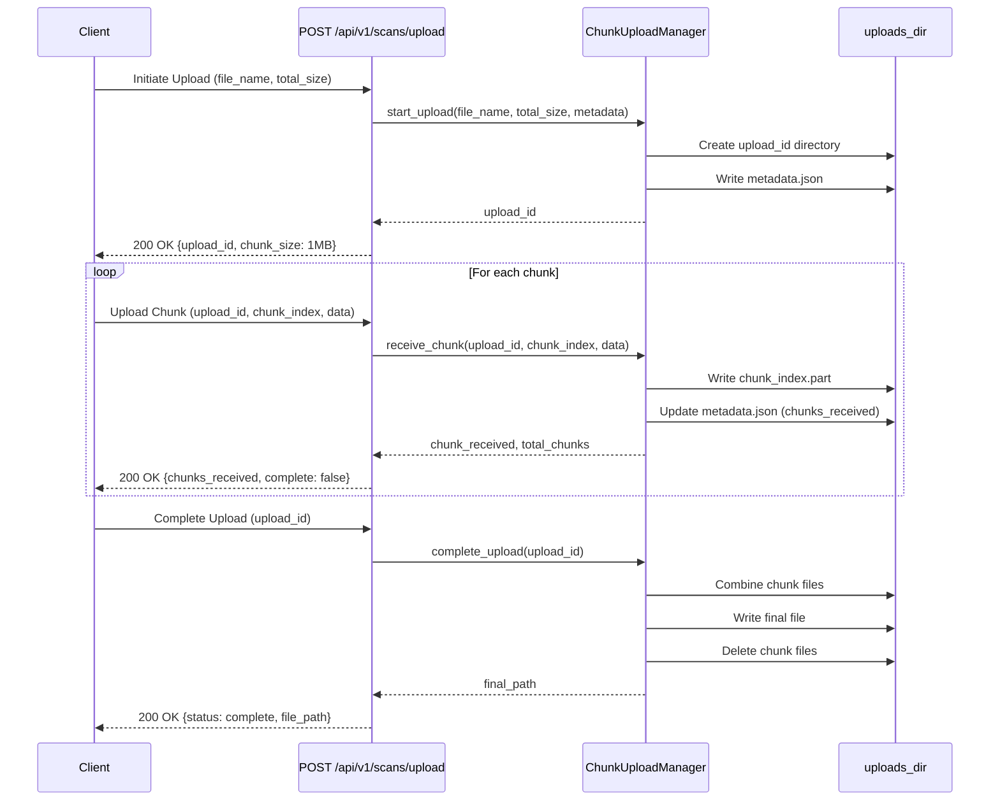

### Chunked Upload Endpoints

**Initiate Upload:**

```
POST /api/v1/scans/upload
{
  "file_name": "large-sbom.json",
  "total_size": 52428800,
  "scan_type": "sbom",
  "service_name": "api-gateway",
  "environment": "production"
}
```

**Upload Chunk:**

```
POST /api/v1/scans/upload/{upload_id}/chunk
Content-Type: application/octet-stream
X-Chunk-Index: 0

<binary data>
```

**Complete Upload:**

```
POST /api/v1/scans/upload/{upload_id}/complete
```

**Sources:** [apps/api/app.py L461-L467](https://github.com/DevOpsMadDog/Fixops/blob/ce6eb1e9/apps/api/app.py#L461-L467)

---

## Input Validation and Security

### Path Security

All upload paths go through `safe_path_ops` validation to prevent path traversal attacks:

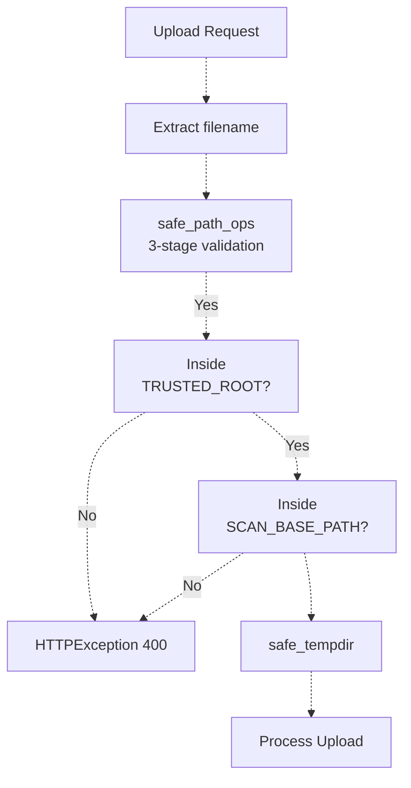

**Trusted Roots:**

* `/var/fixops` (TRUSTED_ROOT)
* `/var/fixops/scans` (SCAN_BASE_PATH)

**Sources:** [apps/api/app.py L174](https://github.com/DevOpsMadDog/Fixops/blob/ce6eb1e9/apps/api/app.py#L174-L174)

---

### Strict Validation Mode

When `overlay.toggles.strict_validation = True`, additional validation is enforced:

| Stage | Strict Validation Rules |
| --- | --- |
| design | All required CSV columns must be present |
| sbom | `bomFormat` must be "CycloneDX" or "SPDX" |
| cve | All CVE records must pass schema validation |
| sarif | SARIF schema must be valid |

**Sources:** [apps/api/app.py L707-L727](https://github.com/DevOpsMadDog/Fixops/blob/ce6eb1e9/apps/api/app.py#L707-L727)

 [apps/api/app.py L753-L791](https://github.com/DevOpsMadDog/Fixops/blob/ce6eb1e9/apps/api/app.py#L753-L791)

 [apps/api/app.py L826-L838](https://github.com/DevOpsMadDog/Fixops/blob/ce6eb1e9/apps/api/app.py#L826-L838)

---

## Normalization Pipeline

After upload validation, each artifact is passed to `InputNormalizer` for format-specific parsing.

### Normalizer Selection

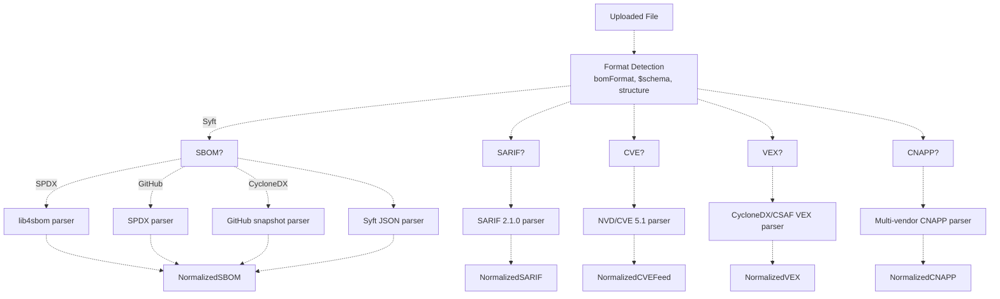

**Normalized Output Models:**

* `NormalizedSBOM`: Components with purls, versions, licenses
* `NormalizedSARIF`: Results with rules, locations, severities
* `NormalizedCVEFeed`: CVE records with CVSS scores, descriptions
* `NormalizedVEX`: Suppressed vulnerability references
* `NormalizedCNAPP`: Cloud assets and security findings
* `NormalizedBusinessContext`: SSVC factors and component metadata

**Sources:** [apps/api/normalizers.py](https://github.com/DevOpsMadDog/Fixops/blob/ce6eb1e9/apps/api/normalizers.py)

 (referenced but not in provided files)

---

## Storage and Archival

### Dual Storage Pattern

Each uploaded artifact is stored in two locations:

1. **In-Memory State:** `app.state.artifacts[stage]` - Used by PipelineOrchestrator
2. **Archive Directory:** Persistent storage with raw bytes and metadata

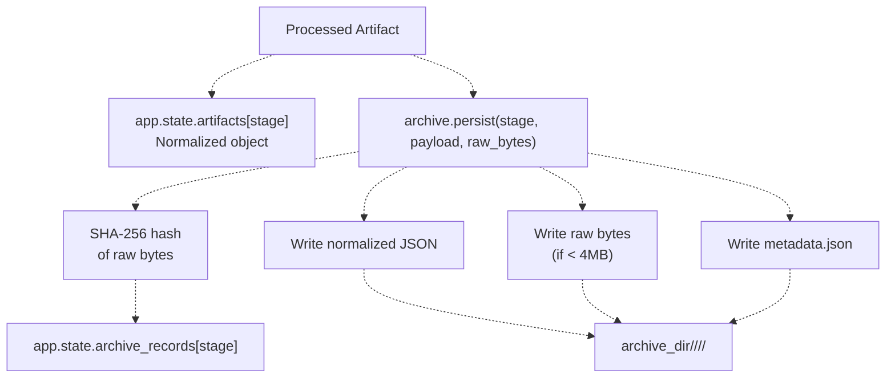

### Archive Directory Structure

```
.fixops_data/archive/<mode>/
├── design/
│   └── <hash>/
│       ├── metadata.json
│       ├── normalized.json
│       └── raw.csv
├── sbom/
│   └── <hash>/
│       ├── metadata.json
│       ├── normalized.json
│       └── raw.json
├── sarif/
│   └── <hash>/
│       ├── metadata.json
│       ├── normalized.json
│       └── raw.json
└── cve/
    └── <hash>/
        ├── metadata.json
        ├── normalized.json
        └── raw.json
```

**Metadata Fields:**

* `stage`: Artifact stage (design, sbom, sarif, etc.)
* `timestamp`: ISO 8601 upload timestamp
* `hash`: SHA-256 hash of raw bytes
* `original_filename`: Uploaded filename
* `size_bytes`: Raw file size
* `normalized_path`: Path to normalized JSON
* `raw_path`: Path to raw bytes (if stored)

**Sources:** [apps/api/app.py L654-L675](https://github.com/DevOpsMadDog/Fixops/blob/ce6eb1e9/apps/api/app.py#L654-L675)

 [core/storage.py](https://github.com/DevOpsMadDog/Fixops/blob/ce6eb1e9/core/storage.py#LNaN-LNaN)

---

## Error Handling

### HTTP Error Responses

| Status Code | Condition | Response Body |
| --- | --- | --- |
| 400 | Invalid format or missing fields | `{"detail": "Failed to parse SBOM: ..."}` |
| 413 | Upload exceeds size limit | `{"detail": {"message": "Upload exceeded limit", "max_bytes": 8388608, "received_bytes": 9000000}}` |
| 415 | Unsupported content type | `{"detail": {"message": "Unsupported content type", "received": "text/plain", "expected": ["application/json"]}}` |
| 422 | Validation error in strict mode | `{"detail": {"message": "Design CSV missing required columns", "missing_columns": ["owner", "data_class"]}}` |
| 500 | Internal processing error | `{"detail": "Failed to parse CVE feed: ..."}` |

### Error Response Examples

**Upload Too Large:**

```json
{
  "detail": {
    "message": "Upload for stage 'sbom' exceeded limit",
    "max_bytes": 8388608,
    "received_bytes": 10485760
  }
}
```

**Missing Required Columns (strict mode):**

```json
{
  "detail": {
    "message": "Design CSV missing required columns (strict mode)",
    "missing_columns": ["owner", "data_class"],
    "required_columns": ["component", "subcomponent", "owner", "data_class", "description", "control_scope"]
  }
}
```

**Invalid SBOM Format (strict mode):**

```json
{
  "detail": {
    "message": "SBOM missing bomFormat and has unrecognized structure",
    "hint": "Provide bomFormat field or use a known format (CycloneDX, GitHub dependency snapshot, Syft)"
  }
}
```

**Sources:** [apps/api/app.py L612-L619](https://github.com/DevOpsMadDog/Fixops/blob/ce6eb1e9/apps/api/app.py#L612-L619)

 [apps/api/app.py L645-L651](https://github.com/DevOpsMadDog/Fixops/blob/ce6eb1e9/apps/api/app.py#L645-L651)

 [apps/api/app.py L720-L727](https://github.com/DevOpsMadDog/Fixops/blob/ce6eb1e9/apps/api/app.py#L720-L727)

---

## Scanner-Agnostic Ingestion

In addition to format-specific endpoints, the system provides a scanner-agnostic ingestion endpoint for flexible format handling.

### Multipart Ingestion Endpoint

**Endpoint:** `POST /api/v1/ingest/multipart`

Accepts any security artifact with auto-detection of format. Uses `NormalizerRegistry` with YAML plugin configuration for extensible format support.

**Request:**

```
POST /api/v1/ingest/multipart
Content-Type: multipart/form-data

------WebKitFormBoundary
Content-Disposition: form-data; name="file"; filename="scan.sarif"
Content-Type: application/json

{...SARIF content...}
------WebKitFormBoundary--
```

**Response:**

```
{
  "status": "success",
  "format_detected": "sarif",
  "detection_confidence": 0.95,
  "findings_count": 42,
  "assets_count": 0,
  "processing_time_ms": 123,
  "findings": [...],
  "errors": [],
  "warnings": []
}
```

### Format Detection Pipeline

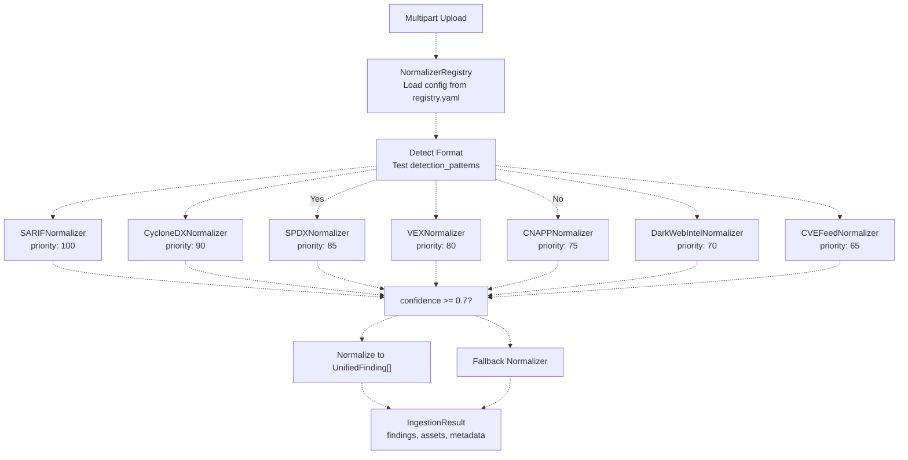

### Supported Detection Patterns

| Format | Detection Patterns | Priority |
| --- | --- | --- |
| SARIF | `"$schema".*sarif`, `"version".*"2\.1\."`, `"runs".*\[` | 100 |
| CycloneDX | `"bomFormat".*"CycloneDX"`, `"specVersion".*"1\.[456]"` | 90 |
| SPDX | `"spdxVersion"`, `"SPDXID"`, `SPDXRef-DOCUMENT` | 85 |
| VEX | `"vulnerabilities".*"analysis"`, `"@type".*"VexDocument"` | 80 |
| CNAPP | `"cloudProvider"`, `"resourceType"`, `"securityFindings"` | 75 |
| Dark Web Intel | `"darkWebSource"`, `"threatIntelligence"`, `"credentialLeak"` | 70 |
| CVE Feed | `"CVE-[0-9]{4}-[0-9]+"`, `"cveMetadata"` | 65 |

**Sources:** [apps/api/ingestion.py L1-L800](https://github.com/DevOpsMadDog/Fixops/blob/ce6eb1e9/apps/api/ingestion.py#L1-L800)

 [config/normalizers/registry.yaml L1-L292](https://github.com/DevOpsMadDog/Fixops/blob/ce6eb1e9/config/normalizers/registry.yaml#L1-L292)

---

## CLI Upload Commands

The CLI provides upload functionality for local file ingestion:

### Ingest File Command

```markdown
# Ingest single file with format detection
fixops ingest-file --file scan.sarif --output result.json

# Ingest multiple files
fixops ingest-file --file sbom.json --file sarif.json --file cve.json

# Force specific format
fixops ingest-file --file custom.json --format sarif

# Include full findings in output
fixops ingest-file --file scan.sarif --include-findings
```

**Command Flow:**

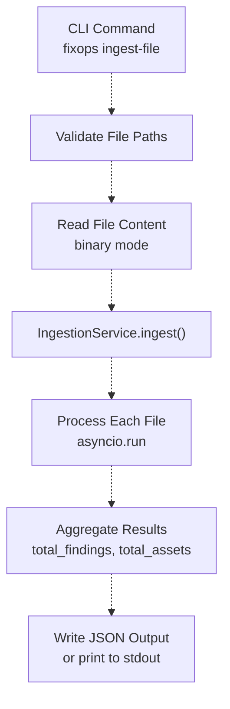

**Output Format:**

```
{
  "status": "success",
  "files_processed": 3,
  "total_findings": 127,
  "total_assets": 45,
  "results": [
    {
      "filename": "/path/to/sbom.json",
      "status": "success",
      "format_detected": "cyclonedx",
      "detection_confidence": 1.0,
      "findings_count": 23,
      "assets_count": 45,
      "processing_time_ms": 89,
      "errors": [],
      "warnings": []
    },
    ...
  ],
  "errors": []
}
```

**Sources:** [core/cli.py L420-L527](https://github.com/DevOpsMadDog/Fixops/blob/ce6eb1e9/core/cli.py#L420-L527)

---

## Integration with Pipeline Orchestrator

After successful upload and normalization, artifacts are consumed by the PipelineOrchestrator:

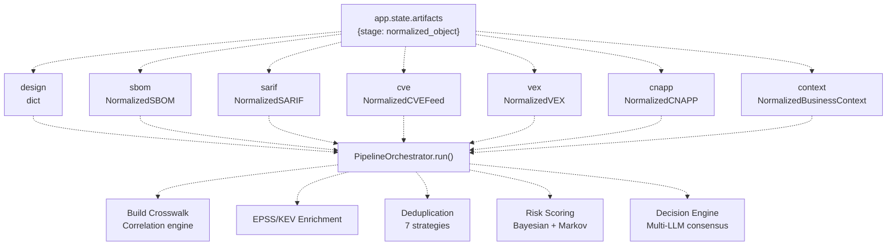

The orchestrator accesses artifacts via `app.state.artifacts[stage]` and combines them for comprehensive vulnerability analysis.

**Sources:** [apps/api/app.py L407-L422](https://github.com/DevOpsMadDog/Fixops/blob/ce6eb1e9/apps/api/app.py#L407-L422)

 [apps/api/pipeline.py](https://github.com/DevOpsMadDog/Fixops/blob/ce6eb1e9/apps/api/pipeline.py#LNaN-LNaN)