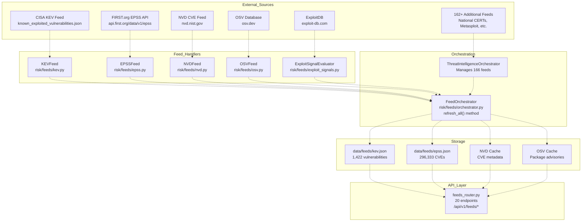
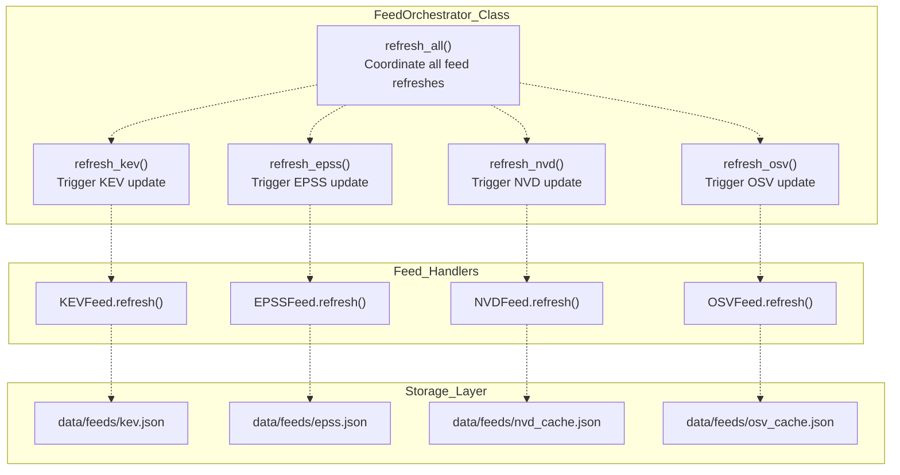
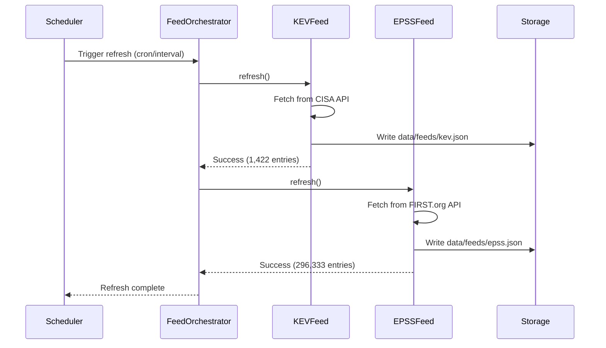
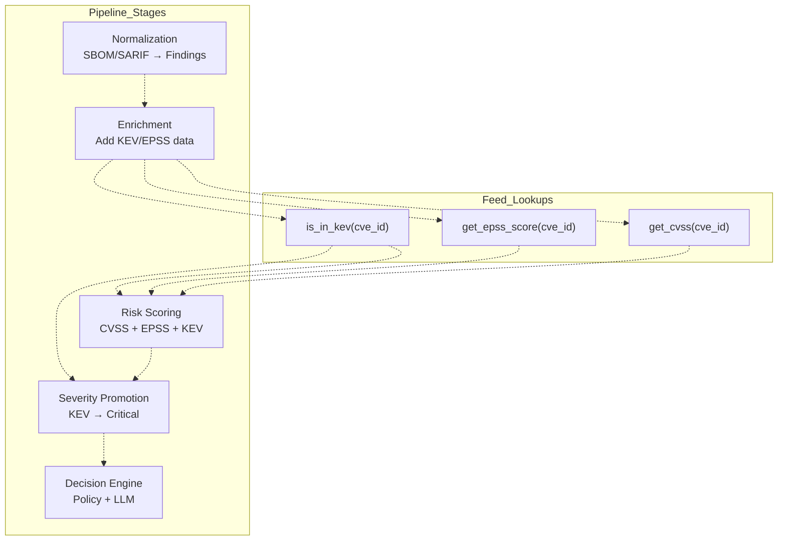

# Vulnerability Intelligence System

> **Relevant source files**
> * [.emergent/emergent.yml](https://github.com/DevOpsMadDog/Fixops/blob/ce6eb1e9/.emergent/emergent.yml)
> * [.gitignore](https://github.com/DevOpsMadDog/Fixops/blob/ce6eb1e9/.gitignore)
> * [README.md](https://github.com/DevOpsMadDog/Fixops/blob/ce6eb1e9/README.md)
> * [apps/api/micro_pentest_router.py](https://github.com/DevOpsMadDog/Fixops/blob/ce6eb1e9/apps/api/micro_pentest_router.py)
> * [core/playbook_runner.py](https://github.com/DevOpsMadDog/Fixops/blob/ce6eb1e9/core/playbook_runner.py)
> * [data/feeds/epss.json](https://github.com/DevOpsMadDog/Fixops/blob/ce6eb1e9/data/feeds/epss.json)
> * [data/feeds/kev.json](https://github.com/DevOpsMadDog/Fixops/blob/ce6eb1e9/data/feeds/kev.json)
> * [docs/API_CLI_REFERENCE.md](https://github.com/DevOpsMadDog/Fixops/blob/ce6eb1e9/docs/API_CLI_REFERENCE.md)
> * [docs/DOCKER_SHOWCASE_GUIDE.md](https://github.com/DevOpsMadDog/Fixops/blob/ce6eb1e9/docs/DOCKER_SHOWCASE_GUIDE.md)
> * [docs/ENTERPRISE_FEATURES.md](https://github.com/DevOpsMadDog/Fixops/blob/ce6eb1e9/docs/ENTERPRISE_FEATURES.md)
> * [docs/FEATURE_CODE_MAPPING.md](https://github.com/DevOpsMadDog/Fixops/blob/ce6eb1e9/docs/FEATURE_CODE_MAPPING.md)
> * [docs/PLAYBOOK_LANGUAGE_REFERENCE.md](https://github.com/DevOpsMadDog/Fixops/blob/ce6eb1e9/docs/PLAYBOOK_LANGUAGE_REFERENCE.md)
> * [fixops-enterprise/src/api/v1/micro_pentest.py](https://github.com/DevOpsMadDog/Fixops/blob/ce6eb1e9/fixops-enterprise/src/api/v1/micro_pentest.py)
> * [fixops-enterprise/src/services/micro_pentest_engine.py](https://github.com/DevOpsMadDog/Fixops/blob/ce6eb1e9/fixops-enterprise/src/services/micro_pentest_engine.py)
> * [tests/test_micro_pentest_engine.py](https://github.com/DevOpsMadDog/Fixops/blob/ce6eb1e9/tests/test_micro_pentest_engine.py)

## Purpose and Scope

The Vulnerability Intelligence System is the foundational data ingestion layer that powers FixOps' risk-based decision engine. It continuously fetches, normalizes, and enriches vulnerability data from 166+ external threat intelligence sources, providing real-time exploit prediction scores (EPSS), known exploited vulnerability status (KEV), and comprehensive CVE metadata. This system transforms raw vulnerability feeds into actionable intelligence that informs risk scoring, severity promotion, and automated decision-making.

**Scope of this document:**

* External feed integration architecture (KEV, EPSS, NVD, OSV, 162+ additional sources)
* Feed orchestration and refresh mechanisms
* Data models for vulnerability intelligence
* Storage and caching strategies
* API endpoints for feed access

**Related pages:**

* For information about how vulnerability data is normalized from security scanners, see [Data Ingestion Layer](/DevOpsMadDog/Fixops/3-data-ingestion-layer)
* For information about how vulnerability intelligence is used in risk calculations, see [Processing Layer](/DevOpsMadDog/Fixops/5-processing-layer)
* For information about severity escalation based on KEV/EPSS, see [Severity Promotion Engine](/DevOpsMadDog/Fixops/2.3-severity-promotion-engine)

---

## System Architecture

The Vulnerability Intelligence System operates as a continuous background service that fetches data from external feeds, normalizes it into consistent data structures, and stores it for fast lookup during pipeline execution.

### High-Level Architecture



**Sources:** [README.md L153-L186](https://github.com/DevOpsMadDog/Fixops/blob/ce6eb1e9/README.md#L153-L186)

 [docs/FEATURE_CODE_MAPPING.md L488-L505](https://github.com/DevOpsMadDog/Fixops/blob/ce6eb1e9/docs/FEATURE_CODE_MAPPING.md#L488-L505)

---

## Data Sources by Category

The system integrates 166+ vulnerability and threat intelligence sources organized into 8 categories:

### 1. Global Authoritative Sources (Ground Truth)

* **NVD** (National Vulnerability Database) - Comprehensive CVE metadata
* **CVE Program** - Official CVE identifiers and descriptions
* **MITRE** - CWE taxonomy and ATT&CK framework
* **CISA KEV** - Known Exploited Vulnerabilities catalog (1,422 entries)
* **CERT/CC**, **US-CERT**, **ICS-CERT** - CERT advisories

### 2. National CERTs (Geo-specific Exploit Reality)

* NCSC UK, BSI Germany, ANSSI France, JPCERT Japan
* CERT-In (India), ACSC (Australia), SingCERT (Singapore), KISA (Korea)
* Enables geo-weighted risk scoring based on regional exploitation patterns

### 3. Exploit & Weaponization Intelligence

* **ExploitDB** - Public exploit database
* **Metasploit** - Exploit framework modules
* **Packet Storm** - Security tools and exploits
* **Vulners** - Vulnerability database with exploit links
* **GreyNoise**, **Shodan**, **Censys** - Internet scanning data
* **Nuclei Templates** - Exploit templates for automated testing

### 4. Threat Actor & Campaign Intelligence

* **MITRE ATT&CK** - Adversary tactics and techniques
* **AlienVault OTX** - Open threat exchange
* **abuse.ch**, **Feodo Tracker**, **Ransomware Live** - Malware tracking
* Provides CVE → Threat Actor → Sector targeting mapping

### 5. Supply-Chain & SBOM Intelligence

* **OSV** (Open Source Vulnerabilities) - 296,333+ package vulnerabilities
* **GitHub Advisory Database** - GitHub security advisories
* **Snyk**, **deps.dev** - Dependency vulnerability databases
* **NPM**, **PyPI**, **RustSec** - Ecosystem-specific advisories
* Enables reachable dependency analysis

### 6. Cloud & Runtime Vulnerability Feeds

* AWS, Azure, GCP Security Bulletins
* Kubernetes CVE tracking
* Red Hat, Ubuntu, Debian, Alpine - Linux distribution advisories

### 7. Zero-Day & Early-Signal Feeds

* Microsoft MSRC, Apple Security, Cisco PSIRT
* Palo Alto, Fortinet - Vendor security advisories
* GitHub security commits, Full-Disclosure mailing list
* OSS-Security - Pre-CVE risk alerts

### 8. Internal Enterprise Signals

* SAST/DAST/SCA findings from security scanners
* IaC misconfiguration findings
* Runtime detection signals from CNAPP tools
* Exposure graph (internet-facing, authentication bypass)
* Business criticality metadata

**Sources:** [README.md L153-L192](https://github.com/DevOpsMadDog/Fixops/blob/ce6eb1e9/README.md#L153-L192)

---

## Core Components

### KEV Feed Handler

The `KEVFeed` class manages synchronization with CISA's Known Exploited Vulnerabilities catalog.

**Data Structure:**

```python
{
  "fetched_at": "2025-10-02T07:31:35.927360+00:00",
  "source": "https://www.cisa.gov/sites/default/files/feeds/known_exploited_vulnerabilities.json",
  "data": {
    "title": "CISA Catalog of Known Exploited Vulnerabilities",
    "catalogVersion": "2025.09.30",
    "count": 1422,
    "vulnerabilities": [
      {
        "cveID": "CVE-2025-32463",
        "vendorProject": "Sudo",
        "product": "Sudo",
        "vulnerabilityName": "Sudo Inclusion of Functionality from Untrusted Control Sphere Vulnerability",
        "dateAdded": "2025-09-29",
        "shortDescription": "...",
        "requiredAction": "Apply mitigations per vendor instructions...",
        "dueDate": "2025-10-20",
        "knownRansomwareCampaignUse": "Unknown",
        "cwes": ["CWE-829"]
      }
    ]
  }
}
```

**Key Methods:**

| Method | Purpose | File Reference |
| --- | --- | --- |
| `refresh()` | Fetch latest KEV catalog from CISA | [risk/feeds/kev.py](https://github.com/DevOpsMadDog/Fixops/blob/ce6eb1e9/risk/feeds/kev.py) |
| `is_in_kev(cve_id)` | Check if CVE is in KEV catalog | [risk/feeds/kev.py](https://github.com/DevOpsMadDog/Fixops/blob/ce6eb1e9/risk/feeds/kev.py) |
| `get_kev_entry(cve_id)` | Retrieve full KEV entry for a CVE | [risk/feeds/kev.py](https://github.com/DevOpsMadDog/Fixops/blob/ce6eb1e9/risk/feeds/kev.py) |

**Sources:** [data/feeds/kev.json L1-L100](https://github.com/DevOpsMadDog/Fixops/blob/ce6eb1e9/data/feeds/kev.json#L1-L100)

 [docs/FEATURE_CODE_MAPPING.md L494](https://github.com/DevOpsMadDog/Fixops/blob/ce6eb1e9/docs/FEATURE_CODE_MAPPING.md#L494-L494)

### EPSS Feed Handler

The `EPSSFeed` class manages synchronization with FIRST.org's Exploit Prediction Scoring System.

**Data Structure:**

```json
{
  "fetched_at": "2025-10-02T07:31:35.751410+00:00",
  "source": "https://api.first.org/data/v1/epss?pretty=true",
  "data": {
    "status": "OK",
    "total": 296333,
    "data": [
      {
        "cve": "CVE-2025-9999",
        "epss": "0.000400000",
        "percentile": "0.116420000",
        "date": "2025-10-01"
      }
    ]
  }
}
```

**Key Methods:**

| Method | Purpose | File Reference |
| --- | --- | --- |
| `refresh()` | Fetch latest EPSS scores from FIRST.org | [risk/feeds/epss.py](https://github.com/DevOpsMadDog/Fixops/blob/ce6eb1e9/risk/feeds/epss.py) |
| `get_epss_score(cve_id)` | Retrieve EPSS score for a CVE | [risk/feeds/epss.py](https://github.com/DevOpsMadDog/Fixops/blob/ce6eb1e9/risk/feeds/epss.py) |
| `get_percentile(cve_id)` | Get EPSS percentile ranking | [risk/feeds/epss.py](https://github.com/DevOpsMadDog/Fixops/blob/ce6eb1e9/risk/feeds/epss.py) |

**Sources:** [data/feeds/epss.json L1-L100](https://github.com/DevOpsMadDog/Fixops/blob/ce6eb1e9/data/feeds/epss.json#L1-L100)

 [docs/FEATURE_CODE_MAPPING.md L493](https://github.com/DevOpsMadDog/Fixops/blob/ce6eb1e9/docs/FEATURE_CODE_MAPPING.md#L493-L493)

### Feed Orchestrator

The `FeedOrchestrator` coordinates refresh cycles for all feed handlers and ensures data freshness.



**Configuration:**

* **Refresh Interval:** Configurable via `fixops.overlay.yml` (default: 24 hours for KEV/EPSS, 1 hour for NVD)
* **Retry Logic:** Exponential backoff on API failures
* **Offline Mode:** Support for air-gapped deployments using cached feeds

**Sources:** [risk/feeds/orchestrator.py](https://github.com/DevOpsMadDog/Fixops/blob/ce6eb1e9/risk/feeds/orchestrator.py)

 [docs/FEATURE_CODE_MAPPING.md L496](https://github.com/DevOpsMadDog/Fixops/blob/ce6eb1e9/docs/FEATURE_CODE_MAPPING.md#L496-L496)

---

## Feed Refresh Process

### Automatic Refresh Cycle

The system performs automatic feed refreshes on a configurable schedule:



### Manual Refresh via CLI

Users can manually trigger feed refreshes:

```markdown
# Refresh all feeds
python -m core.cli feeds refresh

# Refresh specific feed
python -m core.cli feeds refresh --feed kev
python -m core.cli feeds refresh --feed epss

# Check feed status
python -m core.cli feeds status
```

**Sources:** [docs/DOCKER_SHOWCASE_GUIDE.md L790-L850](https://github.com/DevOpsMadDog/Fixops/blob/ce6eb1e9/docs/DOCKER_SHOWCASE_GUIDE.md#L790-L850)

 [docs/API_CLI_REFERENCE.md L27-L42](https://github.com/DevOpsMadDog/Fixops/blob/ce6eb1e9/docs/API_CLI_REFERENCE.md#L27-L42)

### Offline/Air-Gapped Mode

For air-gapped deployments, the system can operate entirely from cached feeds:

1. Export feeds on internet-connected system: ```javascript python -m core.cli feeds export --output feeds-bundle.tar.gz ```
2. Transfer bundle to air-gapped system
3. Import feeds: ```javascript python -m core.cli feeds import --input feeds-bundle.tar.gz ```
4. Run pipeline with `--offline` flag: ``` python -m core.cli run --offline --overlay config/fixops.overlay.yml ```

**Sources:** [docs/DOCKER_SHOWCASE_GUIDE.md L100-L115](https://github.com/DevOpsMadDog/Fixops/blob/ce6eb1e9/docs/DOCKER_SHOWCASE_GUIDE.md#L100-L115)

---

## API Endpoints

The Feeds Router exposes 20 API endpoints for accessing vulnerability intelligence data:

### KEV Endpoints

| Method | Endpoint | Description | Response |
| --- | --- | --- | --- |
| GET | `/api/v1/feeds/kev` | List all KEV entries | Array of 1,422 vulnerabilities |
| GET | `/api/v1/feeds/kev/check/{cve_id}` | Check if CVE is in KEV | `{"in_kev": true/false, "entry": {...}}` |
| GET | `/api/v1/feeds/kev/search` | Search KEV by vendor/product | Filtered KEV entries |
| POST | `/api/v1/feeds/kev/refresh` | Trigger KEV refresh | `{"status": "refreshed", "count": 1422}` |

### EPSS Endpoints

| Method | Endpoint | Description | Response |
| --- | --- | --- | --- |
| GET | `/api/v1/feeds/epss` | List EPSS scores (paginated) | Array of CVE scores |
| GET | `/api/v1/feeds/epss/{cve_id}` | Get EPSS score for CVE | `{"cve": "...", "epss": 0.0034, "percentile": 0.65}` |
| POST | `/api/v1/feeds/epss/batch` | Bulk EPSS lookup | Array of scores for multiple CVEs |
| POST | `/api/v1/feeds/epss/refresh` | Trigger EPSS refresh | `{"status": "refreshed", "total": 296333}` |

### NVD/OSV Endpoints

| Method | Endpoint | Description | Response |
| --- | --- | --- | --- |
| GET | `/api/v1/feeds/nvd/{cve_id}` | Get NVD CVE details | Full CVE metadata with CVSS scores |
| GET | `/api/v1/feeds/osv/{package}` | Get OSV advisories for package | Package vulnerability advisories |
| POST | `/api/v1/feeds/nvd/refresh` | Trigger NVD refresh | Refresh status |

### Feed Status & Management

| Method | Endpoint | Description | Response |
| --- | --- | --- | --- |
| GET | `/api/v1/feeds/status` | Get all feed statuses | Last refresh time, entry counts, health |
| POST | `/api/v1/feeds/refresh-all` | Trigger refresh of all feeds | Refresh results for all feeds |
| GET | `/api/v1/feeds/health` | Feed health check | Connectivity and data freshness status |

**Example Usage:**

```css
# Check if CVE is in KEV
curl -H "X-API-Key: demo-token" \
  http://localhost:8000/api/v1/feeds/kev/check/CVE-2024-1234

# Get EPSS score
curl -H "X-API-Key: demo-token" \
  http://localhost:8000/api/v1/feeds/epss/CVE-2024-1234

# Batch EPSS lookup
curl -H "X-API-Key: demo-token" -X POST \
  -H "Content-Type: application/json" \
  -d '{"cve_ids": ["CVE-2024-1234", "CVE-2024-5678"]}' \
  http://localhost:8000/api/v1/feeds/epss/batch

# Get feed status
curl -H "X-API-Key: demo-token" \
  http://localhost:8000/api/v1/feeds/status
```

**Sources:** [apps/api/feeds_router.py](https://github.com/DevOpsMadDog/Fixops/blob/ce6eb1e9/apps/api/feeds_router.py)

 [docs/FEATURE_CODE_MAPPING.md L508-L524](https://github.com/DevOpsMadDog/Fixops/blob/ce6eb1e9/docs/FEATURE_CODE_MAPPING.md#L508-L524)

 [docs/API_CLI_REFERENCE.md L27-L42](https://github.com/DevOpsMadDog/Fixops/blob/ce6eb1e9/docs/API_CLI_REFERENCE.md#L27-L42)

---

## Integration with Pipeline

The Vulnerability Intelligence System integrates with the FixOps pipeline at multiple stages:



### Stage 2: Enrichment

After normalization, findings are enriched with vulnerability intelligence:

```markdown
# Pseudo-code for enrichment stage
for finding in normalized_findings:
    if finding.cve_id:
        # KEV lookup
        finding.is_kev = kev_feed.is_in_kev(finding.cve_id)
        finding.kev_entry = kev_feed.get_kev_entry(finding.cve_id)
        
        # EPSS lookup
        epss_data = epss_feed.get_epss_score(finding.cve_id)
        finding.epss_score = epss_data.epss
        finding.epss_percentile = epss_data.percentile
        
        # NVD metadata
        nvd_entry = nvd_feed.get_cve(finding.cve_id)
        finding.cvss_base_score = nvd_entry.cvss_v3_score
        finding.cvss_vector = nvd_entry.cvss_vector
```

**Sources:** [core/stage_runner.py](https://github.com/DevOpsMadDog/Fixops/blob/ce6eb1e9/core/stage_runner.py)

 [core/adapters.py](https://github.com/DevOpsMadDog/Fixops/blob/ce6eb1e9/core/adapters.py)

 [docs/FEATURE_CODE_MAPPING.md L449-L471](https://github.com/DevOpsMadDog/Fixops/blob/ce6eb1e9/docs/FEATURE_CODE_MAPPING.md#L449-L471)

### Stage 5: Risk Analysis

KEV and EPSS data directly influence risk score calculation:

**Risk Score Formula:**

```yaml
risk_score = (cvss_base * 0.4) + 
             (epss_score * 100 * 0.3) + 
             (kev_multiplier * 0.3)

where:
  kev_multiplier = 10.0 if is_kev else 1.0
```

This ensures that vulnerabilities in the KEV catalog receive maximum priority regardless of CVSS score.

**Sources:** [risk/scoring.py](https://github.com/DevOpsMadDog/Fixops/blob/ce6eb1e9/risk/scoring.py)

 [docs/FEATURE_CODE_MAPPING.md L488-L505](https://github.com/DevOpsMadDog/Fixops/blob/ce6eb1e9/docs/FEATURE_CODE_MAPPING.md#L488-L505)

### Severity Promotion

The [Severity Promotion Engine](/DevOpsMadDog/Fixops/2.3-severity-promotion-engine) uses KEV and high EPSS scores to automatically escalate severity levels:

**Promotion Rules:**

* **KEV listed** → Promote to `CRITICAL`
* **EPSS ≥ 0.85** → Promote by 1 level (e.g., `HIGH` → `CRITICAL`)
* **EPSS ≥ 0.60** → Flag for review

**Sources:** [core/severity_promotion.py](https://github.com/DevOpsMadDog/Fixops/blob/ce6eb1e9/core/severity_promotion.py)

 [docs/FEATURE_CODE_MAPPING.md L504](https://github.com/DevOpsMadDog/Fixops/blob/ce6eb1e9/docs/FEATURE_CODE_MAPPING.md#L504-L504)

---

## Data Freshness Guarantees

The system provides the following freshness guarantees:

| Feed Type | Update Frequency | Source SLA | Cache TTL |
| --- | --- | --- | --- |
| CISA KEV | Daily (when catalog updates) | 24h | 24h |
| FIRST EPSS | Daily (new scores published) | 24h | 24h |
| NVD CVE | Hourly (for new CVEs) | 1h | 6h |
| OSV | Hourly (for new advisories) | 1h | 6h |
| Exploit Feeds | 4x daily | 6h | 6h |
| National CERTs | Daily | 24h | 24h |

**Stale Data Handling:**

* If feed refresh fails, the system continues using cached data
* A warning is logged and exposed via `/api/v1/feeds/health`
* Age of cached data is included in API responses
* Pipeline can be configured to fail if feeds are >N hours stale

**Sources:** [risk/feeds/orchestrator.py](https://github.com/DevOpsMadDog/Fixops/blob/ce6eb1e9/risk/feeds/orchestrator.py)

 [apps/api/feeds_router.py](https://github.com/DevOpsMadDog/Fixops/blob/ce6eb1e9/apps/api/feeds_router.py)

---

## Key Differentiators

The FixOps Vulnerability Intelligence System provides unique capabilities:

### Exploit-Confidence Scoring

Unlike traditional CVSS-only approaches, FixOps combines:

* **CVSS** (potential impact)
* **EPSS** (exploit probability based on real-world observations)
* **KEV status** (confirmed exploitation in the wild)
* **Exploit availability** (public exploit code existence)

This produces an **exploit-confidence score** that reflects actual risk, not just theoretical severity.

### Geo-Weighted Risk

National CERT feeds provide regional exploitation patterns:

* A CVE heavily exploited in APAC may have different risk in EU
* Regional targeting by APT groups is incorporated
* Compliance requirements vary by geography (GDPR, CCPA, etc.)

### Threat Actor Mapping

The system maps CVEs to threat actor campaigns:

* "CVE-2024-XXXX is actively used by APT29 (Cozy Bear)"
* Sector targeting: "This CVE targets financial services"
* Ransomware association: "Linked to LockBit 3.0 campaigns"

### Reachable Dependency Analysis

SBOM integration enables precision:

* Same CVE in different packages has different risk
* Dependency is present but not reachable from entry points → lower priority
* Dependency is in hot path from internet exposure → critical priority

**Sources:** [README.md L187-L192](https://github.com/DevOpsMadDog/Fixops/blob/ce6eb1e9/README.md#L187-L192)

---

## CLI Command Reference

| Command | Purpose | Example |
| --- | --- | --- |
| `feeds status` | Show feed health and last refresh | `python -m core.cli feeds status` |
| `feeds refresh` | Refresh all feeds | `python -m core.cli feeds refresh` |
| `feeds refresh --feed <name>` | Refresh specific feed | `python -m core.cli feeds refresh --feed kev` |
| `feeds export` | Export feeds for air-gap | `python -m core.cli feeds export --output bundle.tar.gz` |
| `feeds import` | Import feeds in air-gap | `python -m core.cli feeds import --input bundle.tar.gz` |
| `feeds check-cve <cve>` | Check KEV/EPSS for CVE | `python -m core.cli feeds check-cve CVE-2024-1234` |

**Sources:** [docs/DOCKER_SHOWCASE_GUIDE.md L790-L850](https://github.com/DevOpsMadDog/Fixops/blob/ce6eb1e9/docs/DOCKER_SHOWCASE_GUIDE.md#L790-L850)

 [docs/API_CLI_REFERENCE.md L27-L42](https://github.com/DevOpsMadDog/Fixops/blob/ce6eb1e9/docs/API_CLI_REFERENCE.md#L27-L42)

---

## Configuration

Feed behavior is controlled via `config/fixops.overlay.yml`:

```css
vulnerability_intelligence:
  feeds:
    kev:
      enabled: true
      refresh_interval: 86400  # 24 hours
      source: "https://www.cisa.gov/sites/default/files/feeds/known_exploited_vulnerabilities.json"
      
    epss:
      enabled: true
      refresh_interval: 86400  # 24 hours
      source: "https://api.first.org/data/v1/epss"
      batch_size: 100
      
    nvd:
      enabled: true
      refresh_interval: 3600   # 1 hour
      api_key: "${NVD_API_KEY}"  # Optional: faster rate limits
      
    osv:
      enabled: true
      refresh_interval: 3600   # 1 hour
      
  caching:
    enabled: true
    ttl_seconds: 21600  # 6 hours
    max_size_mb: 500
    
  offline_mode:
    enabled: false
    bundle_path: "data/feeds/offline_bundle.tar.gz"
    
  health_checks:
    max_age_hours: 48  # Fail pipeline if feeds >48h old
    alert_on_stale: true
```

**Sources:** [README.md L250-L269](https://github.com/DevOpsMadDog/Fixops/blob/ce6eb1e9/README.md#L250-L269)

 [docs/DOCKER_SHOWCASE_GUIDE.md L100-L115](https://github.com/DevOpsMadDog/Fixops/blob/ce6eb1e9/docs/DOCKER_SHOWCASE_GUIDE.md#L100-L115)