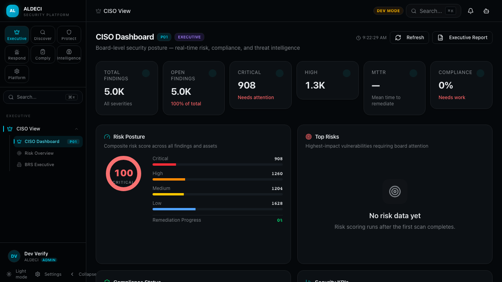
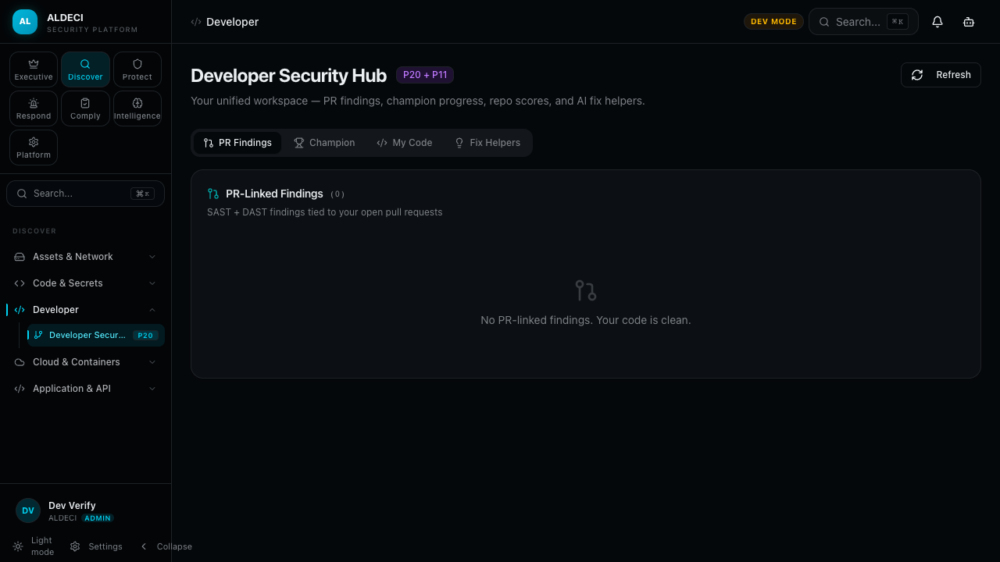
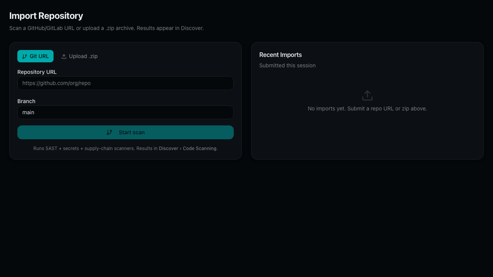
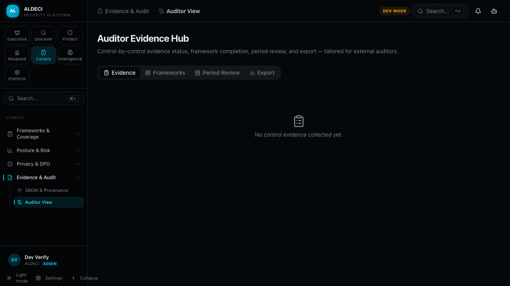

# ALDECI — Unified Security Intelligence Platform

## One Platform. Three Pillars. Zero Compromise.

ALDECI is an **ASPM + CTEM + CSPM platform** that replaces $50K-500K/yr of fragmented enterprise security tools with a single, self-hosted, AI-native decision intelligence engine.

---

## Why ALDECI Wins

1. **Unified threat landscape** — 28+ threat intel feeds + 32 scanner normalizers + 13 PULL + 7 bidirectional connectors. See everything in one view.

2. **AI-native decision engine** — 12-step Brain Pipeline with multi-LLM consensus (Claude, GPT-4, Gemini) — your decisions are defensible, auditable, explainable.

3. **30 out-of-the-box personas** — CISO, Board, SOC Analyst, DevSecOps, Compliance Officer, Auditor, DPO, Architect, Developer, and 21 more. Every stakeholder has their interface.

4. **Instant deployment** — Self-hosted, no SaaS tax. Deploy in your VPC. Control your data. Audit everything.

5. **7 compliance frameworks** — SOC2, ISO 27001, PCI-DSS, HIPAA, GDPR, NIST CSF, CIS. Evidence generation with quantum-secure signing.

---

## What You See in 5 Minutes

### Executive Dashboard

**CISO + Board**: Top 5 risks, compliance posture, breach-readiness dashboard, board-grade reporting.

### Developer Hub

**DevSecOps + Developers**: Contextualized findings, remediation guidance, policy enforcement, IDE integration ready.

### Import & Ingest

**Connector Hub**: 40+ scanner formats ingested in real-time. Deduplicated. Normalized. Ready for decision.

### Compliance & Audit

**Auditors + Compliance**: Evidence chain, control mapping, real-time attestation, zero manual handoff.

---

## The Demo (5 Minutes)

1. **Install** → Deploy ALDECI to your Kubernetes cluster (or Docker)
2. **Import** → Upload a Snyk/Trivy/OWASP report → see 50+ normalized fields
3. **Decide** → Watch the Brain Pipeline converge on your top 5 risks
4. **Act** → One-click remediation workflows OR export to your ticketing system

---

## Try It Now

**Run a 1-day POC at https://aldeci.local**

- Self-hosted in your VPC
- Pre-seeded with real threat intelligence
- See your top 5 risks before lunch
- No trial licensing. No feature gates.

**Questions?** Email: sales@aldeci.io | Slack: @aldeci-support

---

*ALDECI — What the CISO sees, the developer builds, the auditor proves.*
