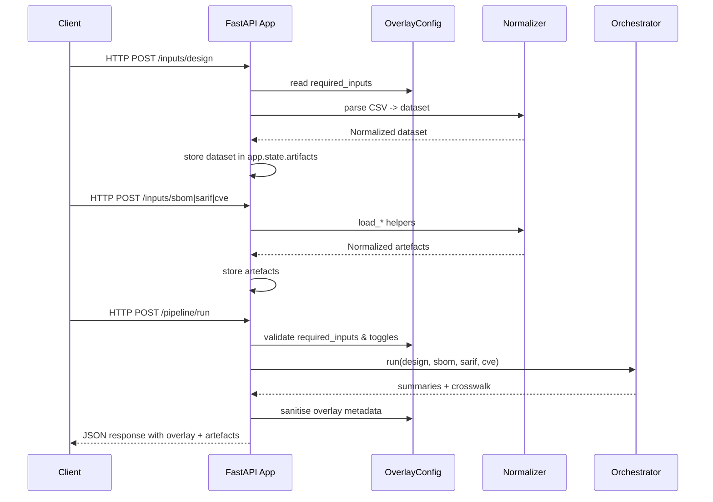

# FixOps Ingestion Platform — Architecture Overview

This document captures how the FixOps demo backend is structured, how requests move through the
system, and where the new overlay configuration influences runtime behaviour. It is intended for
engineers who need to reason about deployments as well as product stakeholders validating the
architecture against market promises.

## Component Summary

1. **FastAPI Ingestion Service (`backend/app.py`)**
   - Owns HTTP endpoints for uploading design context CSV, SBOM documents, SARIF findings, and CVE
     feeds, plus the `/pipeline/run` execution route.
   - Loads the overlay configuration during startup and persists it in `app.state.overlay` so every
     request has consistent mode-specific behaviour.
   - Creates any data directories declared in the overlay, ensuring Demo and Enterprise evidence
     locations exist before ingesting artefacts.
2. **Configuration Loader (`fixops/configuration.py`)**
   - Parses `config/fixops.overlay.yml`, honours the `FIXOPS_OVERLAY_PATH` override, merges
     profile-specific overrides, and applies defaults for toggles and metadata.
   - Normalises secrets (masking tokens/passwords) before they are exposed via API responses.
3. **Normalisation Layer (`backend/normalizers.py`)**
   - Converts raw uploads into rich domain objects (`NormalizedSBOM`, `NormalizedSARIF`,
     `NormalizedCVEFeed`) with helper methods for JSON serialisation.
   - Handles optional third-party parser dependencies gracefully so the demo can run in a minimal
     environment.
4. **Pipeline Orchestrator (`backend/pipeline.py`)**
   - Correlates design rows with SBOM components, SARIF findings, and CVE entries using precomputed
     lowercase tokens for efficient matching.
   - Produces aggregate summaries plus a per-component “crosswalk” that powers downstream evidence
     bundles.
5. **Overlay-Aware State**
   - The ingestion service stores each uploaded artefact in `app.state.artifacts`. The overlay
     controls which artefacts are required (`OverlayConfig.required_inputs`) and whether metadata is
     attached to pipeline responses.

## Request Lifecycle

1. **Startup**
   - `create_app()` reads the overlay file (JSON-compatible YAML) and records the active mode (Demo
     vs Enterprise) in `app.state.overlay`. Any declared data directories are created eagerly.
2. **Artefact Uploads**
   - Each `/inputs/*` endpoint normalises the uploaded file and persists the structured output in
     `app.state.artifacts` keyed by stage name. Responses include preview metadata to confirm the
     upload succeeded.
3. **Pipeline Execution**
   - `/pipeline/run` looks at `OverlayConfig.required_inputs`. Missing artefacts are rejected with a
     descriptive HTTP 400. Enterprise mode enforces that Jira configuration is present before
     proceeding when `enforce_ticket_sync` is enabled.
   - `PipelineOrchestrator.run()` receives the cached artefacts, builds token lookups, aggregates
     severities/exploit evidence, and emits a consolidated report.
   - Overlay metadata is appended to the response (with secrets masked) when the
     `auto_attach_overlay_metadata` toggle is active.

## Sequence Diagram



## Component Diagram

```mermaid
graph TD
    subgraph Boundary[Deployment]
        A[FastAPI Ingestion Service]
        B[OverlayConfig]
        C[InputNormalizer]
        D[PipelineOrchestrator]
    end
    subgraph External
        E[Upload Clients]
        F[Optional Parsers (lib4sbom, sarif-om, cvelib)]
        G[Jira / Confluence / Git / CI (configured via overlay)]
    end

    E -->|HTTP uploads| A
    A --> B
    A --> C
    C --> F
    A --> D
    B --> A
    B --> G
    D --> A
```

## Failure Modes & Mitigations

- **Missing Artefacts** — If a required artefact is absent, `/pipeline/run` aborts with HTTP 400 and
  enumerates missing stages. Demo mode loosens requirements by default (`require_design_input=False`).
- **Misconfigured Integrations** — When `enforce_ticket_sync` is `True` but Jira configuration lacks
  `project_key`, the API raises HTTP 500 with integration metadata. This mirrors Enterprise
  expectations where ticket synchronisation is mandatory.
- **Parser Failures** — Upload endpoints wrap parser errors in HTTP 400 responses and log the
  exception stack trace, preventing raw payload leakage.
- **Overlay Parsing Issues** — `load_overlay()` accepts YAML or JSON. If PyYAML is unavailable the
  loader falls back to JSON parsing and raises a descriptive error when neither succeeds.

## Mode Differences (Demo vs Enterprise)

| Concern | Demo Mode | Enterprise Mode |
| --- | --- | --- |
| Required artefacts | SBOM, SARIF, CVE (design optional) | Design + SBOM + SARIF + CVE |
| Jira enforcement | Not enforced (`enforce_ticket_sync=False`) | Enforced; missing config triggers 500 |
| Evidence directories | `data/evidence/demo` | `data/evidence/enterprise` + `data/audit` |
| Metadata attachment | Overlay metadata auto-attached | Same (toggle can be disabled in overlay) |

The overlay file can be switched to Enterprise by editing `mode: "enterprise"` and adjusting the
integration payloads. No code changes are required; the FastAPI service adapts at startup.
