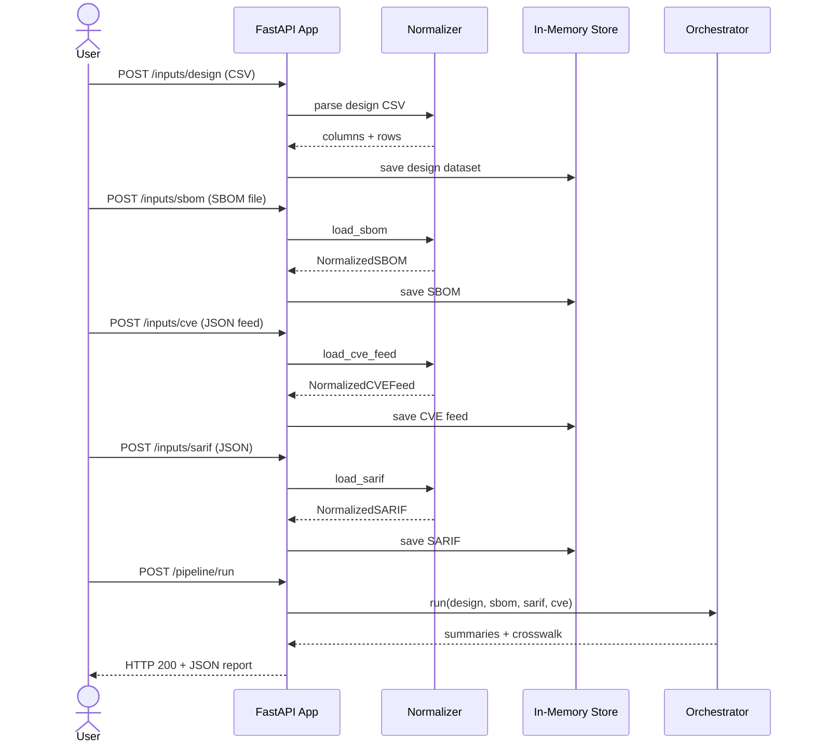
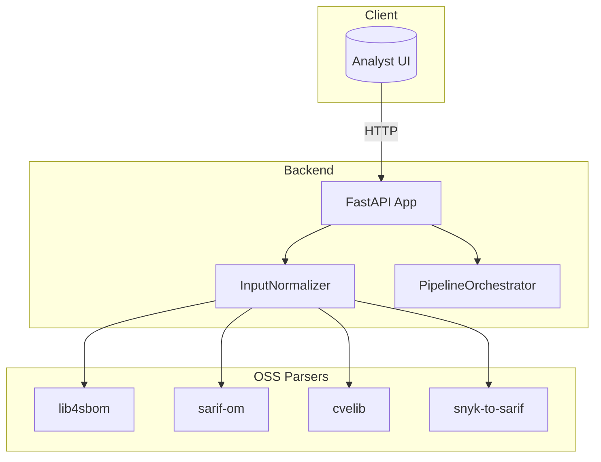

# FixOps Ingestion Demo — Architecture Overview

This document explains how the backend FastAPI service ingests security artefacts, normalises
them, and correlates the data during the pipeline run. It is written for a mixed audience — you
do not need to be a developer to understand how requests move through the system.

## Key Components

1. **FastAPI Application (`backend/app.py`)**
   - Exposes `/inputs/*` endpoints for uploading CSV, SBOM, CVE/KEV, and SARIF artefacts.
   - Stores the normalised artefacts in `app.state.artifacts` for later orchestration.
   - Delegates all parsing to `InputNormalizer` and orchestration to `PipelineOrchestrator`.
2. **Normalisation Layer (`backend/normalizers.py`)**
   - Converts raw files into structured Python dataclasses using maintained OSS parsers.
   - Provides consistent `to_dict()` helpers so the API can serialise responses quickly.
3. **Pipeline Orchestrator (`backend/pipeline.py`)**
   - Correlates design rows with SBOM components, SARIF findings, and CVE entries.
   - Generates summary statistics for each artefact and returns a crosswalk.

## Lifecycle of a Typical Session

## Deployment Boundary Diagram

## Data Flow Highlights

- All uploads are processed in-memory. The service does **not** persist artefacts to disk or a
  database.
- Normalised objects store both concise fields (e.g., component name, severity) and the full raw
  payload for traceability.
- The orchestrator pre-computes lowercase lookup tables so string matching across artefacts is
  fast and case-insensitive.

## Error Handling & Logging

- Upload endpoints wrap parser failures in HTTP 400 errors with human-readable messages.
- Normalisation emits structured debug logs containing metadata counts to help operations teams
  inspect the flow without dumping raw artefacts.
- Missing artefacts during `/pipeline/run` result in a single 400 response that names every missing
  stage.

## Extensibility Considerations

- Additional artefact types can be added by creating new normaliser methods and storing the result
  in `app.state.artifacts` using the `_store` helper.
- The orchestrator is deliberately stateless; you can replace it or run multiple orchestrators in
  parallel by instantiating a new object per request or per tenant.

