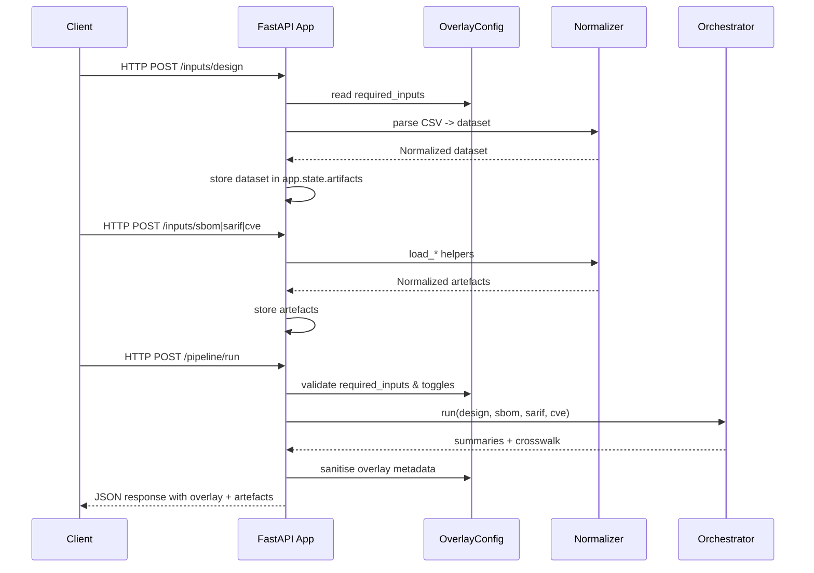

# FixOps Ingestion Platform — Architecture Overview

This document captures how the FixOps demo backend is structured, how requests move through the
system, and where the new overlay configuration influences runtime behaviour. It is intended for
engineers who need to reason about deployments as well as product stakeholders validating the
architecture against market promises.

## Component Summary

1. **FastAPI Ingestion Service (`backend/app.py`)**
   - Owns HTTP endpoints for uploading design context CSV, SBOM documents, SARIF findings, and CVE
     feeds, plus the `/pipeline/run` execution route.
   - Loads the overlay configuration during startup and persists it in `app.state.overlay` so every
     request has consistent mode-specific behaviour.
   - Enforces API-key authentication when the overlay requests token strategy (`X-API-Key` by default).
   - Streams uploads with overlay-defined byte limits and validates content types before parsing.
   - Creates any data directories declared in the overlay, ensuring Demo and Enterprise evidence
     locations exist before ingesting artefacts.
   - Exposes a `/feedback` endpoint (when enabled) that writes JSONL decisions into allowlisted
     directories for audit trails.
2. **Configuration Loader (`fixops/configuration.py`)**
   - Parses `config/fixops.overlay.yml`, honours the `FIXOPS_OVERLAY_PATH` override, merges
     profile-specific overrides, and applies defaults for toggles and metadata.
   - Validates the document with Pydantic (rejecting unknown keys), fails fast when required
     environment variables are missing, and masks secrets before they are exposed via API responses.
   - Resolves data directories against `FIXOPS_DATA_ROOT_ALLOWLIST` and captures authorised API tokens
     for the FastAPI layer.
3. **Normalisation Layer (`backend/normalizers.py`)**
   - Converts raw uploads into rich domain objects (`NormalizedSBOM`, `NormalizedSARIF`,
     `NormalizedCVEFeed`) with helper methods for JSON serialisation.
   - Handles optional third-party parser dependencies gracefully so the demo can run in a minimal
     environment.
4. **Pipeline Orchestrator (`backend/pipeline.py`)**
   - Correlates design rows with SBOM components, SARIF findings, and CVE entries using precomputed
     lowercase tokens for efficient matching.
   - Normalises severities from SARIF and CVE artefacts, produces aggregate summaries, evaluates
     maturity-aware guardrails, and emits a per-component “crosswalk” that powers downstream evidence
     bundles.
   - Executes the probabilistic forecast engine (Bayesian prior blending + Markov transition model)
     when enabled, generating escalation predictions and entropy metrics for the evidence bundle.
   - Invokes the AI Agent Advisor (overlay-driven) to flag LangChain/AutoGPT style components and
     attach recommended controls and playbooks to the pipeline response.
   - Runs the overlay-configured `ExploitSignalEvaluator` to surface EPSS/KEV-driven
     `exploitability_insights`, feeding policy automation and evidence bundles with exploitability
     context.
   - Calls the overlay-configured SSDLC evaluator to grade each lifecycle stage against the uploaded
     artefacts and automation outcomes, surfacing the `ssdlc_assessment` block for audits.
5. **Overlay-Aware State**
   - The ingestion service stores each uploaded artefact in `app.state.artifacts`. The overlay
     controls which artefacts are required (`OverlayConfig.required_inputs`) and whether metadata is
     attached to pipeline responses.

## Request Lifecycle

1. **Startup**
   - `create_app()` reads the overlay file (JSON-compatible YAML), validates it against the schema,
     resolves API keys from environment variables, and records the active mode (Demo vs Enterprise) in
     `app.state.overlay`. Any declared data directories are created eagerly.
2. **Artefact Uploads**
   - Each `/inputs/*` endpoint checks the `X-API-Key`, validates content type, streams the file within
     overlay-defined byte caps, and then normalises the payload before persisting the structured output
     in `app.state.artifacts`. Responses include preview metadata to confirm the upload succeeded.
3. **Pipeline Execution**
   - `/pipeline/run` looks at `OverlayConfig.required_inputs`. Missing artefacts are rejected with a
     descriptive HTTP 400. Enterprise mode enforces that Jira configuration is present before
     proceeding when `enforce_ticket_sync` is enabled.
   - `PipelineOrchestrator.run()` receives the cached artefacts, builds token lookups, aggregates
     severities and exploitability signals, and computes guardrail evaluations using the overlay’s
     maturity profile. The result includes severity breakdowns, a guardrail status (pass/warn/fail),
     SSDLC stage coverage, AI agent analysis (when configured), exploitability insights, IaC
     posture summaries, and a crosswalk for evidence bundling.
   - The overlay’s module registry toggles each feature (guardrails, context engine, compliance,
     probabilistic forecasting, evidence hub, pricing, AI, exploitability, SSDLC, IaC). Execution outcomes are captured in
     `pipeline_result["modules"]` and persisted into evidence bundles for traceability.
   - Overlay metadata is appended to the response (with secrets masked) when the
     `auto_attach_overlay_metadata` toggle is active. Evidence bundles omit the overlay when
     `include_overlay_metadata_in_bundles` is disabled.

## Sequence Diagram



## Component Diagram

```mermaid
graph TD
    subgraph Boundary[Deployment]
        A[FastAPI Ingestion Service]
        B[OverlayConfig]
        C[InputNormalizer]
        D[PipelineOrchestrator]
        K[ProbabilisticForecastEngine]
        H[IaCPostureEvaluator]
        I[Custom Module Hooks]
        J[EvidenceHub]
    end
    subgraph External
        E[Upload Clients]
        F[Optional Parsers (lib4sbom, sarif-om, cvelib)]
        G[Jira / Confluence / Git / CI (configured via overlay)]
    end

    E -->|HTTP uploads| A
    A --> B
    A --> C
    C --> F
    A --> D
    B --> A
    B --> G
    D --> K
    K --> J
    D --> J
    D --> H
    D --> I
    D --> J
    H --> J
    I --> J
    J --> A
```

## Failure Modes & Mitigations

- **Missing Artefacts** — If a required artefact is absent, `/pipeline/run` aborts with HTTP 400 and
  enumerates missing stages. Demo mode loosens requirements by default (`require_design_input=False`).
- **Misconfigured Integrations** — When `enforce_ticket_sync` is `True` but Jira or Confluence
  credentials (`user_email`/`token_env`) are missing, the policy automation layer surfaces
  `delivery.status="skipped"` with diagnostic reasons and the API raises HTTP 500 for critical
  omissions. Remote API errors bubble into `delivery_results` so operators can retry or remediate
  without losing the dispatch manifest.
- **Parser Failures** — Upload endpoints wrap parser errors in HTTP 400 responses and log the
  exception stack trace, preventing raw payload leakage.
- **Overlay Parsing Issues** — `load_overlay()` accepts YAML or JSON. If PyYAML is unavailable the
  loader falls back to JSON parsing and raises a descriptive error when neither succeeds.
- **Unauthorised Requests** — Missing/incorrect API keys return HTTP 401; demo mode can swap to
  `auth.strategy: oidc` when identity delegation is ready.
- **Oversized Uploads** — Exceeding overlay-defined byte caps returns HTTP 413 with guidance on limits.
- **Stale exploit feeds** — Auto-refresh fetches KEV/EPSS sources when metadata exceeds the staleness
  window and records refresh results under `exploit_feed_refresh`. Download failures surface as warning
  payloads without breaking the pipeline run.

## Mode Differences (Demo vs Enterprise)

| Concern | Demo Mode | Enterprise Mode |
| --- | --- | --- |
| Required artefacts | SBOM, SARIF, CVE (design optional) | Design + SBOM + SARIF + CVE |
| Jira enforcement | Not enforced (`enforce_ticket_sync=False`) | Enforced; missing config triggers 500 |
| Guardrail maturity | `foundational` (fail on critical, warn on high) | `advanced` (fail on medium, warn on medium) |
| Evidence directories | `data/evidence/demo` | `data/evidence/enterprise` + `data/audit` + feedback archive |
| Metadata attachment | Overlay metadata auto-attached | Optional; can be disabled for evidence bundles |
| Feedback capture | Disabled (`capture_feedback=False`) | Enabled; `/feedback` writes JSONL logs |
| AI agent watchlist | Optional keywords | Expanded watchlist + stricter controls |

The overlay file can be switched to Enterprise by editing `mode: "enterprise"` and adjusting the
integration payloads. No code changes are required; the FastAPI service adapts at startup.
