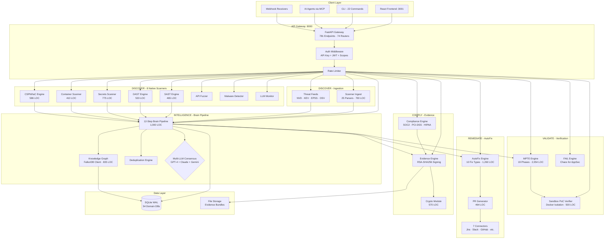
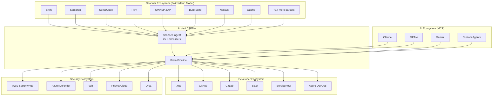

# ALdeci CTEM+ Architecture

> **Last updated**: 2026-03-02 (Sprint 2, Day 3)
> **Pillar**: [V3] Decision Intelligence · [V5] MPTE Verification · [V7] MCP-Native · [V10] CTEM Full Loop
> **Identity**: See `docs/CTEM_PLUS_IDENTITY.md` for canonical platform identity
> **Verified**: 781 routes mounted across 74 routers, E2E 58/58 (100%), all endpoints hardened

---

## System Overview

ALdeci is a **modular monolith** built on FastAPI, organized as 6 Python suites mounted on a single gateway. The architecture prioritizes air-gapped deployment, cryptographic evidence, and AI-native extensibility.


```mermaid
graph TB
    subgraph "Client Layer"
        UI[React Frontend :3001]
        CLI[CLI - 22 Commands]
        MCP_CLIENT[AI Agents via MCP]
        WEBHOOK[Webhook Receivers]
    end

    subgraph "API Gateway :8000"
        GW[FastAPI Gateway<br/>781 Endpoints · 74 Routers]
        AUTH[Auth Middleware<br/>API Key + JWT + Scopes]
        RATE[Rate Limiter]
    end

    subgraph "DISCOVER - 8 Native Scanners"
        SAST[SAST Engine<br/>465 LOC]
        DAST[DAST Engine<br/>533 LOC]
        SECRETS[Secrets Scanner<br/>775 LOC]
        CONTAINER[Container Scanner<br/>410 LOC]
        CSPM[CSPM/IaC Engine<br/>586 LOC]
        FUZZER[API Fuzzer]
        MALWARE[Malware Detector]
        LLM_MON[LLM Monitor]
    end

    subgraph "DISCOVER - Ingestion"
        INGEST[Scanner Ingest<br/>25 Parsers · 700 LOC]
        FEEDS[Threat Feeds<br/>NVD · KEV · EPSS · OSV]
    end

    subgraph "INTELLIGENCE - Brain Pipeline"
        BRAIN[12-Step Brain Pipeline<br/>1,000 LOC]
        KG[Knowledge Graph<br/>FalkorDB Client · 835 LOC]
        DEDUP[Deduplication Engine]
        AI{Multi-LLM Consensus<br/>GPT-4 + Claude + Gemini}
    end

    subgraph "VALIDATE - Verification"
        MPTE[MPTE Engine<br/>19 Phases · 2,054 LOC]
        SANDBOX[Sandbox PoC Verifier<br/>Docker Isolation · 500 LOC]
        FAIL[FAIL Engine<br/>Chaos for AppSec]
    end

    subgraph "REMEDIATE - AutoFix"
        AUTOFIX[AutoFix Engine<br/>10 Fix Types · 1,260 LOC]
        PR_GEN[PR Generator<br/>464 LOC]
        CONNECTORS[7 Connectors<br/>Jira · Slack · GitHub · etc.]
    end

    subgraph "COMPLY - Evidence"
        EVIDENCE[Evidence Engine<br/>RSA-SHA256 Signing]
        COMPLIANCE[Compliance Engine<br/>SOC2 · PCI-DSS · HIPAA]
        CRYPTO[Crypto Module<br/>570 LOC]
    end

    subgraph "Data Layer"
        DB[(SQLite WAL<br/>54 Domain DBs)]
        FS[File Storage<br/>Evidence Bundles]
    end

    UI --> GW
    CLI --> GW
    MCP_CLIENT --> GW
    WEBHOOK --> GW
    GW --> AUTH --> RATE

    RATE --> SAST & DAST & SECRETS & CONTAINER & CSPM & FUZZER & MALWARE & LLM_MON
    RATE --> INGEST & FEEDS
    RATE --> BRAIN
    RATE --> MPTE & SANDBOX & FAIL
    RATE --> AUTOFIX
    RATE --> EVIDENCE & COMPLIANCE

    INGEST --> BRAIN
    FEEDS --> BRAIN
    SAST & DAST & SECRETS & CONTAINER & CSPM --> BRAIN

    BRAIN --> KG
    BRAIN --> DEDUP
    BRAIN --> AI
    BRAIN --> MPTE
    BRAIN --> AUTOFIX
    BRAIN --> EVIDENCE

    AUTOFIX --> PR_GEN --> CONNECTORS
    MPTE --> SANDBOX
    EVIDENCE --> CRYPTO
    COMPLIANCE --> EVIDENCE

    BRAIN --> DB
    KG --> DB
    EVIDENCE --> FS
```

---

## Component Responsibilities

### Suite Architecture (6 Suites)

| Suite | LOC | Purpose | Key Files |
|-------|-----|---------|-----------|
| **suite-api** | 22.1K | FastAPI gateway, 20 routers, JWT auth, CORS, rate limiting | `apps/api/app.py` (2,742 LOC) |
| **suite-core** | 130.2K | Brain pipeline, scanners, AI engines, CLI, 23 routers | `core/brain_pipeline.py`, `core/autofix_engine.py` |
| **suite-attack** | 6.3K | MPTE, attack simulation, 12 scanner routers | `api/mpte_router.py`, `api/micro_pentest_router.py` |
| **suite-feeds** | 4.3K | NVD, KEV, EPSS, OSV, ExploitDB, GitHub feeds | `api/feeds_router.py` (31 endpoints) |
| **suite-evidence-risk** | 20.3K | Evidence bundles, risk scoring, compliance, 7 routers | `api/evidence_router.py`, `api/compliance_engine_router.py` |
| **suite-integrations** | 6.7K | MCP, webhooks, IaC, IDE, OSS tools, 6 routers | `api/mcp_router.py`, `api/webhooks_router.py` |

---

## Data Flow: Ingest to Evidence

The 12-step Brain Pipeline processes findings through the complete CTEM lifecycle:


```mermaid
graph LR
    subgraph "Step 1-2: CONNECT & NORMALIZE"
        S1[External Scanners<br/>Snyk · Semgrep · ZAP]
        S2[Native Scanners<br/>SAST · DAST · Secrets]
        S3[25 Parser<br/>Normalizers]
        S1 --> S3
        S2 --> S3
        S3 --> UFF[Universal Finding Format]
    end

    subgraph "Step 3-5: IDENTITY & GRAPH"
        UFF --> RESOLVE[Resolve Identity<br/>APP_ID Mapping]
        RESOLVE --> DEDUP2[Deduplicate<br/>Cross-Scanner]
        DEDUP2 --> GRAPH[Build Knowledge<br/>Graph]
    end

    subgraph "Step 6-8: ENRICH & SCORE"
        GRAPH --> ENRICH[Enrich with<br/>NVD/KEV/EPSS]
        ENRICH --> SCORE[Multi-Factor<br/>Risk Score]
        SCORE --> POLICY[Apply Org<br/>Policies]
    end

    subgraph "Step 9-10: VERIFY"
        POLICY --> LLM[Multi-LLM<br/>Consensus Vote]
        LLM --> PENTEST[MPTE 19-Phase<br/>Verification]
    end

    subgraph "Step 11-12: ACT"
        PENTEST --> PLAYBOOK[Run AutoFix<br/>Playbooks]
        PLAYBOOK --> SIGN[Generate Signed<br/>Evidence Bundle]
    end
```

**Result**: 11,300 raw findings become 340 actionable, verified, evidence-backed cases.

---

## Integration Architecture


```mermaid
graph TB
    subgraph "Scanner Ecosystem (Switzerland Model)"
        SNYK[Snyk]
        SEMGREP[Semgrep]
        SONAR[SonarQube]
        TRIVY[Trivy]
        ZAP[OWASP ZAP]
        BURP[Burp Suite]
        NESSUS[Nessus]
        QUALYS[Qualys]
        MORE[+17 more parsers]
    end

    subgraph "ALdeci CTEM+"
        INGEST2[Scanner Ingest<br/>25 Normalizers]
        BRAIN2[Brain Pipeline]
    end

    subgraph "Developer Ecosystem"
        JIRA[Jira]
        GITHUB[GitHub]
        GITLAB[GitLab]
        SLACK[Slack]
        SNOW[ServiceNow]
        ADO[Azure DevOps]
    end

    subgraph "Security Ecosystem"
        SEC_HUB[AWS SecurityHub]
        DEFENDER[Azure Defender]
        WIZ[Wiz]
        PRISMA[Prisma Cloud]
        ORCA[Orca]
    end

    subgraph "AI Ecosystem (MCP)"
        CLAUDE[Claude]
        GPT[GPT-4]
        GEMINI[Gemini]
        CUSTOM[Custom Agents]
    end

    SNYK & SEMGREP & SONAR & TRIVY & ZAP & BURP & NESSUS & QUALYS & MORE --> INGEST2
    INGEST2 --> BRAIN2
    BRAIN2 --> JIRA & GITHUB & GITLAB & SLACK & SNOW & ADO
    BRAIN2 --> SEC_HUB & DEFENDER & WIZ & PRISMA & ORCA
    CLAUDE & GPT & GEMINI & CUSTOM --> BRAIN2
```

---

## Security Model

### Authentication

| Layer | Mechanism | Purpose |
|-------|-----------|---------|
| API Key | `X-API-Key` header | Script/programmatic access |
| JWT | `Authorization: Bearer` | User session management |
| Scopes | Role-based (`admin:all`, `attack:execute`, etc.) | Fine-grained access control |
| Webhook | HMAC signature verification | Inbound webhook validation |

### Data Protection

- **At rest**: SQLite WAL with file-system permissions
- **In transit**: TLS 1.3 (configurable)
- **Evidence**: RSA-SHA256 cryptographic signatures (`suite-core/core/crypto.py`, 582 LOC)
- **Secrets**: Environment variables, never stored in code or DB
- **Input validation**: Pydantic v2 on all endpoints, path traversal prevention, size limits
- **Injection guards**: SQL parameter binding, shell command escaping, XXE disabled
- **SSRF protection**: URL validation on all target parameters (DAST, MPTE, micro-pentest)
- **Thread safety**: Brain Pipeline uses proper locking for concurrent requests

### Air-Gapped Deployment [V9]

ALdeci runs fully offline with zero external dependencies:

1. **8 native scanners** replace external scanner dependencies
2. **SQLite** replaces cloud databases
3. **Self-hosted LLM** (vLLM) replaces cloud AI APIs
4. **Local threat feeds** with offline refresh capability
5. **< 1 GB/year** storage via Zero-Gravity Data compression

---

## Deployment Options

### Local Development

```bash
pip install -r requirements.txt
python -m uvicorn apps.api.app:create_app --factory --port 8000
```

### Docker

```bash
docker compose -f docker/docker-compose.yml up
```

### Kubernetes (Helm)

```bash
helm install aldeci docker/helm/ --namespace aldeci
```

### Air-Gapped

```bash
# Pre-package all dependencies
pip download -r requirements.txt -d ./offline-packages/
# Transfer to air-gapped host, then:
pip install --no-index --find-links=./offline-packages/ -r requirements.txt
python -m uvicorn apps.api.app:create_app --factory --port 8000
```

---

## Key Design Decisions

| Decision | Choice | Rationale |
|----------|--------|-----------|
| **Monolith vs Microservices** | Modular monolith | Simpler deployment, especially air-gapped. Suites provide logical separation. |
| **Database** | SQLite WAL (54 domain DBs) | Zero-config, air-gap friendly, sufficient for POC/mid-market. |
| **AI Strategy** | Multi-LLM consensus | No single-model hallucination risk. 85% agreement threshold. |
| **Scanner Strategy** | Switzerland + Native | Integrate with all external tools AND ship built-in fallbacks. |
| **Evidence Signing** | RSA-SHA256 + ML-DSA (planned) | Quantum-resistant evidence for 20+ year validity. |
| **API Design** | FastAPI + OpenAPI | Auto-generated docs, Pydantic validation, async support. |

---

*Generated by ALdeci Technical Writer Agent · 2026-03-02 (Sprint 2, Day 2)*
*Source: `suite-api/apps/api/app.py` (2,742 LOC), 68 router files across 6 suites, `docs/CTEM_PLUS_IDENTITY.md`*
*Verified: 781 routes mounted across 74 routers, E2E 58/58 (100%), 248 backend tests passing*
