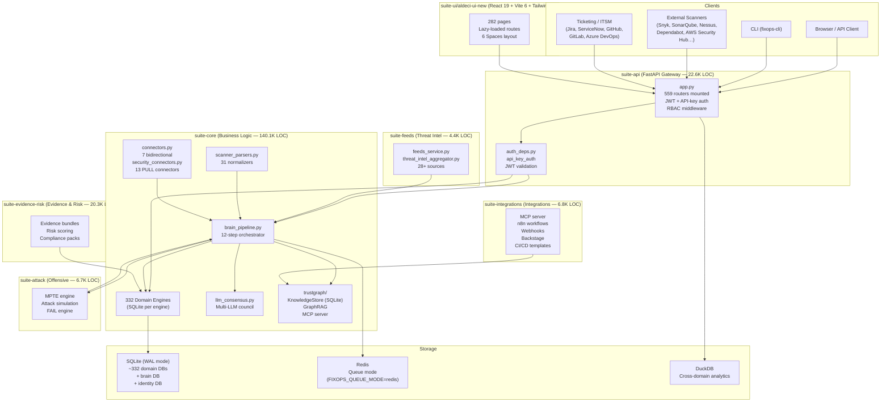
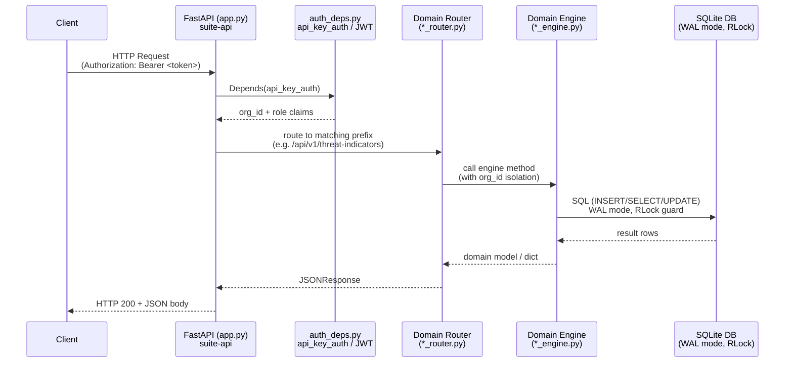
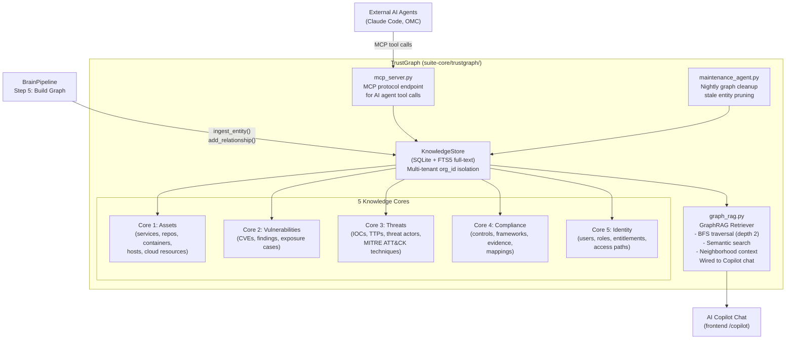
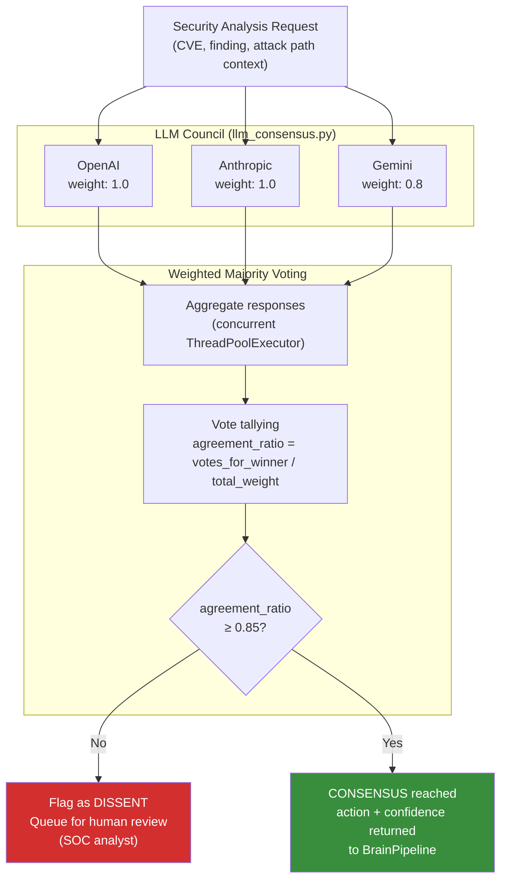
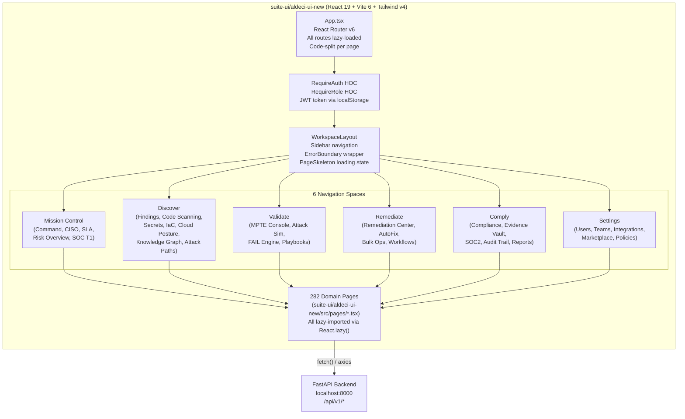
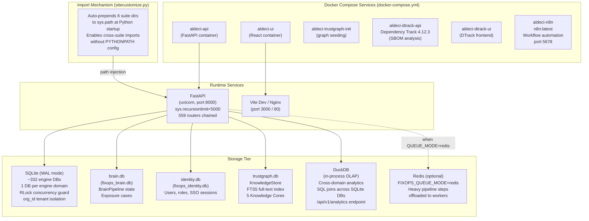

# ALDECI — Current Architecture Reference

> **Generated**: 2026-04-17  
> **Branch**: `features/intermediate-stage`  
> **Source of truth**: verified by inspecting actual files on disk  

All counts below are real (produced by `ls ... | wc -l` on the live codebase):

| Metric | Count |
|--------|-------|
| Backend engines (`suite-core/core/*engine*.py`) | **332** |
| API router files (`suite-api/apps/api/*router*.py`) | **559** |
| Test files (`tests/test_*.py`) | **812** |
| Frontend pages (`suite-ui/aldeci-ui-new/src/pages/*.tsx`) | **282** |
| Bidirectional connectors | **7** |
| PULL connectors | **13** |
| Scanner normalizers | **31** |

---

## 1. System Overview

ALDECI is a unified ASPM + CTEM + CSPM platform composed of six suites that communicate through a shared Python path (injected by `sitecustomize.py`) and a single FastAPI gateway.



---

## 2. Data Flow — Security Finding Through the System

The `BrainPipeline` orchestrates 12 sequential steps. Steps 9, 10, and 11 can be offloaded to Redis workers when `FIXOPS_QUEUE_MODE=redis`.

```mermaid
flowchart LR
    subgraph Ingest ["Ingest (Step 1-2)"]
        SC["Scanner Output\n(ZAP, Burp, Nessus,\nSonarQube, Snyk…)"]
        NR["scanner_parsers.py\n31 normalizers\nXML/JSON → UnifiedFinding"]
    end

    subgraph Pipeline ["BrainPipeline (Steps 3-12)"]
        S3["Step 3: Identity Resolution\nFuzzy entity matching"]
        S3b["Step 3b: FP Auto-Suppress\nFalse-positive filter"]
        S4["Step 4: Deduplicate\nCollapse → ExposureCases"]
        S5["Step 5: Build Graph\nKnowledge graph nodes"]
        S6["Step 6: Enrich Threats\nEPSS + KEV + CVSS\nNVD + abuse.ch feeds"]
        S7["Step 7: Score Risk\nGNN + attack paths\nBFS lateral movement"]
        S8["Step 8: Apply Policy\nRBAC + org rules"]
        S9["Step 9: LLM Consensus\nOpenAI + Anthropic + Gemini\n85% threshold"]
        S10["Step 10: MicroPenTest\nMPTE proves exploitability"]
        S11["Step 11: Run Playbooks\nIR automation"]
        S12["Step 12: Generate Evidence\nSOC2 Type II packs"]
    end

    subgraph Outputs ["Outputs"]
        TGStore["TrustGraph\nKnowledgeStore\n(SQLite graph)"]
        Alert["Alerts / Incidents\n(alerting_notification_engine)"]
        Ticket["Jira / ServiceNow\nbidirectional connector"]
        EvidenceOut["Evidence Bundle\n(compliance packs)"]
        SOCDash["SOC Dashboard\n(282 frontend pages)"]
    end

    SC --> NR
    NR --> S3
    S3 --> S3b
    S3b --> S4
    S4 --> S5
    S5 --> TGStore
    S5 --> S6
    S6 --> S7
    S7 --> S8
    S8 --> S9
    S9 --> S10
    S10 --> S11
    S11 --> Alert
    S11 --> Ticket
    S12 --> EvidenceOut
    S11 --> S12
    Alert --> SOCDash
    EvidenceOut --> SOCDash
```



---

## 3. Engine Categories — 332 Engines in 10 Sub-Epics

All engines live in `suite-core/core/` and follow the pattern: SQLite DB per engine, WAL mode, `threading.RLock()` for concurrency, `org_id` tenant isolation.

```mermaid
graph TD
    ALDECI["332 Domain Engines\nsuite-core/core/"]

    ALDECI --> ASPM["ASPM — Application Security\n~38 engines\n(sast, dast, sbom, secret_scanner,\napi_security, app_risk, devsecops,\nvuln_scan, vuln_lifecycle, patch_mgmt,\ncve_enrichment, sca, iac_scanner…)"]

    ALDECI --> CSPM["CSPM — Cloud Security\n~42 engines\n(cloud_compliance, cloud_drift,\ncloud_posture, cloud_native,\ncloud_identity, cloud_workload,\nksec, container_registry,\ncloud_security_findings,\ncloud_incident_response…)"]

    ALDECI --> CTEM["CTEM — Continuous Threat Exposure\n~35 engines\n(threat_indicator, threat_exposure,\ndark_web_monitoring, zero_day_intel,\nthreat_intel_platform, threat_feed_sub,\nthreat_attribution, attack_surface,\nransomware_protection, breach_detection…)"]

    ALDECI --> SOC["SOC — Security Operations\n~40 engines\n(siem_integration, alert_triage,\nincident_orchestration, soc_workflow,\nincident_triage, ai_powered_soc,\nincident_metrics, itdr,\nsecurity_automation, playbook_engine…)"]

    ALDECI --> GRC["GRC — Governance, Risk & Compliance\n~45 engines\n(compliance_automation, compliance_mapping,\ncompliance_workflow, risk_register,\nrisk_scenario, risk_treatment,\naudit_management, gdpr_compliance,\ndata_privacy, security_questionnaire…)"]

    ALDECI --> IDENTITY["Identity & Access\n~28 engines\n(identity_lifecycle, identity_risk,\naccess_governance, access_anomaly,\ndigital_identity, privileged_identity,\niam_policy_analyzer, mfa_management,\nitdr, pam, ciem, rbac…)"]

    ALDECI --> NETWORK["Network & Infrastructure\n~38 engines\n(network_monitoring, network_anomaly,\nfirewall_policy, network_segmentation,\niot_security, firmware_security,\npassive_dns, ip_reputation,\nwireless_security, bandwidth_analysis…)"]

    ALDECI --> AI["AI / ML\n~12 engines\n(ai_governance, ai_powered_soc,\nai_security_advisor, anomaly_ml,\ndigital_twin_security, graphrag,\nbehavioral_analytics, context_engine,\nllm_consensus layer…)"]

    ALDECI --> EXEC["Executive & Metrics\n~28 engines\n(executive_reporting, security_budget,\nkpi_tracking, security_okr,\nsecurity_investment, security_culture,\ncyber_insurance, security_scorecard,\nmetrics_dashboard, posture_trend…)"]

    ALDECI --> ADVANCED["Advanced Capabilities\n~26 engines\n(quantum_safe_crypto, deception_analytics,\nsecurity_chaos, autonomous_remediation,\nvuln_correlation, posture_benchmarking,\nthreat_modeling_pipeline, sbom_export,\nevidence_vault, security_registry…)"]
```



---

## 4. API Layer — Request Lifecycle



**Auth mechanisms in use:**
- `api_key_auth` — SHA-256 hashed API keys, stored per org in auth DB
- JWT (`python-jose`) — RS256 signed, org_id + role claims
- SAML/OIDC SSO bridge — PyJWKClient RS256 validation for enterprise SSO
- All 559 routers gate endpoints via `dependencies=[Depends(api_key_auth)]`

---

## 5. TrustGraph Knowledge Graph

TrustGraph is ALDECI's versioned security knowledge layer. It lives in `suite-core/trustgraph/` and exposes an MCP server for AI agent access.



**Key capabilities:**
- Full-text search via SQLite FTS5 across all cores
- Graph traversal: `get_neighbors(entity_id, depth=2)` for blast-radius analysis
- Relationship types: `owns`, `depends_on`, `exploits`, `mitigates`, `owned_by`, `maps_to`
- All entities scoped to `org_id` — strict multi-tenant isolation

---

## 6. LLM Council — Multi-Model Consensus

Step 9 of the BrainPipeline sends every security decision to 3 providers concurrently. Results are merged via weighted majority voting.



**Provider weights** (configured in `llm_consensus.py`):
| Provider | Weight | Model |
|----------|--------|-------|
| OpenAI | 1.0 | GPT-4 via `OPENAI_API_KEY` |
| Anthropic | 1.0 | Claude via `ANTHROPIC_API_KEY` |
| Gemini | 0.8 | Gemini via `GOOGLE_API_KEY` |

Consensus threshold: **85%** agreement required. Below threshold → `dissent=True`, queued for human SOC review.

---

## 7. Frontend Architecture



**Technology stack:**
- React 19 with concurrent features
- Vite 6 for bundling (fast HMR in dev)
- Tailwind v4 for styling
- React Router v6 for client-side routing
- All 282 pages are lazy-loaded — zero blocking imports at startup
- `RequireAuth` + `RequireRole` HOCs enforce RBAC before rendering

---

## 8. Infrastructure & Storage



**SQLite WAL pattern (used by all 332 engines):**
```
conn.execute("PRAGMA journal_mode=WAL")
self._lock = threading.RLock()
# All writes: with self._lock: conn.execute(...)
# org_id column on every table for tenant isolation
```

**DuckDB cross-domain analytics:**
- Attaches all SQLite engine DBs at query time
- Enables SQL JOINs across e.g. `vuln_scan_engine.db` × `asset_tagging_engine.db`
- Powers `/api/v1/analytics` and `CrossDomainAnalytics.tsx` dashboard

---

## Appendix: Suite LOC Summary

| Suite | Purpose | Approx LOC |
|-------|---------|-----------|
| `suite-api` | FastAPI gateway, 559 routers, auth, middleware | 22,600 |
| `suite-core` | 332 engines, BrainPipeline, connectors, TrustGraph | 140,100 |
| `suite-attack` | MPTE, attack simulation, FAIL engine | 6,700 |
| `suite-feeds` | 28+ threat intel feed integrations | 4,400 |
| `suite-evidence-risk` | Evidence bundles, risk scoring, compliance | 20,300 |
| `suite-integrations` | MCP, n8n, webhooks, Backstage, CI/CD | 6,800 |
| `suite-ui/aldeci-ui-new` | React 19 frontend, 282 pages | ~60,000 |

---

## Appendix: Key File Locations

| Component | Path |
|-----------|------|
| FastAPI entry point | `suite-api/apps/api/app.py` |
| Brain Pipeline | `suite-core/core/brain_pipeline.py` |
| LLM Consensus | `suite-core/core/llm_consensus.py` |
| Scanner Normalizers | `suite-core/core/scanner_parsers.py` |
| Bidirectional Connectors | `suite-core/core/connectors.py` |
| PULL Connectors | `suite-core/core/security_connectors.py` |
| TrustGraph Store | `suite-core/trustgraph/knowledge_store.py` |
| GraphRAG Retriever | `suite-core/trustgraph/graph_rag.py` |
| TrustGraph MCP Server | `suite-core/trustgraph/mcp_server.py` |
| Path injection | `sitecustomize.py` |
| Auth dependencies | `suite-api/apps/api/auth_deps.py` |
| Frontend routing | `suite-ui/aldeci-ui-new/src/App.tsx` |
| Docker Compose | `docker-compose.yml` |
| Threat intel feeds | `suite-feeds/feeds_service.py` |
| DuckDB analytics engine | `suite-core/core/duckdb_analytics_engine.py` |
