# ALdeci — End-to-End Platform Architecture

> Complete data flow from customer tool ingestion through self-learning feedback loops.

---

## High-Level Flow

```
Customer Tools ──► ALdeci Adapters/Connectors ──► Normalize ──► Resolve & Dedup
       │                                                              │
       ▼ (no tools?)                                                  ▼
  OSS Scanner Fallback                                    Knowledge Graph (Brain Map)
  (Trivy, Grype, Secrets, IaC)                           (Assets ↔ Findings ↔ CVEs)
                                                                      │
                                                          ┌───────────┴───────────┐
                                                          ▼                       ▼
                                                    Threat Enrichment     Graph Visualization
                                                   (EPSS, KEV, CVSS)      (React Force Graph)
                                                          │                       │
                                                          ▼                       │
                                                    Risk Scoring ◄────────────────┘
                                                          │          "Run Micro-Pentest"
                                                          ▼
                                                    Policy Engine ◄──── RBVM Policy Create
                                                   (SLA, Compliance)
                                                          │
                                              ┌───────────┼───────────┐
                                              ▼           ▼           ▼
                                           GPT-4       Claude      Gemini
                                          (0.25)       (0.40)      (0.35)
                                              └───────────┼───────────┘
                                                          ▼
                                                 Weighted Consensus
                                                  (≥85% = auto)
                                                          │
                                                          ▼
                                              Micro-Pentest Engine (MPTE)
                                              (19-phase + AI orchestrator)
                                                          │
                                                          ▼
                                                4-State Verdict + Scores
                                                          │
                                                          ▼
                                             YAML Playbooks & AutoFix
                                             (Jira, Slack, GitHub PRs)
                                                          │
                                                          ▼
                                             Signed Evidence Bundles
                                             (RSA-SHA256 + Reports)
                                                          │
                                                          ▼
                                                   RBVM Dashboard
                                               (Priority, SLA, Trends)
                                                          │
                                                          ▼
                                                ┌─── Self-Learning ───┐
                                                │  ML Layer (scikit)  │
                                                │  MindsDB NL Queries │
                                                │  5 Feedback Loops   │
                                                └──── feeds back ─────┘
                                                    into pipeline
```

---

## Detailed Architecture Diagram (Mermaid)

```mermaid
flowchart TB
    subgraph CUSTOMER["🏢 CUSTOMER ENVIRONMENT"]
        direction TB
        subgraph SAST_DAST["AppSec Tools"]
            SNYK[Snyk]
            SONAR[SonarQube]
            SEMGREP[Semgrep]
            CHECKOV[Checkov]
        end
        subgraph CLOUD_SEC["Cloud Security"]
            AWS_SH[AWS Security Hub]
            AZURE_SC[Azure Security Center]
            WIZ[Wiz]
            PRISMA[Prisma Cloud]
        end
        subgraph DEVOPS["DevOps Platforms"]
            GITLAB[GitLab]
            AZURE_DO[Azure DevOps]
            GITHUB[GitHub / Dependabot]
        end
        subgraph RUNTIME["Runtime / Infra"]
            PROWLER[Prowler]
            TRIVY_EXT[Trivy]
            ZAP[OWASP ZAP]
        end
    end

    subgraph FALLBACK["🛡️ ALdeci OSS SCANNER FALLBACK"]
        direction LR
        TRIVY_INT[Trivy Scanner]
        GRYPE[Grype Scanner]
        VULN_SCAN[Vulnerability Scanner]
        SECRET_SCAN[Secrets Scanner]
        IAC_SCAN[IaC Scanner]
    end

    subgraph INGEST["📥 STEP 1-2: CONNECT & NORMALIZE"]
        direction TB
        ADAPTERS["8 Adapters\n(GitLab, AzDO, Snyk, Trivy,\nProwler, ZAP, Semgrep, Checkov)"]
        CONNECTORS["7 Connectors\n(Snyk, SonarQube, Dependabot,\nAWS SH, Azure SC, Wiz, Prisma)"]
        NORMALIZE["Normalize to Unified Schema\n(SARIF → SarifFinding)\n(SBOM → SBOMComponent)\n(CVE → CVERecordSummary)"]
    end

    subgraph IDENTITY["🔗 STEP 3-4: RESOLVE & DEDUPLICATE"]
        direction TB
        RESOLVE["Asset Identity Resolution\n• Canonical asset fingerprinting\n• Cross-scanner correlation"]
        DEDUP["Smart Deduplication\n• Fuzzy matching clusters\n• Noise reduction\n• Exposure case creation"]
    end

    subgraph GRAPH["🧠 STEP 5: KNOWLEDGE GRAPH (Brain Map)"]
        direction TB
        BRAIN["Knowledge Brain\n(NetworkX Graph)"]
        NODES["Entity Types:\n• Assets • Findings • CVEs\n• Exposure Cases • Packages"]
        EDGES["Edge Types:\n• AFFECTS • REFERENCES\n• DEPENDS_ON • EXPLOITS"]
        VIZ["Graph Visualization\n(React Force Graph / D3.js)"]
    end

    subgraph ENRICH["📊 STEP 6-7: ENRICH & SCORE"]
        direction TB
        THREAT["Threat Reality Signals\n• EPSS scores (exploit probability)\n• CISA KEV (known exploited)\n• CVSS (severity baseline)"]
        FEEDS["Threat Intel Feeds\n(NVD, KEV, EPSS,\nGitHub Advisories, OSV, ExploitDB)"]
        RISK_SCORE["Risk Scoring Engine\n• Attack path analysis\n• Business context weighting\n• Reachability analysis"]
    end

    subgraph POLICY["📋 STEP 8: POLICY ENGINE"]
        direction TB
        APPLY_POLICY["Apply Organization Policies\n• SLA enforcement\n• Auto-triage rules\n• Severity overrides\n• Compliance mapping"]
        FRAMEWORKS["Compliance Frameworks:\nSOC2 · ISO27001 · PCI-DSS\nNIST CSF · HIPAA · CIS"]
    end

    subgraph AI_LAYER["🤖 STEP 9: MULTI-LLM CONSENSUS"]
        direction TB
        GPT4["GPT-4\n(Team Lead · 0.25 weight)"]
        CLAUDE["Claude\n(Developer · 0.40 weight)"]
        GEMINI["Gemini\n(Architect · 0.35 weight)"]
        CONSENSUS["Weighted Consensus\n≥85% = Auto-decide\n<85% = Human review"]
        REASONING["Reasoning Chains\n• Risk assessment rationale\n• Remediation recommendations\n• Priority justification"]
    end

    subgraph MPTE["⚔️ STEP 10: MICRO-PENTEST ENGINE"]
        direction TB
        SCANNER["19-Phase Deterministic Scanner\n• Port scan • Service detection\n• CVE validation • SSRF check"]
        AI_ORCH["Multi-AI Orchestrator\n(MPTE-powered)"]
        VERDICT["4-State Verdict:\n✅ VULNERABLE_VERIFIED\n❌ NOT_VULNERABLE_VERIFIED\n⊘ NOT_APPLICABLE\n❓ UNVERIFIED"]
        METRICS["3 Confidence Metrics:\n• Applicability Score\n• Test Coverage Score\n• Confidence Score"]
    end

    subgraph AUTOMATE["⚡ STEP 11: PLAYBOOKS & AUTOFIX"]
        direction TB
        PLAYBOOKS["YAML Playbook Runner\n• Auto-remediation flows\n• Jira ticket creation\n• Slack notifications\n• GitHub PR auto-fix"]
        AUTOFIX["LLM-Powered AutoFix\n(10 fix types, code generation)\n(Roadmap: tree-sitter AST)"]
    end

    subgraph EVIDENCE["📄 STEP 12: EVIDENCE & REPORTING"]
        direction TB
        BUNDLES["Signed Evidence Bundles\n(RSA-SHA256 signatures)"]
        REPORTS["Report Generation\n• Executive summary\n• Technical detail\n• RBVM dashboard\n• Compliance reports"]
        EXPORT["Export Formats:\nPDF · JSON · CSV · SARIF"]
    end

    subgraph RBVM["📈 RBVM DASHBOARD"]
        direction TB
        RBVM_VIEW["Risk-Based Vulnerability Management\n• Priority queue by exploitability\n• SLA tracking & burndown\n• Trend analysis"]
        POLICY_CREATE["Policy Creation UI\n• Tie policies to findings\n• Auto-assign owners\n• Define SLA thresholds"]
    end

    subgraph SELF_LEARN["🔄 SELF-LEARNING ML LAYER"]
        direction TB
        subgraph ML_STORE["APILearningStore (SQLite + scikit-learn)"]
            ANOMALY["IsolationForest\nAnomaly Detection"]
            THREAT_ML["Threat Assessment\nML Model"]
            PATTERN["Pattern Recognition\n& Trend Analysis"]
        end
        subgraph MINDSDB_LAYER["MindsDB Natural Language Layer"]
            NL_QUERY["Natural Language Queries\n'Show me critical vulns\nexploitable in production'"]
            AGENTS["5 AI Agents:\n• Security Analyst\n• Pentest Agent\n• Compliance Agent\n• Remediation Agent\n• Orchestrator"]
        end
        subgraph FEEDBACK["5 Feedback Loops"]
            FB1["1. Decision Outcomes\n→ Retrain consensus weights"]
            FB2["2. MPTE Results\n→ Improve scan targeting"]
            FB3["3. False Positive Rates\n→ Tune dedup thresholds"]
            FB4["4. Remediation Success\n→ Rank fix strategies"]
            FB5["5. Policy Violations\n→ Auto-adjust rules"]
        end
    end

    subgraph CTEM["♻️ CONTINUOUS THREAT EXPOSURE MANAGEMENT"]
        direction LR
        SCOPE["Scope"] --> DISCOVER["Discover"] --> PRIORITIZE["Prioritize"] --> VALIDATE["Validate"] --> MOBILIZE["Mobilize"]
        MOBILIZE --> SCOPE
    end

    %% ===== FLOW CONNECTIONS =====

    %% Customer tools → ALdeci ingestion
    SAST_DAST --> ADAPTERS
    CLOUD_SEC --> CONNECTORS
    DEVOPS --> ADAPTERS
    RUNTIME --> ADAPTERS

    %% Fallback OSS scanners
    CUSTOMER -- "No tools?\nFallback" --> FALLBACK
    FALLBACK --> NORMALIZE

    %% Ingestion flow
    ADAPTERS --> NORMALIZE
    CONNECTORS --> NORMALIZE

    %% Pipeline steps 1-4
    NORMALIZE --> RESOLVE
    RESOLVE --> DEDUP

    %% Step 5: Graph
    DEDUP --> BRAIN
    BRAIN --- NODES
    BRAIN --- EDGES
    BRAIN --> VIZ

    %% Steps 6-7: Enrich
    BRAIN --> THREAT
    FEEDS --> THREAT
    THREAT --> RISK_SCORE

    %% Step 8: Policy
    RISK_SCORE --> APPLY_POLICY
    APPLY_POLICY --- FRAMEWORKS

    %% Step 9: LLM Consensus
    APPLY_POLICY --> GPT4
    APPLY_POLICY --> CLAUDE
    APPLY_POLICY --> GEMINI
    GPT4 --> CONSENSUS
    CLAUDE --> CONSENSUS
    GEMINI --> CONSENSUS
    CONSENSUS --> REASONING

    %% Step 10: MPTE (triggered from graph)
    VIZ -- "Click: Run\nMicro-Pentest" --> SCANNER
    REASONING --> SCANNER
    SCANNER --> AI_ORCH
    AI_ORCH --> VERDICT
    VERDICT --> METRICS

    %% Step 11: Automate
    METRICS --> PLAYBOOKS
    PLAYBOOKS --> AUTOFIX

    %% Step 12: Evidence
    PLAYBOOKS --> BUNDLES
    BUNDLES --> REPORTS
    REPORTS --> EXPORT

    %% RBVM
    REPORTS --> RBVM_VIEW
    RBVM_VIEW --> POLICY_CREATE
    POLICY_CREATE -- "Policies feed back\nto Step 8" --> APPLY_POLICY

    %% Self-learning loops
    CONSENSUS -- "Decision data" --> ANOMALY
    VERDICT -- "Pentest results" --> THREAT_ML
    DEDUP -- "FP feedback" --> PATTERN
    PLAYBOOKS -- "Fix outcomes" --> ML_STORE
    POLICY_CREATE -- "Policy changes" --> ML_STORE

    ML_STORE --> MINDSDB_LAYER
    NL_QUERY --> AGENTS

    %% Feedback loops back into pipeline
    FB1 -- "Retrain" --> AI_LAYER
    FB2 -- "Optimize" --> MPTE
    FB3 -- "Tune" --> IDENTITY
    FB4 -- "Rank" --> AUTOMATE
    FB5 -- "Adjust" --> POLICY

    %% CTEM wraps everything
    CTEM -- "Continuous\nLoop" --> INGEST

    %% Styling
    classDef customer fill:#1e3a5f,stroke:#4a90d9,color:#fff
    classDef fallback fill:#2d4a1f,stroke:#6fbf44,color:#fff
    classDef pipeline fill:#3d2d5f,stroke:#9b72cf,color:#fff
    classDef ai fill:#5f1e1e,stroke:#d94a4a,color:#fff
    classDef mpte fill:#5f4a1e,stroke:#d9a84a,color:#fff
    classDef learn fill:#1e5f5f,stroke:#4ad9d9,color:#fff
    classDef ctem fill:#4a1e5f,stroke:#b44ad9,color:#fff

    class SNYK,SONAR,SEMGREP,CHECKOV,AWS_SH,AZURE_SC,WIZ,PRISMA,GITLAB,AZURE_DO,GITHUB,PROWLER,TRIVY_EXT,ZAP customer
    class TRIVY_INT,GRYPE,VULN_SCAN,SECRET_SCAN,IAC_SCAN fallback
    class ADAPTERS,CONNECTORS,NORMALIZE,RESOLVE,DEDUP,BRAIN,NODES,EDGES,VIZ,THREAT,FEEDS,RISK_SCORE,APPLY_POLICY,FRAMEWORKS pipeline
    class GPT4,CLAUDE,GEMINI,CONSENSUS,REASONING ai
    class SCANNER,AI_ORCH,VERDICT,METRICS mpte
    class ANOMALY,THREAT_ML,PATTERN,NL_QUERY,AGENTS,FB1,FB2,FB3,FB4,FB5 learn
    class SCOPE,DISCOVER,PRIORITIZE,VALIDATE,MOBILIZE ctem
```



---

## Pipeline Step Mapping to Code

| Step | Name | File | Lines | Status |
|------|------|------|-------|--------|
| 1 | `connect` | `brain_pipeline.py` | 270-295 | ✅ Real |
| 2 | `normalize` | `brain_pipeline.py` | 296-330 | ✅ Real |
| 3 | `resolve_identity` | `brain_pipeline.py` | 331-362 | ✅ Real |
| 4 | `deduplicate` | `brain_pipeline.py` | 363-414 | ✅ Real |
| 5 | `build_graph` | `brain_pipeline.py` | 418-501 | ✅ Real (NetworkX) |
| 6 | `enrich_threats` | `brain_pipeline.py` | 505-540 | ⚠️ Synthetic EPSS/KEV |
| 7 | `score_risk` | `brain_pipeline.py` | 543-610 | ✅ Real (needs attack paths) |
| 8 | `apply_policy` | `brain_pipeline.py` | 612-638 | ⚠️ String matching |
| 9 | `llm_consensus` | `brain_pipeline.py` | 640-720 | ✅ Real (Anthropic bug) |
| 10 | `micro_pentest` | `brain_pipeline.py` | 722-780 | ✅ Real (19-phase) |
| 11 | `run_playbooks` | `brain_pipeline.py` | 782-820 | ✅ Real |
| 12 | `generate_evidence` | `brain_pipeline.py` | 822-864 | ✅ Real (RSA signed) |

---

## Integration Inventory

### Customer Tools We Connect To (15)

| Category | Tool | Connector Type | File |
|----------|------|---------------|------|
| AppSec | Snyk | Adapter + Connector | `adapters.py`, `security_connectors.py` |
| AppSec | SonarQube | Connector | `security_connectors.py` |
| AppSec | Semgrep | Adapter | `adapters.py` |
| AppSec | Checkov | Adapter | `adapters.py` |
| Cloud | AWS Security Hub | Connector | `security_connectors.py` |
| Cloud | Azure Security Center | Connector | `security_connectors.py` |
| Cloud | Wiz | Connector | `security_connectors.py` |
| Cloud | Prisma Cloud | Connector | `security_connectors.py` |
| DevOps | GitLab | Adapter | `adapters.py` |
| DevOps | Azure DevOps | Adapter | `adapters.py` |
| DevOps | GitHub/Dependabot | Connector | `security_connectors.py` |
| Runtime | Trivy | Adapter | `adapters.py` |
| Runtime | Prowler | Adapter | `adapters.py` |
| Runtime | OWASP ZAP | Adapter | `adapters.py` |

### OSS Scanner Fallbacks (5)

| Scanner | Purpose | File |
|---------|---------|------|
| TrivyScanner | Container/OS vuln scanning | `core/scanners.py` |
| GrypeScanner | SBOM-based vuln scanning | `core/scanners.py` |
| RealVulnerabilityScanner | App dependency scanning | `core/scanners.py` |
| RealSecretsScanner | Secret/credential detection | `core/scanners.py` |
| RealIaCScanner | Infrastructure-as-Code | `core/scanners.py` |

---

## Self-Learning Feedback Architecture

```
┌─────────────────────────────────────────────────────────────┐
│                     SELF-LEARNING LAYER                     │
├─────────────────────────────────────────────────────────────┤
│                                                             │
│  ┌──────────────┐    ┌──────────────┐    ┌──────────────┐  │
│  │ APILearning  │    │  MindsDB NL  │    │  5 Feedback  │  │
│  │ Store        │◄──►│  Query Layer │◄──►│  Loops       │  │
│  │ (scikit-     │    │              │    │              │  │
│  │  learn)      │    │ "Show vulns  │    │ 1. Decisions │  │
│  │              │    │  exploitable │    │ 2. MPTE      │  │
│  │ • Anomaly    │    │  in prod"    │    │ 3. FP rates  │  │
│  │ • Threat     │    │              │    │ 4. Fix rank  │  │
│  │ • Patterns   │    │ 5 AI Agents  │    │ 5. Policies  │  │
│  └──────┬───────┘    └──────────────┘    └──────┬───────┘  │
│         │                                        │         │
│         ▼            FEEDS BACK INTO             ▼         │
│  ┌─────────────────────────────────────────────────────┐   │
│  │ Pipeline Steps: Consensus │ MPTE │ Dedup │ Playbooks│   │
│  └─────────────────────────────────────────────────────┘   │
└─────────────────────────────────────────────────────────────┘
```

---

## CTEM (Continuous Threat Exposure Management) Loop

```
    ┌─────────┐     ┌──────────┐     ┌────────────┐
    │  SCOPE  │────►│ DISCOVER │────►│ PRIORITIZE │
    └────▲────┘     └──────────┘     └─────┬──────┘
         │                                  │
         │                                  ▼
    ┌────┴─────┐                    ┌──────────┐
    │ MOBILIZE │◄───────────────────│ VALIDATE │
    └──────────┘                    └──────────┘

    Scope      = Steps 1-2 (Connect, Normalize)
    Discover   = Steps 3-5 (Resolve, Dedup, Graph)
    Prioritize = Steps 6-8 (Enrich, Score, Policy)
    Validate   = Steps 9-10 (LLM Consensus, MPTE)
    Mobilize   = Steps 11-12 (Playbooks, Evidence)
```

---

## What Competitors Do vs. What ALdeci Does

| Capability | Snyk/Wiz/ArmorCode | ALdeci Difference |
|-----------|-------------------|-------------------|
| Ingest vulns | ✅ | ✅ + OSS fallback scanners |
| Deduplicate | Basic | Fuzzy ML clustering |
| Knowledge Graph | ❌ (flat lists) | ✅ Full graph with attack paths |
| Multi-LLM Consensus | ❌ (single AI or none) | ✅ 3-LLM weighted voting |
| Micro-Pentest | ❌ | ✅ 19-phase + AI verification |
| Self-Learning | ❌ | ✅ 5 feedback loops |
| Natural Language | Basic chatbot | MindsDB + 5 specialized agents |
| Signed Evidence | ❌ | ✅ RSA-SHA256 bundles |
| CTEM Loop | Partial | ✅ Full 5-phase continuous |
