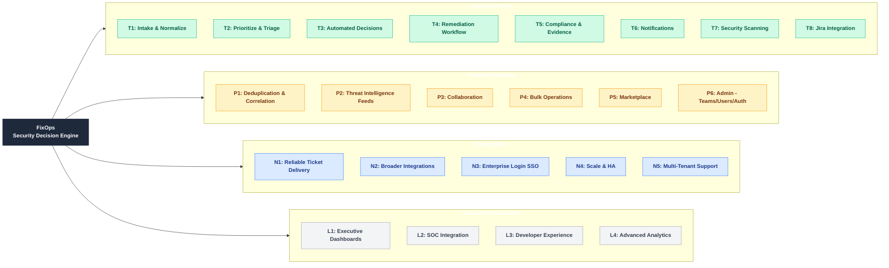
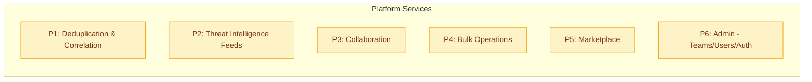

# FixOps Product Status & Technical Reference

**Document Version:** 3.0  
**Date:** January 2026  
**Purpose:** Consolidated product status with technical deep-dive for architects, product owners, and engineers

---

## Capability Map



---

## Workflow Stage Map

```mermaid
flowchart LR
  subgraph DESIGN[Design Phase]
    D1[Design CSV]
    D2[Business Context]
    D3[Inventory]
    D4[Policies]
  end

  subgraph BUILD[Build Phase]
    B1[SBOM Analysis]
    B2[Dependency Scan]
  end

  subgraph TEST[Test Phase]
    T1[SARIF Ingestion]
    T2[CVE/VEX Analysis]
    T3[IaC Scanning]
    T4[Secrets Scanning]
    T5[PentAGI Testing]
    T6[Micro Pentests]
  end

  subgraph DECISION[Release Gate]
    R1[Risk Scoring]
    R2[LLM Consensus]
    R3[Policy Evaluation]
    R4[Decision: ALLOW/BLOCK/REVIEW]
  end

  subgraph REMEDIATE[Remediation]
    M1[Task Assignment]
    M2[SLA Tracking]
    M3[Fix Verification]
  end

  subgraph MONITOR[Monitor & Audit]
    A1[Analytics Dashboard]
    A2[Audit Logs]
    A3[Compliance Reports]
    A4[Evidence Bundles]
  end

  DESIGN --> BUILD --> TEST --> DECISION
  DECISION -->|BLOCK/REVIEW| REMEDIATE --> TEST
  DECISION -->|ALLOW| MONITOR
  REMEDIATE --> MONITOR

  classDef phase fill:#e0f2fe,stroke:#0284c7,color:#0c4a6e;
```



**Workflow Stage to API/CLI Mapping:**

| Stage | CLI Commands | API Routers | Key Endpoints |
|-------|--------------|-------------|---------------|
| **Design** | `stage-run --stage design`, `inventory add`, `policies create` | `ingestion_router`, `inventory_router`, `policies_router` | `POST /inputs/design`, `POST /api/v1/inventory/*`, `POST /api/v1/policies` |
| **Build** | `stage-run --stage build`, `run --sbom` | `ingestion_router` | `POST /inputs/sbom` |
| **Test** | `stage-run --stage test`, `run --sarif`, `pentagi create`, `advanced-pentest run`, `micro-pentest run` | `ingestion_router`, `iac_router`, `secrets_router`, `pentagi_router`, `micro_pentest_router` | `POST /inputs/sarif`, `POST /api/v1/iac/scan/*`, `POST /api/v1/secrets/scan/*`, `POST /api/v1/micro-pentest/*` |
| **Release Gate** | `make-decision`, `run`, `analyze` | `pipeline`, `enhanced` | `GET /pipeline/run`, `POST /api/v1/enhanced/analysis` |
| **Remediation** | `remediation create`, `remediation update` | `remediation_router` | `POST /api/v1/remediation/tasks`, `PUT /api/v1/remediation/tasks/{id}` |
| **Monitor** | `analytics dashboard`, `audit logs`, `compliance status` | `analytics_router`, `audit_router` | `GET /api/v1/analytics/*`, `GET /api/v1/audit/*` |
| **Audit** | `get-evidence`, `copy-evidence`, `compliance report`, `reports export` | `evidence`, `reports_router` | `GET /api/v1/evidence/*`, `GET /api/v1/reports/*` |

---

## API/CLI Coverage Summary

| Metric | Count |
|--------|-------|
| **Total API Endpoints** | 303 |
| **CLI Commands/Subcommands** | 84 |
| **API Endpoints with CLI Coverage** | 223 (74%) |
| **API-Only Endpoints** | 80 (26%) |

**Note:** Counts are code-derived from static enumeration of router decorators.

### Code-Derived Endpoint Breakdown

| Source | Endpoints |
|--------|-----------|
| apps/api/*_router.py | 263 |
| apps/api/app.py | 18 |
| apps/api/routes/enhanced.py | 4 |
| backend/api/* routers | 18 |
| **Total** | **303** |

### API Routers (32 total)

| Router | File | Endpoints | CLI Coverage |
|--------|------|-----------|--------------|
| Core Ingestion | `apps/api/app.py` | 18 | `run`, `ingest`, `stage-run` |
| Enhanced Decision | `apps/api/routes/enhanced.py` | 4 | `advanced-pentest capabilities` |
| Analytics | `apps/api/analytics_router.py` | 16 | `analytics dashboard/mttr/coverage/roi/export` |
| Audit | `apps/api/audit_router.py` | 10 | `audit logs/decisions`, `compliance *` |
| Reports | `apps/api/reports_router.py` | 10 | `reports list/generate/export` |
| Teams | `apps/api/teams_router.py` | 8 | `teams list/get/create` |
| Users | `apps/api/users_router.py` | 6 | `users list/get/create` |
| Policies | `apps/api/policies_router.py` | 8 | `policies list/get/create/validate/test` |
| Integrations | `apps/api/integrations_router.py` | 8 | `integrations list/configure/test/sync` |
| Workflows | `apps/api/workflows_router.py` | 7 | `workflows list/get/create/execute/history` |
| Inventory | `apps/api/inventory_router.py` | 15 | `inventory apps/add/get/services/search` |
| PentAGI | `apps/api/pentagi_router.py` | 14 | `pentagi list/create/status` |
| Micro Pentest | `apps/api/micro_pentest_router.py` | 3 | `micro-pentest run/status/batch` |
| Enhanced PentAGI | `apps/api/pentagi_router_enhanced.py` | 19 | `advanced-pentest run/threat-intel/simulate` |
| IaC | `apps/api/iac_router.py` | 6 | `stage-run --stage deploy` |
| Secrets | `apps/api/secrets_router.py` | 6 | API-only |
| Health | `apps/api/health.py` | 4 | `health` |
| IDE Integration | `apps/api/ide_router.py` | 3 | API-only (IDE plugins) |
| Bulk Operations | `apps/api/bulk_router.py` | 12 | API-only |
| Marketplace | `apps/api/marketplace_router.py` | 12 | API-only |
| SSO/Auth | `apps/api/auth_router.py` | 4 | API-only (OAuth flows) |
| Webhooks | `apps/api/webhooks_router.py` | 17 | API-only (event-driven) |
| Deduplication | `apps/api/deduplication_router.py` | 17 | `correlation`, `groups` |
| Remediation | `apps/api/remediation_router.py` | 13 | `remediation list/create/update` |
| Feeds | `apps/api/feeds_router.py` | 20 | `reachability analyze` |
| **Collaboration** | `apps/api/collaboration_router.py` | 21 | API-only (comments, watchers, activity) |
| Validation | `apps/api/validation_router.py` | 3 | API-only |
| **Evidence** | `backend/api/evidence/router.py` | 4 | `get-evidence`, `copy-evidence` |
| **Graph/Risk** | `backend/api/graph/router.py` | 4 | API-only (visualization) |
| **Risk** | `backend/api/risk/router.py` | 3 | API-only |
| **Provenance** | `backend/api/provenance/router.py` | 2 | API-only |
| **PentAGI (Backend)** | `backend/api/pentagi/router.py` | 5 | API-only |

### API-Only Endpoints (Why No CLI)

| Category | Count | Reason |
|----------|-------|--------|
| Chunked Uploads | 4 | Large file handling requires streaming |
| Graph Visualization | 4 | Interactive visualization requires UI |
| Bulk Operations | 12 | Complex batch operations with progress tracking |
| IDE Integration | 3 | Real-time code analysis for IDE plugins |
| Marketplace | 12 | E-commerce features (purchase, download, rate) |
| SSO/Auth | 4 | OAuth flows require browser redirects |
| Real-time Monitoring | 3 | WebSocket/streaming connections |
| Collaboration | 21 | Comments, watchers, activity feeds (UI-driven) |
| Webhooks | 17 | Event-driven, configured via UI |
| **Total** | **80** | |

---

## Implementation Index (Quick Reference)

| ID | Capability | API Endpoints | CLI Commands | Core Modules | Status |
|----|------------|---------------|--------------|--------------|--------|
| T1 | Intake & Normalize | `POST /inputs/*` (7 endpoints) | `ingest`, `stage-run` | `apps/api/normalizers.py`, `apps/api/ingestion_router.py` | Production |
| T2 | Prioritize & Triage | `GET /api/v1/triage`, `POST /api/v1/risk/*` | `analyze` | `core/services/risk.py`, `core/severity_promotion.py` | Production |
| T3 | Automated Decisions | `POST /api/v1/enhanced/*`, `/api/v1/micro-pentest/*` | `make-decision`, `run`, `micro-pentest` | `core/enhanced_decision.py`, `core/pentagi_advanced.py`, `core/micro_pentest.py` | Production |
| T4 | Remediation Workflow | `/api/v1/remediation/*` (13 endpoints) | `remediation` | `core/services/remediation.py`, `apps/api/remediation_router.py` | Production |
| T5 | Compliance & Evidence | `/api/v1/evidence/*`, `/api/v1/compliance/*` | `get-evidence`, `compliance` | `core/evidence.py`, `services/provenance/attestation.py` | Production |
| T6 | Notifications | `/api/v1/collaboration/notifications/*` | `notifications` | `core/services/collaboration.py`, `core/connectors.py` | Production |
| T7 | Security Scanning | `POST /api/v1/iac/scan/*`, `POST /api/v1/secrets/scan/*` | - | `core/iac_scanner.py`, `core/secrets_scanner.py` | Production |
| T8 | Jira Integration | `POST /api/v1/webhooks/jira/*` | `integrations` | `core/connectors.py:49-124`, `apps/api/webhooks_router.py:233-350` | Production |
| **P1** | **Deduplication & Correlation** | `/api/v1/deduplication/*` (17 endpoints) | `correlation`, `groups` | `core/services/deduplication.py`, `apps/api/deduplication_router.py` | Production |
| **P2** | **Threat Intelligence Feeds** | `/api/v1/feeds/*` (20 endpoints) | `reachability` | `apps/api/feeds_router.py`, `risk/reachability/analyzer.py` | Production |
| **P3** | **Collaboration** | `/api/v1/collaboration/*` (21 endpoints) | API-only | `core/services/collaboration.py`, `apps/api/collaboration_router.py` | Production |
| **P4** | **Bulk Operations** | `/api/v1/bulk/*` (12 endpoints) | API-only | `apps/api/bulk_router.py` | Production |
| **P5** | **Marketplace** | `/api/v1/marketplace/*` (12 endpoints) | API-only | `apps/api/marketplace_router.py` | Production |
| **P6** | **Admin (Teams/Users/Auth)** | `/api/v1/teams/*`, `/api/v1/users/*`, `/api/v1/auth/*` (18 endpoints) | `teams`, `users` | `apps/api/teams_router.py`, `apps/api/users_router.py`, `core/auth_db.py` | Production |
| N1 | Reliable Ticket Delivery | - | - | `apps/api/webhooks_router.py:744-1012` (outbox exists) | **Needs Worker** |
| N2 | Broader Integrations | Webhook receivers only | - | `apps/api/webhooks_router.py` | **Inbound Only** |
| N3 | Enterprise Login (SSO) | `/api/v1/auth/sso/*` | - | `core/auth_db.py` | **Config Only** |
| N4 | Scale & HA | - | - | 12+ SQLite DBs in `core/*_db.py` | **Needs PostgreSQL** |
| N5 | Multi-Tenant Support | - | - | Partial `org_id` in some services | **Needs Enforcement** |

---

## What FixOps Does (Business Capabilities)

### Available Today

| Capability | What It Does | Business Value |
|------------|--------------|----------------|
| **Intake & Normalize** | Aggregates outputs from any scanner (SAST, DAST, SCA, IaC, secrets) | Single pane of glass for all security findings |
| **Prioritize & Triage** | Scores vulnerabilities using threat intelligence (EPSS, KEV, CVSS) | Focus on what matters most, reduce noise by 35% |
| **Automated Decisions** | AI consensus from multiple models decides allow/block/review | Consistent, explainable security decisions at scale |
| **Remediation Workflow** | Assigns tasks, tracks SLAs, verifies fixes | Clear accountability, measurable MTTR |
| **Compliance & Evidence** | Generates signed, tamper-proof audit bundles | Audit-ready evidence for any framework |
| **Notifications** | Sends alerts via Slack and email | Keep teams informed in real-time |
| **Security Scanning** | Scans infrastructure-as-code and detects hardcoded secrets | Shift-left security before deployment |
| **Jira Integration** | Creates and syncs tickets bidirectionally | Seamless developer workflow |

### Coming Next (Enterprise Plug-and-Play)

| Capability | What It Does | Business Value |
|------------|--------------|----------------|
| **Reliable Ticket Delivery** | Automatically creates/updates tickets with guaranteed delivery | No more manual ticket creation |
| **Broader Integrations** | Connect to ServiceNow, GitLab, Azure DevOps, GitHub | Works with your existing tools |
| **Enterprise Login (SSO)** | OIDC/SAML integration with your identity provider | Single sign-on, role-based access |
| **Scale & High Availability** | Production-grade database with failover | Enterprise reliability |
| **Multi-Tenant Support** | Isolated data per organization | Secure multi-team deployment |

### Future Enhancements (Optional)

| Capability | What It Does | Business Value |
|------------|--------------|----------------|
| **Executive Dashboards** | Board-ready visualizations and trends | Strategic visibility for leadership |
| **SOC Integration** | SIEM connectors (Splunk, Sentinel) | Correlate vulnerabilities with incidents |
| **Developer Experience** | PR annotations, self-service portal | Developer-friendly security |
| **Advanced Analytics** | Risk quantification ($), industry benchmarks | Data-driven security investment |

---

## Executive Summary

FixOps is an Enterprise DevSecOps Decision & Verification Engine with substantial production-ready functionality. This document provides a single source of truth for implementation status, enterprise readiness, and roadmap.

**What's Working (Production-Ready):**
- Multi-LLM consensus decisioning (GPT-5, Claude-3, Gemini-2, Sentinel)
- Deduplication with 7 correlation strategies (35% noise reduction)
- Risk scoring (EPSS + KEV + CVSS + Bayesian + Markov probabilistic forecasting)
- Evidence bundles with RSA-SHA256 signing, Fernet encryption, SLSA v1 provenance
- Real connectors: Jira, Confluence, Slack (actual HTTP calls)
- Webhook receivers: Jira, ServiceNow, GitLab, Azure DevOps (with signature verification)
- IaC scanning (checkov/tfsec) and Secrets scanning (gitleaks/trufflehog)
- Storage backends: Local, S3 Object Lock, Azure Immutable Blob

**Enterprise Blockers (Must Fix):**
- 12+ separate SQLite databases with hardcoded paths (blocks HA/scaling)
- No background worker (outbox queues items but never processes them)
- Missing outbound connectors for ServiceNow, GitLab, Azure DevOps, GitHub
- Integration sync endpoint is a no-op (stamps "success" without syncing)

---

## Enterprise Connector Checklist

For true enterprise plug-and-play, each connector needs: Inbound (webhook receiver), Outbound (create/update), Background Worker, and Bidirectional Sync.

| Connector | Inbound | Outbound | Worker | Bidir Sync | Status | What's Missing |
|-----------|---------|----------|--------|------------|--------|----------------|
| **Jira** | Webhook receiver | `create_issue()` | Outbox queues | Drift detection | **PARTIAL** | Worker to process outbox |
| **Confluence** | - | `create_page()` | - | - | **OUTBOUND ONLY** | No inbound, no sync |
| **Slack** | - | `post_message()` | - | - | **OUTBOUND ONLY** | No inbound, no sync |
| **ServiceNow** | Webhook receiver | **MISSING** | - | - | **INBOUND ONLY** | Need `create_incident()` |
| **GitLab** | Webhook receiver | **MISSING** | - | - | **INBOUND ONLY** | Need `create_issue()` |
| **Azure DevOps** | Webhook receiver | **MISSING** | - | - | **INBOUND ONLY** | Need `create_work_item()` |
| **GitHub** | - | **MISSING** | - | - | **NOT IMPLEMENTED** | Need full connector |

**Critical Gap:** Outbox pattern exists (`apps/api/webhooks_router.py:744-1012`) but NO background worker polls and processes it. Items are queued forever.

---

## Implementation Status by Category

### Core Platform (All Production-Ready)

| Component | Status | Evidence |
|-----------|--------|----------|
| **Multi-LLM Consensus** | REAL | 4 providers, 85% threshold, `core/pentagi_advanced.py` |
| **Deduplication** | REAL | 7 strategies, SQLite-backed, `core/services/deduplication.py` |
| **Risk Scoring** | REAL | EPSS+KEV+CVSS+Bayesian+Markov, `core/services/risk.py` |
| **Evidence Bundles** | REAL | RSA-SHA256, Fernet encryption, SLSA v1, `core/services/evidence.py` |
| **Policy Evaluation** | REAL | OPA-based rules, configurable guardrails |
| **Tri-State Decisions** | REAL | ALLOW/BLOCK/NEEDS REVIEW with confidence scores |
| **Remediation Lifecycle** | REAL | Full state machine with SLA tracking |
| **Notification Delivery** | REAL | Slack webhooks with SSRF protection, SMTP with TLS |

### Scanning (Production-Ready)

| Scanner | Status | Tools | Code Reference |
|---------|--------|-------|----------------|
| **IaC Scanning** | REAL | checkov, tfsec | `core/iac_scanner.py` |
| **Secrets Scanning** | REAL | gitleaks, trufflehog | `core/secrets_scanner.py` |
| **SARIF Ingestion** | REAL | Any SARIF-compliant scanner | `apps/api/ingestion_router.py` |
| **SBOM Analysis** | REAL | CycloneDX, SPDX | `apps/api/ingestion_router.py` |

### Storage Backends (Production-Ready)

| Backend | Status | Features |
|---------|--------|----------|
| **Local Filesystem** | REAL | Default for demo/dev |
| **S3 Object Lock** | REAL | WORM compliance, retention policies |
| **Azure Immutable Blob** | REAL | Immutability policies |

### API Coverage

| Category | Endpoints | Status |
|----------|-----------|--------|
| Ingestion | 15 | Complete |
| Pipeline | 4 | Complete |
| Enhanced Decision | 4 | Complete |
| Analytics | 16 | Complete |
| Audit | 10 | Complete |
| Reports | 9 | Complete |
| Teams/Users | 14 | Complete |
| Policies | 8 | Complete |
| Integrations | 8 | Complete |
| Workflows | 7 | Complete |
| Inventory | 15 | Complete |
| PentAGI | 33 | Complete |
| IaC/Secrets | 10 | Complete |
| Evidence | 17 | Complete |
| Deduplication | 17 | Complete |
| Remediation | 13 | Complete |
| Webhooks | 20 | Complete |
| Feeds | 20 | Complete |

---

## Enterprise Blockers (Must Fix Before Deployment)

### 1. SQLite Everywhere - CRITICAL

**Problem:** 12+ separate SQLite databases with hardcoded relative paths.

| Database | Default Path | Impact |
|----------|--------------|--------|
| users.db | `data/users.db` | No HA/failover |
| integrations.db | `data/integrations.db` | No concurrent writes |
| policies.db | `data/policies.db` | Breaks in containers |
| reports.db | `data/reports.db` | No horizontal scaling |
| audit.db | `data/audit.db` | No proper backup story |
| + 7 more | `data/*.db` | Same issues |

**Solution:** Database abstraction layer + PostgreSQL backend + Alembic migrations

### 2. No Background Workers - CRITICAL

**Problem:** Outbox pattern exists but no worker processes the queue.

The outbox table stores items with status, retry_count, max_retries, next_retry_at, last_error - but there is NO CODE that:
1. Polls the outbox for pending items
2. Routes items to appropriate connectors
3. Makes actual HTTP calls to external systems
4. Updates status based on delivery result

**Solution:** Create worker entrypoint (`python -m core.worker`) with outbox processor

### 3. Missing Outbound Connectors - HIGH

**Problem:** Webhook receivers exist for ServiceNow/GitLab/Azure DevOps but no outbound capability.

| System | Inbound | Outbound |
|--------|---------|----------|
| Jira | Yes | Yes |
| ServiceNow | Yes | **NO** |
| GitLab | Yes | **NO** |
| Azure DevOps | Yes | **NO** |
| GitHub | No | **NO** |

**Solution:** Implement `ServiceNowConnector`, `GitLabConnector`, `AzureDevOpsConnector`, `GitHubConnector`

### 4. Integration Sync No-Op - MEDIUM

**Problem:** `apps/api/integrations_router.py:trigger_sync()` stamps "success" without actually syncing.

**Solution:** Implement real sync logic per integration type

---

## Roadmap

### Phase 0: Enterprise Infrastructure (Weeks 1-4) - MUST

| Task | Effort | Priority |
|------|--------|----------|
| **Database Abstraction + PostgreSQL** | 2 weeks | MUST |
| **Centralize Path Configuration** | 3 days | MUST |
| **Implement Outbox Worker** | 1 week | MUST |
| **Fix Integration Sync Endpoint** | 2 days | MUST |

### Phase 1: Connector Expansion (Weeks 5-8) - SHOULD

| Task | Effort | Priority |
|------|--------|----------|
| **ServiceNow Outbound Connector** | 3-5 days | SHOULD |
| **GitLab Outbound Connector** | 3-5 days | SHOULD |
| **Azure DevOps Outbound Connector** | 3-5 days | SHOULD |
| **GitHub Connector (Full)** | 1 week | SHOULD |
| **Wire Outbox to Connectors** | 1 week | SHOULD |

### Phase 2: Enterprise Security (Weeks 9-12) - SHOULD

| Task | Effort | Priority |
|------|--------|----------|
| **Multi-Tenancy Enforcement** | 2 weeks | SHOULD |
| **OIDC/SAML Integration** | 1 week | SHOULD |
| **RBAC Middleware Enforcement** | 1 week | SHOULD |

### Medium Priority (Enterprise Enablement)

| Task | Effort | Priority |
|------|--------|----------|
| **OSS Fallback Wiring** | 3-5 days | MEDIUM |
| **Cross-Stage Correlation** | 1-2 weeks | MEDIUM |
| **Runtime Event Ingestion** | 1 week | MEDIUM |
| **Application Components from SBOM** | 3-5 days | MEDIUM |

### Items That Can Be Deferred (Optional/Not Required)

| Feature | Why Deferrable |
|---------|----------------|
| Risk Quantification ($) | Budget justification, not operational |
| Industry Benchmarking | No customer data yet |
| ROI Calculator | Nice-to-have for execs |
| Board-ready Dashboards | API data exists, UI is enhancement |
| SIEM (Splunk/Sentinel) | Build when customer demands |
| CMDB Sync | Customer-specific integration |
| Developer Portal | Self-service is nice-to-have |
| Scanner Health Dashboard | Operational monitoring, not core |

**Key Principle:** If it doesn't block (1) deploying safely, (2) making decisions, (3) tracking remediation, or (4) generating audit evidence, it can be deferred.

---

## Enterprise Roadmap Reference

For detailed enterprise feature specifications, see **[ENTERPRISE_FEATURES.md](./ENTERPRISE_FEATURES.md)** which contains comprehensive design specs for the following areas:

### Feature Area Status Summary

| Feature Area | Capability ID | Implemented | Proposed (Design Spec) | ENTERPRISE_FEATURES.md Section |
|--------------|---------------|-------------|------------------------|-------------------------------|
| **Deduplication & Correlation** | P1 | Basic correlation (7 strategies), FindingGroup storage | Full correlation graph, human-in-loop merge workflows, explainability | Section 1 (lines 16-219) |
| **Jira/ServiceNow Integration** | T8, N2 | Jira connector (create/update), webhook receivers | Bidirectional sync, drift detection, outbox worker, ServiceNow outbound | Section 2 (lines 222-415) |
| **Remediation Lifecycle** | T4 | State machine, SLA tracking, task management | Verification evidence, risk acceptance workflows, drift detection | Section 3 (lines 418-652) |
| **Bulk Operations** | P4 | Basic bulk endpoints (12) | Async job framework, query language, saved views | Section 4 (lines 655-841) |
| **Collaboration** | P3 | Comments, watchers, activity feed (21 endpoints) | Threaded comments, evidence promotion, external sync | Section 5 (lines 845-1031) |

### Target KPIs (Enterprise Success Metrics)

These are target metrics for enterprise deployments, not current measurements:

| Area | Metric | Target |
|------|--------|--------|
| **Correlation** | Noise reduction ratio | 35% |
| **Correlation** | Merge acceptance rate | >90% |
| **Integrations** | Ticket sync success rate | >99% |
| **Integrations** | Sync latency p95 | <30s |
| **Remediation** | MTTR (Critical) | <24h |
| **Remediation** | SLA compliance rate | >95% |
| **Bulk Operations** | Job completion rate | >99% |
| **Collaboration** | Comment response time | <4h |

### Migration Path (Proposed)

| Phase | Focus | Status |
|-------|-------|--------|
| **Phase 1: Foundation** | Basic correlation, fire-and-forget connectors, stub bulk ops | **Current** |
| **Phase 2: Enterprise Core** | FindingGroup models, bidirectional sync, RemediationTask state machine | Planned |
| **Phase 3: Enterprise Advanced** | Full correlation graph, SLA policies, query language | Planned |
| **Phase 4: Enterprise Complete** | Human-in-loop workflows, drift detection, real-time feeds | Planned |

---

## Stakeholder Coverage Summary

| Stakeholder | Coverage | Key Gaps |
|-------------|----------|----------|
| **Vulnerability Management Analyst** | High | Workload balancing (optional) |
| **Vulnerability Assessment Analyst** | High | Manual pentest workflow (optional) |
| **TVM Engineer** | High | Custom connector SDK (optional) |
| **SOC/Security Analyst** | Medium | SIEM integration (build when demanded) |
| **VM Manager** | High | Executive dashboard (optional) |
| **Security Engineer/DevSecOps** | High | PR annotations (should build) |
| **DevOps/Platform Engineer** | Medium | Patch management integration (optional) |
| **Application Engineering Lead** | High | Sprint velocity impact (optional) |
| **Compliance/GRC Officer** | High | Risk acceptance workflow (should build) |
| **CISO/Head of Security** | Medium | Risk quantification (optional) |

---

## Quick Reference

### What IS Working (Code References)

| Component | Code Location | Status |
|-----------|---------------|--------|
| Jira Connector | `core/connectors.py:49-124` | REAL HTTP calls |
| Confluence Connector | `core/connectors.py:127-210` | REAL HTTP calls |
| Slack Connector | `core/connectors.py:213-248` | REAL HTTP calls |
| Jira Webhook | `apps/api/webhooks_router.py:233-350` | HMAC verification |
| ServiceNow Webhook | `apps/api/webhooks_router.py:353-433` | State mapping |
| GitLab Webhook | `apps/api/webhooks_router.py:1110-1227` | Label mapping |
| Azure DevOps Webhook | `apps/api/webhooks_router.py:1261-1357` | State mapping |
| Deduplication | `core/services/deduplication.py` | 7 strategies |
| Remediation | `core/services/remediation.py` | Full state machine |
| Evidence | `core/services/evidence.py` | RSA-SHA256 + SLSA v1 |
| IaC Scanner | `core/iac_scanner.py` | checkov/tfsec |
| Secrets Scanner | `core/secrets_scanner.py` | gitleaks/trufflehog |

### What Needs Building (Priority Order)

1. **Outbox Worker** - `core/worker.py` (1 week)
2. **PostgreSQL Backend** - `core/db/postgres.py` (2 weeks)
3. **ServiceNow Outbound** - `core/connectors/servicenow.py` (3-5 days)
4. **GitLab Outbound** - `core/connectors/gitlab.py` (3-5 days)
5. **Azure DevOps Outbound** - `core/connectors/azure_devops.py` (3-5 days)
6. **GitHub Connector** - `core/connectors/github.py` (1 week)

---

## Deployment Artifacts

| Artifact | Location | Status |
|----------|----------|--------|
| Dockerfile | `/Dockerfile` | Multi-stage build, Python 3.11-slim |
| Dockerfile.enterprise | `/Dockerfile.enterprise` | Enterprise variant |
| docker-compose.yml | `/docker-compose.yml` | Local development |
| docker-compose.enterprise.yml | `/docker-compose.enterprise.yml` | Enterprise stack |
| Helm Chart | `/deployment/kubernetes/helm/fixops-enterprise/` | Kubernetes deployment |

---

---

## Capability Decomposition (Sub-features)

This section breaks down each capability into its constituent sub-features with code references, addressing the full scope of FixOps functionality.

### T1: Intake & Normalize - Sub-features

| Sub-feature | Description | Core Module | API Surface | CLI Surface | Status |
|-------------|-------------|-------------|-------------|-------------|--------|
| **SARIF Ingestion** | Parse SARIF scan results from any scanner | `apps/api/normalizers.py:load_sarif()` | `POST /inputs/sarif` | `ingest --sarif`, `stage-run --stage sarif` | Wired |
| **SBOM Analysis** | Parse CycloneDX/SPDX SBOMs | `apps/api/normalizers.py:load_sbom()` | `POST /inputs/sbom` | `ingest --sbom`, `stage-run --stage sbom` | Wired |
| **CVE/VEX Processing** | Parse CVE feeds and VEX documents | `apps/api/normalizers.py:load_cve_feed()` | `POST /inputs/cve`, `POST /inputs/vex` | `ingest --cve`, `--vex` | Wired |
| **Design Context** | Parse design CSV with business context | `apps/api/normalizers.py:load_design()` | `POST /inputs/design` | `ingest --design`, `stage-run --stage design` | Wired |
| **CNAPP Findings** | Parse cloud-native security findings | `apps/api/normalizers.py:load_cnapp()` | `POST /inputs/cnapp` | `ingest --cnapp` | Wired |
| **Inventory Management** | Track applications and services | `core/inventory_db.py` | `inventory_router.py` (15 endpoints) | `inventory apps/add/get/services/search` | Wired |

### T2: Prioritize & Triage - Sub-features

| Sub-feature | Description | Core Module | API Surface | CLI Surface | Status |
|-------------|-------------|-------------|-------------|-------------|--------|
| **RBVM Risk Scoring** | EPSS + KEV + CVSS + exposure + reachability | `risk/scoring.py:compute_risk_profile()` | `risk_router.py` (3 endpoints) | `analyze` | Wired |
| **Severity Promotion** | Promote severity based on KEV/EPSS signals | `core/severity_promotion.py` | Internal | `analyze` | Wired |
| **Probabilistic Forecasting** | Bayesian priors + Markov transitions | `core/probabilistic.py:ProbabilisticForecastEngine` | Internal | `train-forecast` | Wired |
| **BN-LR Hybrid Model** | Bayesian Network + Logistic Regression | `core/bn_lr.py` | Internal | `train-bn-lr`, `predict-bn-lr`, `backtest-bn-lr` | Wired |
| **Reachability Analysis** | Determine if vulnerabilities are reachable | `risk/reachability/` | `reachability_router` | `reachability analyze/bulk/status` | Wired |
| **Knowledge Graph** | CTINexus-compatible graph of entities | `apps/api/knowledge_graph.py:KnowledgeGraphService` | `graph_router.py` (4 endpoints) | API-only | Wired |

### T3: Automated Decisions - Sub-features

| Sub-feature | Description | Core Module | API Surface | CLI Surface | Status |
|-------------|-------------|-------------|-------------|-------------|--------|
| **Multi-LLM Consensus** | GPT-5, Claude-3, Gemini-2, Sentinel voting | `core/enhanced_decision.py:MultiLLMConsensusEngine` | `enhanced_router.py` (4 endpoints) | `make-decision`, `run` | Wired |
| **Advanced Pentesting** | AI-driven penetration testing with consensus | `core/pentagi_advanced.py:MultiAIOrchestrator` | `pentagi_router_enhanced.py` (19 endpoints) | `advanced-pentest run/threat-intel/simulate` | Wired |
| **PentAGI Integration** | Pen test request/result management | `core/pentagi_db.py` | `pentagi_router.py` (14 endpoints) | `pentagi list/create/get/results` | Wired |
| **Micro Pentests** | AI-driven CVE-specific penetration testing via PentAGI | `core/micro_pentest.py` | `micro_pentest_router.py` (3 endpoints) | `micro-pentest run/status/batch` | Wired |
| **Hallucination Guards** | Validate LLM outputs for accuracy | `core/hallucination_guards.py` | Internal | Internal | Wired |
| **Decision Policy Engine** | Policy-based overrides and guardrails | `core/decision_policy.py:DecisionPolicyEngine` | Internal | `policies validate/test` | Wired |
| **Decision Tree** | Rule-based decision logic | `core/decision_tree.py` | Internal | Internal | Wired |

### T4: Remediation Workflow - Sub-features

| Sub-feature | Description | Core Module | API Surface | CLI Surface | Status |
|-------------|-------------|-------------|-------------|-------------|--------|
| **Task State Machine** | OPEN→ASSIGNED→IN_PROGRESS→VERIFICATION→RESOLVED | `apps/api/remediation_router.py` | 13 endpoints | `remediation list/get/assign/transition` | Wired |
| **SLA Tracking** | Deadline calculation and breach detection | `apps/api/remediation_router.py` | `GET /api/v1/remediation/sla` | `remediation sla` | Wired |
| **MTTR Metrics** | Mean time to remediate calculation | `apps/api/remediation_router.py` | `GET /api/v1/remediation/metrics` | `remediation metrics` | Wired |
| **Fix Verification** | Verify remediation completion | `apps/api/remediation_router.py` | `POST /api/v1/remediation/tasks/{id}/verify` | `remediation verify` | Wired |
| **Automated Remediation** | Auto-remediation suggestions | `core/automated_remediation.py` | Internal | Internal | Wired |

### T5: Compliance & Evidence - Sub-features

| Sub-feature | Description | Core Module | API Surface | CLI Surface | Status |
|-------------|-------------|-------------|-------------|-------------|--------|
| **Evidence Bundles** | Persist pipeline results with metadata | `core/evidence.py:EvidenceHub.persist()` | `evidence_router.py` (4 endpoints) | `get-evidence` | Wired |
| **Gzip Compression** | Compress large bundles | `core/evidence.py:EvidenceHub` (line 299-318) | Internal | Internal | Wired |
| **Fernet Encryption** | Encrypt sensitive evidence | `core/evidence.py:EvidenceHub` (line 321-324) | Internal | Internal | Wired |
| **RSA-SHA256 Signing** | Sign bundles with RSA keys | `core/evidence.py:EvidenceHub` (line 334-367), `core/crypto.py` | Internal | Internal | Wired |
| **SLSA v1 Provenance** | In-toto attestation for supply chain | `services/provenance/attestation.py` | `provenance_router.py` (2 endpoints) | API-only | Wired |
| **Compliance Frameworks** | SOC2, PCI-DSS, HIPAA, ISO27001 mapping | `core/compliance.py`, `compliance/mapping.py` | `audit_router.py` | `compliance status/frameworks/gaps/report` | Wired |
| **SSDLC Evaluation** | Secure SDLC stage assessment | `core/ssdlc.py:SSDLCEvaluator` | Internal | Internal | Wired |
| **Storage Backends** | Local, S3 Object Lock, Azure Immutable | `core/storage_backends.py` | Internal | Internal | Wired |

### T6: Notifications - Sub-features

| Sub-feature | Description | Core Module | API Surface | CLI Surface | Status |
|-------------|-------------|-------------|-------------|-------------|--------|
| **Slack Webhooks** | Send alerts via Slack | `core/connectors.py:SlackConnector` | `collaboration_router.py` | `notifications pending/worker` | Wired |
| **Email (SMTP)** | Send alerts via email | `core/connectors.py` | `collaboration_router.py` | `notifications pending/worker` | Wired |
| **Notification Queue** | Queue and process notifications | `apps/api/collaboration_router.py` | 21 endpoints | `notifications pending/worker` | Wired |

### T7: Security Scanning - Sub-features

| Sub-feature | Description | Core Module | API Surface | CLI Surface | Status |
|-------------|-------------|-------------|-------------|-------------|--------|
| **IaC Scanning** | Terraform, CloudFormation, Kubernetes | `core/iac_scanner.py` (checkov, tfsec) | `iac_router.py` (6 endpoints) | `stage-run --stage deploy` | Wired |
| **Secrets Scanning** | Detect hardcoded secrets | `core/secrets_scanner.py` (gitleaks, trufflehog) | `secrets_router.py` (6 endpoints) | API-only | Wired |

### T8: Jira Integration - Sub-features

| Sub-feature | Description | Core Module | API Surface | CLI Surface | Status |
|-------------|-------------|-------------|-------------|-------------|--------|
| **Jira Connector** | Create/update Jira issues | `core/connectors.py:JiraConnector` (lines 49-124) | `webhooks_router.py` | `integrations configure/test/sync` | Wired |
| **Confluence Connector** | Create Confluence pages | `core/connectors.py:ConfluenceConnector` (lines 127-210) | `webhooks_router.py` | `integrations configure/test/sync` | Wired |
| **Webhook Receivers** | Inbound webhooks from Jira/ServiceNow/GitLab/Azure DevOps | `apps/api/webhooks_router.py` (17 endpoints) | 17 endpoints | API-only (event-driven) | Wired |
| **Outbox Pattern** | Queue outbound messages | `apps/api/webhooks_router.py` (lines 744-1012) | Internal | - | Partial (no worker) |

### Cross-Cutting Features

| Sub-feature | Description | Core Module | API Surface | CLI Surface | Status |
|-------------|-------------|-------------|-------------|-------------|--------|
| **YAML Overlay Config** | Centralized configuration via YAML | `core/configuration.py:OverlayConfig` (1530 lines) | Internal | `show-overlay`, `--overlay` flag | Wired |
| **Feature Flags** | Runtime feature toggles | `core/flags/` (7 files: provider_factory, base, local_provider, registry, namespace_adapter, combined) | Internal | Internal | Wired |
| **Exploit Signals** | EPSS/KEV feed integration and severity escalation | `core/exploit_signals.py:ExploitSignalEvaluator`, `ExploitFeedRefresher` | `feeds_router.py` (20 endpoints) | `reachability analyze` | Wired |
| **Telemetry Bridge** | OpenTelemetry metrics/traces export | `telemetry_bridge/` (AWS Lambda, Azure Function, GCP Function, Edge Collector) | Internal | Internal | Wired |
| **Vector Store** | Embedding storage for semantic search | `core/vector_store.py` | Internal | Internal | Wired |
| **Continuous Validation** | Ongoing security validation | `core/continuous_validation.py` | Internal | Internal | Wired |
| **Business Context** | Business context enrichment | `core/business_context.py` | Internal | `--context` flag | Wired |
| **OSS Fallback** | Fallback to open-source tools | `core/oss_fallback.py` | Internal | Internal | Wired |
| **Model Registry** | ML model versioning and management | `core/model_registry.py` | Internal | Internal | Wired |
| **Model Factory** | ML model instantiation | `core/model_factory.py` | Internal | Internal | Wired |

---

## Feature Inventory (Code-Derived)

This comprehensive inventory maps every feature to its implementation status, CLI/API surface, and core modules.

| Feature | Status | CLI Commands | API Router(s) | Core Modules | Workflow Stage(s) |
|---------|--------|--------------|---------------|--------------|-------------------|
| **SARIF Ingestion** | Wired | `ingest --sarif`, `stage-run --stage sarif` | `ingestion_router` | `apps/api/normalizers.py` | Test |
| **SBOM Analysis** | Wired | `ingest --sbom`, `stage-run --stage sbom` | `ingestion_router` | `apps/api/normalizers.py` | Build |
| **CVE/VEX Processing** | Wired | `ingest --cve`, `--vex` | `ingestion_router` | `apps/api/normalizers.py` | Test |
| **Design Context** | Wired | `ingest --design`, `stage-run --stage design` | `ingestion_router` | `apps/api/normalizers.py` | Design |
| **CNAPP Findings** | Wired | `ingest --cnapp` | `ingestion_router` | `apps/api/normalizers.py` | Test |
| **Inventory Management** | Wired | `inventory apps/add/get/services/search` | `inventory_router` (15) | `core/inventory_db.py` | Design |
| **RBVM Risk Scoring** | Wired | `analyze` | `risk_router` (3) | `risk/scoring.py` | Decision |
| **Severity Promotion** | Wired | `analyze` | Internal | `core/severity_promotion.py` | Decision |
| **Probabilistic Forecasting** | Wired | `train-forecast` | Internal | `core/probabilistic.py` | Decision |
| **BN-LR Hybrid Model** | Wired | `train-bn-lr`, `predict-bn-lr`, `backtest-bn-lr` | Internal | `core/bn_lr.py` | Decision |
| **Reachability Analysis** | Wired | `reachability analyze/bulk/status` | `reachability_router` | `risk/reachability/` | Decision |
| **Knowledge Graph** | Wired | API-only | `graph_router` (4) | `apps/api/knowledge_graph.py` | Decision |
| **Multi-LLM Consensus** | Wired | `make-decision`, `run` | `enhanced_router` (4) | `core/enhanced_decision.py` | Decision |
| **Advanced Pentesting** | Wired | `advanced-pentest run/threat-intel/simulate` | `pentagi_router_enhanced` (19) | `core/pentagi_advanced.py` | Test |
| **PentAGI Integration** | Wired | `pentagi list/create/get/results` | `pentagi_router` (14) | `core/pentagi_db.py` | Test |
| **Hallucination Guards** | Wired | Internal | Internal | `core/hallucination_guards.py` | Decision |
| **Decision Policy Engine** | Wired | `policies validate/test` | `policies_router` (8) | `core/decision_policy.py` | Decision |
| **Decision Tree** | Wired | Internal | Internal | `core/decision_tree.py` | Decision |
| **Task State Machine** | Wired | `remediation list/get/assign/transition` | `remediation_router` (13) | `apps/api/remediation_router.py` | Remediation |
| **SLA Tracking** | Wired | `remediation sla` | `remediation_router` | `apps/api/remediation_router.py` | Remediation |
| **MTTR Metrics** | Wired | `remediation metrics` | `remediation_router` | `apps/api/remediation_router.py` | Monitor |
| **Fix Verification** | Wired | `remediation verify` | `remediation_router` | `apps/api/remediation_router.py` | Remediation |
| **Automated Remediation** | Wired | Internal | Internal | `core/automated_remediation.py` | Remediation |
| **Evidence Bundles** | Wired | `get-evidence` | `evidence_router` (4) | `core/evidence.py` | Audit |
| **Gzip Compression** | Wired | Internal | Internal | `core/evidence.py` | Audit |
| **Fernet Encryption** | Wired | Internal | Internal | `core/evidence.py` | Audit |
| **RSA-SHA256 Signing** | Wired | Internal | Internal | `core/evidence.py`, `core/crypto.py` | Audit |
| **SLSA v1 Provenance** | Wired | API-only | `provenance_router` (2) | `services/provenance/attestation.py` | Audit |
| **Compliance Frameworks** | Wired | `compliance status/frameworks/gaps/report` | `audit_router` (10) | `core/compliance.py`, `compliance/mapping.py` | Audit |
| **SSDLC Evaluation** | Wired | Internal | Internal | `core/ssdlc.py` | All |
| **Storage Backends** | Wired | Internal | Internal | `core/storage_backends.py` | Audit |
| **Slack Webhooks** | Wired | `notifications pending/worker` | `collaboration_router` | `core/connectors.py` | All |
| **Email (SMTP)** | Wired | `notifications pending/worker` | `collaboration_router` | `core/connectors.py` | All |
| **Notification Queue** | Wired | `notifications pending/worker` | `collaboration_router` (21) | `apps/api/collaboration_router.py` | All |
| **IaC Scanning** | Wired | `stage-run --stage deploy` | `iac_router` (6) | `core/iac_scanner.py` | Test |
| **Secrets Scanning** | Wired | API-only | `secrets_router` (6) | `core/secrets_scanner.py` | Test |
| **Jira Connector** | Wired | `integrations configure/test/sync` | `webhooks_router` | `core/connectors.py` | Remediation |
| **Confluence Connector** | Wired | `integrations configure/test/sync` | `webhooks_router` | `core/connectors.py` | Audit |
| **Webhook Receivers** | Wired | API-only | `webhooks_router` (17) | `apps/api/webhooks_router.py` | Remediation |
| **Outbox Pattern** | Partial | - | Internal | `apps/api/webhooks_router.py` | Remediation |
| **YAML Overlay Config** | Wired | `show-overlay`, `--overlay` | Internal | `core/configuration.py` | Cross-cutting |
| **Feature Flags** | Wired | Internal | Internal | `core/flags/` | Cross-cutting |
| **Exploit Signals** | Wired | `reachability analyze` | `feeds_router` (20) | `core/exploit_signals.py` | Decision |
| **Telemetry Bridge** | Wired | Internal | Internal | `telemetry_bridge/` | Cross-cutting |
| **Vector Store** | Wired | Internal | Internal | `core/vector_store.py` | Cross-cutting |
| **Continuous Validation** | Wired | Internal | Internal | `core/continuous_validation.py` | Cross-cutting |
| **Business Context** | Wired | `--context` flag | Internal | `core/business_context.py` | Design |
| **OSS Fallback** | Wired | Internal | Internal | `core/oss_fallback.py` | Cross-cutting |
| **Model Registry** | Wired | Internal | Internal | `core/model_registry.py` | Cross-cutting |
| **Model Factory** | Wired | Internal | Internal | `core/model_factory.py` | Cross-cutting |
| **Deduplication** | Wired | `correlation analyze/stats/graph/feedback` | `deduplication_router` (17) | `apps/api/deduplication_router.py` | Decision |
| **Finding Groups** | Wired | `groups list/get/merge/unmerge` | `deduplication_router` | `apps/api/deduplication_router.py` | Decision |
| **Bulk Operations** | Wired | API-only | `bulk_router` (12) | `apps/api/bulk_router.py` | Remediation |
| **Marketplace** | Wired | API-only | `marketplace_router` (12) | `apps/api/marketplace_router.py` | Design |
| **Teams Management** | Wired | `teams list/create/get/delete` | `teams_router` (8) | `core/user_db.py` | Admin |
| **Users Management** | Wired | `users list/create/get/delete` | `users_router` (6) | `core/user_db.py` | Admin |
| **Auth/SSO** | Wired | API-only | `auth_router` (4) | `core/auth_db.py` | Admin |
| **Analytics Dashboard** | Wired | `analytics dashboard/mttr/coverage/roi/export` | `analytics_router` (16) | `core/analytics.py`, `core/analytics_db.py` | Monitor |
| **Audit Logs** | Wired | `audit logs/decisions/export` | `audit_router` (10) | `core/audit_db.py` | Audit |
| **Reports** | Wired | `reports list/generate/export/schedules` | `reports_router` (10) | `core/report_db.py` | Audit |
| **Workflows** | Wired | `workflows list/get/create/execute/history` | `workflows_router` (7) | `core/workflow_db.py` | Remediation |
| **IDE Integration** | Wired | API-only | `ide_router` (3) | `apps/api/ide_router.py` | Build |
| **Validation** | Wired | API-only | `validation_router` (3) | `apps/api/validation_router.py` | Test |
| **Health Checks** | Wired | `health` | `health_router` (4) | `apps/api/health.py` | Admin |
| **Threat Intel Feeds** | Wired | `reachability analyze` | `feeds_router` (20) | `apps/api/feeds_router.py` | Decision |

### Features NOT in Main API (Enterprise/Legacy)

| Feature | Location | Status | Notes |
|---------|----------|--------|-------|
| **Micropentests** | `fixops-enterprise/src/api/v1/micro_pentest.py` | Not wired | Enterprise-only, not mounted in `apps/api/app.py` |

---

## Completeness Audit

This appendix verifies that all routers, CLI commands, and core modules are accounted for in the capability decomposition and feature inventory.

### Routers Mounted in Main App (apps/api/app.py)

All 30+ routers are verified as mounted in `apps/api/app.py` (lines 388-455):

| Router | Mounted | Capability ID | Verified |
|--------|---------|---------------|----------|
| `health_router` | Yes (line 388) | Admin | Yes |
| `health_v1_router` | Yes (line 389) | Admin | Yes |
| `enhanced_router` | Yes (line 401) | T3 | Yes |
| `provenance_router` | Yes (line 402) | T5 | Yes |
| `risk_router` | Yes (line 403) | T2 | Yes |
| `graph_router` | Yes (line 404) | T2 | Yes |
| `evidence_router` | Yes (line 405) | T5 | Yes |
| `pentagi_router` | Yes (line 406) | T3 | Yes |
| `reachability_router` | Yes (line 409) | P2 | Yes |
| `inventory_router` | Yes (line 411) | T1 | Yes |
| `users_router` | Yes (line 413) | P6 | Yes |
| `teams_router` | Yes (line 414) | P6 | Yes |
| `policies_router` | Yes (line 415) | T3 | Yes |
| `analytics_router` | Yes (line 417) | Monitor | Yes |
| `integrations_router` | Yes (line 418) | T8 | Yes |
| `reports_router` | Yes (line 420) | T5 | Yes |
| `audit_router` | Yes (line 421) | T5 | Yes |
| `workflows_router` | Yes (line 422) | T4 | Yes |
| `auth_router` | Yes (line 424) | P6 | Yes |
| `secrets_router` | Yes (line 425) | T7 | Yes |
| `iac_router` | Yes (line 426) | T7 | Yes |
| `bulk_router` | Yes (line 427) | P4 | Yes |
| `ide_router` | Yes (line 428) | T1 | Yes |
| `deduplication_router` | Yes (line 431) | P1 | Yes |
| `remediation_router` | Yes (line 432) | T4 | Yes |
| `collaboration_router` | Yes (line 433) | P3 | Yes |
| `webhooks_router` | Yes (line 434) | T8 | Yes |
| `webhooks_receiver_router` | Yes (line 437) | T8 | Yes |
| `feeds_router` | Yes (line 441) | P2 | Yes |
| `validation_router` | Yes (line 445) | T1 | Yes |
| `marketplace_router` | Yes (line 455) | P5 | Yes |

### CLI Command Groups (30 top-level)

All CLI command groups from `python -m core.cli --help` are verified:

| Command Group | Subcommands | Capability ID | Verified |
|---------------|-------------|---------------|----------|
| `stage-run` | `--stage` | T1 | Yes |
| `run` | - | T3 | Yes |
| `ingest` | - | T1 | Yes |
| `make-decision` | - | T3 | Yes |
| `analyze` | - | T2 | Yes |
| `health` | - | Admin | Yes |
| `get-evidence` | - | T5 | Yes |
| `show-overlay` | - | Config | Yes |
| `train-forecast` | - | T2 | Yes |
| `demo` | `--mode` | T3 | Yes |
| `train-bn-lr` | - | T2 | Yes |
| `predict-bn-lr` | - | T2 | Yes |
| `backtest-bn-lr` | - | T2 | Yes |
| `teams` | `list/create/get/delete` | P6 | Yes |
| `users` | `list/create/get/delete` | P6 | Yes |
| `pentagi` | `list-requests/create-request/get-request/list-results/list-configs/create-config` | T3 | Yes |
| `compliance` | `frameworks/status/gaps/report` | T5 | Yes |
| `reports` | `list/generate/export/schedules` | T5 | Yes |
| `inventory` | `apps/add/get/services/search` | T1 | Yes |
| `policies` | `list/get/create/validate/test` | T3 | Yes |
| `integrations` | `list/configure/test/sync` | T8 | Yes |
| `analytics` | `dashboard/mttr/coverage/roi/export` | Monitor | Yes |
| `audit` | `logs/decisions/export` | T5 | Yes |
| `workflows` | `list/get/create/execute/history` | T4 | Yes |
| `advanced-pentest` | `run/threat-intel/business-impact/simulate/remediation/capabilities` | T3 | Yes |
| `reachability` | `analyze/bulk/status` | P2 | Yes |
| `correlation` | `analyze/stats/status/graph/feedback` | P1 | Yes |
| `groups` | `list/get/merge/unmerge` | P1 | Yes |
| `remediation` | `list/get/assign/transition/verify/metrics/sla` | T4 | Yes |
| `notifications` | `worker/pending` | T6 | Yes |

### Core Modules Verified

All major core modules are accounted for in the capability decomposition:

| Module | Lines | Purpose | Capability ID | Verified |
|--------|-------|---------|---------------|----------|
| `core/cli.py` | 4000+ | CLI entrypoint | All | Yes |
| `core/configuration.py` | 1530 | YAML overlay config | Cross-cutting | Yes |
| `core/evidence.py` | 437 | Evidence bundles | T5 | Yes |
| `core/probabilistic.py` | 693 | Bayesian/Markov forecasting | T2 | Yes |
| `core/ssdlc.py` | 428 | SSDLC evaluation | T5 | Yes |
| `core/exploit_signals.py` | 581 | Exploit signal evaluation | T2 | Yes |
| `core/pentagi_advanced.py` | 1054 | Advanced pentesting | T3 | Yes |
| `core/enhanced_decision.py` | 1200+ | Multi-LLM consensus | T3 | Yes |
| `core/connectors.py` | 650+ | Jira/Confluence/Slack | T8 | Yes |
| `core/iac_scanner.py` | 700+ | IaC scanning | T7 | Yes |
| `core/secrets_scanner.py` | 700+ | Secrets scanning | T7 | Yes |
| `core/storage_backends.py` | 1200+ | Storage backends | T5 | Yes |
| `core/bn_lr.py` | 300+ | BN-LR hybrid model | T2 | Yes |
| `core/hallucination_guards.py` | 300+ | LLM output validation | T3 | Yes |
| `core/decision_policy.py` | 300+ | Policy engine | T3 | Yes |
| `core/decision_tree.py` | 300+ | Decision tree | T3 | Yes |
| `core/automated_remediation.py` | 600+ | Auto-remediation | T4 | Yes |
| `core/business_context.py` | 400+ | Business context | T1 | Yes |
| `core/vector_store.py` | 500+ | Vector embeddings | Cross-cutting | Yes |
| `core/continuous_validation.py` | 500+ | Continuous validation | Cross-cutting | Yes |
| `core/oss_fallback.py` | 400+ | OSS fallback | Cross-cutting | Yes |
| `core/model_registry.py` | 400+ | Model registry | Cross-cutting | Yes |
| `core/model_factory.py` | 200+ | Model factory | Cross-cutting | Yes |
| `core/flags/` | 7 files | Feature flags | Cross-cutting | Yes |
| `risk/scoring.py` | 468 | RBVM risk scoring | T2 | Yes |
| `risk/reachability/` | Multiple | Reachability analysis | T2 | Yes |
| `apps/api/knowledge_graph.py` | 303 | Knowledge graph | T2 | Yes |
| `telemetry_bridge/` | Multiple | Telemetry export | Cross-cutting | Yes |
| `compliance/mapping.py` | 200+ | Compliance mapping | T5 | Yes |

---

## Technical Deep Dive by Capability

### T1: Intake & Normalize

**What it does:** Aggregates outputs from any scanner (SAST, DAST, SCA, IaC, secrets) into a unified schema.

**API Endpoints:**
- `POST /inputs/design` - Upload design CSV
- `POST /inputs/sbom` - Upload SBOM (CycloneDX/SPDX)
- `POST /inputs/sarif` - Upload SARIF scan results
- `POST /inputs/cve` - Upload CVE feed
- `POST /inputs/vex` - Upload VEX document
- `POST /inputs/cnapp` - Upload CNAPP findings
- `POST /inputs/context` - Upload business context

**CLI Commands:**
```bash
python -m core.cli ingest --sarif file.sarif --sbom file.json --cve cve.json
python -m core.cli stage-run --stage sarif --input file.sarif
```

**Program Flow:**
```
Scanner Output (SARIF/SBOM/CVE/VEX)
    |
    v
[apps/api/ingestion_router.py] - HTTP endpoint receives file
    |
    v
[apps/api/normalizers.py:InputNormalizer] - Parse and normalize
    |-- load_sarif() -> NormalizedSARIF
    |-- load_sbom() -> NormalizedSBOM
    |-- load_cve_feed() -> NormalizedCVEFeed
    |-- load_vex() -> NormalizedVEX
    |
    v
[core/storage.py:ArtefactArchive] - Persist normalized data
    |
    v
Unified Schema in data/archive/
```

**Key Modules:**
| File | Class/Function | Purpose |
|------|----------------|---------|
| `apps/api/normalizers.py` | `InputNormalizer` | Parse SARIF/SBOM/CVE/VEX/CNAPP |
| `apps/api/ingestion_router.py` | Router endpoints | HTTP handlers for `/inputs/*` |
| `core/cli.py:403-417` | `_handle_ingest()` | CLI ingest command |
| `core/cli.py:622-678` | `_handle_stage_run()` | CLI stage-run command |
| `core/storage.py` | `ArtefactArchive` | Persist artifacts to disk |

---

### T2: Prioritize & Triage

**What it does:** Scores vulnerabilities using threat intelligence (EPSS, KEV, CVSS) with Bayesian/Markov probabilistic forecasting.

**API Endpoints:**
- `GET /api/v1/triage` - Get prioritized findings
- `POST /api/v1/risk/score` - Calculate risk score
- `POST /api/v1/risk/profile` - Get risk profile

**CLI Commands:**
```bash
python -m core.cli analyze --sarif file.sarif
python -m core.cli train-forecast --history incidents.json
python -m core.cli predict-bn-lr --finding finding.json
```

**Program Flow:**
```
Normalized Findings
    |
    v
[core/services/risk.py:RiskScorer] - Calculate composite risk
    |-- EPSS score lookup
    |-- KEV status check
    |-- CVSS base score
    |-- Business context multiplier
    |
    v
[core/severity_promotion.py] - Promote severity based on KEV/EPSS
    |-- promote_if_kev()
    |-- promote_if_high_epss()
    |
    v
[core/probabilistic.py:ProbabilisticForecastEngine] - Bayesian/Markov
    |-- bayesian_posterior()
    |-- markov_transition()
    |
    v
Prioritized Findings with Risk Scores
```

**Key Modules:**
| File | Class/Function | Purpose |
|------|----------------|---------|
| `core/services/risk.py` | `RiskScorer` | Composite risk calculation |
| `core/severity_promotion.py` | `SeverityPromoter` | KEV/EPSS-based promotion |
| `core/probabilistic.py` | `ProbabilisticForecastEngine` | Bayesian/Markov forecasting |
| `core/cli.py:477-549` | `_handle_analyze()` | CLI analyze command |
| `core/cli.py:933-964` | `_handle_train_forecast()` | CLI train-forecast command |

---

### T3: Automated Decisions

**What it does:** AI consensus from multiple LLM providers (GPT-5, Claude-3, Gemini-2, Sentinel) decides allow/block/review.

**API Endpoints:**
- `POST /api/v1/enhanced/analyze` - Multi-LLM consensus analysis
- `GET /api/v1/enhanced/capabilities` - Check LLM provider status
- `POST /api/v1/enhanced/compare-llms` - Side-by-side comparison

**CLI Commands:**
```bash
python -m core.cli make-decision --sarif file.sarif --sbom sbom.json
python -m core.cli run --overlay config/fixops.overlay.yml
python -m core.cli demo --mode enterprise
```

**Program Flow:**
```
Security Findings + Business Context
    |
    v
[core/enhanced_decision.py:MultiLLMConsensusEngine]
    |-- query_providers() - Call all LLM providers
    |   |-- OpenAI GPT-5
    |   |-- Anthropic Claude-3
    |   |-- Google Gemini-2
    |   |-- SentinelCyber
    |
    v
[core/pentagi_advanced.py:PentAGIAdvanced]
    |-- _call_llm() - Real provider calls with fallback
    |-- consensus_vote() - Weighted voting (85% threshold)
    |
    v
[core/decision_policy.py:DecisionPolicyEngine]
    |-- evaluate_guardrails() - Policy overrides
    |-- apply_critical_override() - Force BLOCK for critical
    |
    v
Tri-State Decision: ALLOW | BLOCK | NEEDS_REVIEW
    + Confidence Score + Explanation
```

**Key Modules:**
| File | Class/Function | Purpose |
|------|----------------|---------|
| `core/enhanced_decision.py` | `MultiLLMConsensusEngine` | Orchestrate multi-LLM consensus |
| `core/pentagi_advanced.py:354-460` | `_call_llm()` | Real LLM provider calls |
| `core/llm_providers.py` | `LLMProviderManager` | Provider abstraction |
| `core/decision_policy.py` | `DecisionPolicyEngine` | Policy evaluation |
| `core/cli.py:455-474` | `_handle_make_decision()` | CLI make-decision command |

**Environment Variables:**
- `OPENAI_API_KEY` - OpenAI GPT-5
- `ANTHROPIC_API_KEY` - Claude-3
- `GOOGLE_API_KEY` - Gemini-2
- `SENTINEL_API_KEY` - SentinelCyber

#### Micro Pentests (PentAGI Integration)

**What it does:** AI-driven penetration testing for specific CVEs using PentAGI orchestration service.

**API Endpoints:**
- `POST /api/v1/micro-pentest/run` - Start micro penetration test for CVEs
- `GET /api/v1/micro-pentest/status/{flow_id}` - Get test status and findings
- `POST /api/v1/micro-pentest/batch` - Run batch micro penetration tests

**CLI Commands:**
```bash
python -m core.cli micro-pentest run --cve-ids CVE-2024-1234,CVE-2024-5678 --target-urls http://example.com
python -m core.cli micro-pentest status <flow_id>
python -m core.cli micro-pentest batch batch_config.json
```

**Program Flow:**
```
CVE IDs + Target URLs + Context
    |
    v
[core/micro_pentest.py:run_micro_pentest()]
    |-- Build PentAGI request payload
    |-- httpx.AsyncClient POST to PENTAGI_BASE_URL/api/v1/flows
    |
    v
[PentAGI Service (external)]
    |-- Orchestrates AI-driven penetration test
    |-- Returns flow_id for status tracking
    |
    v
[core/micro_pentest.py:get_micro_pentest_status()]
    |-- Poll PENTAGI_BASE_URL/api/v1/flows/{flow_id}
    |-- Return status, progress, findings
    |
    v
MicroPentestResult: flow_id + status + findings
```

**Key Modules:**
| File | Class/Function | Purpose |
|------|----------------|---------|
| `core/micro_pentest.py` | `run_micro_pentest()` | Initiate PentAGI flow |
| `core/micro_pentest.py` | `get_micro_pentest_status()` | Poll flow status |
| `core/micro_pentest.py` | `run_batch_micro_pentests()` | Batch test execution |
| `apps/api/micro_pentest_router.py` | Router | API endpoints |
| `core/cli.py:1451-1551` | `_handle_micro_pentest()` | CLI handler |

**Environment Variables:**
- `PENTAGI_BASE_URL` - PentAGI service URL (default: `http://pentagi:8443`)
- `PENTAGI_TIMEOUT` - Request timeout in seconds (default: `300`)
- `PENTAGI_PROVIDER` - AI provider for PentAGI (default: `openai`)

---

### T4: Remediation Workflow

**What it does:** Assigns tasks, tracks SLAs, verifies fixes with full state machine.

**API Endpoints:**
- `POST /api/v1/remediation/tasks` - Create remediation task
- `GET /api/v1/remediation/tasks/{id}` - Get task details
- `PUT /api/v1/remediation/tasks/{id}/status` - Update task status
- `GET /api/v1/remediation/sla` - Check SLA compliance
- `GET /api/v1/remediation/metrics` - Get MTTR metrics

**CLI Commands:**
```bash
python -m core.cli remediation list
python -m core.cli remediation create --finding-id X --assignee user@example.com
python -m core.cli remediation update --task-id Y --status IN_PROGRESS
```

**Program Flow:**
```
Finding Identified
    |
    v
[apps/api/remediation_router.py] - Create task endpoint
    |
    v
[core/services/remediation.py:RemediationService]
    |-- create_task()
    |-- State Machine:
    |   OPEN -> ASSIGNED -> IN_PROGRESS -> VERIFICATION -> RESOLVED
    |
    v
[core/services/remediation.py:SLATracker]
    |-- calculate_sla_deadline()
    |-- check_breach()
    |
    v
[core/services/remediation.py:MTTRCalculator]
    |-- calculate_mttr()
    |
    v
Task Persisted to data/remediation.db
```

**Key Modules:**
| File | Class/Function | Purpose |
|------|----------------|---------|
| `core/services/remediation.py` | `RemediationService` | Full state machine |
| `apps/api/remediation_router.py` | Router (13 endpoints) | HTTP handlers |
| `core/cli.py:3443-3594` | `_handle_remediation_cli()` | CLI remediation commands |

---

### T5: Compliance & Evidence

**What it does:** Generates signed, tamper-proof audit bundles with SLSA v1 provenance.

**API Endpoints:**
- `POST /api/v1/evidence/generate` - Generate evidence bundle
- `POST /api/v1/evidence/verify` - Verify signature
- `GET /api/v1/evidence/{id}` - Retrieve bundle
- `GET /api/v1/compliance/frameworks` - List frameworks
- `GET /api/v1/compliance/status` - Compliance status

**CLI Commands:**
```bash
python -m core.cli get-evidence --run result.json --target ./out
python -m core.cli compliance status
python -m core.cli compliance frameworks
```

**Program Flow:**
```
Pipeline Result
    |
    v
[core/evidence.py:EvidenceHub]
    |-- persist()
    |   |-- compress (gzip)
    |   |-- encrypt (Fernet)
    |   |-- checksum (SHA256)
    |   |-- sign (RSA-SHA256)
    |
    v
[services/provenance/attestation.py]
    |-- generate_slsa_provenance()
    |-- create_intoto_envelope()
    |
    v
[core/storage_backends.py]
    |-- LocalBackend (default)
    |-- S3ObjectLockBackend (WORM compliance)
    |-- AzureImmutableBlobBackend
    |
    v
Evidence Bundle (signed .tar.gz + manifest.json + provenance.json)
```

**Key Modules:**
| File | Class/Function | Purpose |
|------|----------------|---------|
| `core/evidence.py` | `EvidenceHub` | Bundle generation + signing |
| `services/provenance/attestation.py` | SLSA v1 provenance | In-toto attestation |
| `core/storage_backends.py` | Storage backends | Local/S3/Azure |
| `backend/api/evidence/router.py:162-303` | Verify endpoint | Signature verification |
| `core/cli.py:586-619` | `_handle_get_evidence()` | CLI get-evidence command |

---

### T6: Notifications

**What it does:** Sends alerts via Slack webhooks and SMTP email with SSRF protection.

**API Endpoints:**
- `POST /api/v1/collaboration/notifications` - Create notification
- `POST /api/v1/collaboration/notifications/{id}/deliver` - Deliver notification
- `GET /api/v1/collaboration/notifications/pending` - List pending

**CLI Commands:**
```bash
python -m core.cli notifications list
python -m core.cli notifications process
```

**Program Flow:**
```
Event Trigger (finding, SLA breach, etc.)
    |
    v
[core/services/collaboration.py:NotificationService]
    |-- create_notification()
    |-- queue_for_delivery()
    |
    v
[core/services/collaboration.py:DeliveryEngine]
    |-- _deliver_slack()
    |   |-- SSRF protection: validate hooks.slack.com domain
    |   |-- requests.post(webhook_url, json=payload)
    |
    |-- _deliver_email()
    |   |-- smtplib.SMTP with TLS
    |   |-- Configurable SMTP settings
    |
    v
Notification Delivered + Status Updated
```

**Key Modules:**
| File | Class/Function | Purpose |
|------|----------------|---------|
| `core/services/collaboration.py` | `NotificationService` | Queue + delivery |
| `core/connectors.py:213-248` | `SlackConnector` | Slack webhook calls |
| `core/cli.py:3597-3664` | `_handle_notifications()` | CLI notifications commands |

**Environment Variables:**
- `SLACK_WEBHOOK_URL` - Slack incoming webhook
- `SMTP_HOST`, `SMTP_PORT`, `SMTP_USER`, `SMTP_PASSWORD` - Email config

---

### T7: Security Scanning

**What it does:** Scans infrastructure-as-code (checkov/tfsec) and detects hardcoded secrets (gitleaks/trufflehog).

**API Endpoints:**
- `GET /api/v1/iac/scanners/status` - Check available scanners
- `POST /api/v1/iac/scan/content` - Scan IaC content
- `GET /api/v1/secrets/scanners/status` - Check secrets scanners
- `POST /api/v1/secrets/scan/content` - Scan for secrets

**Program Flow:**
```
IaC Content (Terraform/CloudFormation/K8s)
    |
    v
[core/iac_scanner.py:IaCScanner]
    |-- scan_content()
    |-- _run_checkov() - subprocess call
    |-- _run_tfsec() - subprocess call
    |-- _parse_checkov_output()
    |
    v
[core/secrets_scanner.py:SecretsScanner]
    |-- scan_content()
    |-- _run_gitleaks()
    |-- _run_trufflehog()
    |
    v
Findings Persisted to data/iac.db, data/secrets.db
```

**Key Modules:**
| File | Class/Function | Purpose |
|------|----------------|---------|
| `core/iac_scanner.py` | `IaCScanner` | checkov/tfsec integration |
| `core/secrets_scanner.py` | `SecretsScanner` | gitleaks/trufflehog integration |
| `apps/api/iac_router.py` | Scan endpoints | HTTP handlers |
| `apps/api/secrets_router.py` | Scan endpoints | HTTP handlers |

**External Tools Required:**
- `checkov` - IaC scanning
- `tfsec` - Terraform security
- `gitleaks` - Secrets detection
- `trufflehog` - Secrets detection

---

### T8: Jira Integration

**What it does:** Creates and syncs tickets bidirectionally with HMAC signature verification.

**API Endpoints:**
- `POST /api/v1/webhooks/jira/receive` - Receive Jira webhook
- `POST /api/v1/integrations/jira/create-issue` - Create Jira issue

**CLI Commands:**
```bash
python -m core.cli integrations list
python -m core.cli integrations test jira
python -m core.cli integrations sync jira
```

**Program Flow:**
```
FixOps Finding -> Jira Issue (Outbound)
    |
    v
[core/connectors.py:JiraConnector]
    |-- create_issue()
    |   |-- self._request("POST", "/rest/api/3/issue", json=payload)
    |   |-- Real HTTP call with auth
    |
    v
[apps/api/webhooks_router.py:744-1012] - Outbox Pattern
    |-- Queue item in outbox table
    |-- **NO WORKER PROCESSES IT** (Enterprise Blocker)

Jira Webhook -> FixOps (Inbound)
    |
    v
[apps/api/webhooks_router.py:233-350]
    |-- verify_hmac_signature()
    |-- map_jira_status_to_fixops()
    |-- update_remediation_task()
    |
    v
Bidirectional Sync with Drift Detection
```

**Key Modules:**
| File | Class/Function | Purpose |
|------|----------------|---------|
| `core/connectors.py:49-124` | `JiraConnector` | Real HTTP calls |
| `apps/api/webhooks_router.py:233-350` | Jira webhook handler | Inbound sync |
| `apps/api/webhooks_router.py:744-1012` | Outbox pattern | Queue for delivery |
| `core/cli.py:2284-2437` | `_handle_integrations()` | CLI integrations commands |

**Environment Variables:**
- `JIRA_URL` - Jira instance URL
- `JIRA_TOKEN` - API token
- `JIRA_WEBHOOK_SECRET` - HMAC secret

---

## End-to-End Workflow Integration

This section shows how CLI commands and API endpoints work together through each phase of the security workflow.

### Design Phase
```bash
# CLI - Define application context and policies
python -m core.cli stage-run --stage design --input design.csv
python -m core.cli inventory add --name payments-api --tier critical --owner platform-team
python -m core.cli policies create --name prod-policy --file policy.yaml

# API
POST /inputs/design
POST /api/v1/inventory/applications
POST /api/v1/policies
```

### Build Phase
```bash
# CLI - Analyze dependencies
python -m core.cli stage-run --stage build --input sbom.json
python -m core.cli run --sbom sbom.json

# API
POST /inputs/sbom
```

### Test Phase
```bash
# CLI - Ingest scan results and run penetration testing
python -m core.cli stage-run --stage test --input scan.sarif
python -m core.cli pentagi create --target payments-api --cve CVE-2024-1234
python -m core.cli advanced-pentest run --target payments-api --cves CVE-2024-1234

# API
POST /inputs/sarif
POST /inputs/cve
POST /api/v1/pentagi/requests
POST /api/v1/enhanced/pentest/run
```

### Release Gate (Decision)
```bash
# CLI - Get security decision with evidence bundle
python -m core.cli make-decision \
  --design design.csv \
  --sbom sbom.json \
  --sarif scan.sarif \
  --cve cve.json \
  --evidence-dir ./evidence

# Exit codes: 0=ALLOW, 1=BLOCK, 2=NEEDS_REVIEW

# API
POST /inputs/* (all artifacts)
GET /pipeline/run
POST /api/v1/enhanced/analysis
```

### Remediation Phase
```bash
# CLI - Manage remediation tasks
python -m core.cli remediation create --finding CVE-2024-1234 --assignee dev-team
python -m core.cli remediation update --id task-123 --status in_progress
python -m core.cli remediation list --status open

# API
POST /api/v1/remediation/tasks
PUT /api/v1/remediation/tasks/{id}
GET /api/v1/remediation/tasks
```

### Monitor Phase
```bash
# CLI - View dashboards and metrics
python -m core.cli analytics dashboard --period 30d
python -m core.cli audit logs --limit 100
python -m core.cli compliance status SOC2

# API
GET /api/v1/analytics/dashboard/*
GET /api/v1/audit/logs
GET /api/v1/audit/compliance/frameworks/SOC2/status
```

### Audit/Export Phase
```bash
# CLI - Export evidence and reports
python -m core.cli get-evidence --run decision.json
python -m core.cli copy-evidence --run decision.json --target ./audit-handoff
python -m core.cli compliance report SOC2 --output soc2-report.json
python -m core.cli reports export {id} --output report.pdf

# API
GET /api/v1/evidence/bundles/{id}/download
POST /api/v1/audit/compliance/frameworks/SOC2/report
GET /api/v1/reports/{id}/download
```

---

## CLI Command Reference (67 Commands)

### Core Pipeline Commands
| Command | Subcommands | Purpose |
|---------|-------------|---------|
| `run` | - | Execute full pipeline with all artifacts |
| `ingest` | - | Normalize artifacts without decision |
| `make-decision` | - | Get decision (exit code 0=allow, 1=block, 2=defer) |
| `analyze` | - | Analyze findings without full pipeline |
| `demo` | `--mode demo\|enterprise` | Run with bundled fixtures |
| `stage-run` | `--stage design\|build\|test\|deploy` | Process single stage |

### Evidence & Compliance Commands
| Command | Subcommands | Purpose |
|---------|-------------|---------|
| `get-evidence` | `--run result.json` | Copy evidence bundle |
| `copy-evidence` | `--run`, `--target` | Copy bundle to handoff directory |
| `compliance` | `status`, `frameworks`, `report` | Compliance management |
| `show-overlay` | - | Print overlay config |

### Inventory & Policies Commands
| Command | Subcommands | Purpose |
|---------|-------------|---------|
| `inventory` | `apps`, `add`, `get`, `services`, `search` | Application inventory |
| `policies` | `list`, `get`, `create`, `validate`, `test` | Policy management |

### Integration Commands
| Command | Subcommands | Purpose |
|---------|-------------|---------|
| `integrations` | `list`, `configure`, `test`, `sync` | Integration management |
| `health` | - | Check integration readiness |

### Analytics & Audit Commands
| Command | Subcommands | Purpose |
|---------|-------------|---------|
| `analytics` | `dashboard`, `mttr`, `coverage`, `roi`, `export`, `trends` | View analytics |
| `audit` | `logs`, `decisions`, `export` | Audit logs |
| `reports` | `list`, `generate`, `export` | Report management |

### Team & User Management Commands
| Command | Subcommands | Purpose |
|---------|-------------|---------|
| `teams` | `list`, `get`, `create`, `delete` | Manage teams |
| `users` | `list`, `get`, `create`, `delete` | Manage users |

### Workflow & Remediation Commands
| Command | Subcommands | Purpose |
|---------|-------------|---------|
| `workflows` | `list`, `get`, `create`, `execute`, `history` | Workflow automation |
| `remediation` | `list`, `create`, `update`, `close` | Remediation tasks |
| `notifications` | `list`, `process`, `retry` | Notification queue |

### Deduplication & Correlation Commands
| Command | Subcommands | Purpose |
|---------|-------------|---------|
| `correlation` | `list`, `create`, `strategies` | Finding correlation |
| `groups` | `list`, `create`, `merge`, `split` | Finding clusters |

### Security Testing Commands
| Command | Subcommands | Purpose |
|---------|-------------|---------|
| `pentagi` | `list`, `create`, `status`, `results` | PentAGI pen testing |
| `advanced-pentest` | `run`, `capabilities`, `threat-intel`, `simulate` | AI-powered pentest |
| `reachability` | `analyze`, `paths`, `graph` | Attack path analysis |

### Machine Learning Commands
| Command | Subcommands | Purpose |
|---------|-------------|---------|
| `train-forecast` | - | Train probabilistic model |
| `train-bn-lr` | - | Train Bayesian-LR model |
| `predict-bn-lr` | - | Predict exploitation risk |

---

## Platform Services / Cross-Cutting Capabilities

These capabilities support the core SDLC workflow but operate across multiple stages or provide administrative functions.



### P1: Deduplication & Correlation

**What it does:** Groups duplicate/related findings using 7 correlation strategies to reduce noise by ~35%.

**API Endpoints (17):**
- `POST /api/v1/deduplication/correlate` - Correlate findings
- `GET /api/v1/deduplication/groups` - List correlation groups
- `POST /api/v1/deduplication/merge` - Merge groups
- `GET /api/v1/deduplication/strategies` - List available strategies

**CLI Commands:**
```bash
python -m core.cli correlation list
python -m core.cli correlation create --strategy cve-match
python -m core.cli groups list
python -m core.cli groups merge --source G1 --target G2
```

**Program Flow:**
```
Normalized Findings
    |
    v
[core/services/deduplication.py:DeduplicationService]
    |-- correlate_findings()
    |   |-- Strategy 1: CVE ID match
    |   |-- Strategy 2: CWE + component match
    |   |-- Strategy 3: File path + line proximity
    |   |-- Strategy 4: Semantic similarity
    |   |-- Strategy 5: SBOM component match
    |   |-- Strategy 6: Attack vector similarity
    |   |-- Strategy 7: Remediation overlap
    |
    v
[apps/api/deduplication_router.py] - 17 endpoints
    |
    v
Correlation Groups (stored in data/deduplication.db)
```

**Supports Stages:** Test, Decision, Remediation

---

### P2: Threat Intelligence Feeds

**What it does:** Enriches findings with EPSS, KEV, NVD data and provides attack path reachability analysis.

**API Endpoints (20):**
- `GET /api/v1/feeds/epss` - EPSS scores
- `GET /api/v1/feeds/kev` - KEV catalog
- `GET /api/v1/feeds/nvd` - NVD data
- `POST /api/v1/feeds/refresh` - Refresh feeds
- `POST /api/v1/reachability/analyze` - Attack path analysis

**CLI Commands:**
```bash
python -m core.cli reachability analyze --finding CVE-2024-1234
python -m core.cli reachability paths --source app --target db
python -m core.cli reachability graph --output graph.json
```

**Program Flow:**
```
Finding (CVE ID)
    |
    v
[apps/api/feeds_router.py] - Feed lookup endpoints
    |-- lookup_epss() - Exploitation probability
    |-- lookup_kev() - Known exploited check
    |-- lookup_nvd() - Full CVE details
    |
    v
[risk/reachability/analyzer.py:ReachabilityAnalyzer]
    |-- build_attack_graph()
    |-- find_paths()
    |-- calculate_exposure()
    |
    v
Enriched Finding with Reachability Score
```

**Supports Stages:** Test, Decision

---

### P3: Collaboration

**What it does:** Enables team collaboration through comments, watchers, activity feeds, and notifications.

**API Endpoints (21):** API-only (UI-driven features)
- `POST /api/v1/collaboration/comments` - Add comment
- `GET /api/v1/collaboration/comments/{finding_id}` - Get comments
- `POST /api/v1/collaboration/watchers` - Add watcher
- `GET /api/v1/collaboration/activity` - Activity feed
- `POST /api/v1/collaboration/notifications` - Create notification

**Program Flow:**
```
User Action (comment, watch, etc.)
    |
    v
[apps/api/collaboration_router.py] - 21 endpoints
    |
    v
[core/services/collaboration.py:CollaborationService]
    |-- add_comment()
    |-- add_watcher()
    |-- log_activity()
    |-- queue_notification()
    |
    v
Activity stored in data/collaboration.db
Notifications queued for delivery
```

**Supports Stages:** All (cross-cutting)

---

### P4: Bulk Operations

**What it does:** Enables batch processing of findings, tasks, and exports for large-scale operations.

**API Endpoints (12):** API-only (complex batch operations)
- `POST /api/v1/bulk/findings/update` - Bulk update findings
- `POST /api/v1/bulk/tasks/assign` - Bulk assign tasks
- `POST /api/v1/bulk/export` - Bulk export
- `GET /api/v1/bulk/jobs/{id}` - Check job status

**Program Flow:**
```
Bulk Request (list of IDs + action)
    |
    v
[apps/api/bulk_router.py] - 12 endpoints
    |-- validate_batch()
    |-- create_job()
    |
    v
[apps/api/bulk_router.py:BulkJobService]
    |-- process_batch() - Iterate with progress
    |-- update_job_status()
    |
    v
Job Result (success/failure counts)
```

**Supports Stages:** Remediation, Monitor

---

### P5: Marketplace

**What it does:** Provides a marketplace for security policies, integrations, and workflow templates.

**API Endpoints (12):** API-only (e-commerce features)
- `GET /api/v1/marketplace/items` - Browse items
- `GET /api/v1/marketplace/items/{id}` - Item details
- `POST /api/v1/marketplace/items/{id}/install` - Install item
- `POST /api/v1/marketplace/items/{id}/rate` - Rate item

**Program Flow:**
```
User Browse/Install Request
    |
    v
[apps/api/marketplace_router.py] - 12 endpoints
    |
    v
[fixops-enterprise/src/services/marketplace_service.py:MarketplaceService]
    |-- list_items()
    |-- get_item_details()
    |-- install_item() - Download + configure
    |-- rate_item()
    |
    v
Installed Item (policy/integration/template)
```

**Supports Stages:** Design (policies), All (integrations)

---

### P6: Admin - Teams/Users/Auth

**What it does:** Manages teams, users, roles, and authentication (SSO/OIDC ready but not enforced).

**API Endpoints (18):**
- Teams: `GET/POST/PUT/DELETE /api/v1/teams/*` (8 endpoints)
- Users: `GET/POST/PUT/DELETE /api/v1/users/*` (6 endpoints)
- Auth: `GET/POST /api/v1/auth/*` (4 endpoints)

**CLI Commands:**
```bash
python -m core.cli teams list
python -m core.cli teams create --name security-team
python -m core.cli users list
python -m core.cli users create --email user@example.com --team security-team
```

**Program Flow:**
```
Admin Request
    |
    v
[apps/api/teams_router.py] - 8 endpoints
[apps/api/users_router.py] - 6 endpoints
[apps/api/auth_router.py] - 4 endpoints
    |
    v
[core/auth_db.py:AuthService]
    |-- create_team()
    |-- create_user()
    |-- assign_role()
    |-- validate_token()
    |
    v
User/Team stored in data/users.db
```

**Supports Stages:** Operate/Admin (cross-cutting)

---

## Router → Capability + Stage Mapping

This table maps every API router to its primary capability and workflow stage(s) for completeness audit.

| Router | File | Endpoints | Primary Capability | Workflow Stage(s) | CLI Coverage |
|--------|------|-----------|-------------------|-------------------|--------------|
| Core Ingestion | `apps/api/app.py` | 18 | T1: Intake & Normalize | Design, Build, Test | `run`, `ingest`, `stage-run` |
| Enhanced Decision | `apps/api/routes/enhanced.py` | 4 | T3: Automated Decisions | Decision | `advanced-pentest capabilities` |
| Analytics | `apps/api/analytics_router.py` | 16 | Monitor | Monitor | `analytics *` |
| Audit | `apps/api/audit_router.py` | 10 | T5: Compliance & Evidence | Monitor, Audit | `audit *`, `compliance *` |
| Reports | `apps/api/reports_router.py` | 10 | T5: Compliance & Evidence | Audit | `reports *` |
| Teams | `apps/api/teams_router.py` | 8 | P6: Admin | Operate/Admin | `teams *` |
| Users | `apps/api/users_router.py` | 6 | P6: Admin | Operate/Admin | `users *` |
| Policies | `apps/api/policies_router.py` | 8 | T3: Automated Decisions | Design | `policies *` |
| Integrations | `apps/api/integrations_router.py` | 8 | T8: Jira Integration | All | `integrations *` |
| Workflows | `apps/api/workflows_router.py` | 7 | T4: Remediation Workflow | Remediation | `workflows *` |
| Inventory | `apps/api/inventory_router.py` | 15 | T1: Intake & Normalize | Design | `inventory *` |
| PentAGI | `apps/api/pentagi_router.py` | 14 | T3: Automated Decisions | Test | `pentagi *` |
| Enhanced PentAGI | `apps/api/pentagi_router_enhanced.py` | 19 | T3: Automated Decisions | Test | `advanced-pentest *` |
| IaC | `apps/api/iac_router.py` | 6 | T7: Security Scanning | Test | `stage-run --stage deploy` |
| Secrets | `apps/api/secrets_router.py` | 6 | T7: Security Scanning | Test | API-only |
| Health | `apps/api/health.py` | 4 | Operate | Operate/Admin | `health` |
| IDE Integration | `apps/api/ide_router.py` | 3 | T1: Intake & Normalize | Build, Test | API-only (IDE plugins) |
| Bulk Operations | `apps/api/bulk_router.py` | 12 | P4: Bulk Operations | Remediation, Monitor | API-only |
| Marketplace | `apps/api/marketplace_router.py` | 12 | P5: Marketplace | Design, All | API-only |
| SSO/Auth | `apps/api/auth_router.py` | 4 | P6: Admin | Operate/Admin | API-only |
| Webhooks | `apps/api/webhooks_router.py` | 17 | T8: Jira Integration | Remediation | API-only (event-driven) |
| Deduplication | `apps/api/deduplication_router.py` | 17 | P1: Deduplication | Test, Decision | `correlation`, `groups` |
| Remediation | `apps/api/remediation_router.py` | 13 | T4: Remediation Workflow | Remediation | `remediation *` |
| Feeds | `apps/api/feeds_router.py` | 20 | P2: Threat Intel Feeds | Test, Decision | `reachability *` |
| Collaboration | `apps/api/collaboration_router.py` | 21 | P3: Collaboration | All | API-only |
| Validation | `apps/api/validation_router.py` | 3 | T1: Intake & Normalize | Build, Test | API-only |
| Evidence | `backend/api/evidence/router.py` | 4 | T5: Compliance & Evidence | Audit | `get-evidence`, `copy-evidence` |
| Graph/Risk | `backend/api/graph/router.py` | 4 | T2: Prioritize & Triage | Decision | API-only (visualization) |
| Risk | `backend/api/risk/router.py` | 3 | T2: Prioritize & Triage | Decision | API-only |
| Provenance | `backend/api/provenance/router.py` | 2 | T5: Compliance & Evidence | Audit | API-only |

---

## CLI Command → Capability + Stage Mapping

| CLI Command Group | Subcommands | Primary Capability | Workflow Stage(s) |
|-------------------|-------------|-------------------|-------------------|
| `run` | - | T3: Automated Decisions | Decision |
| `ingest` | - | T1: Intake & Normalize | Design, Build, Test |
| `make-decision` | - | T3: Automated Decisions | Decision |
| `analyze` | - | T2: Prioritize & Triage | Test, Decision |
| `demo` | `--mode` | T3: Automated Decisions | All (demo) |
| `stage-run` | `--stage` | T1: Intake & Normalize | Design, Build, Test |
| `get-evidence` | - | T5: Compliance & Evidence | Audit |
| `copy-evidence` | - | T5: Compliance & Evidence | Audit |
| `compliance` | `status`, `frameworks`, `report` | T5: Compliance & Evidence | Monitor, Audit |
| `show-overlay` | - | Config | Operate/Admin |
| `inventory` | `apps`, `add`, `get`, `services`, `search` | T1: Intake & Normalize | Design |
| `policies` | `list`, `get`, `create`, `validate`, `test` | T3: Automated Decisions | Design |
| `integrations` | `list`, `configure`, `test`, `sync` | T8: Jira Integration | All |
| `health` | - | Operate | Operate/Admin |
| `analytics` | `dashboard`, `mttr`, `coverage`, `roi`, `export`, `trends` | Monitor | Monitor |
| `audit` | `logs`, `decisions`, `export` | T5: Compliance & Evidence | Monitor, Audit |
| `reports` | `list`, `generate`, `export` | T5: Compliance & Evidence | Audit |
| `teams` | `list`, `get`, `create`, `delete` | P6: Admin | Operate/Admin |
| `users` | `list`, `get`, `create`, `delete` | P6: Admin | Operate/Admin |
| `workflows` | `list`, `get`, `create`, `execute`, `history` | T4: Remediation Workflow | Remediation |
| `remediation` | `list`, `create`, `update`, `close` | T4: Remediation Workflow | Remediation |
| `notifications` | `list`, `process`, `retry` | T6: Notifications | All |
| `correlation` | `list`, `create`, `strategies` | P1: Deduplication | Test, Decision |
| `groups` | `list`, `create`, `merge`, `split` | P1: Deduplication | Test, Decision |
| `pentagi` | `list`, `create`, `status`, `results` | T3: Automated Decisions | Test |
| `advanced-pentest` | `run`, `capabilities`, `threat-intel`, `simulate` | T3: Automated Decisions | Test |
| `reachability` | `analyze`, `paths`, `graph` | P2: Threat Intel Feeds | Test, Decision |
| `train-forecast` | - | T2: Prioritize & Triage | ML Training |
| `train-bn-lr` | - | T2: Prioritize & Triage | ML Training |
| `predict-bn-lr` | - | T2: Prioritize & Triage | Decision |

---

*This document is the single source of truth for FixOps product status. Previous documents (STAKEHOLDER_ANALYSIS.md, ENTERPRISE_READINESS_ANALYSIS.md, FIXOPS_IMPLEMENTATION_STATUS.md, next_features.md) have been consolidated here and can be deleted.*
