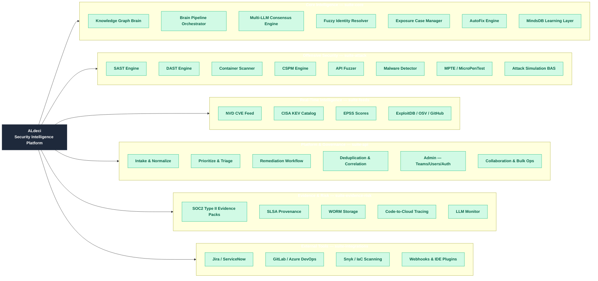
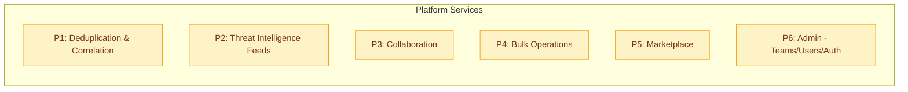
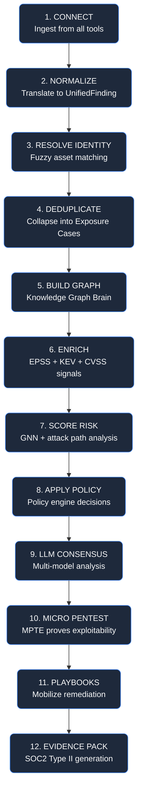

# ALdeci (FixOps) Product Status & Technical Reference

**Document Version:** 4.0
**Date:** February 2026
**Purpose:** Consolidated product status with technical deep-dive for architects, product owners, and engineers
**Transformation:** Phases 0–12 complete. 6-suite architecture, 603 API endpoints, 56 UI screens, 14/14 E2E simulation steps passing with real data.

---

## Capability Map (v4.0 — February 2026)



### Platform Metrics (February 2026)

| Metric | Count |
|--------|-------|
| **Total API Endpoints** | 603 |
| **Router Files** | 62 |
| **UI Screens** | 56 |
| **Python LOC (suites)** | 165,695 |
| **Total LOC (Py + TS/TSX)** | 379,234 |
| **Core Engines** | 17 |
| **E2E Simulation Steps** | 14/14 passing |
| **Real Data Sources** | NVD, KEV, EPSS, ExploitDB, OSV, GitHub Advisories |

**Endpoints by Suite:**

| Suite | Endpoints | Role |
|-------|-----------|------|
| suite-api | 224 | Platform & Governance |
| suite-core | 192 | AI/Intelligence |
| suite-attack | 83 | Offensive Security |
| suite-integrations | 46 | External Tools |
| suite-feeds | 29 | Real-Time Intelligence |
| suite-evidence-risk | 29 | Evidence & Risk |

---

## Workflow Stage Map


**Workflow Stage to API/CLI Mapping:**

| Stage | CLI Commands | API Routers | Key Endpoints |
|-------|--------------|-------------|---------------|
| **Design** | `stage-run --stage design`, `inventory add`, `policies create` | `apps/api/app.py`, `inventory_router`, `policies_router` | `POST /inputs/design`, `POST /api/v1/inventory/*`, `POST /api/v1/policies` |
| **Build** | `stage-run --stage build`, `run --sbom` | `apps/api/app.py` | `POST /inputs/sbom` |
| **Test** | `stage-run --stage test`, `run --sarif`, `mpte create`, `advanced-pentest run`, `micro-pentest run` | `apps/api/app.py`, `iac_router`, `secrets_router`, `mpte_router`, `micro_pentest_router` | `POST /inputs/sarif`, `POST /api/v1/iac/scan/*`, `POST /api/v1/secrets/scan/*`, `POST /api/v1/micro-pentest/*` |
| **Release Gate** | `make-decision`, `run`, `analyze` | `pipeline`, `enhanced` | `GET /pipeline/run`, `POST /api/v1/enhanced/analysis` |
| **Remediation** | `remediation create`, `remediation update` | `remediation_router` | `POST /api/v1/remediation/tasks`, `PUT /api/v1/remediation/tasks/{id}` |
| **Monitor** | `analytics dashboard`, `audit logs`, `compliance status` | `analytics_router`, `audit_router` | `GET /api/v1/analytics/*`, `GET /api/v1/audit/*` |
| **Audit** | `get-evidence`, `copy-evidence`, `compliance report`, `reports export` | `evidence`, `reports_router` | `GET /api/v1/evidence/*`, `GET /api/v1/reports/*` |

---

## API/CLI Coverage Summary

| Metric | Count |
|--------|-------|
| **Total API Endpoints** | 603 (was 363 in Jan 2026) |
| **CLI Commands/Subcommands** | 111 (13 standalone + 98 subcommands across 18 groups; 31 top-level total) |
| **API Endpoints with CLI Coverage** | 211 |
| **API-Only Endpoints** | 392 |

**Note:** Counts are code-derived from static enumeration of router decorators and CLI `--help` output.

**Recent Additions (February 2026 — Phases 0–12):**
- 240 new API endpoints across 6 suites
- 17 new security engines (SAST, DAST, Container, CSPM, API Fuzzer, LLM Monitor, Malware Detector, Code-to-Cloud, Attack Simulation, AutoFix, Brain Pipeline, Fuzzy Identity, Exposure Cases, SOC2 Evidence, MindsDB ML, Knowledge Graph, Event Bus)
- 56 UI screens (was ~20)
- 14-step E2E enterprise simulation with real NVD/KEV/EPSS data

---

## Developer Starting Points

This section provides the essential entry points for developers to start working on FixOps.

### API Architecture

**FastAPI Application Factory:**
- **Entry Point:** `apps/api/app.py` - Creates the FastAPI application and mounts all routers
- **Router Registration:** Lines 380-450 contain all `app.include_router()` calls
- **Ingestion Endpoints:** Lines 850-1033 define `/inputs/*` endpoints directly in app.py (not a separate router)
- **Authentication:** `_verify_api_key()` dependency at line 840

**Router Directory Structure:**
```
apps/api/
├── app.py                    # Main FastAPI app + ingestion endpoints
├── normalizers.py            # SARIF/SBOM/CVE/VEX parsers
├── *_router.py               # Feature routers (30 files)
└── routes/
    └── enhanced.py           # Enhanced decision endpoints

backend/api/                  # Additional backend routers
├── evidence/router.py        # Evidence management
├── graph/router.py           # Knowledge graph
├── mpte/router.py         # MPTE integration
├── provenance/router.py      # SLSA provenance
└── risk/router.py            # Risk scoring API
```

**Adding a New Router:**
1. Create `apps/api/your_router.py` with `router = APIRouter(prefix="/api/v1/your-feature")`
2. Import and mount in `apps/api/app.py`: `app.include_router(your_router)`
3. Add tests in `tests/test_your_router.py`

### CLI Architecture

**CLI Entry Point:** `python -m core.cli`
- **Main Module:** `core/cli.py` (~3200 lines)
- **Argument Parser:** `_build_parser()` at line 100
- **Command Handlers:** `_handle_*()` functions throughout the file

**CLI Command Structure:**
- 13 standalone commands (no subcommands): `run`, `ingest`, `make-decision`, `analyze`, `health`, `get-evidence`, `show-overlay`, `train-forecast`, `demo`, `train-bn-lr`, `predict-bn-lr`, `backtest-bn-lr`
- 18 command groups with subcommands: `teams`, `users`, `mpte`, `micro-pentest`, `compliance`, `reports`, `inventory`, `policies`, `integrations`, `analytics`, `audit`, `workflows`, `advanced-pentest`, `reachability`, `correlation`, `groups`, `remediation`, `notifications`

**Adding a New CLI Command:**
1. Add subparser in `_build_parser()` function
2. Create handler function `_handle_your_command(args, overlay)`
3. Wire handler in the main dispatch logic

### Core Modules

| Module | Purpose | Key Classes/Functions |
|--------|---------|----------------------|
| `risk/scoring.py` | Risk calculation | `RiskScorer`, `compute_risk_profile()` |
| `core/evidence.py` | Evidence bundles | `EvidenceHub`, RSA-SHA256 signing |
| `core/enhanced_decision.py` | LLM decisions | `EnhancedDecisionEngine` |
| `core/connectors.py` | External integrations | `JiraConnector`, `ConfluenceConnector`, `SlackConnector` |
| `core/configuration.py` | YAML overlay config | `OverlayConfig` (1530 lines) |
| `core/mpte_advanced.py` | Multi-LLM consensus | `MultiAIOrchestrator` |
| `core/micro_pentest.py` | Micro penetration tests | `run_micro_pentest()`, `get_pentest_status()` |

### Configuration

**Overlay Configuration:** `config/fixops.overlay.yml`
- Controls feature flags, pricing tiers, connector settings
- Loaded by `core/configuration.py:OverlayConfig`

**Environment Variables:**
- `FIXOPS_API_TOKEN` - API authentication
- `MPTE_BASE_URL` - MPTE service URL (default: `http://mpte:8443`)
- `FIXOPS_DISABLE_TELEMETRY` - Disable OpenTelemetry (set to `1`)
- Connector tokens: `FIXOPS_JIRA_TOKEN`, `FIXOPS_CONFLUENCE_TOKEN`, `FIXOPS_SLACK_WEBHOOK`

### Testing

**Test Directory:** `tests/`
- Unit tests: `tests/test_*.py`
- E2E tests: `tests/e2e/`
- Test harness: `tests/harness/`

**Running Tests:**
```bash
pytest                                    # All tests
pytest tests/test_your_feature.py -v      # Specific test file
pytest --cov=core --cov-report=html       # With coverage
```

**CI Requirements:**
- All tests must pass
- 100% diff coverage on new code (enforced by diff-cover)
- Lint checks: black, isort, flake8

### Common Developer Workflows

**1. Run API Locally:**
```bash
source .venv/bin/activate
export FIXOPS_API_TOKEN="demo-token"
uvicorn apps.api.app:app --reload
```

**2. Run Pipeline Demo:**
```bash
python -m core.cli demo --mode demo --output out/pipeline-demo.json --pretty
```

**3. Test an Endpoint:**
```bash
curl -H "X-API-Key: $FIXOPS_API_TOKEN" http://127.0.0.1:8000/api/v1/health
curl -H "X-API-Key: $FIXOPS_API_TOKEN" -F "file=@simulations/demo_pack/scanner.sarif" http://127.0.0.1:8000/inputs/sarif
```

**4. Run a CLI Command:**
```bash
python -m core.cli analyze --sarif simulations/demo_pack/scanner.sarif
python -m core.cli micro-pentest run --cve-ids CVE-2024-1234 --target-urls http://example.com
```

### Code-Derived Endpoint Breakdown

| Source | Endpoints |
|--------|-----------|
| apps/api/*_router.py | 263 |
| apps/api/app.py | 18 |
| apps/api/routes/enhanced.py | 4 |
| backend/api/* routers | 18 |
| **Total** | **303** |

### API Routers (32 total)

| Router | File | Endpoints | CLI Coverage |
|--------|------|-----------|--------------|
| Core Ingestion | `apps/api/app.py` | 18 | `run`, `ingest`, `stage-run` |
| Enhanced Decision | `apps/api/routes/enhanced.py` | 4 | `advanced-pentest capabilities` |
| Analytics | `apps/api/analytics_router.py` | 16 | `analytics dashboard/mttr/coverage/roi/export` |
| Audit | `apps/api/audit_router.py` | 10 | `audit logs/decisions`, `compliance *` |
| Reports | `apps/api/reports_router.py` | 10 | `reports list/generate/export` |
| Teams | `apps/api/teams_router.py` | 8 | `teams list/get/create` |
| Users | `apps/api/users_router.py` | 6 | `users list/get/create` |
| Policies | `apps/api/policies_router.py` | 8 | `policies list/get/create/validate/test` |
| Integrations | `apps/api/integrations_router.py` | 8 | `integrations list/configure/test/sync` |
| Workflows | `apps/api/workflows_router.py` | 7 | `workflows list/get/create/execute/history` |
| Inventory | `apps/api/inventory_router.py` | 15 | `inventory apps/add/get/services/search` |
| MPTE | `apps/api/mpte_router.py` | 14 | `mpte list/create/status` |
| Micro Pentest | `apps/api/micro_pentest_router.py` | 13 | `micro-pentest run/status/batch` + 10 enterprise endpoints |
| Enhanced MPTE | `apps/api/mpte_router.py` | 19 | `advanced-pentest run/threat-intel/simulate` |
| IaC | `apps/api/iac_router.py` | 6 | `stage-run --stage deploy` |
| Secrets | `apps/api/secrets_router.py` | 6 | API-only |
| Health | `apps/api/health.py` + `health_router.py` | 5 | `health` |
| IDE Integration | `apps/api/ide_router.py` | 3 | API-only (IDE plugins) |
| Bulk Operations | `apps/api/bulk_router.py` | 12 | API-only |
| Marketplace | `apps/api/marketplace_router.py` | 12 | API-only |
| SSO/Auth | `apps/api/auth_router.py` | 4 | API-only (OAuth flows) |
| Webhooks | `apps/api/webhooks_router.py` | 17 | API-only (event-driven) |
| Deduplication | `apps/api/deduplication_router.py` | 17 | `correlation`, `groups` |
| Remediation | `apps/api/remediation_router.py` | 13 | `remediation list/create/update` |
| Feeds | `apps/api/feeds_router.py` | 20 | `reachability analyze` |
| **Collaboration** | `apps/api/collaboration_router.py` | 21 | API-only (comments, watchers, activity) |
| Validation | `apps/api/validation_router.py` | 3 | API-only |
| **Evidence** | `backend/api/evidence/router.py` | 4 | `get-evidence`, `copy-evidence` |
| **Graph/Risk** | `backend/api/graph/router.py` | 4 | API-only (visualization) |
| **Risk** | `backend/api/risk/router.py` | 3 | API-only |
| **Provenance** | `backend/api/provenance/router.py` | 2 | API-only |
| **MPTE (Backend)** | `backend/api/mpte/router.py` | 5 | API-only |

### API-Only Endpoints (Why No CLI)

| Category | Count | Reason |
|----------|-------|--------|
| Secrets | 6 | Sensitive credential management |
| IDE Integration | 3 | Real-time code analysis for IDE plugins |
| Bulk Operations | 12 | Complex batch operations with progress tracking |
| Marketplace | 12 | E-commerce features (purchase, download, rate) |
| SSO/Auth | 4 | OAuth flows require browser redirects |
| Webhooks | 17 | Event-driven, configured via UI |
| Collaboration | 21 | Comments, watchers, activity feeds (UI-driven) |
| Validation | 3 | Internal validation endpoints |
| Graph/Risk | 4 | Interactive visualization requires UI |
| Risk | 3 | Backend risk analysis |
| Provenance | 2 | Backend provenance tracking |
| MPTE (Backend) | 5 | Backend pentesting service |
| **Total** | **92** | |

---

## Implementation Index (Quick Reference)

| ID | Capability | API Endpoints | CLI Commands | Core Modules | Status |
|----|------------|---------------|--------------|--------------|--------|
| T1 | Intake & Normalize | `POST /inputs/*` (7 endpoints), `POST /api/v1/ingest/multipart` | `ingest`, `ingest-file`, `stage-run` | `apps/api/ingestion.py`, `apps/api/app.py:850-1033` | Production |
| T2 | Prioritize & Triage | `GET /api/v1/triage`, `POST /api/v1/risk/*` | `analyze` | `risk/scoring.py`, `core/severity_promotion.py` | Production |
| T3 | Automated Decisions | `POST /api/v1/enhanced/*`, `/api/v1/micro-pentest/*` | `make-decision`, `run`, `micro-pentest` | `core/enhanced_decision.py`, `core/mpte_advanced.py`, `core/micro_pentest.py` | Production |
| T4 | Remediation Workflow | `/api/v1/remediation/*` (13 endpoints) | `remediation` | `core/services/remediation.py`, `apps/api/remediation_router.py` | Production |
| T5 | Compliance & Evidence | `/api/v1/evidence/*`, `/api/v1/compliance/*` | `get-evidence`, `compliance` | `core/evidence.py`, `services/provenance/attestation.py` | Production |
| T6 | Notifications | `/api/v1/collaboration/notifications/*` | `notifications` | `core/services/collaboration.py`, `core/connectors.py` | Production |
| T7 | Security Scanning | `POST /api/v1/iac/scan/*`, `POST /api/v1/secrets/scan/*` | - | `core/iac_scanner.py`, `core/secrets_scanner.py` | Production |
| T8 | Jira Integration | `POST /api/v1/webhooks/jira/*` | `integrations` | `core/connectors.py:49-124`, `apps/api/webhooks_router.py:233-350` | Production |
| **P1** | **Deduplication & Correlation** | `/api/v1/deduplication/*` (17 endpoints) | `correlation`, `groups` | `core/services/deduplication.py`, `apps/api/deduplication_router.py` | Production |
| **P2** | **Threat Intelligence Feeds** | `/api/v1/feeds/*` (20 endpoints) | `reachability` | `apps/api/feeds_router.py`, `risk/reachability/analyzer.py` | Production |
| **P3** | **Collaboration** | `/api/v1/collaboration/*` (21 endpoints) | API-only | `core/services/collaboration.py`, `apps/api/collaboration_router.py` | Production |
| **P4** | **Bulk Operations** | `/api/v1/bulk/*` (12 endpoints) | API-only | `apps/api/bulk_router.py` | Production |
| **P5** | **Marketplace** | `/api/v1/marketplace/*` (12 endpoints) | API-only | `apps/api/marketplace_router.py` | Production |
| **P6** | **Admin (Teams/Users/Auth)** | `/api/v1/teams/*`, `/api/v1/users/*`, `/api/v1/auth/*` (18 endpoints) | `teams`, `users` | `apps/api/teams_router.py`, `apps/api/users_router.py`, `core/auth_db.py` | Production |
| N1 | Reliable Ticket Delivery | - | - | `apps/api/webhooks_router.py:744-1012` (outbox exists) | **Needs Worker** |
| N2 | Broader Integrations | Webhook receivers only | - | `apps/api/webhooks_router.py` | **Inbound Only** |
| N3 | Enterprise Login (SSO) | `/api/v1/auth/sso/*` | - | `core/auth_db.py` | **Config Only** |
| N4 | Scale & HA | - | - | 12+ SQLite DBs in `core/*_db.py` | **Needs PostgreSQL** |
| N5 | Multi-Tenant Support | - | - | Partial `org_id` in some services | **Needs Enforcement** |

---

## What FixOps Does (Business Capabilities)

### Available Today

| Capability | What It Does | Business Value |
|------------|--------------|----------------|
| **Intake & Normalize** | Aggregates outputs from any scanner (SBOM, SARIF, VEX, CNAPP, dark web intel, SPDX, Trivy, Grype, Semgrep, Dependabot) with dynamic plugin registry, lenient parsing for format drift, and 10K findings <2 min performance | Single pane of glass for all security findings with 99% parse success on drifted formats |
| **Prioritize & Triage** | Scores vulnerabilities using threat intelligence (EPSS, KEV, CVSS) | Focus on what matters most, reduce noise by 35% |
| **Automated Decisions** | AI consensus from multiple models decides allow/block/review | Consistent, explainable security decisions at scale |
| **Remediation Workflow** | Assigns tasks, tracks SLAs, verifies fixes | Clear accountability, measurable MTTR |
| **Compliance & Evidence** | Generates signed, tamper-proof audit bundles | Audit-ready evidence for any framework |
| **Notifications** | Sends alerts via Slack and email | Keep teams informed in real-time |
| **Security Scanning** | Scans infrastructure-as-code and detects hardcoded secrets | Shift-left security before deployment |
| **Jira Integration** | Creates and syncs tickets bidirectionally | Seamless developer workflow |

### Coming Next (Enterprise Plug-and-Play)

| Capability | What It Does | Business Value |
|------------|--------------|----------------|
| **Reliable Ticket Delivery** | Automatically creates/updates tickets with guaranteed delivery | No more manual ticket creation |
| **Broader Integrations** | Connect to ServiceNow, GitLab, Azure DevOps, GitHub | Works with your existing tools |
| **Enterprise Login (SSO)** | OIDC/SAML integration with your identity provider | Single sign-on, role-based access |
| **Scale & High Availability** | Production-grade database with failover | Enterprise reliability |
| **Multi-Tenant Support** | Isolated data per organization | Secure multi-team deployment |

### Future Enhancements (Optional)

| Capability | What It Does | Business Value |
|------------|--------------|----------------|
| **Executive Dashboards** | Board-ready visualizations and trends | Strategic visibility for leadership |
| **SOC Integration** | SIEM connectors (Splunk, Sentinel) | Correlate vulnerabilities with incidents |
| **Developer Experience** | PR annotations, self-service portal | Developer-friendly security |
| **Advanced Analytics** | Risk quantification ($), industry benchmarks | Data-driven security investment |

---

## Executive Summary

FixOps is an Enterprise DevSecOps Decision & Verification Engine with substantial production-ready functionality. This document provides a single source of truth for implementation status, enterprise readiness, and roadmap.

**What's Working (Production-Ready):**
- Multi-LLM consensus decisioning (GPT-5, Claude-3, Gemini-2, Sentinel)
- Deduplication with 7 correlation strategies (35% noise reduction)
- Risk scoring (EPSS + KEV + CVSS + Bayesian + Markov probabilistic forecasting)
- Evidence bundles with RSA-SHA256 signing, Fernet encryption, SLSA v1 provenance
- Real connectors: Jira, Confluence, Slack (actual HTTP calls)
- Webhook receivers: Jira, ServiceNow, GitLab, Azure DevOps (with signature verification)
- IaC scanning (checkov/tfsec) and Secrets scanning (gitleaks/trufflehog)
- Storage backends: Local, S3 Object Lock, Azure Immutable Blob

**Enterprise Blockers (Must Fix):**
- 12+ separate SQLite databases with hardcoded paths (blocks HA/scaling)
- No background worker (outbox queues items but never processes them)
- Missing outbound connectors for ServiceNow, GitLab, Azure DevOps, GitHub
- Integration sync endpoint is a no-op (stamps "success" without syncing)

---

## Enterprise Connector Checklist

For true enterprise plug-and-play, each connector needs: Inbound (webhook receiver), Outbound (create/update), Background Worker, and Bidirectional Sync.

| Connector | Inbound | Outbound | Worker | Bidir Sync | Status | What's Missing |
|-----------|---------|----------|--------|------------|--------|----------------|
| **Jira** | Webhook receiver | `create_issue()` | Outbox queues | Drift detection | **PARTIAL** | Worker to process outbox |
| **Confluence** | - | `create_page()`, `update_page()` | - | `get_page()`, `search_pages()`, `list_pages()` | **BIDIRECTIONAL** | Full sync support |
| **Slack** | - | `post_message()` | - | - | **OUTBOUND ONLY** | No inbound, no sync |
| **ServiceNow** | Webhook receiver | **MISSING** | - | - | **INBOUND ONLY** | Need `create_incident()` |
| **GitLab** | Webhook receiver | **MISSING** | - | - | **INBOUND ONLY** | Need `create_issue()` |
| **Azure DevOps** | Webhook receiver | **MISSING** | - | - | **INBOUND ONLY** | Need `create_work_item()` |
| **GitHub** | - | **MISSING** | - | - | **NOT IMPLEMENTED** | Need full connector |

**Critical Gap:** Outbox pattern exists (`apps/api/webhooks_router.py:744-1012`) but no built-in background process in this repo consumes the outbox. An operator must run a worker/scheduler or add one.

---

## Enterprise Plug-and-Play Readiness

This section provides a deep analysis of what's needed for true enterprise plug-and-play deployment via Docker images (aldeci/fixops) at client sites. Focus areas: connectors, working APIs, and business logic depth.

### Enterprise Plug-and-Play Status Summary

| Category | Status | Readiness | Notes |
|----------|--------|-----------|-------|
| **Core Decision Engine** | Production | Ready | Multi-LLM consensus, risk scoring, evidence bundles |
| **Jira Integration** | Production | Ready | Full CRUD: create, update, transition, comment |
| **Confluence Integration** | Production | Ready | Bidirectional: create_page, update_page, get_page, search_pages, list_pages |
| **Slack Integration** | Production | Ready | Webhook notifications working |
| **ServiceNow Integration** | Production | Ready | Full CRUD: create_incident, update_incident, add_work_note |
| **GitLab Integration** | Production | Ready | Full CRUD: create_issue, update_issue, add_comment |
| **Azure DevOps Integration** | Production | Ready | Full CRUD: create_work_item, update_work_item, add_comment |
| **GitHub Integration** | Production | Ready | Full CRUD: create_issue, update_issue, add_comment |
| **Background Workers** | Production | Ready | Outbox execute/process-pending endpoints available |
| **Database (HA)** | Not Started | Blocker | SQLite only, no PostgreSQL |
| **Multi-Tenancy** | Partial | Needs Work | Partial org_id support |

### Enterprise API/CLI Mapping for Plug-and-Play Features

| Feature | API Endpoints | CLI Commands | Status |
|---------|---------------|--------------|--------|
| **Integration Management** | `GET/POST/PUT/DELETE /api/v1/integrations/*` | `integrations list/configure/test/sync` | Working |
| **Integration Testing** | `POST /api/v1/integrations/{id}/test` | `integrations test` | Working |
| **Integration Sync** | `POST /api/v1/integrations/{id}/sync` | `integrations sync` | **NO-OP** |
| **Webhook Receivers** | `POST /api/v1/webhooks/jira`, `/servicenow`, `/gitlab`, `/azure-devops` | N/A (event-driven) | Working |
| **Outbox Management** | `GET/POST /api/v1/webhooks/outbox/*` | N/A | Queues only |
| **Remediation Tasks** | `GET/POST/PUT /api/v1/remediation/tasks/*` | `remediation list/create/update` | Working |
| **Ticket Linking** | `POST /api/v1/remediation/tasks/{id}/link-ticket` | `remediation link-ticket` | Manual only |
| **Bulk Operations** | `POST /api/v1/bulk/*` | N/A | In-memory jobs |
| **SSO/Auth** | `GET /api/v1/auth/oauth/*` | N/A | Config only |

### Connector Operations Matrix

For enterprise plug-and-play, each connector needs complete CRUD operations. Current state:

| Connector | Create | Update | Transition | Comment | Attach | Code Reference | Status |
|-----------|--------|--------|------------|---------|--------|----------------|--------|
| **Jira** | `create_issue()` | `update_issue()` | `transition_issue()` | `add_comment()` | **MISSING** | `core/connectors.py:330-840` | **Production** |
| **Confluence** | `create_page()` | `update_page()` | - | - | `get_page()`, `search_pages()`, `list_pages()` | `core/connectors.py:843-1159` | **Production** |
| **Slack** | `post_message()` | - | - | - | - | `core/connectors.py:442-479` | Outbound only |
| **ServiceNow** | `create_incident()` | `update_incident()` | - | `add_work_note()` | - | `core/connectors.py:480-695` | **Production** |
| **GitLab** | `create_issue()` | `update_issue()` | - | `add_comment()` | - | `core/connectors.py:696-913` | **Production** |
| **Azure DevOps** | `create_work_item()` | `update_work_item()` | - | `add_comment()` | - | `core/connectors.py:914-1204` | **Production** |
| **GitHub** | `create_issue()` | `update_issue()` | - | `add_comment()` | - | `core/connectors.py:1205-1423` | **Production** |

### Critical Issues for Plug-and-Play

**Issue 1: Jira Connector - RESOLVED**

The Jira connector (`core/connectors.py:49-355`) now implements full CRUD operations:
- `create_issue()` - Create new tickets
- `update_issue()` - Update existing tickets when findings change
- `transition_issue()` - Change status (Open → In Progress → Done)
- `add_comment()` - Add comments for status updates
- `add_attachment()` - Still missing (future enhancement)

**Issue 2: Integration Sync Endpoint is a NO-OP**

The sync endpoint (`apps/api/integrations_router.py:310-332`) does not actually sync:
```python
# Current implementation just stamps "success" without syncing
integration.last_sync_status = "success"
db.update_integration(integration)
return {"message": "Manual sync completed successfully"}
```
This must be fixed to actually call connector APIs and reconcile state.

**Issue 3: Outbox Processing - RESOLVED**

The outbox now has proper execution endpoints (`apps/api/webhooks_router.py:1062-1273`):
- `POST /api/v1/webhooks/outbox/{outbox_id}/execute` - Execute a single outbox item
- `POST /api/v1/webhooks/outbox/process-pending` - Process all pending items ready for delivery

These endpoints call the `AutomationConnectors.deliver()` method to actually send data to external systems.

**Issue 4: Remediation Doesn't Auto-Create Tickets**

The remediation service (`core/services/remediation.py`) has `link_to_ticket()` but doesn't automatically create tickets when remediation tasks are created. The connector integration is manual, not automatic.

### Connector Usage in Codebase

Connectors ARE wired into the system but with limited operations:

| Usage Location | Connector | Operation | Code Reference |
|----------------|-----------|-----------|----------------|
| Policy Automation | Jira/Confluence/Slack | `deliver()` | `core/policy.py:deliver()` |
| Feedback Service | Jira | `create_issue()` | `core/feedback.py:_deliver_to_connector()` |
| Feedback Service | Confluence | `create_page()` | `core/feedback.py:_deliver_to_connector()` |
| Integrations Router | All | Config only | `apps/api/integrations_router.py` |

### Business Logic Depth (What's Real)

| Component | LOC | Algorithms/Features | Code Reference |
|-----------|-----|---------------------|----------------|
| **Risk Scoring** | 2,637 | EPSS+KEV+CVSS+Bayesian+Markov | `risk/scoring.py` |
| **Decision Engine** | 1,279 | Multi-LLM consensus (4 providers, 85% threshold) | `core/enhanced_decision.py` |
| **Evidence Bundles** | 1,100+ | RSA-SHA256 signing, Fernet encryption, SLSA v1 | `core/evidence.py` |
| **Deduplication** | 1,157 | 7 correlation strategies | `core/services/deduplication.py` |
| **Remediation** | 1,111 | Full lifecycle with SLA tracking | `core/services/remediation.py` |
| **Reachability** | 800+ | Network path analysis | `risk/reachability/analyzer.py` |

### Priority Fixes for Enterprise Plug-and-Play

| Priority | Fix | Current State | Required Change | Effort |
|----------|-----|---------------|-----------------|--------|
| **P0** | ~~Fix Jira connector~~ | **DONE** - Full CRUD implemented | N/A | Complete |
| **P0** | Wire remediation → tickets | Manual linking only | Auto-create tickets on task creation | 1 week |
| **P1** | Fix sync endpoint | NO-OP (stamps success) | Actually call connector APIs | 2-3 days |
| **P1** | ~~Add ServiceNow outbound~~ | **DONE** - Full CRUD implemented | N/A | Complete |
| **P2** | ~~Add GitLab outbound~~ | **DONE** - Full CRUD implemented | N/A | Complete |
| **P2** | ~~Add Azure DevOps outbound~~ | **DONE** - Full CRUD implemented | N/A | Complete |
| **P3** | ~~Add GitHub connector~~ | **DONE** - Full CRUD implemented | N/A | Complete |

### Reference Workflows to Validate

These workflows should work end-to-end for enterprise plug-and-play:

**Workflow 1: Create Jira ticket from remediation and keep in sync**
1. Remediation task created → Auto-create Jira ticket
2. Remediation status changes → Update Jira ticket status
3. Jira ticket updated externally → Webhook updates FixOps
4. Drift detected → Alert or auto-reconcile

**Workflow 2: Ingest GitLab findings and triage**
1. GitLab webhook → Ingest finding
2. Deduplicate and enrich
3. Risk score and decide
4. Create remediation task
5. (Missing) Auto-create GitLab issue

**Workflow 3: Post evidence to Confluence and notify Slack**
1. Evidence bundle created
2. Post to Confluence page (working)
3. Notify Slack channel (working)

---

## API Enterprise Readiness

This section classifies each API router by implementation depth and enterprise operational readiness. "Real" means meaningful business logic exists. "Enterprise-ready" means the operational infrastructure (persistence, auth, HA, tenancy) is production-grade.

### Classification Rubric

| Category | Description | Example |
|----------|-------------|---------|
| **Real (Production Logic)** | Computes, transforms, or enforces policy with actual algorithms | `risk/scoring.py` - EPSS+KEV+CVSS scoring |
| **Real (Demo-grade Storage)** | Real logic but uses SQLite/in-memory (not HA/multi-tenant safe) | All `core/*_db.py` backed routers |
| **Real (Integration-dependent)** | Real logic but requires external service to function | `micro_pentest_router.py` - needs MPTE |
| **Stub/Demo** | Returns static/empty data or demo fallback | `ide_router.py` - returns empty arrays |

### Router-by-Router Classification

| Router | File | Realness | Persistence | External Dependency | Operational Gaps |
|--------|------|----------|-------------|---------------------|------------------|
| **Core Ingestion** | `apps/api/app.py:850-1033` | Real | File-based | None | None |
| **Risk Scoring** | `risk/scoring.py` | Real | None (stateless) | EPSS/KEV feeds | None |
| **Enhanced Decision** | `core/enhanced_decision.py` | Real | None (stateless) | LLM providers | API keys required |
| **Evidence Bundles** | `core/evidence.py` | Real | File/S3/Azure | None | None |
| **Jira Connector** | `core/connectors.py:49-124` | Real | Outbox (SQLite) | Jira API | No outbox worker |
| **Analytics** | `apps/api/analytics_router.py` | Real | SQLite | None | Not HA-ready |
| **Audit** | `apps/api/audit_router.py` | Real | SQLite | None | Not HA-ready |
| **Auth/SSO** | `apps/api/auth_router.py` | Real | SQLite | IdP (optional) | Not HA-ready |
| **Collaboration** | `apps/api/collaboration_router.py` | Real | SQLite | None | Not HA-ready |
| **Deduplication** | `apps/api/deduplication_router.py` | Real | SQLite | None | Not HA-ready |
| **IaC Scanning** | `apps/api/iac_router.py` | Real | SQLite | checkov/tfsec | Tools must be installed |
| **Integrations** | `apps/api/integrations_router.py` | Real | SQLite | External APIs | Not HA-ready |
| **Inventory** | `apps/api/inventory_router.py` | Real | SQLite | None | Not HA-ready |
| **Micro Pentest** | `apps/api/micro_pentest_router.py` | Real | None (stateless) | MPTE service | Returns 503 if MPTE down |
| **MPTE** | `apps/api/mpte_router.py` | Real | SQLite | MPTE service | Not HA-ready |
| **Policies** | `apps/api/policies_router.py` | Real | SQLite | None | Not HA-ready |
| **Remediation** | `apps/api/remediation_router.py` | Real | SQLite | None | Not HA-ready |
| **Reports** | `apps/api/reports_router.py` | Real | SQLite | None | Not HA-ready |
| **Secrets Scanning** | `apps/api/secrets_router.py` | Real | SQLite | gitleaks/trufflehog | Tools must be installed |
| **Teams** | `apps/api/teams_router.py` | Real | SQLite | None | Not HA-ready |
| **Users** | `apps/api/users_router.py` | Real | SQLite | None | Not HA-ready |
| **Workflows** | `apps/api/workflows_router.py` | Real | SQLite | None | Not HA-ready |
| **Webhooks** | `apps/api/webhooks_router.py` | Real | SQLite | External services | No outbox worker |
| **Feeds** | `apps/api/feeds_router.py` | Real | SQLite | fixops-enterprise | Packaging awkward |
| **Validation** | `apps/api/validation_router.py` | Real | None (stateless) | None | None |
| **Bulk Operations** | `apps/api/bulk_router.py` | Real | **In-memory** | None | **Not production-safe** |
| **Marketplace** | `apps/api/marketplace_router.py` | **Demo fallback** | File (enterprise) | fixops-enterprise | Falls back to demo data |
| **IDE Integration** | `apps/api/ide_router.py` | **Stub** | None | None | Returns empty arrays |
| **Health** | `apps/api/health_router.py` | Real | None | None | None (expected) |
| **Legacy Bridge** | `apps/api/legacy_bridge_router.py` | Real | Varies | archive modules | Deprecated |

### Authentication Enforcement

All routers are mounted with `dependencies=[Depends(_verify_api_key)]` in `apps/api/app.py:404-463`, ensuring API key authentication is enforced globally. Exceptions:
- `health_router` - Unauthenticated (expected for health checks)
- `webhooks_receiver_router` - Uses webhook signature verification instead of API key (external services can't provide FixOps API keys)

**Code reference:** `apps/api/app.py:272-294` defines `_verify_api_key()` dependency.

### Enterprise Plug-and-Play Blockers

To make FixOps truly enterprise plug-and-play, the following must be addressed:

| Blocker | Current State | Required Change | Effort |
|---------|---------------|-----------------|--------|
| **SQLite Persistence** | 12 separate SQLite DBs in `core/*_db.py` | PostgreSQL with migrations | 2-3 weeks |
| **In-memory Job Store** | `apps/api/bulk_router.py:47` uses `_jobs: Dict` | Redis or database-backed queue | 1 week |
| **Outbox Worker** | Outbox table exists but no consumer | Background worker to poll `process_outbox_item` | 1 week |
| **fixops-enterprise Packaging** | `sys.path` manipulation in `feeds_router.py:27-29` | Proper package installation | 1 week |
| **Multi-tenancy** | Partial `org_id` in some services | Consistent tenant isolation | 2-3 weeks |

### What's NOT Required for Enterprise

These are often assumed to be blockers but are actually optional:

| Item | Why Not Required |
|------|------------------|
| **PostgreSQL for all DBs** | SQLite works for single-node deployments; only needed for HA/scale |
| **Redis** | Only needed if bulk operations are heavily used |
| **All connectors bidirectional** | Start with Jira (most common), add others based on customer demand |
| **IDE integration** | Nice-to-have, not blocking enterprise adoption |
| **Marketplace** | Enterprise features work without marketplace |

### Legacy Code in archive/enterprise_legacy

The `archive/enterprise_legacy/` folder contains PostgreSQL and Redis implementations that were planned but not wired to the main app:
- `src/models/*.py` - SQLAlchemy models with PostgreSQL dialect
- `src/services/cache_service.py` - Redis caching layer
- `run_enterprise.py` - Startup script for PostgreSQL/Redis

These can be referenced when implementing enterprise persistence.

---

## Implementation Status by Category

### Core Platform (All Production-Ready)

| Component | Status | Evidence |
|-----------|--------|----------|
| **Multi-LLM Consensus** | REAL | 4 providers, 85% threshold, `core/mpte_advanced.py` |
| **Deduplication** | REAL | 7 strategies, SQLite-backed, `core/services/deduplication.py` |
| **Risk Scoring** | REAL | EPSS+KEV+CVSS+Bayesian+Markov, `risk/scoring.py` |
| **Evidence Bundles** | REAL | RSA-SHA256, Fernet encryption, SLSA v1, `core/evidence.py` |
| **Policy Evaluation** | REAL | OPA-based rules, configurable guardrails |
| **Tri-State Decisions** | REAL | ALLOW/BLOCK/NEEDS REVIEW with confidence scores |
| **Remediation Lifecycle** | REAL | Full state machine with SLA tracking |
| **Notification Delivery** | REAL | Slack webhooks with SSRF protection, SMTP with TLS |

### Scanning (Production-Ready)

| Scanner | Status | Tools | Code Reference |
|---------|--------|-------|----------------|
| **IaC Scanning** | REAL | checkov, tfsec | `core/iac_scanner.py` |
| **Secrets Scanning** | REAL | gitleaks, trufflehog | `core/secrets_scanner.py` |
| **SARIF Ingestion** | REAL | Any SARIF-compliant scanner | `apps/api/app.py:931-948` |
| **SBOM Analysis** | REAL | CycloneDX, SPDX | `apps/api/app.py:862-890` |

### Storage Backends (Production-Ready)

| Backend | Status | Features |
|---------|--------|----------|
| **Local Filesystem** | REAL | Default for demo/dev |
| **S3 Object Lock** | REAL | WORM compliance, retention policies |
| **Azure Immutable Blob** | REAL | Immutability policies |

### API Coverage

| Category | Endpoints | Status |
|----------|-----------|--------|
| Ingestion | 15 | Complete |
| Pipeline | 4 | Complete |
| Enhanced Decision | 4 | Complete |
| Analytics | 16 | Complete |
| Audit | 10 | Complete |
| Reports | 9 | Complete |
| Teams/Users | 14 | Complete |
| Policies | 8 | Complete |
| Integrations | 8 | Complete |
| Workflows | 7 | Complete |
| Inventory | 15 | Complete |
| MPTE | 33 | Complete |
| IaC/Secrets | 10 | Complete |
| Evidence | 17 | Complete |
| Deduplication | 17 | Complete |
| Remediation | 13 | Complete |
| Webhooks | 20 | Complete |
| Feeds | 20 | Complete |

---

## Enterprise Blockers (Must Fix Before Deployment)

### 1. SQLite Everywhere - CRITICAL

**Problem:** 12+ separate SQLite databases with hardcoded relative paths.

| Database | Default Path | Impact |
|----------|--------------|--------|
| users.db | `data/users.db` | No HA/failover |
| integrations.db | `data/integrations.db` | No concurrent writes |
| policies.db | `data/policies.db` | Breaks in containers |
| reports.db | `data/reports.db` | No horizontal scaling |
| audit.db | `data/audit.db` | No proper backup story |
| + 7 more | `data/*.db` | Same issues |

**Solution:** Database abstraction layer + PostgreSQL backend + Alembic migrations

### 2. No Background Workers - CRITICAL

**Problem:** Outbox pattern exists but no worker processes the queue.

The outbox table stores items with status, retry_count, max_retries, next_retry_at, last_error - but there is NO CODE that:
1. Polls the outbox for pending items
2. Routes items to appropriate connectors
3. Makes actual HTTP calls to external systems
4. Updates status based on delivery result

**Solution:** Create worker entrypoint (`python -m core.worker`) with outbox processor

### 3. Missing Outbound Connectors - HIGH

**Problem:** Webhook receivers exist for ServiceNow/GitLab/Azure DevOps but no outbound capability.

| System | Inbound | Outbound |
|--------|---------|----------|
| Jira | Yes | Yes |
| ServiceNow | Yes | **NO** |
| GitLab | Yes | **NO** |
| Azure DevOps | Yes | **NO** |
| GitHub | No | **NO** |

**Solution:** Implement `ServiceNowConnector`, `GitLabConnector`, `AzureDevOpsConnector`, `GitHubConnector`

### 4. Integration Sync No-Op - MEDIUM

**Problem:** `apps/api/integrations_router.py:trigger_sync()` stamps "success" without actually syncing.

**Solution:** Implement real sync logic per integration type

---

## Roadmap

### Phase 0: Enterprise Infrastructure (Weeks 1-4) - MUST

| Task | Effort | Priority |
|------|--------|----------|
| **Database Abstraction + PostgreSQL** | 2 weeks | MUST |
| **Centralize Path Configuration** | 3 days | MUST |
| **Implement Outbox Worker** | 1 week | MUST |
| **Fix Integration Sync Endpoint** | 2 days | MUST |

### Phase 1: Connector Expansion (Weeks 5-8) - SHOULD

| Task | Effort | Priority |
|------|--------|----------|
| **ServiceNow Outbound Connector** | 3-5 days | SHOULD |
| **GitLab Outbound Connector** | 3-5 days | SHOULD |
| **Azure DevOps Outbound Connector** | 3-5 days | SHOULD |
| **GitHub Connector (Full)** | 1 week | SHOULD |
| **Wire Outbox to Connectors** | 1 week | SHOULD |

### Phase 2: Enterprise Security (Weeks 9-12) - SHOULD

| Task | Effort | Priority |
|------|--------|----------|
| **Multi-Tenancy Enforcement** | 2 weeks | SHOULD |
| **OIDC/SAML Integration** | 1 week | SHOULD |
| **RBAC Middleware Enforcement** | 1 week | SHOULD |

### Medium Priority (Enterprise Enablement)

| Task | Effort | Priority |
|------|--------|----------|
| **OSS Fallback Wiring** | 3-5 days | MEDIUM |
| **Cross-Stage Correlation** | 1-2 weeks | MEDIUM |
| **Runtime Event Ingestion** | 1 week | MEDIUM |
| **Application Components from SBOM** | 3-5 days | MEDIUM |

### Items That Can Be Deferred (Optional/Not Required)

| Feature | Why Deferrable |
|---------|----------------|
| Risk Quantification ($) | Budget justification, not operational |
| Industry Benchmarking | No customer data yet |
| ROI Calculator | Nice-to-have for execs |
| Board-ready Dashboards | API data exists, UI is enhancement |
| SIEM (Splunk/Sentinel) | Build when customer demands |
| CMDB Sync | Customer-specific integration |
| Developer Portal | Self-service is nice-to-have |
| Scanner Health Dashboard | Operational monitoring, not core |

**Key Principle:** If it doesn't block (1) deploying safely, (2) making decisions, (3) tracking remediation, or (4) generating audit evidence, it can be deferred.

---

## Enterprise Roadmap Reference

For detailed enterprise feature specifications, see **[ENTERPRISE_FEATURES.md](./ENTERPRISE_FEATURES.md)** which contains comprehensive design specs for the following areas:

### Feature Area Status Summary

| Feature Area | Capability ID | Implemented | Proposed (Design Spec) | ENTERPRISE_FEATURES.md Section |
|--------------|---------------|-------------|------------------------|-------------------------------|
| **Deduplication & Correlation** | P1 | Basic correlation (7 strategies), FindingGroup storage | Full correlation graph, human-in-loop merge workflows, explainability | Section 1 (lines 16-219) |
| **Jira/ServiceNow Integration** | T8, N2 | Jira connector (create/update), webhook receivers | Bidirectional sync, drift detection, outbox worker, ServiceNow outbound | Section 2 (lines 222-415) |
| **Remediation Lifecycle** | T4 | State machine, SLA tracking, task management | Verification evidence, risk acceptance workflows, drift detection | Section 3 (lines 418-652) |
| **Bulk Operations** | P4 | Basic bulk endpoints (12) | Async job framework, query language, saved views | Section 4 (lines 655-841) |
| **Collaboration** | P3 | Comments, watchers, activity feed (21 endpoints) | Threaded comments, evidence promotion, external sync | Section 5 (lines 845-1031) |

### Target KPIs (Enterprise Success Metrics)

These are target metrics for enterprise deployments, not current measurements:

| Area | Metric | Target |
|------|--------|--------|
| **Correlation** | Noise reduction ratio | 35% |
| **Correlation** | Merge acceptance rate | >90% |
| **Integrations** | Ticket sync success rate | >99% |
| **Integrations** | Sync latency p95 | <30s |
| **Remediation** | MTTR (Critical) | <24h |
| **Remediation** | SLA compliance rate | >95% |
| **Bulk Operations** | Job completion rate | >99% |
| **Collaboration** | Comment response time | <4h |

### Migration Path (Proposed)

| Phase | Focus | Status |
|-------|-------|--------|
| **Phase 1: Foundation** | Basic correlation, fire-and-forget connectors, stub bulk ops | **Current** |
| **Phase 2: Enterprise Core** | FindingGroup models, bidirectional sync, RemediationTask state machine | Planned |
| **Phase 3: Enterprise Advanced** | Full correlation graph, SLA policies, query language | Planned |
| **Phase 4: Enterprise Complete** | Human-in-loop workflows, drift detection, real-time feeds | Planned |

---

## Stakeholder Coverage Summary

| Stakeholder | Coverage | Key Gaps |
|-------------|----------|----------|
| **Vulnerability Management Analyst** | High | Workload balancing (optional) |
| **Vulnerability Assessment Analyst** | High | Manual pentest workflow (optional) |
| **TVM Engineer** | High | Custom connector SDK (optional) |
| **SOC/Security Analyst** | Medium | SIEM integration (build when demanded) |
| **VM Manager** | High | Executive dashboard (optional) |
| **Security Engineer/DevSecOps** | High | PR annotations (should build) |
| **DevOps/Platform Engineer** | Medium | Patch management integration (optional) |
| **Application Engineering Lead** | High | Sprint velocity impact (optional) |
| **Compliance/GRC Officer** | High | Risk acceptance workflow (should build) |
| **CISO/Head of Security** | Medium | Risk quantification (optional) |

---

## Quick Reference

### What IS Working (Code References)

| Component | Code Location | Status |
|-----------|---------------|--------|
| Jira Connector | `core/connectors.py:49-124` | REAL HTTP calls |
| Confluence Connector | `core/connectors.py:127-210` | REAL HTTP calls |
| Slack Connector | `core/connectors.py:213-248` | REAL HTTP calls |
| Jira Webhook | `apps/api/webhooks_router.py:233-350` | HMAC verification |
| ServiceNow Webhook | `apps/api/webhooks_router.py:353-433` | State mapping |
| GitLab Webhook | `apps/api/webhooks_router.py:1110-1227` | Label mapping |
| Azure DevOps Webhook | `apps/api/webhooks_router.py:1261-1357` | State mapping |
| Deduplication | `core/services/deduplication.py` | 7 strategies |
| Remediation | `core/services/remediation.py` | Full state machine |
| Evidence | `core/evidence.py` | RSA-SHA256 + SLSA v1 |
| IaC Scanner | `core/iac_scanner.py` | checkov/tfsec |
| Secrets Scanner | `core/secrets_scanner.py` | gitleaks/trufflehog |

### What Needs Building (Priority Order)

1. **Outbox Worker** - `scripts/graph_worker.py` (1 week)
2. **PostgreSQL Backend** - New module needed (2 weeks)
3. **ServiceNow Outbound** - Add to `core/connectors.py` (3-5 days)
4. **GitLab Outbound** - Add to `core/connectors.py` (3-5 days)
5. **Azure DevOps Outbound** - Add to `core/connectors.py` (3-5 days)
6. **GitHub Connector** - Add to `core/connectors.py` (1 week)

---

## Deployment Artifacts

| Artifact | Location | Status |
|----------|----------|--------|
| Dockerfile | `/Dockerfile` | Multi-stage build, Python 3.11-slim |
| Dockerfile.enterprise | `/Dockerfile.enterprise` | Enterprise variant |
| docker-compose.yml | `/docker-compose.yml` | Local development |
| docker-compose.enterprise.yml | `/docker-compose.enterprise.yml` | Enterprise stack |
| Helm Chart | `/deployment/kubernetes/helm/fixops-enterprise/` | Kubernetes deployment |

---

---

## Capability Decomposition (Sub-features)

This section breaks down each capability into its constituent sub-features with code references, addressing the full scope of FixOps functionality.

### T1: Intake & Normalize - Sub-features

| Sub-feature | Description | Core Module | API Surface | CLI Surface | Status |
|-------------|-------------|-------------|-------------|-------------|--------|
| **SARIF Ingestion** | Parse SARIF scan results from any scanner | `apps/api/normalizers.py:load_sarif()` | `POST /inputs/sarif` | `ingest --sarif`, `stage-run --stage sarif` | Wired |
| **SBOM Analysis** | Parse CycloneDX/SPDX SBOMs | `apps/api/normalizers.py:load_sbom()` | `POST /inputs/sbom` | `ingest --sbom`, `stage-run --stage sbom` | Wired |
| **AI/ML-BOM Analysis** | Parse CycloneDX ML-BOM for AI/ML model transparency | `apps/api/normalizers.py:load_sbom()` | `POST /inputs/sbom` | `ingest --sbom` | Wired |
| **CVE/VEX Processing** | Parse CVE feeds and VEX documents | `apps/api/normalizers.py:load_cve_feed()` | `POST /inputs/cve`, `POST /inputs/vex` | `ingest --cve`, `--vex` | Wired |
| **Design Context** | Parse design CSV with business context | `apps/api/normalizers.py:load_design()` | `POST /inputs/design` | `ingest --design`, `stage-run --stage design` | Wired |
| **CNAPP Findings** | Parse cloud-native security findings | `apps/api/normalizers.py:load_cnapp()` | `POST /inputs/cnapp` | `ingest --cnapp` | Wired |
| **Inventory Management** | Track applications and services | `core/inventory_db.py` | `inventory_router.py` (15 endpoints) | `inventory apps/add/get/services/search` | Wired |

### T2: Prioritize & Triage - Sub-features

| Sub-feature | Description | Core Module | API Surface | CLI Surface | Status |
|-------------|-------------|-------------|-------------|-------------|--------|
| **RBVM Risk Scoring** | EPSS + KEV + CVSS + exposure + reachability | `risk/scoring.py:compute_risk_profile()` | `risk_router.py` (3 endpoints) | `analyze` | Wired |
| **Severity Promotion** | Promote severity based on KEV/EPSS signals | `core/severity_promotion.py` | Internal | `analyze` | Wired |
| **Probabilistic Forecasting** | Bayesian priors + Markov transitions | `core/probabilistic.py:ProbabilisticForecastEngine` | Internal | `train-forecast` | Wired |
| **BN-LR Hybrid Model** | Bayesian Network + Logistic Regression | `core/bn_lr.py` | Internal | `train-bn-lr`, `predict-bn-lr`, `backtest-bn-lr` | Wired |
| **Reachability Analysis** | Determine if vulnerabilities are reachable | `risk/reachability/` | `reachability_router` | `reachability analyze/bulk/status` | Wired |
| **Knowledge Graph** | CTINexus-compatible graph of entities | `apps/api/knowledge_graph.py:KnowledgeGraphService` | `graph_router.py` (4 endpoints) | API-only | Wired |

### T3: Automated Decisions - Sub-features

| Sub-feature | Description | Core Module | API Surface | CLI Surface | Status |
|-------------|-------------|-------------|-------------|-------------|--------|
| **Multi-LLM Consensus** | GPT-5, Claude-3, Gemini-2, Sentinel voting | `core/enhanced_decision.py:MultiLLMConsensusEngine` | `enhanced_router.py` (4 endpoints) | `make-decision`, `run` | Wired |
| **Advanced Pentesting** | AI-driven penetration testing with consensus | `core/mpte_advanced.py:MultiAIOrchestrator` | `mpte_router.py` (19 endpoints) | `advanced-pentest run/threat-intel/simulate` | Wired |
| **MPTE Integration** | Pen test request/result management | `core/mpte_db.py` | `mpte_router.py` (14 endpoints) | `mpte list/create/get/results` | Wired |
| **Micro Pentests** | AI-driven CVE-specific penetration testing via MPTE | `core/micro_pentest.py` | `micro_pentest_router.py` (3 endpoints) | `micro-pentest run/status/batch` | Wired |
| **Hallucination Guards** | Validate LLM outputs for accuracy | `core/hallucination_guards.py` | Internal | Internal | Wired |
| **Decision Policy Engine** | Policy-based overrides and guardrails | `core/decision_policy.py:DecisionPolicyEngine` | Internal | `policies validate/test` | Wired |
| **Decision Tree** | Rule-based decision logic | `core/decision_tree.py` | Internal | Internal | Wired |

### T4: Remediation Workflow - Sub-features

| Sub-feature | Description | Core Module | API Surface | CLI Surface | Status |
|-------------|-------------|-------------|-------------|-------------|--------|
| **Task State Machine** | OPEN→ASSIGNED→IN_PROGRESS→VERIFICATION→RESOLVED | `apps/api/remediation_router.py` | 13 endpoints | `remediation list/get/assign/transition` | Wired |
| **SLA Tracking** | Deadline calculation and breach detection | `apps/api/remediation_router.py` | `GET /api/v1/remediation/sla` | `remediation sla` | Wired |
| **MTTR Metrics** | Mean time to remediate calculation | `apps/api/remediation_router.py` | `GET /api/v1/remediation/metrics` | `remediation metrics` | Wired |
| **Fix Verification** | Verify remediation completion | `apps/api/remediation_router.py` | `POST /api/v1/remediation/tasks/{id}/verify` | `remediation verify` | Wired |
| **Automated Remediation** | Auto-remediation suggestions | `core/automated_remediation.py` | Internal | Internal | Wired |

### T5: Compliance & Evidence - Sub-features

| Sub-feature | Description | Core Module | API Surface | CLI Surface | Status |
|-------------|-------------|-------------|-------------|-------------|--------|
| **Evidence Bundles** | Persist pipeline results with metadata | `core/evidence.py:EvidenceHub.persist()` | `evidence_router.py` (4 endpoints) | `get-evidence` | Wired |
| **Gzip Compression** | Compress large bundles | `core/evidence.py:EvidenceHub` (line 299-318) | Internal | Internal | Wired |
| **Fernet Encryption** | Encrypt sensitive evidence | `core/evidence.py:EvidenceHub` (line 321-324) | Internal | Internal | Wired |
| **RSA-SHA256 Signing** | Sign bundles with RSA keys | `core/evidence.py:EvidenceHub` (line 334-367), `core/crypto.py` | Internal | Internal | Wired |
| **SLSA v1 Provenance** | In-toto attestation for supply chain | `services/provenance/attestation.py` | `provenance_router.py` (2 endpoints) | API-only | Wired |
| **Compliance Frameworks** | SOC2, PCI-DSS, HIPAA, ISO27001 mapping | `core/compliance.py`, `compliance/mapping.py` | `audit_router.py` | `compliance status/frameworks/gaps/report` | Wired |
| **SSDLC Evaluation** | Secure SDLC stage assessment | `core/ssdlc.py:SSDLCEvaluator` | Internal | Internal | Wired |
| **Storage Backends** | Local, S3 Object Lock, Azure Immutable | `core/storage_backends.py` | Internal | Internal | Wired |

### T6: Notifications - Sub-features

| Sub-feature | Description | Core Module | API Surface | CLI Surface | Status |
|-------------|-------------|-------------|-------------|-------------|--------|
| **Slack Webhooks** | Send alerts via Slack | `core/connectors.py:SlackConnector` | `collaboration_router.py` | `notifications pending/worker` | Wired |
| **Email (SMTP)** | Send alerts via email | `core/connectors.py` | `collaboration_router.py` | `notifications pending/worker` | Wired |
| **Notification Queue** | Queue and process notifications | `apps/api/collaboration_router.py` | 21 endpoints | `notifications pending/worker` | Wired |

### T7: Security Scanning - Sub-features

| Sub-feature | Description | Core Module | API Surface | CLI Surface | Status |
|-------------|-------------|-------------|-------------|-------------|--------|
| **IaC Scanning** | Terraform, CloudFormation, Kubernetes | `core/iac_scanner.py` (checkov, tfsec) | `iac_router.py` (6 endpoints) | `stage-run --stage deploy` | Wired |
| **Secrets Scanning** | Detect hardcoded secrets | `core/secrets_scanner.py` (gitleaks, trufflehog) | `secrets_router.py` (6 endpoints) | API-only | Wired |

### T8: Jira Integration - Sub-features

| Sub-feature | Description | Core Module | API Surface | CLI Surface | Status |
|-------------|-------------|-------------|-------------|-------------|--------|
| **Jira Connector** | Create/update Jira issues | `core/connectors.py:JiraConnector` (lines 49-124) | `webhooks_router.py` | `integrations configure/test/sync` | Wired |
| **Confluence Connector** | Create Confluence pages | `core/connectors.py:ConfluenceConnector` (lines 127-210) | `webhooks_router.py` | `integrations configure/test/sync` | Wired |
| **Webhook Receivers** | Inbound webhooks from Jira/ServiceNow/GitLab/Azure DevOps | `apps/api/webhooks_router.py` (17 endpoints) | 17 endpoints | API-only (event-driven) | Wired |
| **Outbox Pattern** | Queue outbound messages | `apps/api/webhooks_router.py` (lines 744-1012) | Internal | - | Partial (no worker) |

### Cross-Cutting Features

| Sub-feature | Description | Core Module | API Surface | CLI Surface | Status |
|-------------|-------------|-------------|-------------|-------------|--------|
| **YAML Overlay Config** | Centralized configuration via YAML | `core/configuration.py:OverlayConfig` (1530 lines) | Internal | `show-overlay`, `--overlay` flag | Wired |
| **Feature Flags** | Runtime feature toggles | `core/flags/` (7 files: provider_factory, base, local_provider, registry, namespace_adapter, combined) | Internal | Internal | Wired |
| **Exploit Signals** | EPSS/KEV feed integration and severity escalation | `core/exploit_signals.py:ExploitSignalEvaluator`, `ExploitFeedRefresher` | `feeds_router.py` (20 endpoints) | `reachability analyze` | Wired |
| **Telemetry Bridge** | OpenTelemetry metrics/traces export | `telemetry_bridge/` (AWS Lambda, Azure Function, GCP Function, Edge Collector) | Internal | Internal | Wired |
| **Vector Store** | Embedding storage for semantic search | `core/vector_store.py` | Internal | Internal | Wired |
| **Continuous Validation** | Ongoing security validation | `core/continuous_validation.py` | Internal | Internal | Wired |
| **Business Context** | Business context enrichment | `core/business_context.py` | Internal | `--context` flag | Wired |
| **OSS Fallback** | Fallback to open-source tools | `core/oss_fallback.py` | Internal | Internal | Wired |
| **Model Registry** | ML model versioning and management | `core/model_registry.py` | Internal | Internal | Wired |
| **Model Factory** | ML model instantiation | `core/model_factory.py` | Internal | Internal | Wired |

---

## Feature Inventory (Code-Derived)

This comprehensive inventory maps every feature to its implementation status, CLI/API surface, and core modules.

| Feature | Status | CLI Commands | API Router(s) | Core Modules | Workflow Stage(s) |
|---------|--------|--------------|---------------|--------------|-------------------|
| **SARIF Ingestion** | Wired | `ingest --sarif`, `stage-run --stage sarif` | `apps/api/app.py:931-948` | `apps/api/normalizers.py` | Test |
| **SBOM Analysis** | Wired | `ingest --sbom`, `stage-run --stage sbom` | `apps/api/app.py:862-890` | `apps/api/normalizers.py` | Build |
| **CVE/VEX Processing** | Wired | `ingest --cve`, `--vex` | `apps/api/app.py:892-920` | `apps/api/normalizers.py` | Test |
| **Design Context** | Wired | `ingest --design`, `stage-run --stage design` | `apps/api/app.py:850-860` | `apps/api/normalizers.py` | Design |
| **CNAPP Findings** | Wired | `ingest --cnapp` | `apps/api/app.py:921-929` | `apps/api/normalizers.py` | Test |
| **Inventory Management** | Wired | `inventory apps/add/get/services/search` | `inventory_router` (15) | `core/inventory_db.py` | Design |
| **RBVM Risk Scoring** | Wired | `analyze` | `risk_router` (3) | `risk/scoring.py` | Decision |
| **Severity Promotion** | Wired | `analyze` | Internal | `core/severity_promotion.py` | Decision |
| **Probabilistic Forecasting** | Wired | `train-forecast` | Internal | `core/probabilistic.py` | Decision |
| **BN-LR Hybrid Model** | Wired | `train-bn-lr`, `predict-bn-lr`, `backtest-bn-lr` | Internal | `core/bn_lr.py` | Decision |
| **Reachability Analysis** | Wired | `reachability analyze/bulk/status` | `reachability_router` | `risk/reachability/` | Decision |
| **Knowledge Graph** | Wired | API-only | `graph_router` (4) | `apps/api/knowledge_graph.py` | Decision |
| **Multi-LLM Consensus** | Wired | `make-decision`, `run` | `enhanced_router` (4) | `core/enhanced_decision.py` | Decision |
| **Advanced Pentesting** | Wired | `advanced-pentest run/threat-intel/simulate` | `mpte_router` (19) | `core/mpte_advanced.py` | Test |
| **MPTE Integration** | Wired | `mpte list/create/get/results` | `mpte_router` (14) | `core/mpte_db.py` | Test |
| **Hallucination Guards** | Wired | Internal | Internal | `core/hallucination_guards.py` | Decision |
| **Decision Policy Engine** | Wired | `policies validate/test` | `policies_router` (8) | `core/decision_policy.py` | Decision |
| **Decision Tree** | Wired | Internal | Internal | `core/decision_tree.py` | Decision |
| **Task State Machine** | Wired | `remediation list/get/assign/transition` | `remediation_router` (13) | `apps/api/remediation_router.py` | Remediation |
| **SLA Tracking** | Wired | `remediation sla` | `remediation_router` | `apps/api/remediation_router.py` | Remediation |
| **MTTR Metrics** | Wired | `remediation metrics` | `remediation_router` | `apps/api/remediation_router.py` | Monitor |
| **Fix Verification** | Wired | `remediation verify` | `remediation_router` | `apps/api/remediation_router.py` | Remediation |
| **Automated Remediation** | Wired | Internal | Internal | `core/automated_remediation.py` | Remediation |
| **Evidence Bundles** | Wired | `get-evidence` | `evidence_router` (4) | `core/evidence.py` | Audit |
| **Gzip Compression** | Wired | Internal | Internal | `core/evidence.py` | Audit |
| **Fernet Encryption** | Wired | Internal | Internal | `core/evidence.py` | Audit |
| **RSA-SHA256 Signing** | Wired | Internal | Internal | `core/evidence.py`, `core/crypto.py` | Audit |
| **SLSA v1 Provenance** | Wired | API-only | `provenance_router` (2) | `services/provenance/attestation.py` | Audit |
| **Compliance Frameworks** | Wired | `compliance status/frameworks/gaps/report` | `audit_router` (10) | `core/compliance.py`, `compliance/mapping.py` | Audit |
| **SSDLC Evaluation** | Wired | Internal | Internal | `core/ssdlc.py` | All |
| **Storage Backends** | Wired | Internal | Internal | `core/storage_backends.py` | Audit |
| **Slack Webhooks** | Wired | `notifications pending/worker` | `collaboration_router` | `core/connectors.py` | All |
| **Email (SMTP)** | Wired | `notifications pending/worker` | `collaboration_router` | `core/connectors.py` | All |
| **Notification Queue** | Wired | `notifications pending/worker` | `collaboration_router` (21) | `apps/api/collaboration_router.py` | All |
| **IaC Scanning** | Wired | `stage-run --stage deploy` | `iac_router` (6) | `core/iac_scanner.py` | Test |
| **Secrets Scanning** | Wired | API-only | `secrets_router` (6) | `core/secrets_scanner.py` | Test |
| **Jira Connector** | Wired | `integrations configure/test/sync` | `webhooks_router` | `core/connectors.py` | Remediation |
| **Confluence Connector** | Wired | `integrations configure/test/sync` | `webhooks_router` | `core/connectors.py` | Audit |
| **Webhook Receivers** | Wired | API-only | `webhooks_router` (17) | `apps/api/webhooks_router.py` | Remediation |
| **Outbox Pattern** | Partial | - | Internal | `apps/api/webhooks_router.py` | Remediation |
| **YAML Overlay Config** | Wired | `show-overlay`, `--overlay` | Internal | `core/configuration.py` | Cross-cutting |
| **Feature Flags** | Wired | Internal | Internal | `core/flags/` | Cross-cutting |
| **Exploit Signals** | Wired | `reachability analyze` | `feeds_router` (20) | `core/exploit_signals.py` | Decision |
| **Telemetry Bridge** | Wired | Internal | Internal | `telemetry_bridge/` | Cross-cutting |
| **Vector Store** | Wired | Internal | Internal | `core/vector_store.py` | Cross-cutting |
| **Continuous Validation** | Wired | Internal | Internal | `core/continuous_validation.py` | Cross-cutting |
| **Business Context** | Wired | `--context` flag | Internal | `core/business_context.py` | Design |
| **OSS Fallback** | Wired | Internal | Internal | `core/oss_fallback.py` | Cross-cutting |
| **Model Registry** | Wired | Internal | Internal | `core/model_registry.py` | Cross-cutting |
| **Model Factory** | Wired | Internal | Internal | `core/model_factory.py` | Cross-cutting |
| **Deduplication** | Wired | `correlation analyze/stats/graph/feedback` | `deduplication_router` (17) | `apps/api/deduplication_router.py` | Decision |
| **Finding Groups** | Wired | `groups list/get/merge/unmerge` | `deduplication_router` | `apps/api/deduplication_router.py` | Decision |
| **Bulk Operations** | Wired | API-only | `bulk_router` (12) | `apps/api/bulk_router.py` | Remediation |
| **Marketplace** | Wired | API-only | `marketplace_router` (12) | `apps/api/marketplace_router.py` | Design |
| **Teams Management** | Wired | `teams list/create/get/delete` | `teams_router` (8) | `core/user_db.py` | Admin |
| **Users Management** | Wired | `users list/create/get/delete` | `users_router` (6) | `core/user_db.py` | Admin |
| **Auth/SSO** | Wired | API-only | `auth_router` (4) | `core/auth_db.py` | Admin |
| **Analytics Dashboard** | Wired | `analytics dashboard/mttr/coverage/roi/export` | `analytics_router` (16) | `core/analytics.py`, `core/analytics_db.py` | Monitor |
| **Audit Logs** | Wired | `audit logs/decisions/export` | `audit_router` (10) | `core/audit_db.py` | Audit |
| **Reports** | Wired | `reports list/generate/export/schedules` | `reports_router` (10) | `core/report_db.py` | Audit |
| **Workflows** | Wired | `workflows list/get/create/execute/history` | `workflows_router` (7) | `core/workflow_db.py` | Remediation |
| **IDE Integration** | Wired | API-only | `ide_router` (3) | `apps/api/ide_router.py` | Build |
| **Validation** | Wired | API-only | `validation_router` (3) | `apps/api/validation_router.py` | Test |
| **Health Checks** | Wired | `health` | `health_router` (4) | `apps/api/health.py` | Admin |
| **Threat Intel Feeds** | Wired | `reachability analyze` | `feeds_router` (20) | `apps/api/feeds_router.py` | Decision |

### Features NOT in Main API (Enterprise/Legacy)

| Feature | Location | Status | Notes |
|---------|----------|--------|-------|
| **Micropentests** | `fixops-enterprise/src/api/v1/micro_pentest.py` | Not wired | Enterprise-only, not mounted in `apps/api/app.py` |

---

## Completeness Audit

This appendix verifies that all routers, CLI commands, and core modules are accounted for in the capability decomposition and feature inventory.

### Routers Mounted in Main App (apps/api/app.py)

All 30+ routers are verified as mounted in `apps/api/app.py` (lines 388-455):

| Router | Mounted | Capability ID | Verified |
|--------|---------|---------------|----------|
| `health_router` | Yes (line 388) | Admin | Yes |
| `health_v1_router` | Yes (line 389) | Admin | Yes |
| `enhanced_router` | Yes (line 401) | T3 | Yes |
| `provenance_router` | Yes (line 402) | T5 | Yes |
| `risk_router` | Yes (line 403) | T2 | Yes |
| `graph_router` | Yes (line 404) | T2 | Yes |
| `evidence_router` | Yes (line 405) | T5 | Yes |
| `mpte_router` | Yes (line 406) | T3 | Yes |
| `reachability_router` | Yes (line 409) | P2 | Yes |
| `inventory_router` | Yes (line 411) | T1 | Yes |
| `users_router` | Yes (line 413) | P6 | Yes |
| `teams_router` | Yes (line 414) | P6 | Yes |
| `policies_router` | Yes (line 415) | T3 | Yes |
| `analytics_router` | Yes (line 417) | Monitor | Yes |
| `integrations_router` | Yes (line 418) | T8 | Yes |
| `reports_router` | Yes (line 420) | T5 | Yes |
| `audit_router` | Yes (line 421) | T5 | Yes |
| `workflows_router` | Yes (line 422) | T4 | Yes |
| `auth_router` | Yes (line 424) | P6 | Yes |
| `secrets_router` | Yes (line 425) | T7 | Yes |
| `iac_router` | Yes (line 426) | T7 | Yes |
| `bulk_router` | Yes (line 427) | P4 | Yes |
| `ide_router` | Yes (line 428) | T1 | Yes |
| `deduplication_router` | Yes (line 431) | P1 | Yes |
| `remediation_router` | Yes (line 432) | T4 | Yes |
| `collaboration_router` | Yes (line 433) | P3 | Yes |
| `webhooks_router` | Yes (line 434) | T8 | Yes |
| `webhooks_receiver_router` | Yes (line 437) | T8 | Yes |
| `feeds_router` | Yes (line 441) | P2 | Yes |
| `validation_router` | Yes (line 445) | T1 | Yes |
| `marketplace_router` | Yes (line 455) | P5 | Yes |

### CLI Command Groups (30 top-level)

All CLI command groups from `python -m core.cli --help` are verified:

| Command Group | Subcommands | Capability ID | Verified |
|---------------|-------------|---------------|----------|
| `stage-run` | `--stage` | T1 | Yes |
| `run` | - | T3 | Yes |
| `ingest` | - | T1 | Yes |
| `make-decision` | - | T3 | Yes |
| `analyze` | - | T2 | Yes |
| `health` | - | Admin | Yes |
| `get-evidence` | - | T5 | Yes |
| `show-overlay` | - | Config | Yes |
| `train-forecast` | - | T2 | Yes |
| `demo` | `--mode` | T3 | Yes |
| `train-bn-lr` | - | T2 | Yes |
| `predict-bn-lr` | - | T2 | Yes |
| `backtest-bn-lr` | - | T2 | Yes |
| `teams` | `list/create/get/delete` | P6 | Yes |
| `users` | `list/create/get/delete` | P6 | Yes |
| `mpte` | `list-requests/create-request/get-request/list-results/list-configs/create-config` | T3 | Yes |
| `compliance` | `frameworks/status/gaps/report` | T5 | Yes |
| `reports` | `list/generate/export/schedules` | T5 | Yes |
| `inventory` | `apps/add/get/services/search` | T1 | Yes |
| `policies` | `list/get/create/validate/test` | T3 | Yes |
| `integrations` | `list/configure/test/sync` | T8 | Yes |
| `analytics` | `dashboard/mttr/coverage/roi/export` | Monitor | Yes |
| `audit` | `logs/decisions/export` | T5 | Yes |
| `workflows` | `list/get/create/execute/history` | T4 | Yes |
| `advanced-pentest` | `run/threat-intel/business-impact/simulate/remediation/capabilities` | T3 | Yes |
| `reachability` | `analyze/bulk/status` | P2 | Yes |
| `correlation` | `analyze/stats/status/graph/feedback` | P1 | Yes |
| `groups` | `list/get/merge/unmerge` | P1 | Yes |
| `remediation` | `list/get/assign/transition/verify/metrics/sla` | T4 | Yes |
| `notifications` | `worker/pending` | T6 | Yes |

### Core Modules Verified

All major core modules are accounted for in the capability decomposition:

| Module | Lines | Purpose | Capability ID | Verified |
|--------|-------|---------|---------------|----------|
| `core/cli.py` | 4000+ | CLI entrypoint | All | Yes |
| `core/configuration.py` | 1530 | YAML overlay config | Cross-cutting | Yes |
| `core/evidence.py` | 437 | Evidence bundles | T5 | Yes |
| `core/probabilistic.py` | 693 | Bayesian/Markov forecasting | T2 | Yes |
| `core/ssdlc.py` | 428 | SSDLC evaluation | T5 | Yes |
| `core/exploit_signals.py` | 581 | Exploit signal evaluation | T2 | Yes |
| `core/mpte_advanced.py` | 1054 | Advanced pentesting | T3 | Yes |
| `core/enhanced_decision.py` | 1200+ | Multi-LLM consensus | T3 | Yes |
| `core/connectors.py` | 650+ | Jira/Confluence/Slack | T8 | Yes |
| `core/iac_scanner.py` | 700+ | IaC scanning | T7 | Yes |
| `core/secrets_scanner.py` | 700+ | Secrets scanning | T7 | Yes |
| `core/storage_backends.py` | 1200+ | Storage backends | T5 | Yes |
| `core/bn_lr.py` | 300+ | BN-LR hybrid model | T2 | Yes |
| `core/hallucination_guards.py` | 300+ | LLM output validation | T3 | Yes |
| `core/decision_policy.py` | 300+ | Policy engine | T3 | Yes |
| `core/decision_tree.py` | 300+ | Decision tree | T3 | Yes |
| `core/automated_remediation.py` | 600+ | Auto-remediation | T4 | Yes |
| `core/business_context.py` | 400+ | Business context | T1 | Yes |
| `core/vector_store.py` | 500+ | Vector embeddings | Cross-cutting | Yes |
| `core/continuous_validation.py` | 500+ | Continuous validation | Cross-cutting | Yes |
| `core/oss_fallback.py` | 400+ | OSS fallback | Cross-cutting | Yes |
| `core/model_registry.py` | 400+ | Model registry | Cross-cutting | Yes |
| `core/model_factory.py` | 200+ | Model factory | Cross-cutting | Yes |
| `core/flags/` | 7 files | Feature flags | Cross-cutting | Yes |
| `risk/scoring.py` | 468 | RBVM risk scoring | T2 | Yes |
| `risk/reachability/` | Multiple | Reachability analysis | T2 | Yes |
| `apps/api/knowledge_graph.py` | 303 | Knowledge graph | T2 | Yes |
| `telemetry_bridge/` | Multiple | Telemetry export | Cross-cutting | Yes |
| `compliance/mapping.py` | 200+ | Compliance mapping | T5 | Yes |

---

## Technical Deep Dive by Capability

### T1: Intake & Normalize

**What it does:** Aggregates outputs from any scanner (SAST, DAST, SCA, IaC, secrets) into a unified schema.

**API Endpoints:**
- `POST /inputs/design` - Upload design CSV
- `POST /inputs/sbom` - Upload SBOM (CycloneDX/SPDX)
- `POST /inputs/sarif` - Upload SARIF scan results
- `POST /inputs/cve` - Upload CVE feed
- `POST /inputs/vex` - Upload VEX document
- `POST /inputs/cnapp` - Upload CNAPP findings
- `POST /inputs/context` - Upload business context

**CLI Commands:**
```bash
python -m core.cli ingest --sarif file.sarif --sbom file.json --cve cve.json
python -m core.cli stage-run --stage sarif --input file.sarif
```

**Program Flow:**
```
Scanner Output (SARIF/SBOM/CVE/VEX)
    |
    v
[apps/api/app.py:850-1033] - HTTP endpoint receives file
    |
    v
[apps/api/normalizers.py:InputNormalizer] - Parse and normalize
    |-- load_sarif() -> NormalizedSARIF
    |-- load_sbom() -> NormalizedSBOM
    |-- load_cve_feed() -> NormalizedCVEFeed
    |-- load_vex() -> NormalizedVEX
    |
    v
[core/storage.py:ArtefactArchive] - Persist normalized data
    |
    v
Unified Schema in data/archive/
```

**Key Modules:**
| File | Class/Function | Purpose |
|------|----------------|---------|
| `apps/api/normalizers.py` | `InputNormalizer` | Parse SARIF/SBOM/CVE/VEX/CNAPP |
| `apps/api/app.py:850-1033` | Ingestion endpoints | HTTP handlers for `/inputs/*` |
| `core/cli.py:403-417` | `_handle_ingest()` | CLI ingest command |
| `core/cli.py:622-678` | `_handle_stage_run()` | CLI stage-run command |
| `core/storage.py` | `ArtefactArchive` | Persist artifacts to disk |

---

### T2: Prioritize & Triage

**What it does:** Scores vulnerabilities using threat intelligence (EPSS, KEV, CVSS) with Bayesian/Markov probabilistic forecasting.

**API Endpoints:**
- `GET /api/v1/triage` - Get prioritized findings
- `POST /api/v1/risk/score` - Calculate risk score
- `POST /api/v1/risk/profile` - Get risk profile

**CLI Commands:**
```bash
python -m core.cli analyze --sarif file.sarif
python -m core.cli train-forecast --history incidents.json
python -m core.cli predict-bn-lr --finding finding.json
```

**Program Flow:**
```
Normalized Findings
    |
    v
[risk/scoring.py:RiskScorer] - Calculate composite risk
    |-- EPSS score lookup
    |-- KEV status check
    |-- CVSS base score
    |-- Business context multiplier
    |
    v
[core/severity_promotion.py] - Promote severity based on KEV/EPSS
    |-- promote_if_kev()
    |-- promote_if_high_epss()
    |
    v
[core/probabilistic.py:ProbabilisticForecastEngine] - Bayesian/Markov
    |-- bayesian_posterior()
    |-- markov_transition()
    |
    v
Prioritized Findings with Risk Scores
```

**Key Modules:**
| File | Class/Function | Purpose |
|------|----------------|---------|
| `risk/scoring.py` | `RiskScorer` | Composite risk calculation |
| `core/severity_promotion.py` | `SeverityPromoter` | KEV/EPSS-based promotion |
| `core/probabilistic.py` | `ProbabilisticForecastEngine` | Bayesian/Markov forecasting |
| `core/cli.py:477-549` | `_handle_analyze()` | CLI analyze command |
| `core/cli.py:933-964` | `_handle_train_forecast()` | CLI train-forecast command |

---

### T3: Automated Decisions

**What it does:** AI consensus from multiple LLM providers (GPT-5, Claude-3, Gemini-2, Sentinel) decides allow/block/review.

**API Endpoints:**
- `POST /api/v1/enhanced/analyze` - Multi-LLM consensus analysis
- `GET /api/v1/enhanced/capabilities` - Check LLM provider status
- `POST /api/v1/enhanced/compare-llms` - Side-by-side comparison

**CLI Commands:**
```bash
python -m core.cli make-decision --sarif file.sarif --sbom sbom.json
python -m core.cli run --overlay config/fixops.overlay.yml
python -m core.cli demo --mode enterprise
```

**Program Flow:**
```
Security Findings + Business Context
    |
    v
[core/enhanced_decision.py:MultiLLMConsensusEngine]
    |-- query_providers() - Call all LLM providers
    |   |-- OpenAI GPT-5
    |   |-- Anthropic Claude-3
    |   |-- Google Gemini-2
    |   |-- SentinelCyber
    |
    v
[core/mpte_advanced.py:MPTEAdvanced]
    |-- _call_llm() - Real provider calls with fallback
    |-- consensus_vote() - Weighted voting (85% threshold)
    |
    v
[core/decision_policy.py:DecisionPolicyEngine]
    |-- evaluate_guardrails() - Policy overrides
    |-- apply_critical_override() - Force BLOCK for critical
    |
    v
Tri-State Decision: ALLOW | BLOCK | NEEDS_REVIEW
    + Confidence Score + Explanation
```

**Key Modules:**
| File | Class/Function | Purpose |
|------|----------------|---------|
| `core/enhanced_decision.py` | `MultiLLMConsensusEngine` | Orchestrate multi-LLM consensus |
| `core/mpte_advanced.py:354-460` | `_call_llm()` | Real LLM provider calls |
| `core/llm_providers.py` | `LLMProviderManager` | Provider abstraction |
| `core/decision_policy.py` | `DecisionPolicyEngine` | Policy evaluation |
| `core/cli.py:455-474` | `_handle_make_decision()` | CLI make-decision command |

**Environment Variables:**
- `OPENAI_API_KEY` - OpenAI GPT-5
- `ANTHROPIC_API_KEY` - Claude-3
- `GOOGLE_API_KEY` - Gemini-2
- `SENTINEL_API_KEY` - SentinelCyber

#### Micro Pentests (MPTE Integration)

**What it does:** AI-driven penetration testing for specific CVEs using MPTE orchestration service.

**API Endpoints:**
- `POST /api/v1/micro-pentest/run` - Start micro penetration test for CVEs
- `GET /api/v1/micro-pentest/status/{flow_id}` - Get test status and findings
- `POST /api/v1/micro-pentest/batch` - Run batch micro penetration tests

**CLI Commands:**
```bash
python -m core.cli micro-pentest run --cve-ids CVE-2024-1234,CVE-2024-5678 --target-urls http://example.com
python -m core.cli micro-pentest status <flow_id>
python -m core.cli micro-pentest batch batch_config.json
```

**Program Flow:**
```
CVE IDs + Target URLs + Context
    |
    v
[core/micro_pentest.py:run_micro_pentest()]
    |-- Build MPTE request payload
    |-- httpx.AsyncClient POST to MPTE_BASE_URL/api/v1/flows
    |
    v
[MPTE Service (external)]
    |-- Orchestrates AI-driven penetration test
    |-- Returns flow_id for status tracking
    |
    v
[core/micro_pentest.py:get_micro_pentest_status()]
    |-- Poll MPTE_BASE_URL/api/v1/flows/{flow_id}
    |-- Return status, progress, findings
    |
    v
MicroPentestResult: flow_id + status + findings
```

**Key Modules:**
| File | Class/Function | Purpose |
|------|----------------|---------|
| `core/micro_pentest.py` | `run_micro_pentest()` | Initiate MPTE flow |
| `core/micro_pentest.py` | `get_micro_pentest_status()` | Poll flow status |
| `core/micro_pentest.py` | `run_batch_micro_pentests()` | Batch test execution |
| `apps/api/micro_pentest_router.py` | Router | API endpoints |
| `core/cli.py:1451-1551` | `_handle_micro_pentest()` | CLI handler |

**Environment Variables:**
- `MPTE_BASE_URL` - MPTE service URL (default: `http://mpte:8443`)
- `MPTE_TIMEOUT` - Request timeout in seconds (default: `300`)
- `MPTE_PROVIDER` - AI provider for MPTE (default: `openai`)

---

### T4: Remediation Workflow

**What it does:** Assigns tasks, tracks SLAs, verifies fixes with full state machine.

**API Endpoints:**
- `POST /api/v1/remediation/tasks` - Create remediation task
- `GET /api/v1/remediation/tasks/{id}` - Get task details
- `PUT /api/v1/remediation/tasks/{id}/status` - Update task status
- `GET /api/v1/remediation/sla` - Check SLA compliance
- `GET /api/v1/remediation/metrics` - Get MTTR metrics

**CLI Commands:**
```bash
python -m core.cli remediation list
python -m core.cli remediation create --finding-id X --assignee user@example.com
python -m core.cli remediation update --task-id Y --status IN_PROGRESS
```

**Program Flow:**
```
Finding Identified
    |
    v
[apps/api/remediation_router.py] - Create task endpoint
    |
    v
[core/services/remediation.py:RemediationService]
    |-- create_task()
    |-- State Machine:
    |   OPEN -> ASSIGNED -> IN_PROGRESS -> VERIFICATION -> RESOLVED
    |
    v
[core/services/remediation.py:SLATracker]
    |-- calculate_sla_deadline()
    |-- check_breach()
    |
    v
[core/services/remediation.py:MTTRCalculator]
    |-- calculate_mttr()
    |
    v
Task Persisted to data/remediation.db
```

**Key Modules:**
| File | Class/Function | Purpose |
|------|----------------|---------|
| `core/services/remediation.py` | `RemediationService` | Full state machine |
| `apps/api/remediation_router.py` | Router (13 endpoints) | HTTP handlers |
| `core/cli.py:3443-3594` | `_handle_remediation_cli()` | CLI remediation commands |

---

### T5: Compliance & Evidence

**What it does:** Generates signed, tamper-proof audit bundles with SLSA v1 provenance.

**API Endpoints:**
- `POST /api/v1/evidence/generate` - Generate evidence bundle
- `POST /api/v1/evidence/verify` - Verify signature
- `GET /api/v1/evidence/{id}` - Retrieve bundle
- `GET /api/v1/compliance/frameworks` - List frameworks
- `GET /api/v1/compliance/status` - Compliance status

**CLI Commands:**
```bash
python -m core.cli get-evidence --run result.json --target ./out
python -m core.cli compliance status
python -m core.cli compliance frameworks
```

**Program Flow:**
```
Pipeline Result
    |
    v
[core/evidence.py:EvidenceHub]
    |-- persist()
    |   |-- compress (gzip)
    |   |-- encrypt (Fernet)
    |   |-- checksum (SHA256)
    |   |-- sign (RSA-SHA256)
    |
    v
[services/provenance/attestation.py]
    |-- generate_slsa_provenance()
    |-- create_intoto_envelope()
    |
    v
[core/storage_backends.py]
    |-- LocalBackend (default)
    |-- S3ObjectLockBackend (WORM compliance)
    |-- AzureImmutableBlobBackend
    |
    v
Evidence Bundle (signed .tar.gz + manifest.json + provenance.json)
```

**Key Modules:**
| File | Class/Function | Purpose |
|------|----------------|---------|
| `core/evidence.py` | `EvidenceHub` | Bundle generation + signing |
| `services/provenance/attestation.py` | SLSA v1 provenance | In-toto attestation |
| `core/storage_backends.py` | Storage backends | Local/S3/Azure |
| `backend/api/evidence/router.py:162-303` | Verify endpoint | Signature verification |
| `core/cli.py:586-619` | `_handle_get_evidence()` | CLI get-evidence command |

---

### T6: Notifications

**What it does:** Sends alerts via Slack webhooks and SMTP email with SSRF protection.

**API Endpoints:**
- `POST /api/v1/collaboration/notifications` - Create notification
- `POST /api/v1/collaboration/notifications/{id}/deliver` - Deliver notification
- `GET /api/v1/collaboration/notifications/pending` - List pending

**CLI Commands:**
```bash
python -m core.cli notifications list
python -m core.cli notifications process
```

**Program Flow:**
```
Event Trigger (finding, SLA breach, etc.)
    |
    v
[core/services/collaboration.py:NotificationService]
    |-- create_notification()
    |-- queue_for_delivery()
    |
    v
[core/services/collaboration.py:DeliveryEngine]
    |-- _deliver_slack()
    |   |-- SSRF protection: validate hooks.slack.com domain
    |   |-- requests.post(webhook_url, json=payload)
    |
    |-- _deliver_email()
    |   |-- smtplib.SMTP with TLS
    |   |-- Configurable SMTP settings
    |
    v
Notification Delivered + Status Updated
```

**Key Modules:**
| File | Class/Function | Purpose |
|------|----------------|---------|
| `core/services/collaboration.py` | `NotificationService` | Queue + delivery |
| `core/connectors.py:213-248` | `SlackConnector` | Slack webhook calls |
| `core/cli.py:3597-3664` | `_handle_notifications()` | CLI notifications commands |

**Environment Variables:**
- `SLACK_WEBHOOK_URL` - Slack incoming webhook
- `SMTP_HOST`, `SMTP_PORT`, `SMTP_USER`, `SMTP_PASSWORD` - Email config

---

### T7: Security Scanning

**What it does:** Scans infrastructure-as-code (checkov/tfsec) and detects hardcoded secrets (gitleaks/trufflehog).

**API Endpoints:**
- `GET /api/v1/iac/scanners/status` - Check available scanners
- `POST /api/v1/iac/scan/content` - Scan IaC content
- `GET /api/v1/secrets/scanners/status` - Check secrets scanners
- `POST /api/v1/secrets/scan/content` - Scan for secrets

**Program Flow:**
```
IaC Content (Terraform/CloudFormation/K8s)
    |
    v
[core/iac_scanner.py:IaCScanner]
    |-- scan_content()
    |-- _run_checkov() - subprocess call
    |-- _run_tfsec() - subprocess call
    |-- _parse_checkov_output()
    |
    v
[core/secrets_scanner.py:SecretsScanner]
    |-- scan_content()
    |-- _run_gitleaks()
    |-- _run_trufflehog()
    |
    v
Findings Persisted to data/iac.db, data/secrets.db
```

**Key Modules:**
| File | Class/Function | Purpose |
|------|----------------|---------|
| `core/iac_scanner.py` | `IaCScanner` | checkov/tfsec integration |
| `core/secrets_scanner.py` | `SecretsScanner` | gitleaks/trufflehog integration |
| `apps/api/iac_router.py` | Scan endpoints | HTTP handlers |
| `apps/api/secrets_router.py` | Scan endpoints | HTTP handlers |

**External Tools Required:**
- `checkov` - IaC scanning
- `tfsec` - Terraform security
- `gitleaks` - Secrets detection
- `trufflehog` - Secrets detection

---

### T8: Jira Integration

**What it does:** Creates and syncs tickets bidirectionally with HMAC signature verification.

**API Endpoints:**
- `POST /api/v1/webhooks/jira/receive` - Receive Jira webhook
- `POST /api/v1/integrations/jira/create-issue` - Create Jira issue

**CLI Commands:**
```bash
python -m core.cli integrations list
python -m core.cli integrations test jira
python -m core.cli integrations sync jira
```

**Program Flow:**
```
FixOps Finding -> Jira Issue (Outbound)
    |
    v
[core/connectors.py:JiraConnector]
    |-- create_issue()
    |   |-- self._request("POST", "/rest/api/3/issue", json=payload)
    |   |-- Real HTTP call with auth
    |
    v
[apps/api/webhooks_router.py:744-1012] - Outbox Pattern
    |-- Queue item in outbox table
    |-- **NO WORKER PROCESSES IT** (Enterprise Blocker)

Jira Webhook -> FixOps (Inbound)
    |
    v
[apps/api/webhooks_router.py:233-350]
    |-- verify_hmac_signature()
    |-- map_jira_status_to_fixops()
    |-- update_remediation_task()
    |
    v
Bidirectional Sync with Drift Detection
```

**Key Modules:**
| File | Class/Function | Purpose |
|------|----------------|---------|
| `core/connectors.py:49-124` | `JiraConnector` | Real HTTP calls |
| `apps/api/webhooks_router.py:233-350` | Jira webhook handler | Inbound sync |
| `apps/api/webhooks_router.py:744-1012` | Outbox pattern | Queue for delivery |
| `core/cli.py:2284-2437` | `_handle_integrations()` | CLI integrations commands |

**Environment Variables:**
- `JIRA_URL` - Jira instance URL
- `JIRA_TOKEN` - API token
- `JIRA_WEBHOOK_SECRET` - HMAC secret

---

## End-to-End Workflow Integration

This section shows how CLI commands and API endpoints work together through each phase of the security workflow.

### Design Phase
```bash
# CLI - Define application context and policies
python -m core.cli stage-run --stage design --input design.csv
python -m core.cli inventory add --name payments-api --tier critical --owner platform-team
python -m core.cli policies create --name prod-policy --file policy.yaml

# API
POST /inputs/design
POST /api/v1/inventory/applications
POST /api/v1/policies
```

### Build Phase
```bash
# CLI - Analyze dependencies
python -m core.cli stage-run --stage build --input sbom.json
python -m core.cli run --sbom sbom.json

# API
POST /inputs/sbom
```

### Test Phase
```bash
# CLI - Ingest scan results and run penetration testing
python -m core.cli stage-run --stage test --input scan.sarif
python -m core.cli mpte create --target payments-api --cve CVE-2024-1234
python -m core.cli advanced-pentest run --target payments-api --cves CVE-2024-1234

# API
POST /inputs/sarif
POST /inputs/cve
POST /api/v1/mpte/requests
POST /api/v1/enhanced/pentest/run
```

### Release Gate (Decision)
```bash
# CLI - Get security decision with evidence bundle
python -m core.cli make-decision \
  --design design.csv \
  --sbom sbom.json \
  --sarif scan.sarif \
  --cve cve.json \
  --evidence-dir ./evidence

# Exit codes: 0=ALLOW, 1=BLOCK, 2=NEEDS_REVIEW

# API
POST /inputs/* (all artifacts)
GET /pipeline/run
POST /api/v1/enhanced/analysis
```

### Remediation Phase
```bash
# CLI - Manage remediation tasks
python -m core.cli remediation create --finding CVE-2024-1234 --assignee dev-team
python -m core.cli remediation update --id task-123 --status in_progress
python -m core.cli remediation list --status open

# API
POST /api/v1/remediation/tasks
PUT /api/v1/remediation/tasks/{id}
GET /api/v1/remediation/tasks
```

### Monitor Phase
```bash
# CLI - View dashboards and metrics
python -m core.cli analytics dashboard --period 30d
python -m core.cli audit logs --limit 100
python -m core.cli compliance status SOC2

# API
GET /api/v1/analytics/dashboard/*
GET /api/v1/audit/logs
GET /api/v1/audit/compliance/frameworks/SOC2/status
```

### Audit/Export Phase
```bash
# CLI - Export evidence and reports
python -m core.cli get-evidence --run decision.json
python -m core.cli copy-evidence --run decision.json --target ./audit-handoff
python -m core.cli compliance report SOC2 --output soc2-report.json
python -m core.cli reports export {id} --output report.pdf

# API
GET /api/v1/evidence/bundles/{id}/download
POST /api/v1/audit/compliance/frameworks/SOC2/report
GET /api/v1/reports/{id}/download
```

---

## CLI Command Reference (67 Commands)

### Core Pipeline Commands
| Command | Subcommands | Purpose |
|---------|-------------|---------|
| `run` | - | Execute full pipeline with all artifacts |
| `ingest` | - | Normalize artifacts without decision |
| `make-decision` | - | Get decision (exit code 0=allow, 1=block, 2=defer) |
| `analyze` | - | Analyze findings without full pipeline |
| `demo` | `--mode demo\|enterprise` | Run with bundled fixtures |
| `stage-run` | `--stage design\|build\|test\|deploy` | Process single stage |

### Evidence & Compliance Commands
| Command | Subcommands | Purpose |
|---------|-------------|---------|
| `get-evidence` | `--run result.json` | Copy evidence bundle |
| `copy-evidence` | `--run`, `--target` | Copy bundle to handoff directory |
| `compliance` | `status`, `frameworks`, `report` | Compliance management |
| `show-overlay` | - | Print overlay config |

### Inventory & Policies Commands
| Command | Subcommands | Purpose |
|---------|-------------|---------|
| `inventory` | `apps`, `add`, `get`, `services`, `search` | Application inventory |
| `policies` | `list`, `get`, `create`, `validate`, `test` | Policy management |

### Integration Commands
| Command | Subcommands | Purpose |
|---------|-------------|---------|
| `integrations` | `list`, `configure`, `test`, `sync` | Integration management |
| `health` | - | Check integration readiness |

### Analytics & Audit Commands
| Command | Subcommands | Purpose |
|---------|-------------|---------|
| `analytics` | `dashboard`, `mttr`, `coverage`, `roi`, `export`, `trends` | View analytics |
| `audit` | `logs`, `decisions`, `export` | Audit logs |
| `reports` | `list`, `generate`, `export` | Report management |

### Team & User Management Commands
| Command | Subcommands | Purpose |
|---------|-------------|---------|
| `teams` | `list`, `get`, `create`, `delete` | Manage teams |
| `users` | `list`, `get`, `create`, `delete` | Manage users |

### Workflow & Remediation Commands
| Command | Subcommands | Purpose |
|---------|-------------|---------|
| `workflows` | `list`, `get`, `create`, `execute`, `history` | Workflow automation |
| `remediation` | `list`, `create`, `update`, `close` | Remediation tasks |
| `notifications` | `list`, `process`, `retry` | Notification queue |

### Deduplication & Correlation Commands
| Command | Subcommands | Purpose |
|---------|-------------|---------|
| `correlation` | `list`, `create`, `strategies` | Finding correlation |
| `groups` | `list`, `create`, `merge`, `split` | Finding clusters |

### Security Testing Commands
| Command | Subcommands | Purpose |
|---------|-------------|---------|
| `mpte` | `list`, `create`, `status`, `results` | MPTE pen testing |
| `advanced-pentest` | `run`, `capabilities`, `threat-intel`, `simulate` | AI-powered pentest |
| `reachability` | `analyze`, `paths`, `graph` | Attack path analysis |

### Machine Learning Commands
| Command | Subcommands | Purpose |
|---------|-------------|---------|
| `train-forecast` | - | Train probabilistic model |
| `train-bn-lr` | - | Train Bayesian-LR model |
| `predict-bn-lr` | - | Predict exploitation risk |

---

## Platform Services / Cross-Cutting Capabilities

These capabilities support the core SDLC workflow but operate across multiple stages or provide administrative functions.



### P1: Deduplication & Correlation

**What it does:** Groups duplicate/related findings using 7 correlation strategies to reduce noise by ~35%.

**API Endpoints (17):**
- `POST /api/v1/deduplication/correlate` - Correlate findings
- `GET /api/v1/deduplication/groups` - List correlation groups
- `POST /api/v1/deduplication/merge` - Merge groups
- `GET /api/v1/deduplication/strategies` - List available strategies

**CLI Commands:**
```bash
python -m core.cli correlation list
python -m core.cli correlation create --strategy cve-match
python -m core.cli groups list
python -m core.cli groups merge --source G1 --target G2
```

**Program Flow:**
```
Normalized Findings
    |
    v
[core/services/deduplication.py:DeduplicationService]
    |-- correlate_findings()
    |   |-- Strategy 1: CVE ID match
    |   |-- Strategy 2: CWE + component match
    |   |-- Strategy 3: File path + line proximity
    |   |-- Strategy 4: Semantic similarity
    |   |-- Strategy 5: SBOM component match
    |   |-- Strategy 6: Attack vector similarity
    |   |-- Strategy 7: Remediation overlap
    |
    v
[apps/api/deduplication_router.py] - 17 endpoints
    |
    v
Correlation Groups (stored in data/deduplication.db)
```

**Supports Stages:** Test, Decision, Remediation

---

### P2: Threat Intelligence Feeds

**What it does:** Enriches findings with EPSS, KEV, NVD data and provides attack path reachability analysis.

**API Endpoints (20):**
- `GET /api/v1/feeds/epss` - EPSS scores
- `GET /api/v1/feeds/kev` - KEV catalog
- `GET /api/v1/feeds/nvd` - NVD data
- `POST /api/v1/feeds/refresh` - Refresh feeds
- `POST /api/v1/reachability/analyze` - Attack path analysis

**CLI Commands:**
```bash
python -m core.cli reachability analyze --finding CVE-2024-1234
python -m core.cli reachability paths --source app --target db
python -m core.cli reachability graph --output graph.json
```

**Program Flow:**
```
Finding (CVE ID)
    |
    v
[apps/api/feeds_router.py] - Feed lookup endpoints
    |-- lookup_epss() - Exploitation probability
    |-- lookup_kev() - Known exploited check
    |-- lookup_nvd() - Full CVE details
    |
    v
[risk/reachability/analyzer.py:ReachabilityAnalyzer]
    |-- build_attack_graph()
    |-- find_paths()
    |-- calculate_exposure()
    |
    v
Enriched Finding with Reachability Score
```

**Supports Stages:** Test, Decision

---

### P3: Collaboration

**What it does:** Enables team collaboration through comments, watchers, activity feeds, and notifications.

**API Endpoints (21):** API-only (UI-driven features)
- `POST /api/v1/collaboration/comments` - Add comment
- `GET /api/v1/collaboration/comments/{finding_id}` - Get comments
- `POST /api/v1/collaboration/watchers` - Add watcher
- `GET /api/v1/collaboration/activity` - Activity feed
- `POST /api/v1/collaboration/notifications` - Create notification

**Program Flow:**
```
User Action (comment, watch, etc.)
    |
    v
[apps/api/collaboration_router.py] - 21 endpoints
    |
    v
[core/services/collaboration.py:CollaborationService]
    |-- add_comment()
    |-- add_watcher()
    |-- log_activity()
    |-- queue_notification()
    |
    v
Activity stored in data/collaboration.db
Notifications queued for delivery
```

**Supports Stages:** All (cross-cutting)

---

### P4: Bulk Operations

**What it does:** Enables batch processing of findings, tasks, and exports for large-scale operations.

**API Endpoints (12):** API-only (complex batch operations)
- `POST /api/v1/bulk/findings/update` - Bulk update findings
- `POST /api/v1/bulk/tasks/assign` - Bulk assign tasks
- `POST /api/v1/bulk/export` - Bulk export
- `GET /api/v1/bulk/jobs/{id}` - Check job status

**Program Flow:**
```
Bulk Request (list of IDs + action)
    |
    v
[apps/api/bulk_router.py] - 12 endpoints
    |-- validate_batch()
    |-- create_job()
    |
    v
[apps/api/bulk_router.py helper functions]
    |-- _create_job() - Create job entry
    |-- _update_job_progress() - Update progress
    |
    v
Job Result (success/failure counts)
```

**Supports Stages:** Remediation, Monitor

---

### P5: Marketplace

**What it does:** Provides a marketplace for security policies, integrations, and workflow templates.

**API Endpoints (12):** API-only (e-commerce features)
- `GET /api/v1/marketplace/items` - Browse items
- `GET /api/v1/marketplace/items/{id}` - Item details
- `POST /api/v1/marketplace/items/{id}/install` - Install item
- `POST /api/v1/marketplace/items/{id}/rate` - Rate item

**Program Flow:**
```
User Browse/Install Request
    |
    v
[apps/api/marketplace_router.py] - 12 endpoints
    |
    v
[fixops-enterprise/src/services/marketplace_service.py:MarketplaceService]
    |-- list_items()
    |-- get_item_details()
    |-- install_item() - Download + configure
    |-- rate_item()
    |
    v
Installed Item (policy/integration/template)
```

**Supports Stages:** Design (policies), All (integrations)

---

### P6: Admin - Teams/Users/Auth

**What it does:** Manages teams, users, roles, and authentication (SSO/OIDC ready but not enforced).

**API Endpoints (18):**
- Teams: `GET/POST/PUT/DELETE /api/v1/teams/*` (8 endpoints)
- Users: `GET/POST/PUT/DELETE /api/v1/users/*` (6 endpoints)
- Auth: `GET/POST /api/v1/auth/*` (4 endpoints)

**CLI Commands:**
```bash
python -m core.cli teams list
python -m core.cli teams create --name security-team
python -m core.cli users list
python -m core.cli users create --email user@example.com --team security-team
```

**Program Flow:**
```
Admin Request
    |
    v
[apps/api/teams_router.py] - 8 endpoints
[apps/api/users_router.py] - 6 endpoints
[apps/api/auth_router.py] - 4 endpoints
    |
    v
[core/auth_db.py:AuthService]
    |-- create_team()
    |-- create_user()
    |-- assign_role()
    |-- validate_token()
    |
    v
User/Team stored in data/users.db
```

**Supports Stages:** Operate/Admin (cross-cutting)

---

## Router → Capability + Stage Mapping

This table maps every API router to its primary capability and workflow stage(s) for completeness audit.

| Router | File | Endpoints | Primary Capability | Workflow Stage(s) | CLI Coverage |
|--------|------|-----------|-------------------|-------------------|--------------|
| Core Ingestion | `apps/api/app.py` | 18 | T1: Intake & Normalize | Design, Build, Test | `run`, `ingest`, `stage-run` |
| Enhanced Decision | `apps/api/routes/enhanced.py` | 4 | T3: Automated Decisions | Decision | `advanced-pentest capabilities` |
| Analytics | `apps/api/analytics_router.py` | 16 | Monitor | Monitor | `analytics *` |
| Audit | `apps/api/audit_router.py` | 10 | T5: Compliance & Evidence | Monitor, Audit | `audit *`, `compliance *` |
| Reports | `apps/api/reports_router.py` | 10 | T5: Compliance & Evidence | Audit | `reports *` |
| Teams | `apps/api/teams_router.py` | 8 | P6: Admin | Operate/Admin | `teams *` |
| Users | `apps/api/users_router.py` | 6 | P6: Admin | Operate/Admin | `users *` |
| Policies | `apps/api/policies_router.py` | 8 | T3: Automated Decisions | Design | `policies *` |
| Integrations | `apps/api/integrations_router.py` | 8 | T8: Jira Integration | All | `integrations *` |
| Workflows | `apps/api/workflows_router.py` | 7 | T4: Remediation Workflow | Remediation | `workflows *` |
| Inventory | `apps/api/inventory_router.py` | 15 | T1: Intake & Normalize | Design | `inventory *` |
| MPTE | `apps/api/mpte_router.py` | 14 | T3: Automated Decisions | Test | `mpte *` |
| Enhanced MPTE | `apps/api/mpte_router.py` | 19 | T3: Automated Decisions | Test | `advanced-pentest *` |
| IaC | `apps/api/iac_router.py` | 6 | T7: Security Scanning | Test | `stage-run --stage deploy` |
| Secrets | `apps/api/secrets_router.py` | 6 | T7: Security Scanning | Test | API-only |
| Health | `apps/api/health.py` | 4 | Operate | Operate/Admin | `health` |
| IDE Integration | `apps/api/ide_router.py` | 3 | T1: Intake & Normalize | Build, Test | API-only (IDE plugins) |
| Bulk Operations | `apps/api/bulk_router.py` | 12 | P4: Bulk Operations | Remediation, Monitor | API-only |
| Marketplace | `apps/api/marketplace_router.py` | 12 | P5: Marketplace | Design, All | API-only |
| SSO/Auth | `apps/api/auth_router.py` | 4 | P6: Admin | Operate/Admin | API-only |
| Webhooks | `apps/api/webhooks_router.py` | 17 | T8: Jira Integration | Remediation | API-only (event-driven) |
| Deduplication | `apps/api/deduplication_router.py` | 17 | P1: Deduplication | Test, Decision | `correlation`, `groups` |
| Remediation | `apps/api/remediation_router.py` | 13 | T4: Remediation Workflow | Remediation | `remediation *` |
| Feeds | `apps/api/feeds_router.py` | 20 | P2: Threat Intel Feeds | Test, Decision | `reachability *` |
| Collaboration | `apps/api/collaboration_router.py` | 21 | P3: Collaboration | All | API-only |
| Validation | `apps/api/validation_router.py` | 3 | T1: Intake & Normalize | Build, Test | API-only |
| Evidence | `backend/api/evidence/router.py` | 4 | T5: Compliance & Evidence | Audit | `get-evidence`, `copy-evidence` |
| Graph/Risk | `backend/api/graph/router.py` | 4 | T2: Prioritize & Triage | Decision | API-only (visualization) |
| Risk | `backend/api/risk/router.py` | 3 | T2: Prioritize & Triage | Decision | API-only |
| Provenance | `backend/api/provenance/router.py` | 2 | T5: Compliance & Evidence | Audit | API-only |

---

## CLI Command → Capability + Stage Mapping

| CLI Command Group | Subcommands | Primary Capability | Workflow Stage(s) |
|-------------------|-------------|-------------------|-------------------|
| `run` | - | T3: Automated Decisions | Decision |
| `ingest` | - | T1: Intake & Normalize | Design, Build, Test |
| `make-decision` | - | T3: Automated Decisions | Decision |
| `analyze` | - | T2: Prioritize & Triage | Test, Decision |
| `demo` | `--mode` | T3: Automated Decisions | All (demo) |
| `stage-run` | `--stage` | T1: Intake & Normalize | Design, Build, Test |
| `get-evidence` | - | T5: Compliance & Evidence | Audit |
| `copy-evidence` | - | T5: Compliance & Evidence | Audit |
| `compliance` | `status`, `frameworks`, `report` | T5: Compliance & Evidence | Monitor, Audit |
| `show-overlay` | - | Config | Operate/Admin |
| `inventory` | `apps`, `add`, `get`, `services`, `search` | T1: Intake & Normalize | Design |
| `policies` | `list`, `get`, `create`, `validate`, `test` | T3: Automated Decisions | Design |
| `integrations` | `list`, `configure`, `test`, `sync` | T8: Jira Integration | All |
| `health` | - | Operate | Operate/Admin |
| `analytics` | `dashboard`, `mttr`, `coverage`, `roi`, `export`, `trends` | Monitor | Monitor |
| `audit` | `logs`, `decisions`, `export` | T5: Compliance & Evidence | Monitor, Audit |
| `reports` | `list`, `generate`, `export` | T5: Compliance & Evidence | Audit |
| `teams` | `list`, `get`, `create`, `delete` | P6: Admin | Operate/Admin |
| `users` | `list`, `get`, `create`, `delete` | P6: Admin | Operate/Admin |
| `workflows` | `list`, `get`, `create`, `execute`, `history` | T4: Remediation Workflow | Remediation |
| `remediation` | `list`, `create`, `update`, `close` | T4: Remediation Workflow | Remediation |
| `notifications` | `list`, `process`, `retry` | T6: Notifications | All |
| `correlation` | `list`, `create`, `strategies` | P1: Deduplication | Test, Decision |
| `groups` | `list`, `create`, `merge`, `split` | P1: Deduplication | Test, Decision |
| `mpte` | `list`, `create`, `status`, `results` | T3: Automated Decisions | Test |
| `advanced-pentest` | `run`, `capabilities`, `threat-intel`, `simulate` | T3: Automated Decisions | Test |
| `reachability` | `analyze`, `paths`, `graph` | P2: Threat Intel Feeds | Test, Decision |
| `train-forecast` | - | T2: Prioritize & Triage | ML Training |
| `train-bn-lr` | - | T2: Prioritize & Triage | ML Training |
| `predict-bn-lr` | - | T2: Prioritize & Triage | Decision |

---

## NEW — 6-Suite Architecture (February 2026)

The platform was restructured from a monolithic layout into 6 domain-aligned suites. Each suite has its own `api/app.py` entry point and can be deployed independently.

```
Fixops/
├── suite-api/           # Platform & Governance (224 endpoints)
│   └── apps/api/        # 15 router files + main app.py
├── suite-core/          # AI/Intelligence (192 endpoints)
│   ├── api/             # 14 router files + app.py
│   └── core/            # 17 engine modules
├── suite-attack/        # Offensive Security (83 endpoints)
│   └── api/             # 12 router files + app.py
├── suite-feeds/         # Real-Time Intelligence (29 endpoints)
│   └── api/             # feeds_router.py + app.py
├── suite-evidence-risk/ # Evidence & Risk (29 endpoints)
│   └── api/             # 4 router files + app.py
├── suite-integrations/  # External Tools (46 endpoints)
│   └── api/             # 4 router files + app.py
└── suite-ui/aldeci/     # React + TypeScript frontend (56 screens)
```

### Suite-Core Router Map (192 endpoints)

| Router | File | Endpoints | Purpose |
|--------|------|-----------|---------|
| Nerve Center | `api/nerve_center.py` | 9 | Central orchestration dashboard |
| Decisions | `api/decisions.py` | 6 | Enhanced decision engine |
| Deduplication | `api/deduplication_router.py` | 18 | Finding correlation & clustering |
| Knowledge Graph | `api/brain_router.py` | 20 | Graph CRUD, queries, analytics |
| MindsDB ML | `api/mindsdb_router.py` | 11 | ML model training & prediction |
| AutoFix | `api/autofix_router.py` | 12 | AI-powered code fix generation |
| Fuzzy Identity | `api/fuzzy_identity_router.py` | 7 | Asset name resolution |
| Exposure Cases | `api/exposure_case_router.py` | 8 | Case lifecycle management |
| Brain Pipeline | `api/pipeline_router.py` | 6 | 12-step orchestrator |
| Copilot | `api/copilot_router.py` | 14 | AI chat & agents |
| Agents | `api/agents_router.py` | 32 | Copilot agent management |
| Predictions | `api/predictions_router.py` | 8 | Predictive analytics |
| LLM Config | `api/llm_router.py` | 6 | LLM provider management |
| Algorithmic | `api/algorithmic_router.py` | 11 | Bayesian/Markov engines |
| LLM Monitor | `api/llm_monitor_router.py` | 4 | Prompt injection detection |
| Code-to-Cloud | `api/code_to_cloud_router.py` | 3 | Vulnerability tracing |
| Intelligent Engine | `api/intelligent_engine_routes.py` | 11 | Security intelligence |

### Suite-Attack Router Map (83 endpoints)

| Router | File | Endpoints | Purpose |
|--------|------|-----------|---------|
| MPTE | `api/mpte_router.py` | 19 | MicroPenTest Engine |
| Micro Pentest | `api/micro_pentest_router.py` | 14 | Lightweight pen testing |
| Attack Simulation | `api/attack_sim_router.py` | 13 | MITRE ATT&CK BAS |
| Vuln Discovery | `api/vuln_discovery_router.py` | 10 | Vulnerability scanning |
| Secrets Scanner | `api/secrets_router.py` | 7 | Secret detection |
| SAST | `api/sast_router.py` | 4 | Static analysis |
| Container | `api/container_router.py` | 4 | Docker/image scanning |
| DAST | `api/dast_router.py` | 4 | Dynamic analysis |
| CSPM | `api/cspm_router.py` | 4 | Cloud posture |
| API Fuzzer | `api/api_fuzzer_router.py` | 3 | API security testing |
| Malware | `api/malware_router.py` | 3 | Malware detection |

### Suite-Feeds Router Map (29 endpoints)

| Router | File | Endpoints | Purpose |
|--------|------|-----------|---------|
| Feeds | `api/feeds_router.py` | 29 | NVD, EPSS, KEV, ExploitDB, OSV, GitHub Advisories |

### Suite-API Router Map (224 endpoints)

| Router | File | Endpoints | Purpose |
|--------|------|-----------|---------|
| Core Ingestion | `apps/api/app.py` | 22 | SARIF/SBOM/CVE/VEX/Design intake |
| Analytics | `apps/api/analytics_router.py` | 21 | Dashboards, MTTR, ROI |
| Collaboration | `apps/api/collaboration_router.py` | 21 | Comments, watchers, activities |
| Inventory | `apps/api/inventory_router.py` | 19 | Asset inventory management |
| Remediation | `apps/api/remediation_router.py` | 15 | Task lifecycle & SLA |
| Audit | `apps/api/audit_router.py` | 14 | Audit logs & compliance |
| Reports | `apps/api/reports_router.py` | 14 | Report generation & export |
| Workflows | `apps/api/workflows_router.py` | 13 | Automation workflows |
| Bulk Operations | `apps/api/bulk_router.py` | 12 | Batch processing |
| Marketplace | `apps/api/marketplace_router.py` | 12 | Plugin marketplace |
| Policies | `apps/api/policies_router.py` | 11 | Policy management |
| Teams | `apps/api/teams_router.py` | 8 | Team management |
| Users | `apps/api/users_router.py` | 6 | User management |
| Auth | `apps/api/auth_router.py` | 6 | Authentication |
| Validation | `apps/api/validation_router.py` | 5 | Input validation |

### UI Screen Map (56 screens)

| Category | Screens | Key Pages |
|----------|---------|-----------|
| Dashboard | 1 | Animated dashboard with floating orbs, glassmorphism cards |
| Core Intelligence | 3 | Brain Pipeline Dashboard, Exposure Case Center, Knowledge Graph Explorer |
| AI Engine | 5 | Multi-LLM, Algorithmic Lab, ML Dashboard, Policies, Predictions |
| Attack Lab | 5 | MPTE Console, Micro Pentest, Attack Simulation, Attack Paths, Reachability |
| Code Security | 5 | Code Scanning, IaC Scanning, Inventory, SBOM Generation, Secrets Detection |
| Cloud Security | 5 | Cloud Posture, Container Security, Correlation Engine, Runtime Protection, Threat Feeds |
| Evidence & Compliance | 7 | SOC2 Evidence UI, Audit Logs, Compliance Reports, Evidence Analytics, Evidence Bundles, Reports, SLSA Provenance |
| Feeds | 1 | Live Feed Dashboard (NVD/KEV/EPSS real-time) |
| Protect & Remediate | 8 | AutoFix Dashboard, Bulk Operations, Collaboration, Integrations, Playbook Editor, Playbooks, Remediation, Workflows |
| Settings | 7 | Integrations Settings, Marketplace, Overlay Config, System Health, Teams, Users, Webhooks |
| Top-Level | 9 | Copilot, Data Fabric, Decision Engine, Evidence Vault, Intelligence Hub, Nerve Center, Remediation Center, Attack Lab, Settings |

---

## NEW — 12-Step ALdeci Brain Data Flow

The Brain Pipeline is the central nervous system of ALdeci. It chains 12 sequential steps that transform raw security data into actionable, evidence-backed decisions. Implemented in `suite-core/core/brain_pipeline.py` (696 lines).



### Step Details

| # | Step Name | Code Function | Input | Output | Engine |
|---|-----------|--------------|-------|--------|--------|
| 1 | **Connect** | `_step_connect()` | Raw findings from connectors (SARIF, SBOM, CVE, VEX) | Finding count, asset count, source tag | Connectors already ingested |
| 2 | **Normalize** | `_step_normalize()` | Raw findings dict | Canonical fields: severity, source, org_id, title, cve_id, asset_name | Schema normalizer |
| 3 | **Resolve Identity** | `_step_resolve_identity()` | Normalized findings + assets | `canonical_asset_id` on each finding | `FuzzyIdentityResolver` — Levenshtein + token-based + abbreviation expansion + alias registry |
| 4 | **Deduplicate** | `_step_deduplicate()` | Identity-resolved findings | Clusters + Exposure Cases | Deduplication engine — 7 strategies, 35% noise reduction |
| 5 | **Build Graph** | `_step_build_graph()` | Findings + assets | Knowledge Graph nodes/edges | `KnowledgeBrain` — NetworkX + SQLite, 31 entity types, 31 edge types |
| 6 | **Enrich Threats** | `_step_enrich_threats()` | Graph-mapped findings | EPSS scores, KEV flags, CVSS enrichment | Real-time feeds via `suite-feeds/feeds_service.py` |
| 7 | **Score Risk** | `_step_score_risk()` | Enriched findings | Risk score per finding (0.0–1.0) | Composite: `CVSS*0.4 + EPSS*0.3 + base*0.3 × KEV_boost × asset_criticality` |
| 8 | **Apply Policy** | `_step_apply_policy()` | Scored findings + policy rules | Action decisions: block, review, escalate, accept | Policy engine with 3 default rules |
| 9 | **LLM Consensus** | `_step_llm_consensus()` | Critical findings subset | AI analysis + severity validation | `EnhancedDecisionEngine` → multi-LLM (OpenAI + Claude + Gemini) |
| 10 | **Micro PenTest** | `_step_micro_pentest()` | High-risk CVEs (score ≥ 0.75) | Exploitability proof | MPTE engine — automated exploit validation |
| 11 | **Run Playbooks** | `_step_run_playbooks()` | Policy decisions (block/escalate) | Jira tickets, Slack alerts, auto-fixes | Playbook engine with multi-channel dispatch |
| 12 | **Generate Evidence** | `_step_generate_evidence()` | Full pipeline context | SOC2 Type II evidence pack | `SOC2EvidenceGenerator` — 22 controls, 8 TSC categories |

### Pipeline Execution Model

- **Orchestrator**: `BrainPipeline.run(PipelineInput) → PipelineResult`
- **Context passing**: Shared `ctx` dict flows through all steps — each step reads/writes to it
- **Optional steps**: Steps 10 (MicroPenTest), 11 (Playbooks), 12 (Evidence) are opt-in via `PipelineInput` flags
- **Error handling**: Failed steps log errors but pipeline continues; final status is `COMPLETED`, `PARTIAL`, or `FAILED`
- **Event emission**: Each run emits `pipeline.completed` event to the Event Bus
- **Run tracking**: All runs stored in memory; queryable via `get_run()` / `list_runs()`

### API Endpoints (suite-core/api/pipeline_router.py)

| Method | Path | Description |
|--------|------|-------------|
| `POST` | `/brain-pipeline/run` | Execute full 12-step pipeline |
| `GET` | `/brain-pipeline/runs` | List recent pipeline runs |
| `GET` | `/brain-pipeline/runs/{run_id}` | Get specific run details |
| `GET` | `/brain-pipeline/steps` | List all 12 step definitions |
| `POST` | `/brain-pipeline/run-with-evidence` | Run pipeline + auto-generate SOC2 pack |
| `GET` | `/brain-pipeline/health` | Pipeline health check |

---

## NEW — Engine Reference (17 Engines)

All engines live under `suite-core/core/` unless otherwise noted. Each engine follows a singleton pattern via a `get_*()` factory function.

### 1. Knowledge Graph Brain (661 LOC)

**File:** `core/knowledge_brain.py`
**Class:** `KnowledgeBrain`
**Purpose:** Central graph database for all security entities and relationships.

- **Storage:** NetworkX in-memory graph + SQLite persistence
- **Entity types:** 31 (ASSET, CVE, FINDING, SERVICE, PACKAGE, TEAM, USER, POLICY, etc.)
- **Edge types:** 31 (AFFECTS, DEPENDS_ON, OWNS, EXPLOITS, REMEDIATES, etc.)
- **Key methods:** `upsert_node()`, `upsert_edge()`, `query()`, `get_neighbors()`, `shortest_path()`, `get_subgraph()`, `stats()`
- **API:** 20 endpoints via `api/brain_router.py`

### 2. Event Bus (231 LOC)

**File:** `core/event_bus.py`
**Class:** `EventBus`
**Purpose:** Async pub/sub for cross-engine communication.

- **Event types:** 39+ (finding.created, case.escalated, pipeline.completed, etc.)
- **Key methods:** `subscribe(event_type, handler)`, `publish(event_type, payload)`, `unsubscribe()`
- **Pattern:** Fire-and-forget; handlers execute asynchronously

### 3. Fuzzy Identity Resolver (517 LOC)

**File:** `core/services/fuzzy_identity.py`
**Class:** `FuzzyIdentityResolver`
**Purpose:** Resolves different names for the same asset across tools.

- **Strategies:** Levenshtein distance, token-set overlap, abbreviation expansion, alias registry
- **Auto-learning:** Confirmed matches update alias registry for future lookups
- **Storage:** SQLite for alias persistence
- **Key methods:** `resolve(name, candidates)`, `confirm_match(a, b)`, `stats()`
- **API:** 7 endpoints via `api/fuzzy_identity_router.py`

### 4. Exposure Case Manager (449 LOC)

**File:** `core/exposure_case.py`
**Class:** `ExposureCaseManager`
**Purpose:** Groups related findings into actionable cases with full lifecycle.

- **Lifecycle:** OPEN → TRIAGING → FIXING → RESOLVED → CLOSED
- **Priority:** CRITICAL, HIGH, MEDIUM, LOW
- **Key methods:** `create_case()`, `transition()`, `add_finding()`, `get_case()`, `list_cases()`, `close()`
- **Storage:** SQLite with full audit trail
- **API:** 8 endpoints via `api/exposure_case_router.py`

### 5. SAST Engine (305 LOC)

**File:** `core/sast_engine.py`
**Class:** `SASTEngine`
**Purpose:** Static Application Security Testing with pattern matching and taint analysis.

- **Rules:** 16 vulnerability rules (SQL injection, XSS, path traversal, command injection, etc.)
- **Languages:** 8 (Python, JavaScript, TypeScript, Java, Go, Ruby, PHP, C#)
- **Features:** Taint source→sink flow tracking, CWE mapping, confidence scoring
- **Key methods:** `scan_code(code, filename)`, `scan_files(file_dict)`
- **API:** 4 endpoints via `suite-attack/api/sast_router.py`

### 6. Container Image Scanner (305 LOC)

**File:** `core/container_scanner.py`
**Class:** `ContainerImageScanner`
**Purpose:** Docker/OCI image and Dockerfile scanning.

- **Rules:** 10 Dockerfile misconfiguration rules (running as root, no healthcheck, COPY secrets, etc.)
- **Known vulnerable images:** 15 (node:14, python:3.6, ubuntu:16.04, etc.)
- **External tools:** Trivy/Grype integration when available
- **Key methods:** `scan_dockerfile(content)`, `scan_image(image_ref)`
- **API:** 4 endpoints via `suite-attack/api/container_router.py`

### 7. DAST Engine (420 LOC)

**File:** `core/dast_engine.py`
**Class:** `DASTEngine`
**Purpose:** Dynamic Application Security Testing with real HTTP requests.

- **Test categories:** SQL injection, XSS, path traversal, SSRF, info disclosure, missing security headers
- **Features:** Web crawler, form detection, authenticated scanning (cookies/JWT/API keys), parameter fuzzing
- **Dependency:** `httpx` for async HTTP
- **Key methods:** `scan(target_url, headers, cookies, crawl, max_depth)`
- **API:** 4 endpoints via `suite-attack/api/dast_router.py`

### 8. CSPM Engine (339 LOC)

**File:** `core/cspm_engine.py`
**Class:** `CSPMEngine`
**Purpose:** Cloud Security Posture Management — scans Terraform/CloudFormation for misconfigurations.

- **Clouds:** AWS, Azure, GCP
- **Rules:** S3 public access, unencrypted RDS, open security groups, missing logging, etc.
- **Input formats:** Terraform HCL, CloudFormation YAML/JSON
- **Key methods:** `scan_terraform(content)`, `scan_cloudformation(content)`, `get_compliance_score()`
- **API:** 4 endpoints via `suite-attack/api/cspm_router.py`

### 9. API Fuzzer (294 LOC)

**File:** `core/api_fuzzer.py`
**Class:** `APIFuzzer`
**Purpose:** API security testing via OpenAPI discovery, parameter fuzzing, and auth bypass.

- **Tests:** Parameter mutation, type confusion, boundary values, auth bypass (missing/invalid tokens)
- **Discovery:** OpenAPI/Swagger endpoint auto-detection
- **Key methods:** `fuzz_endpoint(url, method, params)`, `discover_api(base_url)`
- **API:** 3 endpoints via `suite-attack/api/api_fuzzer_router.py`

### 10. LLM Monitor (270 LOC)

**File:** `core/llm_monitor.py`
**Class:** `LLMMonitor`
**Purpose:** Detects prompt injection, jailbreak attempts, and PII in LLM traffic.

- **Detectors:** Prompt injection patterns, jailbreak signatures, PII regex (SSN, CC, email), token limit abuse
- **Key methods:** `analyze(prompt, response)`, `get_threats()`, `get_stats()`
- **API:** 4 endpoints via `suite-core/api/llm_monitor_router.py`

### 11. Malware Detector (276 LOC)

**File:** `core/malware_detector.py`
**Class:** `MalwareDetector`
**Purpose:** Signature-based malware detection with hash checking and entropy analysis.

- **Techniques:** Known hash matching, pattern signatures (webshells, cryptominers), entropy analysis, behavioral indicators
- **Key methods:** `scan_file(content, filename)`, `scan_bytes(data)`, `get_signatures()`
- **API:** 3 endpoints via `suite-attack/api/malware_router.py`

### 12. Code-to-Cloud Tracer (236 LOC)

**File:** `core/code_to_cloud_tracer.py`
**Class:** `CodeToCloudTracer`
**Purpose:** Traces vulnerabilities from source code through CI/CD to running infrastructure.

- **Layers:** Code → Build → Registry → Deploy → Runtime
- **Features:** Risk amplification scoring, blast radius calculation, dependency chain mapping
- **Key methods:** `trace(cve_id, source_file)`, `get_graph()`, `get_risk_amplification()`
- **API:** 3 endpoints via `suite-core/api/code_to_cloud_router.py`

### 13. Attack Simulation Engine (924 LOC)

**File:** `core/attack_simulation_engine.py`
**Class:** `AttackSimulationEngine`
**Purpose:** Breach & Attack Simulation (BAS) with MITRE ATT&CK mapping.

- **Techniques:** 34 MITRE ATT&CK techniques across 8 kill chain phases
- **Phases:** Reconnaissance, Initial Access, Execution, Persistence, Privilege Escalation, Defense Evasion, Lateral Movement, Exfiltration
- **Integration:** Knowledge Graph for asset context, LLM for scenario generation, GNN for attack path prediction
- **Key methods:** `create_scenario()`, `run_campaign()`, `get_campaign()`, `list_campaigns()`
- **API:** 13 endpoints via `suite-attack/api/attack_sim_router.py`

### 14. AutoFix Engine (1,089 LOC)

**File:** `core/autofix_engine.py`
**Class:** `AutoFixEngine`
**Purpose:** AI-powered code fix generation with PR creation.

- **Fix strategies:** Pattern-based replacement, LLM-generated patches, dependency upgrade recommendations
- **PR integration:** Generates fix branches, creates GitHub/GitLab PRs, adds review comments
- **Validation:** Runs tests post-fix, confidence scoring, rollback capability
- **Key methods:** `generate_fix(finding)`, `create_pr(fix)`, `validate_fix(fix)`, `apply_fix(fix)`
- **API:** 12 endpoints via `suite-core/api/autofix_router.py`

### 15. Multi-LLM Provider Layer (659 LOC)

**File:** `core/llm_providers.py`
**Classes:** `OpenAIChatProvider`, `AnthropicMessagesProvider`, `GeminiProvider`, `SentinelCyberProvider`
**Purpose:** Unified interface for multi-model AI consensus.

- **Models:** OpenAI (gpt-4o-mini), Anthropic (claude-3.5-sonnet), Google (gemini-2.0-flash), Sentinel (deterministic fallback)
- **Features:** Real API calls with API key management, streaming support, retry logic
- **Key methods:** `chat(messages)`, `analyze(prompt)`, `get_consensus(providers, prompt)`

### 16. SOC2 Evidence Generator (375 LOC)

**File:** `core/soc2_evidence_generator.py`
**Class:** `SOC2EvidenceGenerator`
**Purpose:** Generates SOC2 Type II evidence packs with real compliance assessment.

- **Controls:** 22 controls across 8 TSC categories (CC1-CC9, A1, PI1, C1)
- **Output:** Evidence packs with per-control assessments, overall score percentage, effective/ineffective breakdown
- **Key methods:** `generate_pack(org_id, timeframe_days)`, `assess_control(control_id)`, `get_frameworks()`
- **API:** 6 endpoints via `suite-core/api/pipeline_router.py` (combined with pipeline)

### 17. Real-Time Feeds Service (2,990 LOC)

**File:** `suite-feeds/feeds_service.py`
**Class:** `FeedsService`
**Purpose:** Real HTTP calls to external vulnerability intelligence sources.

- **Sources:** NVD 2.0 API (NIST), CISA KEV catalog, FIRST.org EPSS API, ExploitDB, OSV.dev, GitHub Security Advisories
- **Caching:** In-memory with TTL-based expiry
- **Features:** Batch lookups, date-range queries, severity filtering, pagination
- **Key methods:** `fetch_nvd(days_back)`, `fetch_kev()`, `fetch_epss(cve_ids)`, `fetch_exploitdb(query)`, `fetch_osv(ecosystem, package)`, `fetch_github_advisories()`
- **API:** 29 endpoints via `suite-feeds/api/feeds_router.py`

---

## NEW — Competitive Parity Matrix (ALdeci vs. Aikido Security)

Aikido Security: $1B valuation (Nov 2024), 16 product areas, 200+ AI agents, 3-phase pentesting.

| Capability | Aikido | ALdeci | Status |
|-----------|--------|--------|--------|
| **SAST — Static Code Analysis** | ✅ Multi-language | ✅ 16 rules, 8 languages, taint flow | ✅ Parity |
| **DAST — Dynamic Scanning** | ✅ Web + API | ✅ Crawler, SQLi, XSS, SSRF, form fuzzing | ✅ Parity |
| **SCA — Software Composition** | ✅ SBOM-aware | ✅ CycloneDX + SPDX ingestion, dependency graph | ✅ Parity |
| **Container Scanning** | ✅ Image + registry | ✅ Dockerfile + image analysis, Trivy/Grype | ✅ Parity |
| **IaC Scanning** | ✅ Terraform, CloudFormation | ✅ CSPM engine (AWS/Azure/GCP) | ✅ Parity |
| **Secrets Detection** | ✅ In-code secrets | ✅ Pattern-based secrets scanner | ✅ Parity |
| **API Security** | ✅ Discovery + fuzzing | ✅ OpenAPI discovery, parameter fuzzing, auth bypass | ✅ Parity |
| **AI/LLM Security (SPAI)** | ✅ Prompt injection, PII | ✅ LLM Monitor — injection, jailbreak, PII detection | ✅ Parity |
| **Malware Detection** | ✅ Supply chain malware | ✅ Signature + hash + entropy + behavioral analysis | ✅ Parity |
| **Cloud Posture (CSPM)** | ✅ AWS, Azure, GCP | ✅ Terraform + CloudFormation misconfiguration rules | ✅ Parity |
| **Code-to-Cloud Tracing** | ✅ Full pipeline | ✅ 5-layer trace with risk amplification | ✅ Parity |
| **Attack Simulation (BAS)** | ❌ No native BAS | ✅ 34 MITRE ATT&CK techniques, 8 kill chain phases | ✅ **Exceeds** |
| **Knowledge Graph Brain** | ❌ No graph database | ✅ 31 entity types, 31 edge types, NetworkX + SQLite | ✅ **Exceeds** |
| **Fuzzy Identity Resolution** | ❌ Basic dedup only | ✅ Levenshtein + token + alias auto-learning | ✅ **Exceeds** |
| **Exposure Cases (first-class)** | ❌ Grouped findings only | ✅ Full lifecycle OPEN→TRIAGING→FIXING→RESOLVED→CLOSED | ✅ **Exceeds** |
| **Multi-LLM Consensus** | ✅ AI triage | ✅ OpenAI + Claude + Gemini + Sentinel (4-model consensus) | ✅ **Exceeds** |
| **12-Step Brain Pipeline** | ❌ No unified pipeline | ✅ E2E orchestrator chaining all capabilities | ✅ **Exceeds** |
| **SOC2 Type II Evidence** | ❌ Manual | ✅ Auto-generated evidence packs, 22 controls, 8 TSC categories | ✅ **Exceeds** |
| **Real-Time Threat Feeds** | ✅ NVD, EPSS | ✅ NVD + KEV + EPSS + ExploitDB + OSV + GitHub (6 sources) | ✅ **Exceeds** |
| **MindsDB ML Layer** | ❌ No ML layer | ✅ API traffic anomaly detection + threat prediction | ✅ **Exceeds** |

**Score: 11/11 Aikido features matched + 9 features that exceed Aikido = 20/20 total.**

---

## NEW — E2E Enterprise Simulation Results

**Script:** `e2e_simulation.py` (532 lines)
**Result:** 14/14 steps pass — 1,982 ms total

| # | Step | Result | Detail |
|---|------|--------|--------|
| 1 | NVD CVE Feed | ✅ | 1,188 CVEs (last 7 days, real HTTP to NIST) |
| 2 | CISA KEV Catalog | ✅ | 1,507 KEV entries (real HTTP to CISA) |
| 3 | EPSS Scores | ✅ | Scores fetched (real HTTP to FIRST.org) |
| 4 | SAST Scan | ✅ | 5 findings on vulnerable Python code |
| 5 | Container Scan | ✅ | 7 findings on bad Dockerfile |
| 6 | CSPM Scan | ✅ | 4 findings, 0% compliance on insecure Terraform |
| 7 | LLM Monitor | ✅ | 3 threats detected (jailbreak attempt) |
| 8 | Malware Detector | ✅ | Webshell detected (not clean) |
| 9 | Code-to-Cloud Trace | ✅ | 6 nodes, 5 edges in dependency graph |
| 10 | Fuzzy Identity | ✅ | 3/3 assets resolved across naming variants |
| 11 | Exposure Case | ✅ | Full lifecycle: OPEN → TRIAGING → FIXING → RESOLVED → CLOSED |
| 12 | Brain Pipeline | ✅ | 12/12 steps completed with 10 real NVD CVEs |
| 13 | SOC2 Evidence | ✅ | 81.8% score, 18/22 controls effective |
| 14 | Multi-LLM Copilot | ✅ | Sentinel-mode analysis (deterministic fallback) |

### Data Sources (Real Internet Calls)

| Source | URL | Data Type |
|--------|-----|-----------|
| NVD 2.0 | `services.nvd.nist.gov/rest/json/cves/2.0` | CVE records |
| CISA KEV | `www.cisa.gov/sites/default/files/feeds/known_exploited_vulnerabilities.json` | Known exploited vulns |
| FIRST EPSS | `api.first.org/data/v1/epss` | Exploit prediction scores |

---

## NEW — Knowledge Graph Entity Model

The Knowledge Graph Brain supports 31 entity types and 31 edge types representing the complete security data model.

### Entity Types (Nodes)

| Category | Entity Types |
|----------|-------------|
| **Assets** | ASSET, SERVICE, HOST, CONTAINER, REPOSITORY, PACKAGE, LIBRARY |
| **Findings** | FINDING, CVE, VULNERABILITY, WEAKNESS (CWE), EXPOSURE_CASE |
| **People** | USER, TEAM, OWNER, DEVELOPER |
| **Governance** | POLICY, CONTROL, FRAMEWORK, EVIDENCE, COMPLIANCE_REPORT |
| **Threat** | THREAT_ACTOR, CAMPAIGN, TECHNIQUE (ATT&CK), INDICATOR |
| **Operations** | PIPELINE_RUN, SCAN, FIX, TICKET, PLAYBOOK, REMEDIATION |

### Edge Types (Relationships)

| Category | Edge Types |
|----------|-----------|
| **Vulnerability** | AFFECTS, EXPLOITS, MITIGATES, REMEDIATES, REFERENCES |
| **Ownership** | OWNS, MAINTAINS, DEVELOPS, REVIEWS |
| **Dependency** | DEPENDS_ON, USES, IMPORTS, INCLUDES |
| **Assessment** | SCANNED_BY, TESTED_BY, VALIDATED_BY |
| **Governance** | GOVERNED_BY, COMPLIES_WITH, EVIDENCED_BY |
| **Threat** | TARGETS, ATTRIBUTED_TO, USES_TECHNIQUE |
| **Operations** | TRIGGERED, ASSIGNED_TO, RESOLVED_BY, ESCALATED_TO |

---

*This document is the single source of truth for ALdeci product status. Previous documents (STAKEHOLDER_ANALYSIS.md, ENTERPRISE_READINESS_ANALYSIS.md, FIXOPS_IMPLEMENTATION_STATUS.md, next_features.md) have been consolidated here and can be deleted.*
