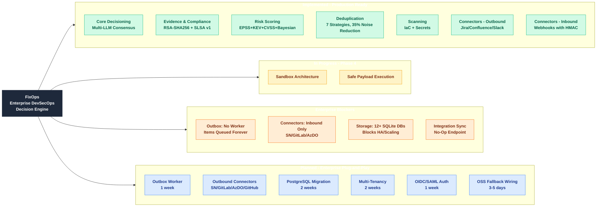

# FixOps Product Status & Roadmap

**Document Version:** 1.0  
**Date:** January 2026  
**Purpose:** Consolidated product status for architect and product owner showcase

---

## Visual Overview (Mindmap)

---

## Executive Summary

FixOps is an Enterprise DevSecOps Decision & Verification Engine with substantial production-ready functionality. This document provides a single source of truth for implementation status, enterprise readiness, and roadmap.

**What's Working (Production-Ready):**
- Multi-LLM consensus decisioning (GPT-5, Claude-3, Gemini-2, Sentinel)
- Deduplication with 7 correlation strategies (35% noise reduction)
- Risk scoring (EPSS + KEV + CVSS + Bayesian + Markov probabilistic forecasting)
- Evidence bundles with RSA-SHA256 signing, Fernet encryption, SLSA v1 provenance
- Real connectors: Jira, Confluence, Slack (actual HTTP calls)
- Webhook receivers: Jira, ServiceNow, GitLab, Azure DevOps (with signature verification)
- IaC scanning (checkov/tfsec) and Secrets scanning (gitleaks/trufflehog)
- Storage backends: Local, S3 Object Lock, Azure Immutable Blob

**Enterprise Blockers (Must Fix):**
- 12+ separate SQLite databases with hardcoded paths (blocks HA/scaling)
- No background worker (outbox queues items but never processes them)
- Missing outbound connectors for ServiceNow, GitLab, Azure DevOps, GitHub
- Integration sync endpoint is a no-op (stamps "success" without syncing)

---

## Enterprise Connector Checklist

For true enterprise plug-and-play, each connector needs: Inbound (webhook receiver), Outbound (create/update), Background Worker, and Bidirectional Sync.

| Connector | Inbound | Outbound | Worker | Bidir Sync | Status | What's Missing |
|-----------|---------|----------|--------|------------|--------|----------------|
| **Jira** | Webhook receiver | `create_issue()` | Outbox queues | Drift detection | **PARTIAL** | Worker to process outbox |
| **Confluence** | - | `create_page()` | - | - | **OUTBOUND ONLY** | No inbound, no sync |
| **Slack** | - | `post_message()` | - | - | **OUTBOUND ONLY** | No inbound, no sync |
| **ServiceNow** | Webhook receiver | **MISSING** | - | - | **INBOUND ONLY** | Need `create_incident()` |
| **GitLab** | Webhook receiver | **MISSING** | - | - | **INBOUND ONLY** | Need `create_issue()` |
| **Azure DevOps** | Webhook receiver | **MISSING** | - | - | **INBOUND ONLY** | Need `create_work_item()` |
| **GitHub** | - | **MISSING** | - | - | **NOT IMPLEMENTED** | Need full connector |

**Critical Gap:** Outbox pattern exists (`apps/api/webhooks_router.py:744-1012`) but NO background worker polls and processes it. Items are queued forever.

---

## Implementation Status by Category

### Core Platform (All Production-Ready)

| Component | Status | Evidence |
|-----------|--------|----------|
| **Multi-LLM Consensus** | REAL | 4 providers, 85% threshold, `core/pentagi_advanced.py` |
| **Deduplication** | REAL | 7 strategies, SQLite-backed, `core/services/deduplication.py` |
| **Risk Scoring** | REAL | EPSS+KEV+CVSS+Bayesian+Markov, `core/services/risk.py` |
| **Evidence Bundles** | REAL | RSA-SHA256, Fernet encryption, SLSA v1, `core/services/evidence.py` |
| **Policy Evaluation** | REAL | OPA-based rules, configurable guardrails |
| **Tri-State Decisions** | REAL | ALLOW/BLOCK/NEEDS REVIEW with confidence scores |
| **Remediation Lifecycle** | REAL | Full state machine with SLA tracking |
| **Notification Delivery** | REAL | Slack webhooks with SSRF protection, SMTP with TLS |

### Scanning (Production-Ready)

| Scanner | Status | Tools | Code Reference |
|---------|--------|-------|----------------|
| **IaC Scanning** | REAL | checkov, tfsec | `core/iac_scanner.py` |
| **Secrets Scanning** | REAL | gitleaks, trufflehog | `core/secrets_scanner.py` |
| **SARIF Ingestion** | REAL | Any SARIF-compliant scanner | `apps/api/ingestion_router.py` |
| **SBOM Analysis** | REAL | CycloneDX, SPDX | `apps/api/ingestion_router.py` |

### Storage Backends (Production-Ready)

| Backend | Status | Features |
|---------|--------|----------|
| **Local Filesystem** | REAL | Default for demo/dev |
| **S3 Object Lock** | REAL | WORM compliance, retention policies |
| **Azure Immutable Blob** | REAL | Immutability policies |

### API Coverage

| Category | Endpoints | Status |
|----------|-----------|--------|
| Ingestion | 15 | Complete |
| Pipeline | 4 | Complete |
| Enhanced Decision | 4 | Complete |
| Analytics | 16 | Complete |
| Audit | 10 | Complete |
| Reports | 9 | Complete |
| Teams/Users | 14 | Complete |
| Policies | 8 | Complete |
| Integrations | 8 | Complete |
| Workflows | 7 | Complete |
| Inventory | 15 | Complete |
| PentAGI | 33 | Complete |
| IaC/Secrets | 10 | Complete |
| Evidence | 17 | Complete |
| Deduplication | 17 | Complete |
| Remediation | 13 | Complete |
| Webhooks | 20 | Complete |
| Feeds | 20 | Complete |

---

## Enterprise Blockers (Must Fix Before Deployment)

### 1. SQLite Everywhere - CRITICAL

**Problem:** 12+ separate SQLite databases with hardcoded relative paths.

| Database | Default Path | Impact |
|----------|--------------|--------|
| users.db | `data/users.db` | No HA/failover |
| integrations.db | `data/integrations.db` | No concurrent writes |
| policies.db | `data/policies.db` | Breaks in containers |
| reports.db | `data/reports.db` | No horizontal scaling |
| audit.db | `data/audit.db` | No proper backup story |
| + 7 more | `data/*.db` | Same issues |

**Solution:** Database abstraction layer + PostgreSQL backend + Alembic migrations

### 2. No Background Workers - CRITICAL

**Problem:** Outbox pattern exists but no worker processes the queue.

The outbox table stores items with status, retry_count, max_retries, next_retry_at, last_error - but there is NO CODE that:
1. Polls the outbox for pending items
2. Routes items to appropriate connectors
3. Makes actual HTTP calls to external systems
4. Updates status based on delivery result

**Solution:** Create worker entrypoint (`python -m core.worker`) with outbox processor

### 3. Missing Outbound Connectors - HIGH

**Problem:** Webhook receivers exist for ServiceNow/GitLab/Azure DevOps but no outbound capability.

| System | Inbound | Outbound |
|--------|---------|----------|
| Jira | Yes | Yes |
| ServiceNow | Yes | **NO** |
| GitLab | Yes | **NO** |
| Azure DevOps | Yes | **NO** |
| GitHub | No | **NO** |

**Solution:** Implement `ServiceNowConnector`, `GitLabConnector`, `AzureDevOpsConnector`, `GitHubConnector`

### 4. Integration Sync No-Op - MEDIUM

**Problem:** `apps/api/integrations_router.py:trigger_sync()` stamps "success" without actually syncing.

**Solution:** Implement real sync logic per integration type

---

## Roadmap

### Phase 0: Enterprise Infrastructure (Weeks 1-4) - MUST

| Task | Effort | Priority |
|------|--------|----------|
| **Database Abstraction + PostgreSQL** | 2 weeks | MUST |
| **Centralize Path Configuration** | 3 days | MUST |
| **Implement Outbox Worker** | 1 week | MUST |
| **Fix Integration Sync Endpoint** | 2 days | MUST |

### Phase 1: Connector Expansion (Weeks 5-8) - SHOULD

| Task | Effort | Priority |
|------|--------|----------|
| **ServiceNow Outbound Connector** | 3-5 days | SHOULD |
| **GitLab Outbound Connector** | 3-5 days | SHOULD |
| **Azure DevOps Outbound Connector** | 3-5 days | SHOULD |
| **GitHub Connector (Full)** | 1 week | SHOULD |
| **Wire Outbox to Connectors** | 1 week | SHOULD |

### Phase 2: Enterprise Security (Weeks 9-12) - SHOULD

| Task | Effort | Priority |
|------|--------|----------|
| **Multi-Tenancy Enforcement** | 2 weeks | SHOULD |
| **OIDC/SAML Integration** | 1 week | SHOULD |
| **RBAC Middleware Enforcement** | 1 week | SHOULD |

### Medium Priority (Enterprise Enablement)

| Task | Effort | Priority |
|------|--------|----------|
| **OSS Fallback Wiring** | 3-5 days | MEDIUM |
| **Cross-Stage Correlation** | 1-2 weeks | MEDIUM |
| **Runtime Event Ingestion** | 1 week | MEDIUM |
| **Application Components from SBOM** | 3-5 days | MEDIUM |

### Items That Can Be Deferred (Optional/Not Required)

| Feature | Why Deferrable |
|---------|----------------|
| Risk Quantification ($) | Budget justification, not operational |
| Industry Benchmarking | No customer data yet |
| ROI Calculator | Nice-to-have for execs |
| Board-ready Dashboards | API data exists, UI is enhancement |
| SIEM (Splunk/Sentinel) | Build when customer demands |
| CMDB Sync | Customer-specific integration |
| Developer Portal | Self-service is nice-to-have |
| Scanner Health Dashboard | Operational monitoring, not core |

**Key Principle:** If it doesn't block (1) deploying safely, (2) making decisions, (3) tracking remediation, or (4) generating audit evidence, it can be deferred.

---

## Stakeholder Coverage Summary

| Stakeholder | Coverage | Key Gaps |
|-------------|----------|----------|
| **Vulnerability Management Analyst** | High | Workload balancing (optional) |
| **Vulnerability Assessment Analyst** | High | Manual pentest workflow (optional) |
| **TVM Engineer** | High | Custom connector SDK (optional) |
| **SOC/Security Analyst** | Medium | SIEM integration (build when demanded) |
| **VM Manager** | High | Executive dashboard (optional) |
| **Security Engineer/DevSecOps** | High | PR annotations (should build) |
| **DevOps/Platform Engineer** | Medium | Patch management integration (optional) |
| **Application Engineering Lead** | High | Sprint velocity impact (optional) |
| **Compliance/GRC Officer** | High | Risk acceptance workflow (should build) |
| **CISO/Head of Security** | Medium | Risk quantification (optional) |

---

## Quick Reference

### What IS Working (Code References)

| Component | Code Location | Status |
|-----------|---------------|--------|
| Jira Connector | `core/connectors.py:49-124` | REAL HTTP calls |
| Confluence Connector | `core/connectors.py:127-210` | REAL HTTP calls |
| Slack Connector | `core/connectors.py:213-248` | REAL HTTP calls |
| Jira Webhook | `apps/api/webhooks_router.py:233-350` | HMAC verification |
| ServiceNow Webhook | `apps/api/webhooks_router.py:353-433` | State mapping |
| GitLab Webhook | `apps/api/webhooks_router.py:1110-1227` | Label mapping |
| Azure DevOps Webhook | `apps/api/webhooks_router.py:1261-1357` | State mapping |
| Deduplication | `core/services/deduplication.py` | 7 strategies |
| Remediation | `core/services/remediation.py` | Full state machine |
| Evidence | `core/services/evidence.py` | RSA-SHA256 + SLSA v1 |
| IaC Scanner | `core/iac_scanner.py` | checkov/tfsec |
| Secrets Scanner | `core/secrets_scanner.py` | gitleaks/trufflehog |

### What Needs Building (Priority Order)

1. **Outbox Worker** - `core/worker.py` (1 week)
2. **PostgreSQL Backend** - `core/db/postgres.py` (2 weeks)
3. **ServiceNow Outbound** - `core/connectors/servicenow.py` (3-5 days)
4. **GitLab Outbound** - `core/connectors/gitlab.py` (3-5 days)
5. **Azure DevOps Outbound** - `core/connectors/azure_devops.py` (3-5 days)
6. **GitHub Connector** - `core/connectors/github.py` (1 week)

---

## Deployment Artifacts

| Artifact | Location | Status |
|----------|----------|--------|
| Dockerfile | `/Dockerfile` | Multi-stage build, Python 3.11-slim |
| Dockerfile.enterprise | `/Dockerfile.enterprise` | Enterprise variant |
| docker-compose.yml | `/docker-compose.yml` | Local development |
| docker-compose.enterprise.yml | `/docker-compose.enterprise.yml` | Enterprise stack |
| Helm Chart | `/deployment/kubernetes/helm/fixops-enterprise/` | Kubernetes deployment |

---

*This document consolidates STAKEHOLDER_ANALYSIS.md, ENTERPRISE_READINESS_ANALYSIS.md, FIXOPS_IMPLEMENTATION_STATUS.md, and next_features.md into a single source of truth.*
