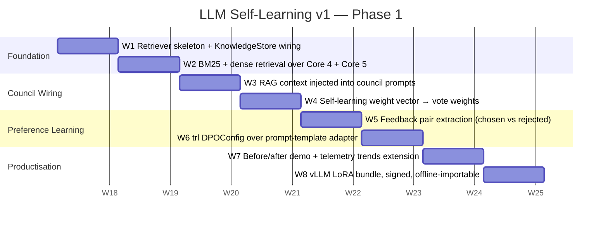
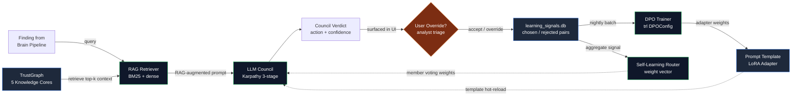

# LLM Training Roadmap — Phase 1 (Self-Learning v1)

**Date:** 2026-04-26
**Branch:** `features/intermediate-stage`
**Author:** data-scientist
**Companion to:** `docs/self_learning_llm_scope_2026-04-26.md`
**Skeleton:** `scripts/llm_training_phase1_skeleton.py`

> **One-liner for the CTO deck:** *"We are not retraining a foundation model. We are closing the loop where every analyst decision improves the next council vote — through RAG over TrustGraph and DPO over prompt templates. 6–8 weeks. Air-gap clean."*

---

## 0. Visual Timeline (Weeks 0 – 8)



---

## 1. Closed-Loop Architecture



**Reading the loop:**

1. A finding enters from the Brain Pipeline (Step 9 — LLM Consensus).
2. The retriever pulls top-k context from TrustGraph Core 4 (Decision Memory) and Core 5 (Remediation Outcomes) for *this org* — historical verdicts on similar findings.
3. The council convenes with the RAG context appended to its analysis prompt.
4. The verdict surfaces in the UI. If the analyst overrides, the (verdict, override) pair lands in `learning_signals.db`.
5. Nightly, a DPO job runs over collected pairs to update a small LoRA adapter on the prompt template.
6. The adapter is hot-reloaded into the council. The weight vector also adjusts member voting weights (e.g. down-rank a member whose votes correlate with overrides).
7. Next round, the same finding gets a *different* verdict — closing the loop.

**Critically: the foundation weights never change in Phase 1.** Only retrieval, prompt templates, and vote weights move.

---

## 2. Dataset Checklist

| Signal | Source | Today | Phase-1 target | DPO eligible? |
|---|---|---:|---:|:---:|
| Closed remediation outcomes | `feedback/remediation` endpoint → `self_learning.db` | ~hundreds (per scope doc, real count to be measured Wk 1) | 1,000 | Yes — `resolved=True` is chosen, `resolved=False` is rejected |
| Council disagreement pairs | `core/llm_council.py` `peer_review_changes` | Live, unsampled | 2,000 | Yes — each `PositionChange` is a (original, new) pair |
| Analyst override events | `feedback/decision` endpoint → predicted vs actual | ~hundreds | 2,000 | Yes — `predicted_action` (rejected) vs `actual_outcome` (chosen) |
| False-positive flags | `feedback/false-positive` endpoint | Live | 1,000 | Yes (negative-only) — used to down-rank patterns |
| Policy outcomes | `feedback/policy` endpoint | Live | 500 | Partial — `was_justified` flag |
| MPTE outcomes | `feedback/mpte` endpoint | Live | 1,000 | Yes — `predicted_exploitable` vs `actual_exploitable` |
| Audit-log decisions | Multica audit pipeline (per scope doc §1c) | Unmeasured | 5,000 | Indirect — provides the *ground-truth* timeline |

**Total Phase-1 minimum:** ~7,500 preference pairs across all signals. **Today's gap:** unknown — Week 1 deliverable is a real count from production tenants.

**Where pairs come from concretely:**

- `(predicted_action, actual_outcome)` pairs from `decision_feedback` table where `predicted_action != actual_outcome`.
- `(original_position, new_position)` pairs from `CouncilVerdict.peer_review_changes` — these are *self-supervised* (council members already vote on which is better in stage 2).
- `(council_action, analyst_override)` pairs from join of council verdicts with downstream UI actions in audit log.

---

## 3. Hardware Checklist

| Component | Today | Phase-1 target | On-prem? | SCIF compatible? |
|---|---|---|:---:|:---:|
| **Council inference** (council members) | OpenRouter / MuleRouter / Ollama / vLLM | Same — no change | Mixed | Yes (vLLM-only profile available) |
| **Council chairman** | OpenAI / Anthropic / OpenRouter | Same | Cloud | No (needs internet) |
| **Opus escalation** | Anthropic API (`claude-opus-4-1-20250805`) | Same — fallback only | Cloud | No (allowlist exception required) |
| **RAG retriever** | New | SentenceTransformers `all-MiniLM-L6-v2` (local CPU OK), FAISS index on disk, BM25 via `rank_bm25` | Yes | Yes |
| **DPO trainer** | None | `trl.DPOTrainer` against `Qwen3-1.5B-Instruct` LoRA, run weekly | Yes | Yes |
| **Adapter store** | None | `models/dpo_adapters/` LoRA bundles + signed manifest | Yes | Yes |
| **Adapter inference (post-DPO)** | None | Existing vLLM endpoint with `--enable-lora` flag | Yes | Yes |
| **GPU for DPO training** | None confirmed | 1× L40S or 1× A100 40GB (rented or shared dev rig) | Either | Adapter-export must be signed & hashed for SCIF transfer |

**SCIF profile note:** when `FIXOPS_AIR_GAPPED=1` is set, council degrades to vLLM-only members + chairman, no Opus escalation, RAG retriever runs locally, DPO adapter is loaded from signed bundle — no external calls anywhere on the hot path.

---

## 4. Per-Week Milestone Table

| Week | Deliverable | Owner | Verifiable test |
|:----:|---|---|---|
| **W1** | RAG retriever skeleton talks to real `KnowledgeStore`. Returns top-k entities for a query string. | data-scientist | `python scripts/llm_training_phase1_skeleton.py --smoke` exits 0; trace shows `≥1` retrieved entity. |
| **W2** | BM25 + dense rerank merge, configurable per-core weight. Indexes Core 4 + Core 5 nightly. | data-scientist | `pytest tests/test_rag_retriever.py -k bm25_plus_dense` passes; index file size > 0 KB. |
| **W3** | RAG context block injected into `LLMCouncilEngine._build_analysis_prompt`. Context block visible in `MemberAnalysis.metadata["rag_context"]`. | backend-eng | Run a council convene; assert `verdict.raw_analyses[0].metadata["rag_context"]` is non-empty. |
| **W4** | `self_learning_router` weight vector consumed by `CouncilMember.weight` at convene time. | backend-eng | `PUT /api/v1/self-learning/weights/threat_modeler 0.5`; convene; assert that member's `MemberVote.weight == 0.5`. |
| **W5** | Feedback pair extractor builds `(chosen, rejected)` JSONL from `learning_signals.db`. | data-scientist | `python scripts/extract_dpo_pairs.py --out pairs.jsonl`; assert ≥100 pairs in output. |
| **W6** | `trl.DPOTrainer` produces a LoRA adapter from extracted pairs. Adapter loadable in vLLM. | ml-eng | Train run logs `train_loss` decreasing; vLLM serves adapter; council member uses adapter; verdict differs from baseline on a held-out finding. |
| **W7** | Before/after demo wired into existing `/api/v1/self-learning/score-with-learning` endpoint. Telemetry trends dashboard shows learning curve. | frontend-eng | Click "Score With Learning" button; UI shows two side-by-side verdicts with delta highlighted. |
| **W8** | vLLM LoRA bundle is signed (Cosign) + manifest-tracked. Offline import path documented. SCIF dry-run passes. | sec-eng | `cosign verify` succeeds; `air-gapped-test.sh` exercises full loop with `FIXOPS_AIR_GAPPED=1`. |

**Exit criteria for Phase 1:** all 8 verifiable tests green. CTO can demo the loop end-to-end in 30 seconds: trigger a finding, override the verdict, observe the next finding's verdict shift.

---

## 5. Phase 2 / Phase 3 Overview (Brief)

### Phase 2 — Distilled Specialist Member (Months 3 – 6)

- Replace the Opus-escalation council slot with a distilled local model.
- Collect 50K Opus verdicts → distill into Qwen 7B with LoRA.
- Goal: ≥90% of Opus quality on triage, at ~10× lower cost. SCIF-native.
- Trigger: only after Phase 1 ships and we have a quality baseline.

#### Phase 2 — Implementation Status (as of 2026-04-27)

Scaffolding has shipped — pipeline is real, training is gated until we hit the
volume threshold. Three artefacts are now in `features/intermediate-stage`:

| Artefact | Path | Purpose |
|---|---|---|
| Dataset curator | `scripts/llm_distill_dataset_curator.py` | Reads `data/learning_signals.db` (`council_verdicts` + `feedback_pairs`) → emits `data/distill_train.jsonl` (DPO format) and `data/distill_sft.jsonl` (SFT format) + `distill_dataset_manifest.json` sidecar. Filters: dedupe by SHA-256 of prompt, min-confidence floor, council-agreement gate, Opus-escalation gate, source whitelist (smoke pairs excluded by default). |
| Training scaffold | `scripts/llm_distill_train.py` | Two-stage student fine-tune (`trl.SFTTrainer` warm-start → `trl.DPOTrainer` preference alignment) on `Qwen/Qwen2.5-7B-Instruct` (HF, no auth) with 4-bit nf4 + LoRA `r=16, alpha=32`. `--dry-run` validates schema + library status without GPU. Cost-guard: refuses real training without `FIXOPS_DISTILL_TRAIN=1` (exit 2). |
| Inference router | `suite-core/core/llm_distill_router.py` | `LLMDistillRouter.triage()` → student first; if `student_confidence < FIXOPS_DISTILL_CONFIDENCE` (default 0.70) falls through to `LLMCouncilEngine`. Every fall-through where student≠council is persisted as a new DPO pair (`pair_source="distill_router_fallthrough"`) — closing the continuous-improvement loop. Fail-soft: missing adapter or libs → council-only mode. |

**Dry-run trace (2026-04-27 07:35 UTC, MPS device, no GPU, no libs installed):**

```
Curator:  107 verdicts (107 Opus-escalated), 107 feedback pairs
          → 107 DPO records, 107 SFT records, 0 dropped (--include-smoke)
Trainer:  --dry-run, 843 ms
          SFT 107/107 valid, DPO 107/107 valid
          library_status: torch=2.10.0; transformers/trl/peft/datasets/bitsandbytes/accelerate = MISSING
          notes: trl import deferred (expected on dev box)
Cost-guard: real run without FIXOPS_DISTILL_TRAIN=1 → exit code 2 ✅
Router smoke: parser ok (remediate_high@0.85), no-adapter env → student_available=False, threshold=0.70
```

**Threshold-to-train (Phase-2 GA gate):** **10K curated DPO pairs** in
`data/learning_signals.db` after the curator's default filters. At today's
107-pair seed (smoke + low-confidence escalation captures from the Phase-1
loop), we are **0.107%** of the way there. Volume is gated on (a) prod tenants
exercising the Phase-1 closed loop with `FIXOPS_LLM_LEARNING_LOOP=1` and (b)
analyst overrides being captured by the UI feedback path (W5 deliverable).

**Gating env vars (CTO sign-off surface):**

| Env var | Default | Effect |
|---|---|---|
| `FIXOPS_DISTILL_TRAIN` | unset | Required `=1` to leave dry-run; cost-guard for accidental cloud-GPU spend |
| `FIXOPS_DISTILL_ADAPTER` | unset | Path to LoRA adapter; if unset, router silently delegates to council |
| `FIXOPS_DISTILL_BASE_MODEL` | `Qwen/Qwen2.5-7B-Instruct` | Override base model |
| `FIXOPS_DISTILL_CONFIDENCE` | `0.70` | Student confidence threshold below which router falls through |
| `FIXOPS_LEARNING_SIGNALS_DB` | `data/learning_signals.db` | Where router persists fall-through DPO signals |

**Hardware/budget envelope (CTO can sign off when threshold is met):**
- 1× L40S (48 GB) or A100 40 GB, ~$1.50–2.50/hr on Lambda/RunPod.
- Estimated wall-clock at 10K pairs: SFT 1 epoch ~45 min, DPO 1 epoch ~60 min → ≤$10 per training run.
- Adapter size (LoRA r=16): ~120 MB; signed + offline-importable per W8 SCIF flow.
- No data leaves the cluster — all training happens on prepared JSONL artefacts shipped from `data/`.

### Phase 3 — Org-Specific Continued Pre-Training (Months 6 – 12+)

- Only when a SCIF customer demands it AND we have ≥6 months of their operational data.
- Llama 3.1 8B base + LoRA continued pre-training on their normalized graph corpus.
- Hardware: 8× A100 80GB or 4× H100 for ~7 days per training run.
- Cost: $40–120K per run on cloud, ~$300K capex if owning hardware.
- Output: per-customer model card + signed weights stored *inside* their facility.

---

## 6. Honest Caveats (Carry-over from Scope Doc)

- **"Self-learning" is a marketing term.** What Phase 1 ships is *not* a model that updates its weights at inference time. It is a council whose retrieval, voting weights, and prompt templates adapt to feedback. This matches what Cursor / Copilot ship, but be precise in deck language.
- **Air-gap training is hard.** All Phase 2/3 paths implicitly require internet for the initial base-model download. SCIF customers will need a model-card SBOM (training data, weights hash, attestation chain) for ATO. Plan that artifact alongside Phase 2.
- **Counts in §2 are placeholder until Week 1.** First deliverable on the schedule is "measure today's preference-pair inventory across the 5 feedback tables." If the count is < 1,000, Phase 1 still ships — the loop works on small data — but DPO impact will be muted until volume accrues.

---

## 7. Open Questions Gated on User / CTO Input

1. **Hardware budget approval** for the W6 GPU rental (~$5K/month for shared L40S) and Phase-2 distillation rig (~$100K capex if owned).
2. **Marketing posture** — is the headline "Self-Learning LLM" or the more defensible "Council that learns from your decisions"?
3. **SCIF design partner** — is there a customer who will co-design Phase 3 in exchange for bespoke weights? Without one, Phase 3 is speculative.
4. **Adapter signing CA** — which root-of-trust signs LoRA bundles for offline transfer to air-gapped facilities?

---

*End roadmap. See `scripts/llm_training_phase1_skeleton.py` for the executable scaffold.*
