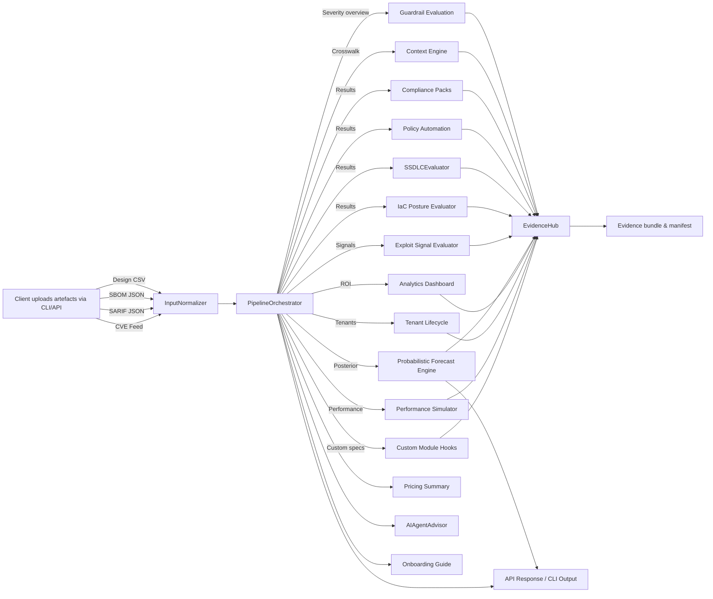

# FixOps Platform Runbook

This runbook summarises the shipped feature set, end-to-end data flow, CLI/API touchpoints, and a comprehensive test plan so teams can exercise every FixOps capability with confidence.

## Feature Overview

| Capability | What It Delivers | Key Modules / Files |
| --- | --- | --- |
| Overlay-driven configuration | Mode-aware guardrails, integrations, pricing, and lifecycle profiles | `fixops/configuration.py`, `config/fixops.overlay.yml` |
| Module registry & toggles | Terraform-style overlay switches with custom hook support | `fixops/configuration.py`, `fixops/modules.py` |
| Context engine | Business-aware severity weighting, playbook selection, and summaries | `fixops/context_engine.py` |
| Guardrail maturity & policy automation | Fail/warn thresholds, Jira/Confluence actions, deployment approvals | `backend/pipeline.py`, `fixops/policy.py` |
| Compliance packs | Framework scoring, audit-ready summaries | `fixops/compliance.py` |
| Evidence hub | Persisted bundles, manifests, feedback capture integration | `fixops/evidence.py`, `fixops/feedback.py` |
| AI agent advisor | Framework detection, control recommendations, playbook routing | `fixops/ai_agents.py` |
| Exploitability signals | EPSS/KEV-driven exploit context and escalation hints | `fixops/exploit_signals.py`, `config/fixops.overlay.yml` |
| Probabilistic forecast engine | Bayesian priors + Markov transitions yielding escalation metrics | `fixops/probabilistic.py`, `backend/pipeline.py` |
| ROI analytics dashboard | ROI estimates, MTTR deltas, automation savings per module | `fixops/analytics.py`, `backend/pipeline.py` |
| Tenant lifecycle orchestration | Tenant inventories, lifecycle stages, module coverage gaps | `fixops/tenancy.py`, `config/fixops.overlay.yml` |
| Performance simulator | Near real-time latency forecasts, throughput targets, backlog guidance | `fixops/performance.py`, `backend/pipeline.py` |
| SSDLC evaluator | Stage-by-stage lifecycle coverage report | `fixops/ssdlc.py` |
| IaC posture evaluator | Multi-cloud/on-prem coverage with artefact gap detection | `fixops/iac.py`, `config/fixops.overlay.yml` |
| CVE contextual simulation | Log4Shell demo vs enterprise evidence bundles | `simulations/cve_scenario/runner.py` |

## End-to-End Data Flow



The FastAPI service wires this chain during startup by loading the overlay, provisioning allowlisted data directories, and enforcing authentication. The orchestrator reuses cached lowercase tokens to avoid repeated SBOM/SARIF scans and passes a single enriched payload through guardrails, context, compliance, policy, exploitability, AI, SSDLC, analytics, tenancy, performance, and evidence modules before responding.

### Module execution lifecycle

- **Configuration**: `OverlayConfig.modules` normalises every module toggle (guardrails, context, evidence, IaC, etc.) and exposes `OverlayConfig.enabled_modules` so operators can verify which building blocks will run for a profile.
- **Execution record**: `pipeline_result["modules"]` captures the configured matrix, execution status, and custom hook outcomes. Evidence bundles persist this block for audit and troubleshooting.
- **Custom hooks**: entries in `modules.custom` run after the built-in modules via `fixops.modules.execute_custom_modules`, receiving a `PipelineContext` with design rows, crosswalk, and intermediate summaries. Returned mappings are merged into the API response.
- **IaC posture**: when enabled, `fixops/iac.py` inspects design rows for each configured target (AWS/GCP/Azure/on-prem) and highlights missing artefacts or unmatched components, feeding both the API response and evidence bundles.

## CLI & API Touchpoints

### Persona-driven usage recipes

The push-model API stays consistent for every stakeholder, but the overlay toggles expose different artefacts and automation to
each persona. Use the following checklists to script role-specific workflows:

  - **CISO / Risk Executive**
    - Ensure the overlay profile enables `modules.analytics`, `modules.performance`, `pricing.disclosure`, and `guardrails.escalate_on_fail`.
    - Execute `curl -H "X-API-Key: ${FIXOPS_API_TOKEN}" -X POST http://127.0.0.1:8000/pipeline/run | jq '.guardrails,.analytics.overview,.performance_profile.summary,.pricing_summary'`
      to review governance posture, ROI value, and latency status.
    - Download the latest evidence bundle listed in `.evidence_bundle.files.bundle` to brief audit/compliance teams with embedded analytics sections.

  - **CTEM Lead**
    - Upload fresh KEV/EPSS feeds via `/inputs/cve` and trigger the run; inspect `.exploitability.signals` for hot spots and `.analytics.insights` for contextualised savings.
    - Use `jq '.probabilistic.posterior, .modules.status'` to identify escalation forecasts and module coverage per asset.
    - Reference the IaC posture findings in `.iac_posture` and performance outputs in `.performance_profile.recommendations` when sequencing mitigation.

  - **Security Operations / SIEM Owner**
  - Enable Slack automation in the overlay and run the pipeline; confirm `.policy_automation.deliveries[] | select(.target=="slack")` entries for alert routing.
  - Tail the evidence manifest directory for JSON dispatch files that can be ingested into the SIEM.

  - **DevSecOps Engineer**
  - Use the CLI uploads plus `/pipeline/run` output to triage `.guardrails.failures` and `.policy_automation.jira` tickets.
  - Invoke the CVE simulation (`python -m simulations.cve_scenario.runner --mode demo`) to validate playbooks before pushing policies to CI/CD.

  - **Cloud Developer / Platform Engineer**
  - Provide Terraform/Terragrunt manifests to `/inputs/design` and enable IaC posture in the overlay.
  - Query `.iac.targets` from the pipeline output to uncover missing guardrails per cloud and adopt suggested modules.

  - **Solutions / Enterprise Architect**
  - Leverage `FIXOPS_OVERLAY_PATH` overrides to model customer-specific integrations.
  - Use the module matrix (`.modules`) to validate which enterprise packs (policy automation, SSDLC, probabilistic) will execute in each configuration.

  - **Security Tester / Red Team**

  - **Tenant Operations / Platform PMO**
    - Enable `modules.tenancy` and populate `tenancy.tenants` with each internal or customer tenant.
    - Run `python -m fixops.cli run --enable tenancy --enable performance --output out/tenant.json` and inspect `.tenant_lifecycle.summary` for stage counts and `.performance_profile.summary` for latency posture.
    - Feed `.analytics.value_by_module` into stakeholder scorecards to show the savings each module delivers for shared tenants.
  - Inject synthetic SARIF findings and rerun the pipeline to confirm downgrades/escalations recorded under `.context_summary.adjusted_severity`.
  - Review the SSDLC assessment (`.ssdlc`) for stages lacking security tests and feed back via the `/feedback` endpoint when toggled on.

### CLI quickstart

Run the full pipeline without standing up FastAPI by invoking the overlay-aware CLI. The CLI honours module toggles, copies evidence bundles, and can operate offline by disabling exploit-feed refreshes.

```bash
export FIXOPS_API_TOKEN="demo-token"

python -m fixops.cli run \
  --overlay config/fixops.overlay.yml \
  --design artefacts/design.csv \
  --sbom artefacts/sbom.json \
  --sarif artefacts/scan.sarif \
  --cve artefacts/cve.json \
  --output out/pipeline.json \
  --evidence-dir out/evidence \
  --offline

# View the active overlay with secrets masked
python -m fixops.cli show-overlay --overlay config/fixops.overlay.yml --pretty
```

- The CLI mirrors the API’s artefact archive and appends an `artifact_archive` section pointing to raw and normalised inputs under the mode-specific `data.archive_dir`.
- Provide `--evidence-dir` to copy the encrypted/compressed bundle into a separate operator-controlled folder while the original remains in the allowlisted evidence directory.

Key switches:

- `--env KEY=VALUE` – supply API tokens or connector credentials without exporting them globally.
- `--disable MODULE` / `--enable MODULE` – toggle overlay modules (e.g. disable `policy_automation` for smoke tests).
- `--offline` – prevent exploit feed auto-refresh when running in restricted environments.
- `--include-overlay` – embed the sanitised overlay in the result JSON for downstream tooling.
- Replace `artefacts/...` with paths to your own uploaded files.

### FastAPI ingestion workflow

```bash
export FIXOPS_API_TOKEN="demo-token"
uvicorn backend.app:create_app --factory --reload

# Upload design context
curl -X POST \
  -H "X-API-Key: ${FIXOPS_API_TOKEN}" \
  -F "file=@samples/design.csv;type=text/csv" \
  http://127.0.0.1:8000/inputs/design

# Upload SBOM
curl -X POST \
  -H "X-API-Key: ${FIXOPS_API_TOKEN}" \
  -F "file=@samples/sbom.json;type=application/json" \
  http://127.0.0.1:8000/inputs/sbom

# Upload CVE feed
curl -X POST \
  -H "X-API-Key: ${FIXOPS_API_TOKEN}" \
  -F "file=@samples/kev.json;type=application/json" \
  http://127.0.0.1:8000/inputs/cve

# Upload SARIF
curl -X POST \
  -H "X-API-Key: ${FIXOPS_API_TOKEN}" \
  -F "file=@samples/scan.sarif;type=application/json" \
  http://127.0.0.1:8000/inputs/sarif

# Execute the overlay-aware pipeline
curl -X POST \
  -H "X-API-Key: ${FIXOPS_API_TOKEN}" \
  http://127.0.0.1:8000/pipeline/run | jq
```

Each response includes mode, severity breakdowns, probabilistic forecasts, exploitability insights, context summaries, AI agent findings, SSDLC assessment, guardrail status, evidence bundle pointers, and pricing plan metadata.

### CVE contextual scoring simulation

```bash
# Demo mode: proves high → medium downgrade with limited blast radius
python -m simulations.cve_scenario.runner --mode demo

# Enterprise mode: proves medium → high escalation with regulated data and production exposure
python -m simulations.cve_scenario.runner --mode enterprise
```

Both runs emit contextual scorecards and evidence bundles in the overlay-configured `evidence_dir`, referencing the bundled guardrail, compliance, policy, AI agent, and SSDLC outputs.

### Real CVE playbook CLI

```bash
python scripts/run_real_cve_playbook.py --context simulations/cve_scenario/contexts.json
```

The script leverages the blended enterprise scorer to contrast scanner severities with FixOps-adjusted tiers and prints compliance alignment via Rich tables.

## Test Strategy ("Best Tester" checklist)

1. **Unit & integration suite**
   ```bash
   pytest
   ```
   Validates overlay parsing, API endpoints, pipeline orchestration, AI agent detection, SSDLC scoring, policy automation, compliance packs, and feedback capture.

2. **Bytecode compilation smoke test**
   ```bash
   python -m compileall backend fixops simulations tests
   ```
   Catches syntax regressions across orchestrator, helpers, simulations, and tests.

3. **CVE scenario verification** – ensures demo vs enterprise guardrails, pricing, compliance, and SSDLC diffs are preserved.
   ```bash
   python -m simulations.cve_scenario.runner --mode demo
   python -m simulations.cve_scenario.runner --mode enterprise
   ```

4. **Manual FastAPI workflow** – exercise the full push-model ingestion using the `curl` steps above, confirm `/pipeline/run` returns:
   - Guardrail status `pass/warn/fail`
   - Context summary with component counts and weighted severities
   - Compliance frameworks with satisfied/in-progress status
   - Policy automation action plans
   - External delivery results (Jira/Confluence/Slack) with connector status
   - AI agent matches and recommendations
   - Probabilistic forecast metrics (posterior distribution, escalation candidates)
   - SSDLC stage summary and requirement rollups
   - Evidence bundle manifest paths
   - Pricing summary with active plan
   - Exploit feed refresh status (auto-ingested KEV/EPSS snapshots)

5. **Feedback capture** – if `toggles.capture_feedback` is true, post a JSON payload to `/feedback` and verify the JSONL entry appears under the overlay-configured `feedback_dir`.

## Data & Evidence Handling

- Overlay allowlists constrain upload destinations (`FIXOPS_DATA_ROOT_ALLOWLIST`).
- Evidence bundles include manifest + archive paths; the CVE simulation asserts both files exist when guardrails trigger bundling.
- Feedback entries live under `data/feedback/<mode>/<run_id>/feedback.jsonl`, matching SSDLC "feedback_loop" requirements.
- Policy automation dispatches emit JSON manifests under `data/automation/<mode>/` and simultaneously call Jira, Confluence, and Slack connectors when `toggles.enforce_ticket_sync` is true. Configure `FIXOPS_JIRA_TOKEN`, `FIXOPS_CONFLUENCE_TOKEN`, and `FIXOPS_SLACK_WEBHOOK` to enable live delivery.
- Exploit signal auto-refresh writes downloaded feeds to `data/feeds/<mode>/` and annotates CVE records when KEV/EPSS data changes.

## Quick Feature Recap

- **Demo mode** delivers contextual risk summaries, onboarding checklist, AI agent callouts, and lightweight compliance guidance within 30 minutes.
- **Enterprise mode** enforces ticket-sync prerequisites, richer compliance packs, policy automation (Jira/Confluence/change requests), SSDLC depth, pricing disclosures, and comprehensive evidence bundles.
- Both modes share the same push ingestion API and overlay contract, making upgrades configuration-only.

Refer to `docs/CONFIG_GUIDE.md` for deeper configuration examples and `docs/ARCHITECTURE.md` for component boundaries.
