# ALdeci PRD Creation - Mind Map

```mermaid
mindmap
  root((ALdeci PRD))
    Executive Summary
      Product Overview
      Value Propositions
      Target Market
      Business Impact
    
    Vision & Strategy
      Vision Statement
      Mission Statement
      Strategic Positioning
      Competitive Differentiation
      Product Principles
    
    Problem & Market
      Core Problems
        Vulnerability Noise
        No Decision Automation
        Missing Audit Evidence
        CVSS-Only Prioritization
        No Exploit Validation
      Market Size
        TAM: $8.5B
        SAM: $1.8B
        SOM: $45M
      Competitive Landscape
        RBVM Platforms
        ASPM Platforms
        Scanning Tools
      Regulatory Drivers
        EU Cyber Resilience Act
        EO 14028
        ISO 27001:2022
        SOC2/PCI-DSS
    
    Product Overview
      REST API
        313+ Endpoints
        32 Routers
      CLI
        112+ Commands
        31 Top-level Groups
      Web UI
        16 Pages
        Risk Graph
      Tech Stack
        FastAPI/Python
        SQLite/PostgreSQL
        Cytoscape.js
      Deployment Models
        SaaS
        On-Premises
        Air-Gapped
    
    User Personas
      Security Architect
        Sarah
        Automate Triage
        Scale Security
      DevSecOps Engineer
        David
        Pipeline Integration
        Low False Positives
      Compliance Manager
        Catherine
        Pass Audits
        Evidence Collection
      AppSec Manager
        Alex
        Measure Effectiveness
        Reduce MTTR
    
    Core Capabilities
      1 Ingest & Normalize
        SBOM Ingestion
          CycloneDX
          SPDX
          Syft JSON
          ML-BOM
        SARIF Ingestion
        CVE/VEX Processing
        CNAPP Integration
        Business Context
      
      2 Correlate & Deduplicate
        Risk Graph
        Finding Deduplication
          5 Strategies
        Vulnerability Enrichment
          8 Intelligence Sources
      
      3 Decide with Transparency
        Tri-State Verdicts
          Allow
          Block
          Needs Review
        Multi-LLM Consensus
          GPT-5
          Claude-3
          Gemini-2
          Sentinel-Cyber
        Policy Evaluation
        Probabilistic Forecasting
        Explainable Scoring
      
      4 Verify Exploitability
        Micro-Pentest Engine
          SQL Injection
          XSS
          SSRF
          RCE
        Reachability Analysis
        MPTE Integration
      
      5 Operationalize Remediation
        Lifecycle Management
          7 States
          SLA Tracking
        Jira/Ticketing Integration
          Bidirectional Sync
          6 Systems
        Collaboration
        Bulk Operations
      
      6 Prove & Retain
        Signed Evidence Bundles
          RSA-SHA256
          SLSA v1
        Immutable Evidence Lake
          7-Year Retention
          3 Storage Backends
        SLSA Provenance
        Compliance Reports
          6 Frameworks
      
      7 Automate & Extend
        YAML Overlay Config
        YAML Playbooks
          21 Pre-approved Actions
        Compliance Marketplace
        Scheduled Jobs
      
      8 Visualize & Analyze
        Interactive Risk Graph
          Cytoscape.js
          Multi-Select
        Analytics Dashboards
          MTTR
          Coverage
          Compliance
    
    Technical Architecture
      System Architecture
        Modular Monolith
        Optional Microservices
      Core Components
        API Gateway Layer
        Business Logic Layer
        Data Access Layer
        Integration Layer
        Storage Layer
      Technology Stack
        Backend: FastAPI/Python
        Frontend: Web/Cytoscape
        Database: SQLite/PostgreSQL
        Security: RSA/JWT/bcrypt
      Deployment Architecture
        Load Balancer
        App Servers
        Database Cluster
        Evidence Lake
        External Integrations
      Data Models
        Services
        Components
        Vulnerabilities
        Findings
        Decisions
        Evidence
      Security Architecture
        Authentication: JWT
        Authorization: RBAC
        Encryption: TLS/Fernet
        Signatures: RSA-SHA256
    
    Functional Requirements
      FR-ING: Ingestion
        FR-ING-001: SBOM
        FR-ING-002: SARIF
        FR-ING-003: CVE/VEX
        FR-ING-004: CNAPP
        FR-ING-005: Scanner-Agnostic Multipart
        FR-ING-006: Business Context
      FR-COR: Correlation
        FR-COR-001: Risk Graph
        FR-COR-002: Deduplication
        FR-COR-003: Enrichment
      FR-DEC: Decision
        FR-DEC-001: Tri-State
        FR-DEC-002: LLM Consensus
        FR-DEC-003: Policy Eval
        FR-DEC-004: Forecasting
        FR-DEC-005: Scoring
      FR-VER: Verification
        FR-VER-001: Micro-Pentest
        FR-VER-002: Reachability
        FR-VER-003: MPTE
      FR-REM: Remediation
        FR-REM-001: Lifecycle
        FR-REM-002: Ticketing
        FR-REM-003: Collaboration
        FR-REM-004: Bulk Ops
      FR-EVD: Evidence
        FR-EVD-001: Signed Bundles
        FR-EVD-002: Evidence Lake
        FR-EVD-003: SLSA
        FR-EVD-004: Compliance
      FR-AUT: Automation
        FR-AUT-001: YAML Config
        FR-AUT-002: Playbooks
        FR-AUT-003: Marketplace
        FR-AUT-004: Jobs
      FR-VIZ: Visualization
        FR-VIZ-001: Risk Graph
        FR-VIZ-002: Analytics
    
    Non-Functional Requirements
      Performance
        API Response < 200ms
        Risk Graph < 2s load
        1000+ nodes support
      Scalability
        10k findings/day
        100+ concurrent users
        Horizontal scaling
      Availability
        99.9% uptime SLA
        Automated failover
        Backup/recovery
      Security
        OWASP Top 10
        Penetration testing
        Vulnerability scanning
      Compliance
        SOC2 Type II
        ISO 27001
        GDPR
      Usability
        Onboarding < 30 min
        Intuitive UI
        Comprehensive docs
      Maintainability
        Modular design
        Test coverage > 80%
        Documentation
      Portability
        Docker containers
        Kubernetes support
        Multi-cloud
    
    Integration & Extensibility
      LLM Providers
        OpenAI GPT
        Anthropic Claude
        Google Gemini
        Custom Sentinel
      Vulnerability Intelligence
        NVD/CVE
        CISA KEV
        EPSS
        MITRE ATT&CK
      Ticketing Systems
        Jira
        ServiceNow
        GitHub
        GitLab
        Azure DevOps
      Notifications
        Slack
        Confluence
        Email
      Security Scanners
        Push Model
        SBOM/SARIF
        Any Tool
      Storage Backends
        Local FS
        S3 Object Lock
        Azure Immutable
      Authentication
        JWT
        OAuth2
        SAML (future)
        LDAP (future)
    
    Security & Compliance
      Authentication & Authorization
        JWT Tokens
        Role-Based Access
        API Keys
      Data Protection
        TLS/HTTPS
        At-Rest Encryption
        PII Handling
      Audit & Logging
        Activity Logs
        Access Logs
        Change Tracking
      Vulnerability Management
        SAST/DAST
        Dependency Scanning
        Container Scanning
      Compliance Frameworks
        ISO 27001:2022
        SOC2 Type II
        PCI-DSS
        GDPR
        HIPAA
        NIST SSDF
    
    Success Metrics & KPIs
      Business Metrics
        Customer Acquisition
        Revenue Growth
        Market Share
      Operational Metrics
        Time Saved
          60% reduction
        Noise Reduction
          100:1 ratio
        Onboarding Time
          30 minutes
      Security Metrics
        MTTR
        MTTD
        Vulnerability Trends
        SLA Compliance
      Adoption Metrics
        Active Users
        API Call Volume
        Feature Usage
      Customer Satisfaction
        NPS Score
        CSAT Score
        Retention Rate
    
    Product Roadmap
      Phase 1: Foundation
        Q1 2026
          Core Ingestion ✅
          Decision Engine ✅
          Evidence Bundles ✅
      Phase 2: Intelligence
        Q2 2026
          Multi-LLM Consensus ✅
          Micro-Pentest ✅
          Risk Graph ✅
      Phase 3: Scale
        Q3 2026
          Enterprise Features
          Multi-Tenant
          HA/DR
      Phase 4: Ecosystem
        Q4 2026
          Marketplace
          Advanced Analytics
          Mobile Support
      Future Phases
        2027+
          ML/AI Enhancement
          Global Deployment
          SOC Integration
    
    Dependencies & Constraints
      Technical Dependencies
        Python 3.10+
        FastAPI Framework
        LLM APIs
        PostgreSQL
      External Dependencies
        NVD API
        CISA KEV Feed
        Scanner Tools
      Constraints
        Budget
        Timeline
        Resources
        Compliance
      Risks
        LLM Availability
        API Rate Limits
        Data Privacy
        Vendor Lock-in
    
    Risk Assessment
      Technical Risks
        LLM Hallucinations
          Mitigation: Consensus
        Performance Degradation
          Mitigation: Caching
        Integration Failures
          Mitigation: Retry Logic
      Business Risks
        Competition
          Mitigation: Differentiation
        Market Adoption
          Mitigation: Quick Wins
        Pricing Pressure
          Mitigation: Value Proof
      Operational Risks
        Data Breaches
          Mitigation: Encryption
        Service Outages
          Mitigation: HA/DR
        Support Scaling
          Mitigation: Documentation
    
    Go-to-Market Strategy
      Target Segments
        Enterprise Financial
        Healthcare Orgs
        Government Agencies
        Critical Infrastructure
      Positioning
        Decision Layer
        Not a Scanner
        Evidence-First
      Pricing Model
        Freemium
        Professional
        Enterprise
        Air-Gapped
      Sales Channels
        Direct Sales
        Partners
        Marketplace
      Marketing Tactics
        Content Marketing
        Thought Leadership
        Case Studies
        Webinars
    
    Support & Documentation
      Documentation Types
        User Guide
        API Reference
        CLI Reference
        Architecture Docs
        Compliance Guide
      Support Tiers
        Community
          Forums
          GitHub Issues
        Professional
          Email Support
          SLA: 24hrs
        Enterprise
          24/7 Support
          Dedicated CSM
          SLA: 4hrs
      Training & Enablement
        Getting Started
        Video Tutorials
        Certification Program
        Partner Training
      Knowledge Base
        FAQs
        Troubleshooting
        Best Practices
        Integration Guides
```

---

## Mind Map Structure Overview

### 1. **Top Level Branches**
The mind map is organized into 19 major branches representing the core sections of the PRD:
- Executive Summary → Vision → Problem/Market → Product → Users → Capabilities → Architecture → Requirements → NFRs → Integrations → Security → Metrics → Roadmap → Dependencies → Risks → GTM → Support

### 2. **Core Capabilities Branch** (Most Complex)
This is the deepest branch with 8 sub-capabilities:
- Each capability has 3-5 sub-features
- Each sub-feature has implementation details
- Total: ~50 functional requirements mapped

### 3. **Key Decision Points** (Highlighted)
- **Deployment Models:** SaaS vs. On-Prem vs. Air-Gapped
- **Risk Philosophy:** Zero-Exception vs. Smart Prioritization
- **LLM Strategy:** Multi-provider consensus vs. single provider
- **Integration Approach:** Push model vs. pull model

### 4. **Dependencies & Relationships**
- **User Personas** → drive **Core Capabilities**
- **Core Capabilities** → require **Technical Architecture**
- **Technical Architecture** → determines **NFRs**
- **NFRs** → influence **Roadmap priorities**
- **Market Analysis** → informs **GTM Strategy**

### 5. **Color Coding (Conceptual)**
If rendered in a visual mind map tool:
- **Green:** Implemented features ✅
- **Blue:** Planned features (Q3-Q4 2026)
- **Purple:** Future enhancements (2027+)
- **Red:** Critical dependencies/risks
- **Orange:** Key differentiators

### 6. **Depth Levels**
- **Level 1:** Main branches (19 sections)
- **Level 2:** Sub-sections (80+ items)
- **Level 3:** Detailed features (200+ items)
- **Level 4:** Implementation specifics (300+ items)

---

## Usage Recommendations

1. **For Product Managers:** Focus on Vision → Market → Capabilities → Roadmap
2. **For Engineers:** Deep dive into Architecture → Requirements → NFRs → Dependencies
3. **For Sales/Marketing:** Study Market → GTM → Success Metrics → Support
4. **For Leadership:** Review Executive Summary → Metrics → Roadmap → Risks

---

## Export Options

This mind map can be rendered in:
- **Mermaid.js:** Native support in GitHub, GitLab, many Markdown tools
- **MindMeister/XMind:** Import the structure for interactive visualization
- **Draw.io/Lucidchart:** Manually recreate with custom styling
- **PowerPoint/Keynote:** For executive presentations

---

## Next Steps

1. Review mind map structure for completeness
2. Validate against actual PRD content
3. Use as navigation guide for PRD document
4. Update as product evolves
