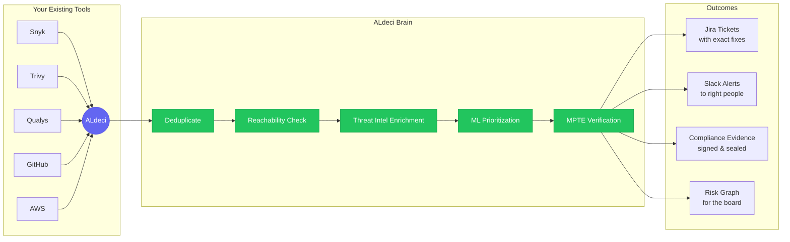
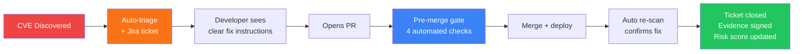
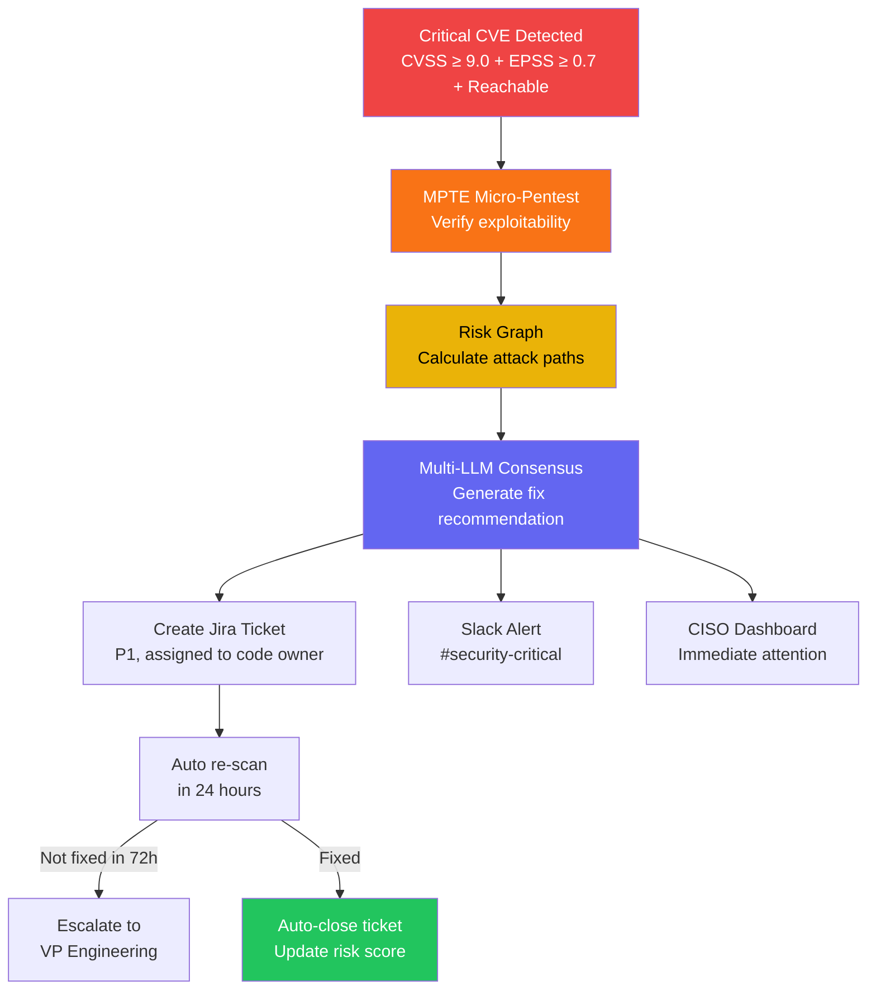
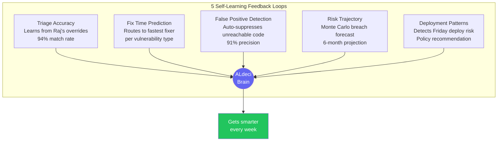

<div align="center">

# ALdeci — A Day in the Life

### How a Real Security Team Goes from Drowning in Alerts to Sleeping at Night

[]()
&nbsp;
[]()
&nbsp;
[]()
&nbsp;
[]()

**This is not a feature list. This is a story.**

*Follow 25 real personas — from a panicking junior developer to a skeptical CFO to a Big 4 auditor — through a single day, a single week, and a single quarter with ALdeci. See exactly how every feature solves a real problem for a real person.*

</div>

---

> **Why this document exists:** Most security tools show you a feature grid. We think you deserve to see *how it actually feels* to use one. This story follows HealthPay — a fictional healthcare fintech startup — as they go from 14,000 unmanageable vulnerability alerts to a security program that runs itself.

---

## Table of Contents

<details>
<summary><strong>Click to expand full chapter list</strong></summary>

| # | Chapter | Who Stars In It | What You'll See |
|:---:|---|---|---|
| — | [The Characters](#the-characters) | Everyone | Meet all 25 personas |
| — | [The Company](#the-company) | — | HealthPay's security nightmare |
| 1 | [Getting Started](#chapter-1-getting-started-day-1) | Sarah, Ethan | 60-second setup, first scan, 11,300 → 340 |
| 2 | [Raj's Morning](#chapter-2-rajs-morning-daily-use) | Raj | Smart dashboard, overnight CVE, AI copilot |
| 3 | [Mike Fixes It](#chapter-3-mike-fixes-it-developer-experience) | Mike | PR check, auto-fix, post-deploy verify |
| 4 | [Lisa's Cloud Check](#chapter-4-lisas-cloud-check-infrastructure) | Lisa | S3 bucket + IAM + attack path |
| 5 | [The Risk Graph](#chapter-5-the-risk-graph-seeing-the-invisible) | David, Tom | Attack surface map, GNN prediction, supply chain |
| 6 | [SBOM & Inventory](#chapter-6-sbom--asset-inventory-knowing-what-you-have) | Anika | SBOM generation, unified asset inventory |
| 7 | [The Audit](#chapter-7-the-audit-compliance) | Sarah, Raj, Karen | HIPAA evidence bundle, 3 weeks → 2 hours |
| 8 | [Board Meeting](#chapter-8-the-board-meeting-reporting) | Sarah | One-page executive report |
| 9 | [Playbooks](#chapter-9-automation--playbooks-rajs-superpower) | Raj | 25 hours → 90 seconds, nerve center |
| 10 | [Threat Intel](#chapter-10-threat-intelligence-anikas-early-warning-system) | Anika, Sana | 50+ threat feeds, curated daily brief |
| 11 | [Collaboration](#chapter-11-collaboration-the-whole-team-one-place) | Mike, Raj, Anika | Comments, activity feed, evidence promotion |
| 12 | [Learning Loop](#chapter-12-the-learning-loop-over-time) | Chen, Raj | 5 ML feedback loops, self-learning |
| 13 | [The Incident](#chapter-13-the-incident-when-things-go-wrong) | Raj, Tom | 2 AM attack attempt, auto-response |
| 14 | [CISO View](#chapter-14-davids-ciso-view-risk-ownership) | David | Risk register, policy enforcement |
| 15 | [CFO View](#chapter-15-priyas-cfo-view-proving-roi) | Priya | ROI dashboard, $110K saved, tool consolidation |
| 16 | [VM Team](#chapter-16-anika--toms-day-vulnerability-management-team) | Anika, Tom | 80% data janitoring → 0%, triage inbox |
| 17 | [AppSec Engineering](#chapter-17-ninas-appsec-engineering-shifting-left) | Nina | 8 → 20 PRs/week, security champions |
| 18 | [Red Team](#chapter-18-jakes-red-team-offensive-security) | Jake | 1 → 365 pen-tests/year, MPTE engine |
| 19 | [Compliance World](#chapter-19-karens-compliance-world-audit-ready-every-day) | Karen | Always audit-ready, gap tracking |
| 20 | [Sprint Planning](#chapter-20-derek--olivias-sprint-where-security-meets-delivery) | Derek, Olivia | Sprint security budget, velocity protection |
| 21 | [Threat Analyst](#chapter-21-sanas-threat-intelligence-knowing-the-enemy) | Sana | TTP correlation, threat hunts |
| 22 | [Security Pipeline](#chapter-22-ethan-builds-the-security-pipeline-security-engineering) | Ethan | Connector config, 60% → 10% maintenance |
| 23 | [Data & AI Team](#chapter-23-the-data--ai-team-making-aldeci-smarter) | Farid, Maya, Ravi, Chen | LLM tuning, RAG, ML models, context engine |
| 24 | [Junior Dev](#chapter-24-alexs-first-security-ticket-the-junior-dev-experience) | Alex | Terrified → confident in one ticket |
| 25 | [External Audit](#chapter-25-dianas-audit-the-external-auditors-experience) | Diana | 3 days → 4 hours, cryptographic proof |
| 26 | [Architecture Review](#chapter-26-lenas-architecture-review-security-by-design) | Lena | Risk simulation, pattern analysis |
| 27 | [SOC Operations](#chapter-27-victors-soc-operations-managing-the-security-team) | Victor | SOC metrics, shift handoff, staffing data |
| 28 | [Platform Admin](#chapter-28-hasans-admin-day-running-the-platform) | Hasan | RBAC, SSO, platform health, 2 hr/month |
| — | [Before & After](#the-transformation) | Everyone | The full before/after comparison |
| — | [Competitor Comparison](#how-aldeci-compares-to-existing-tools) | — | Why not just use Snyk/Wiz/ArmorCode? |
| — | [Feature × Persona Map](#complete-feature--persona-map) | All 25 | Every feature, every persona, one table |

</details>

---

## The Vision

<div align="center">

```
┌─────────────────────────────────────────────────────────────────────┐
│                                                                     │
│   Your scanners found 14,000 vulnerabilities.                       │
│                                                                     │
│   ALdeci tells you which 12 actually matter,                        │
│   who should fix them,                                              │
│   exactly how to fix them,                                          │
│   proves to auditors that you did,                                  │
│   and gets smarter every week.                                      │
│                                                                     │
│   It doesn't replace your tools. It makes them 10x more useful.     │
│                                                                     │
└─────────────────────────────────────────────────────────────────────┘
```

</div>



---

## The Characters

> *25 people. 5 teams. One platform. Every character is someone you know.*

<details>
<summary><strong>Leadership</strong> — The 4 people who need answers, not alerts</summary>

| Name | Role | Their Problem |
|---|---|---|
| **Sarah** | VP of Engineering | Board asks "are we safe?" and she doesn't know |
| **David** | CISO | Personally liable if they get breached. Can't sleep. |
| **Priya** | CFO | Spending $180K/year on security tools. Can't prove ROI. |
| **Karen** | Compliance Manager | Lives in spreadsheets. 3 weeks of panic before every audit. |

</details>

<details>
<summary><strong>Security Team</strong> — The 9 people fighting 14,000 alerts with 8 hours a day</summary>

| Name | Role | Their Problem |
|---|---|---|
| **Raj** | AppSec Lead | 30 hours/week copy-pasting CVE descriptions into Jira |
| **Nina** | AppSec Engineer | Can only review 8 of 20 security PRs per week |
| **Anika** | VM Analyst | 80% of her week is exporting CSVs and deduplicating in Excel |
| **Tom** | Security Analyst | Alert fatigue from 3 uncorrelated dashboards |
| **Victor** | SOC Manager | Can't measure MTTD/MTTR. Verbal shift handoffs. |
| **Jake** | Red Team Lead | 1 pen-test per year. 150-page PDF nobody reads. |
| **Sana** | Threat Analyst | Manually checks 15 RSS feeds. Briefings are generic, not actionable. |
| **Ethan** | Security Engineer | 60% of his time maintaining custom ETL scripts between tools |
| **Lena** | Security Architect | Makes architecture decisions on gut feel, not data |

</details>

<details>
<summary><strong>Engineering & Product</strong> — The 6 people who just want to ship code</summary>

| Name | Role | Their Problem |
|---|---|---|
| **Mike** | Senior Developer | Gets vague Jira tickets with just a CVE number. Spends 2 hours researching. |
| **Alex** | Junior Developer | Got a security ticket. Doesn't know what SQL injection is. Terrified. |
| **Lisa** | DevOps Lead | Cloud misconfigs found after deployment, never before |
| **Derek** | Scrum Master | Unplanned security work blows up 30% of sprint velocity |
| **Olivia** | Product Owner | Security vs. features is a constant fight with no visibility |
| **Hasan** | Platform Admin | User provisioning via helpdesk tickets. SSH to fix things. |

</details>

<details>
<summary><strong>Data & AI Team</strong> — The 4 people making the AI actually work</summary>

| Name | Role | Their Problem |
|---|---|---|
| **Farid** | LLM Analyst | Managing multi-LLM consensus across 3 providers |
| **Maya** | Context Engineer | Making sure the AI gets the right context for good answers |
| **Ravi** | Data Engineer | 50% of his time fixing broken parsers for 12 scanner formats |
| **Chen** | Data Scientist | Training ML models on stale data with no feedback loops |

</details>

<details>
<summary><strong>External</strong></summary>

| Name | Role | Their Problem |
|---|---|---|
| **Diana** | Big 4 Auditor | 3 days on-site per client. Evidence is screenshots and verbal promises. |

</details>

---

## The Company

**HealthPay** processes medical payments. They handle sensitive patient data (HIPAA) and credit cards (PCI-DSS). They have 12 microservices, 3 cloud accounts, and use GitHub, Jira, and Slack. They already pay for Snyk ($42K/year) and run Trivy in their pipelines. Priya also approved Qualys ($28K/year) for infrastructure scanning.

<div align="center">

> **They're drowning in 14,000 security findings across all their tools and have no idea which ones actually matter. David is personally liable if they get breached. Priya is spending $180K/year on security tools and can't prove ROI.**

</div>

---

## Chapter 1: Getting Started (Day 1)

### Sarah signs up

Sarah visits aldeci.ai, creates an account, and gets a 14-day free trial. She lands on a clean dashboard that says: *"Let's connect your world."*

### Connecting the tools they already use

Sarah clicks **"Add Integration"** and sees logos she recognizes: GitHub, Jira, Slack, Snyk, AWS. She doesn't need to rip out anything. ALdeci doesn't replace her tools — it sits on top of them.

She connects:
- **GitHub** — ALdeci reads their repos, PRs, and commits
- **Snyk** — ALdeci pulls in all 8,200 vulnerability findings Snyk already found
- **Trivy** — ALdeci ingests the 3,100 container scan results from their CI pipelines
- **AWS** — ALdeci checks their cloud configs (S3 buckets, IAM roles, security groups)
- **Jira** — ALdeci will push tickets here later
- **Slack** — ALdeci will send alerts to `#security-alerts`

Each connection takes about 60 seconds. Click, paste a token, done.

### The first scan

Sarah clicks **"Run First Analysis."** ALdeci's brain kicks in:

1. It pulls all 11,300 findings from Snyk + Trivy
2. It checks: *"Are any of these the same vulnerability reported by two different tools?"* — It finds 2,400 duplicates. **Gone.**
3. It checks: *"Is this vulnerable library actually used in the running code, or is it just sitting in a lock file?"* — 3,100 findings are unreachable dead code. **Deprioritized.**
4. It checks threat intel feeds: *"Are hackers actually exploiting any of these right now?"* — 47 findings match active exploits in the wild
5. It checks their business context: *"Which services handle payments or patient data?"* — The `payment-gateway` and `patient-records` services get extra weight

**Result: 11,300 findings become 340 that actually matter. 47 are critical. 12 need action this week.**


Sarah stares at the screen. For the first time, she can see the real picture.

---

## Chapter 2: Raj's Morning (Daily Use)

### The smart dashboard

Raj opens ALdeci at 9 AM with his coffee. His dashboard shows:

- **Risk Score: 72/100** (down from 78 last week — they're improving)
- **Critical findings: 12** (with one new one overnight)
- **Compliance: HIPAA 84% ready, PCI-DSS 71% ready**
- A graph showing how vulnerabilities connect — one compromised library in `auth-service` could cascade to 4 other services

### The overnight alert

There's a red banner: *"New critical: CVE-2026-1847 — Remote Code Execution in `jsonwebtoken` v9.0.0. Used in `payment-gateway`. Actively exploited in the wild. EPSS score: 0.94."*

ALdeci already did the homework:
- It confirmed the vulnerable function `jwt.verify()` is actually called in their code (not just imported)
- It ran a safe micro-pentest against their staging environment and **verified the exploit works**
- It checked the attack path: an attacker could go from this JWT bug → forge a token → access payment endpoints → exfiltrate card data
- It drafted a fix: upgrade `jsonwebtoken` to v9.0.2

Raj clicks **"Create Jira Ticket"** — ALdeci creates a P1 ticket in Jira, assigns it to Mike (because ALdeci knows Mike owns `payment-gateway`), and includes:
- What's wrong (plain English, not CVE jargon)
- Why it matters (attack path + business impact)
- How to fix it (exact dependency update + code snippet)
- A deadline based on their SLA policy

Raj didn't write a single word. He clicks **"Notify on Slack"** — Mike gets a DM in Slack with a summary.

**Time spent: 4 minutes.** Without ALdeci, this would have taken Raj 2 hours of research, writing, and ticket creation.

### Raj asks the AI Copilot

Before creating the ticket, Raj wants to understand the blast radius. Instead of Googling for 30 minutes, he opens ALdeci's **Chat** panel — a natural-language copilot built right into the platform.

He types: *"What's the impact if CVE-2026-1847 is exploited in payment-gateway?"*

ALdeci's copilot responds in 3 seconds:

> *"CVE-2026-1847 affects `jsonwebtoken` v9.0.0 in `payment-gateway`. If exploited, an attacker can forge JWT tokens and bypass authentication. Based on your service graph, this gives access to 3 downstream APIs: `/api/payments/process`, `/api/patients/lookup`, and `/api/refunds/create`. Estimated records at risk: 142,000 patient records and 38,000 payment transactions. EPSS score is 0.94 — active exploitation confirmed by CISA KEV. Recommended action: upgrade to v9.0.2 (no breaking changes detected). Estimated fix time: 15 minutes."*

Raj follows up: *"Show me all services using jsonwebtoken."*

The copilot returns a table:

| Service | Version | Function Called | Reachable? |
|---|---|---|---|
| payment-gateway | 9.0.0 | `jwt.verify()` | ✅ Yes — actively called |
| auth-service | 9.0.0 | `jwt.sign()` | ✅ Yes — actively called |
| notification-service | 8.5.1 | — | ❌ In lockfile only, never imported |

Raj doesn't need to search GitHub, read Stack Overflow, or cross-reference three dashboards. He just *asks*, and ALdeci answers with data from across the entire platform — findings, graph, threat intel, code analysis — all in one conversation.

This isn't a generic chatbot. It knows HealthPay's code, their architecture, their business context, and their risk posture. It's their security analyst that never sleeps.

---

## Chapter 3: Mike Fixes It (Developer Experience)

### The Pull Request

Mike sees the Slack message, clicks the link to the Jira ticket, reads the clear explanation, and opens a PR to bump `jsonwebtoken` to v9.0.2.

### Pre-merge check

When Mike opens the PR on GitHub, ALdeci's pre-merge bot runs automatically:

1. **Dependency check** — The new version of `jsonwebtoken` doesn't introduce any new vulnerabilities ✅
2. **License check** — Still MIT licensed, no compliance issue ✅
3. **Secret scan** — No accidentally committed API keys ✅
4. **Code review** — ALdeci's AI reviews the diff: *"Change looks correct. The `verify()` call signature is compatible with v9.0.2. No breaking changes detected."* ✅

A green check appears on the PR: **"ALdeci: All clear. Safe to merge."**

Mike merges. The CI pipeline deploys to staging.

### Post-deploy verification

ALdeci notices the deployment, re-scans `payment-gateway` in staging, confirms CVE-2026-1847 is gone, and automatically:
- Closes the Jira ticket
- Updates the risk score (72 → 69)
- Sends Raj a Slack message: *"CVE-2026-1847 remediated in payment-gateway. Verified in staging. Risk score improved."*
- Generates a compliance evidence record with a timestamp and digital signature (for the next HIPAA audit)

**Mike's total time: 20 minutes of actual work.** He didn't need to become a security expert. ALdeci told him exactly what to do.



---

## Chapter 4: Lisa's Cloud Check (Infrastructure)

### Weekly infrastructure review

Lisa opens ALdeci's **Infrastructure** view every Monday. Today it shows:

- 3 S3 buckets with overly permissive policies (one holds patient data exports)
- 2 IAM roles with `AdministratorAccess` that haven't been used in 90 days
- 1 security group allowing SSH from `0.0.0.0/0` (the entire internet)

ALdeci shows these as an **attack path**: *"An attacker who compromises the unused admin IAM role → could access the patient-data S3 bucket → exfiltrate 240K patient records."*

For each finding, ALdeci provides:
- A Terraform/CloudFormation snippet to fix it
- The blast radius (what could go wrong if they don't fix it)
- Whether this violates HIPAA or PCI-DSS (the S3 bucket does — HIPAA §164.312)

Lisa copies the Terraform fix, applies it, and the finding auto-resolves on next scan.

---

## Chapter 5: The Risk Graph (Seeing the Invisible)

### David explores the attack surface

David, the CISO, has always wanted to answer one question: *"If one thing gets compromised, what else falls?"*

He opens ALdeci's **Risk Graph** — a visual, interactive map of HealthPay's entire attack surface. It looks like a constellation:

- **Nodes** = services, databases, cloud resources, APIs, third-party dependencies
- **Edges** = connections between them (API calls, data flows, shared credentials, dependency chains)
- **Colors** = risk level (red nodes have critical findings, orange have high, green are clean)
- **Size** = business impact (payment-gateway is the biggest node because it processes money)

David clicks on `auth-service` (glowing red). The graph highlights everything connected to it:

```
auth-service (red - CVE-2026-1847)
  ├── payment-gateway (calls auth-service to validate tokens)
  │     ├── patient-records-db (payment-gateway reads patient data)
  │     └── stripe-connector (processes credit cards)
  ├── admin-portal (uses auth-service for login)
  │     └── user-management-db (contains all employee credentials)
  └── notification-service (sends password reset emails)
        └── SendGrid API (email provider — could be used for phishing)
```

David can see the **attack chain**: compromise JWT in auth-service → forge tokens → access payment-gateway → reach patient-records-db → exfiltrate 142K records. Three hops from a vulnerable library to a data breach.

### GNN-powered attack path prediction

ALdeci doesn't just show what's connected — it uses a **Graph Neural Network** to predict the most likely attack paths. It considers:
- Which CVEs have known exploits (EPSS + KEV data)
- Which connections are authenticated vs unauthenticated
- Which nodes have defense-in-depth (WAF, rate limiting, MFA)
- Historical attack patterns from threat intelligence

The GNN highlights the top 3 attack paths in red, ranked by likelihood:
1. **JWT forgery → payment exfiltration** (Likelihood: 89%) *← the one they're fixing*
2. **Stale admin IAM role → S3 patient data bucket** (Likelihood: 67%) *← Lisa's finding*
3. **Open SSH security group → lateral movement to internal APIs** (Likelihood: 41%)

David exports this graph as a report for the board. For the first time, non-technical people can *see* why a library vulnerability in `auth-service` is a bigger deal than a library vulnerability in `notification-service` — because of where it connects.

### Supply-chain graph

Tom, from the Vuln Management team, uses a different view of the same graph: the **Supply Chain** layer. This shows:
- Every open-source dependency in every service
- Which dependencies are shared across services (jsonwebtoken appears in 3 services)
- Which maintainers are single points of failure (one abandoned npm package with 1 maintainer)
- License compliance (one dependency just changed from MIT to AGPL — flagged)

Tom clicks on the abandoned package and ALdeci shows: *"This package has 1 maintainer, no commits in 18 months, 4 open CVEs, and is used in payment-gateway. Risk: HIGH. Recommendation: migrate to `@fastify/jwt` (actively maintained, 847 contributors, MIT license)."*

---

## Chapter 6: SBOM & Asset Inventory (Knowing What You Have)

### The auditor's first question

Every audit starts with: *"Give me a complete inventory of all software, all dependencies, and all infrastructure assets."*

Before ALdeci, Anika would spend a week collecting this manually — cloning repos, running `npm list` and `pip freeze`, exporting cloud asset lists, and stitching it all into a spreadsheet that was outdated by the time she finished.

Now she clicks **"Generate SBOM"** (Software Bill of Materials).

ALdeci produces a standards-compliant SBOM (CycloneDX or SPDX format) for every service:

| Service | Components | Direct Deps | Transitive Deps | Licenses | Known CVEs |
|---|---|---|---|---|---|
| payment-gateway | 1 | 47 | 312 | 4 (MIT, Apache-2.0, ISC, BSD-3) | 3 |
| auth-service | 1 | 32 | 198 | 3 (MIT, Apache-2.0, ISC) | 2 |
| patient-records | 1 | 51 | 284 | 5 (MIT, Apache-2.0, ISC, BSD-3, MPL-2.0) | 1 |
| ... | ... | ... | ... | ... | ... |

The **Unified Asset Inventory** goes further — it correlates:
- **Code assets** (repos, services, libraries) from GitHub
- **Cloud assets** (EC2 instances, S3 buckets, RDS databases) from AWS
- **Container images** (what's running in k8s) from Trivy
- **API endpoints** (external attack surface) from DAST scans

Everything has an owner, a risk score, and a last-scanned timestamp. ALdeci uses **fuzzy identity resolution** so `payment-svc`, `payment-service`, and `payment-gateway` in different tools all map to the same asset.

Anika exports the SBOM as a PDF for the auditor and a JSON for the procurement team (who need to verify license compliance before buying a new library). Done in 5 minutes.

---

## Chapter 7: The Audit (Compliance)

### The dreaded email

Sarah gets an email: *"Your annual HIPAA audit is scheduled for March 15th. Please prepare evidence of your security controls."*

Last year, this took Raj and Lisa **3 weeks** of frantically gathering screenshots, exporting spreadsheets, writing narratives, and assembling a 200-page PDF.

### This year with ALdeci

Sarah opens ALdeci's **Compliance** tab and clicks **"Generate HIPAA Evidence Bundle."**

ALdeci assembles everything automatically:

| HIPAA Requirement | Evidence | Status |
|---|---|---|
| §164.308 — Risk Analysis | ALdeci's continuous risk assessments (12 months of history) | ✅ Met |
| §164.312 — Access Controls | IAM policy reviews, MFA enforcement checks | ✅ Met |
| §164.312 — Encryption | TLS scan results, encryption-at-rest verification | ✅ Met |
| §164.316 — Documentation | Policy documents + change history | ⚠️ 1 gap |

ALdeci flags the gap: *"Policy document for 'Incident Response Plan' was last updated 14 months ago. HIPAA requires annual review."*

Sarah asks Raj to update it. ALdeci even drafts a template based on their actual incident history.

The evidence bundle is exported as a signed PDF — digitally signed so the auditor can verify nothing was tampered with.

**Time to prepare for audit: 2 hours instead of 3 weeks.**

---

## Chapter 8: The Board Meeting (Reporting)

### Monthly security report

Sarah has a board meeting. The board doesn't understand CVEs or CVSS scores. They understand risk and money.

She opens ALdeci's **Executive Dashboard** and exports a one-page report:

```
HealthPay Security Posture — February 2026

Risk Score:     69/100 (improved from 84 in November)
Critical Items: 8 (down from 34)
Mean Time to Remediate: 4.2 days (industry avg: 58 days)
Compliance:     HIPAA 91% | PCI-DSS 78%
Cost Avoided:   ~$2.1M in potential breach liability reduced

Top 3 Risks:
1. Legacy auth library in patient-records (fix scheduled for Sprint 14)
2. Over-privileged CI/CD service account (ticket assigned to Lisa)
3. Missing WAF rules on public API gateway (vendor quote pending)
```

The board nods. They can see improvement. They can see what's left to do. No jargon.

---

## Chapter 9: Automation & Playbooks (Raj's Superpower)

### The manual workflow that used to take days

Before ALdeci, when a critical CVE dropped, Raj's workflow was:
1. Read the advisory (20 min)
2. Check if they're affected (2 hours — grep through repos)
3. Assess impact (1 hour — trace code paths manually)
4. Write a Jira ticket (30 min)
5. Assign it (figure out who owns what — 20 min)
6. Notify on Slack (5 min)
7. Follow up daily until it's fixed (30 min/day × 38 days)

Total: **~25 hours per critical finding.**

### Automated playbooks

Now Raj has **security playbooks** — automated workflows that trigger on conditions:

**Playbook: "Critical CVE Response"**
```
WHEN: new finding with CVSS >= 9.0 AND EPSS >= 0.7 AND reachable = true
THEN:
  1. Run micro-pentest to verify exploitability
  2. Calculate attack paths via risk graph
  3. Generate fix recommendation (AI-powered)
  4. Create Jira ticket (P1, assigned to code owner)
  5. Send Slack alert to #security-critical
  6. Add to CISO dashboard "immediate attention" list
  7. Schedule re-scan in 24 hours
  8. If not fixed in 72 hours → escalate to VP Engineering
```

This playbook fires automatically. Raj didn't lift a finger. The entire 25-hour workflow happens in 90 seconds.



Raj has built 8 playbooks:
- **Critical CVE Response** — auto-triage, ticket, notify, escalate
- **New Deploy Check** — scan + verify after every deployment
- **License Violation** — alert legal team if a dependency changes to GPL
- **Secret Leak** — if an API key is committed, revoke + rotate + notify
- **Compliance Drift** — if HIPAA score drops below 85%, alert David
- **SLA Breach** — if a P1 finding is open > 7 days, escalate
- **False Positive Suppression** — auto-suppress known false positives with evidence
- **Weekly Report** — auto-generate and email to leadership every Monday 8 AM

### The nerve center

ALdeci's **Nerve Center** shows all playbook activity as a live feed:

```
09:14 AM — Playbook "Critical CVE Response" triggered for CVE-2026-1847
09:14 AM — MPTE micro-pentest started on payment-gateway (staging)
09:15 AM — MPTE result: VULNERABLE_VERIFIED (confidence: 0.94)
09:15 AM — Attack path calculated: 3 hops to patient-records-db
09:15 AM — Jira ticket PAY-1847 created, assigned to Mike
09:15 AM — Slack alert sent to #security-critical
09:15 AM — Added to CISO dashboard
09:16 AM — Re-scan scheduled for Feb 23 09:14 AM
```

Raj watches the feed with his coffee. Everything that used to take him a full day happened while he poured his second cup.

---

## Chapter 10: Threat Intelligence (Anika's Early Warning System)

### Before: finding out too late

Before ALdeci, the team found out about new threats from Twitter, or worse — from the news after someone else got breached.

### After: real-time threat feeds

ALdeci continuously pulls from **50+ threat intelligence sources** across 8 categories:

| Feed Category | Sources | What It Tells You |
|---|---|---|
| **Vulnerability databases** | NVD, GitHub Advisories, OSV | New CVEs published every hour |
| **Exploit intelligence** | EPSS, CISA KEV, ExploitDB | Is anyone actually exploiting this? |
| **Threat actors** | MITRE ATT&CK, AlienVault OTX | Which hacker groups are active and what they target |
| **Malware signatures** | VirusTotal, Abuse.ch | Known malicious indicators |
| **Supply chain** | npm/PyPI advisories, Deps.dev | Compromised packages, typosquatting |
| **Dark web** | Curated feeds | Leaked credentials, zero-day markets |
| **Industry-specific** | H-ISAC (healthcare), FS-ISAC (finance) | Threats targeting your industry |
| **Regulatory** | NIST, HIPAA updates, PCI SSC bulletins | New compliance requirements |

Anika sets up a **Threat Watch** for HealthPay's tech stack:
- *"Alert me when any CVE is published for: jsonwebtoken, express, pg, aws-sdk, react, lodash"*
- *"Alert me when any CVE targeting healthcare/fintech appears in CISA KEV"*
- *"Show me weekly: top 10 CVEs by EPSS score that affect our dependencies"*

Every morning, Anika gets a **Threat Briefing** — a one-page summary of what changed overnight in the threat landscape, pre-filtered to what's relevant to HealthPay. Not a firehose of 500 advisories. A curated, contextual brief.

She forwards it to David (CISO) every Monday. He finally feels like he has an intelligence team, not just a fire-fighting team.

---

## Chapter 11: Collaboration (The Whole Team, One Place)

### Comments and watchers

Mike is working on the JWT fix. He has a question about whether the upgrade will break the refresh-token flow. Instead of starting a Slack thread that gets buried, he adds a **comment** directly on the finding in ALdeci:

> *Mike: "Will upgrading jsonwebtoken to 9.0.2 change the refresh token signature format? Don't want to invalidate 50K active sessions."*

Raj is a **watcher** on this finding, so he gets a notification. He replies:

> *Raj: "Check the v9.0.2 changelog — signature format is backward compatible. But add a test for existing tokens before deploying. I'll add a note to the playbook."*

This conversation is **attached to the finding**, not lost in Slack. When the auditor asks *"how was this decision made?"*, the full discussion thread is right there in the evidence trail.

### Activity feed

Sarah, the VP of Eng, doesn't need to attend security standup meetings anymore. She opens the **Activity Feed** and sees everything her team did:

```
10:42 AM — Mike commented on CVE-2026-1847: "Upgrade safe, testing refresh tokens"
10:38 AM — Raj approved 47 suppressions (unreachable code)
10:15 AM — Anika promoted finding FN-4821 to evidence (HIPAA §164.312)
09:45 AM — Playbook "Critical CVE Response" auto-created ticket PAY-1847
09:30 AM — Lisa resolved 2 S3 bucket policy findings
09:14 AM — ALdeci ingested 12 new findings from Snyk sync
```

It's like a security changelog. Everyone can see what's happening without interrupting each other.

### Promote to evidence

Anika finds a tricky finding that's actually a false positive — Snyk flags a vulnerability in a test helper that never runs in production. She clicks **"Promote to Evidence"** and writes:

> *"False positive — affects test utility only. `test-helpers/mock-jwt.js` is excluded from production builds via `.dockerignore`. Verified by reviewing Dockerfile line 14. Suppressed with evidence."*

This creates a signed, timestamped evidence record. When the auditor says *"why did you suppress this?"*, the justification, the reviewer (Anika), the timestamp, and the digital signature are all there. No he-said-she-said.

---

## Chapter 12: The Learning Loop (Over Time)

### ALdeci gets smarter

Three months in, something interesting happens. ALdeci has learned HealthPay's patterns through **5 ML feedback loops**:

**Loop 1 — Triage Accuracy**: Every time Raj overrides ALdeci's priority (bumps a "medium" to "critical" or suppresses a "high"), ALdeci learns. After 3 months, its triage matches Raj's judgment 94% of the time.

**Loop 2 — Fix Time Prediction**: ALdeci knows Mike fixes JWT issues fast (avg 1.2 days) but struggles with infrastructure findings (avg 8 days). Lisa is the opposite. ALdeci auto-routes tickets to the fastest fixer for each type.

**Loop 3 — False Positive Detection**: Snyk keeps flagging `lodash` as vulnerable, but HealthPay's code never calls the affected functions. ALdeci auto-suppresses these with a note: *"Suppressed — unreachable code path. Will re-alert if code changes."*

**Loop 4 — Risk Trajectory**: ALdeci's Monte Carlo simulation predicts that if HealthPay maintains their current remediation velocity, their risk score will drop from 69 to 52 by June 2026. But if they ignore the legacy auth library, it will spike to 78 after the EPSS score crosses 0.85.

**Loop 5 — Deployment Pattern Recognition**: ALdeci notices that every Friday afternoon deployment introduces new vulnerabilities. It recommends a policy: *"Consider blocking Friday deployments or adding an extra security check for end-of-week releases."* David adds it as an enforced policy.

Raj used to spend 30 hours a week on security triage. Now he spends 6. The other 24 hours? He's actually improving their security architecture instead of playing whack-a-mole.



---

## Chapter 13: The Incident (When Things Go Wrong)

### 2 AM alert

ALdeci's runtime monitor detects unusual API traffic to `payment-gateway` at 2 AM. It's not a vulnerability — it's an actual attack attempt.

ALdeci:
1. Correlates the traffic pattern with known attack signatures
2. Identifies the attacker is probing for the JWT vulnerability that Mike fixed last month — **it's already patched**
3. Sends a Slack alert to `#security-incidents` with full context
4. Generates an incident evidence bundle (timestamped, signed) for compliance records
5. Recommends: *"Block source IP range 185.x.x.0/24 at WAF level. This range is associated with known threat actor group."*

Raj sees it in the morning. The attack failed because they patched in time. He adds the IP block, and ALdeci records the full incident response timeline — ready for the next audit.

---

## Chapter 14: David's CISO View (Risk Ownership)

### The risk register he always wanted

David, the CISO, logs into ALdeci every Monday morning. Before ALdeci, he had a spreadsheet with 400 rows that Anika manually updated. Half the entries were stale. He never felt confident presenting it to the board.

Now he opens ALdeci's **CISO Dashboard**:

- **Organization Risk Score: 69/100** with a 12-week trend line showing steady improvement
- **Top 10 Risks** ranked by actual business impact, not just CVSS score — each linked to a specific application, owner, and remediation timeline
- **SLA Compliance: 94%** — 94% of critical findings are fixed within the 7-day SLA he set
- **Attack Surface Map** — a visual graph showing how their 12 services connect, where the crown jewels (patient data, payment processing) sit, and which attack paths lead to them
- **Regulatory Posture** — HIPAA: 91%, PCI-DSS: 78%, SOC 2: 82% — all live, not point-in-time

### The CEO asks "are we safe?"

David used to dread this question. Now he pulls up ALdeci on his phone:

> *"We have 8 open critical findings, down from 34 three months ago. Our mean-time-to-remediate is 4.2 days, which is 13x faster than industry average. The highest-risk item is a legacy auth library in patient-records — Raj has a fix scheduled for Sprint 14. We've reduced our estimated breach exposure from $12M to $3.4M. Here's the signed evidence trail."*

The CEO nods. David sleeps better.

### Policy enforcement

David sets policies in ALdeci that auto-enforce:
- *"No critical vulnerability may remain open longer than 7 days in any service tagged `pci-scope`"*
- *"Any PR touching `payment-gateway` requires security review"*
- *"Block deployment if a container image has a known-exploited CVE"*

ALdeci enforces these automatically. No nagging emails. No ignored Slack messages. The pipeline simply won't let bad code through.

---

## Chapter 15: Priya's CFO View (Proving ROI)

### The budget question

Priya approved $180K/year for security tools last year:
- Snyk: $42K/year
- Qualys: $28K/year
- Manual pen-test (annual): $45K
- Consultants for audit prep: $35K
- Raj's overtime: $30K extra

**Total: $180K/year. And she has no idea if it's working.**

This year, Raj asks for ALdeci at $4K/month ($48K/year). Priya's first question: *"Why do I need another security tool?"*

### The ROI dashboard

Raj shows her ALdeci's **Financial Impact** view:

| Metric | Before ALdeci | After ALdeci | Savings |
|---|---|---|---|
| Annual pen-test | $45K (1x/year, point-in-time) | $0 — ALdeci's MPTE runs continuous pen-tests | **$45K saved** |
| Audit prep consultants | $35K (3 weeks of billable hours) | $0 — ALdeci auto-generates evidence bundles | **$35K saved** |
| Raj's overtime | $30K (manual triage, weekends) | $0 — ALdeci triages automatically | **$30K saved** |
| Mean-time-to-remediate | 38 days (= prolonged breach exposure) | 4.2 days | **$2.1M risk reduction** |
| Breach probability (estimated) | 14% annual | 3% annual | **$1.3M expected value saved** |

**ALdeci costs $48K/year and saves $110K in direct costs + reduces risk exposure by $3.4M.**

Priya approves the purchase in one meeting. She also cancels the annual pen-test contract — ALdeci's micro-pentest engine runs every week, not once a year.

### Tool consolidation

Three months later, Priya notices something else:
- Snyk and Trivy overlap on 40% of findings. ALdeci shows exactly where.
- Qualys is only used for infrastructure scanning — ALdeci + Trivy already covers this.

Priya downgrades Qualys from Enterprise to Basic tier, saving $16K/year. She now has **one dashboard (ALdeci) that shows the combined output of all tools**, instead of three dashboards that nobody cross-references.

**Net result: Security spending stays flat, but effectiveness increases 10x.**

---

## Chapter 16: Anika & Tom's Day (Vulnerability Management Team)

### The old life (before ALdeci)

Anika and Tom are vulnerability management analysts. Their old weekly routine:

- **Monday**: Export CSV from Snyk (8,200 rows). Export CSV from Trivy (3,100 rows). Export CSV from Qualys (2,700 rows). Combine in a master spreadsheet (14,000 rows).
- **Tuesday**: Manually deduplicate. Same CVE reported by Snyk and Trivy? Delete one. Takes 6 hours.
- **Wednesday**: Try to figure out which findings are real. Google each CVE. Read advisories. Check if the library is actually used. Takes all day.
- **Thursday**: Write Jira tickets for the ones that seem important. Copy-paste CVE descriptions. Guess who should fix it. Takes 4 hours.
- **Friday**: Follow up on last week's tickets that nobody looked at. Get ignored. Feel demoralized.

**80% of their week is data janitoring. 20% is actual security work.**

### The new life (with ALdeci)

Anika opens ALdeci Monday morning:

- All 14,000 findings are already ingested, deduplicated (2,400 removed), and triaged
- Each finding has a **priority score** combining CVSS + EPSS (exploit likelihood) + reachability (is the code actually called?) + business context (does it touch payments?)
- The top 12 findings have **auto-generated Jira tickets** already assigned to the right developers
- 3,100 findings are marked *"Unreachable — suppress"* with one-click approval

Anika's new Monday:
- Review ALdeci's triage (30 minutes)
- Approve suppressions for unreachable code (10 minutes)
- Deep-dive into 2 complex findings that ALdeci flagged as *"needs human review"* (1 hour)
- Check remediation progress on last week's tickets — ALdeci shows a burndown chart (15 minutes)

**That's it. The entire week's old workload done before lunch on Monday.**

Tom now spends his time on proactive work: reviewing architecture decisions, building threat models, writing security runbooks. Work that actually prevents vulnerabilities instead of chasing them after the fact.

Anika tells Raj: *"I finally feel like a security analyst, not a spreadsheet operator."*

---

## Chapter 17: Nina's AppSec Engineering (Shifting Left)

### The developer who needs a security partner

Nina is the AppSec Engineer. Her job is to make sure security is baked into the development process — not bolted on after the fact. Before ALdeci, this meant:

- Manually configuring Snyk and Semgrep rules for each repo (and arguing with devs who disable them)
- Doing manual code reviews for security-sensitive PRs (20+ PRs/week, she can only review 8)
- Running quarterly security training that developers sleep through
- Writing security guidelines that nobody reads

### With ALdeci: the force multiplier

**PR Reviews at scale**: Nina used to be the bottleneck — 20 PRs needed security review, she could only do 8. Now ALdeci's pre-merge gate handles the first pass on ALL 20. It flags only the 3-4 that genuinely need Nina's human judgment. She comments directly in ALdeci, which syncs to the GitHub PR.

**Custom security rules**: Nina writes custom policies in ALdeci:
- *"Flag any PR that modifies authentication logic in auth-service"*
- *"Require peer review if a new npm dependency is added with fewer than 100 GitHub stars"*
- *"Block any commit that introduces `eval()`, `exec()`, or `dangerouslySetInnerHTML`"*

These aren't just linting rules — ALdeci's AI understands context. It won't flag `eval()` in a test helper, only in production code paths.

**Security champion program**: Nina designates Mike as the security champion for the payments team. ALdeci routes payments-related security findings to Mike first, with Nina cc'd. Mike gets mentored on security thinking without Nina being the bottleneck.

**Training that's contextual**: Instead of generic "OWASP Top 10" PowerPoints, ALdeci generates **micro-lessons tied to real findings**. When a dev introduces an XSS vulnerability, ALdeci's PR comment includes a 3-sentence explanation + link to the specific OWASP guide + the exact fix. The developer learns *while fixing their own code*.

Nina tells Sarah: *"I went from reviewing 8 PRs a week to covering all 20, and the developers are actually learning security because the feedback is in their own code, not a slide deck."*

---

## Chapter 18: Jake's Red Team (Offensive Security)

### The annual pen-test is dead

Jake is the Offensive Team Lead — HealthPay's one-person red team. Before ALdeci, his life looked like this:

- Run a 2-week pen-test once a year ($45K for external consultants + Jake's time)
- Produce a 150-page PDF report that's outdated by the time it's delivered
- Wait 6 months for findings to be fixed (if ever)
- Have no visibility into whether the fixes actually worked

### Continuous offensive validation

Jake now uses ALdeci's **MPTE (Micro Pen-Test Engine)** as his co-pilot:

**Daily automated pen-tests**: MPTE runs safe, targeted exploit simulations against staging every night. Not a full red team engagement — micro-tests that validate specific vulnerabilities:

```
MPTE Nightly Report — Feb 22, 2026
━━━━━━━━━━━━━━━━━━━━━━━━━━━━━━━━━━━━
Tests run:        47
VULNERABLE_VERIFIED:   2  ← confirmed exploitable
NOT_VULNERABLE:       41  ← patched or mitigated
NOT_APPLICABLE:        3  ← doesn't apply to this environment
UNVERIFIED:            1  ← needs manual validation

New exploit confirmed:
  CVE-2026-0912 — SQL injection in /api/patients/search
  Confidence: 0.91
  Attack chain: unauthenticated → SQLi → data exfiltration
  Estimated records at risk: 142,000
  ⚠️ Auto-escalated to P0 — Jira ticket PAT-0912 created
```

Jake used to spend 2 weeks finding what MPTE finds overnight. Now he focuses on **creative attack scenarios** that automation can't do — social engineering simulations, physical security assessments, and novel attack chains.

**Breach & Attack Simulation (BAS)**: Jake configures attack scenarios in ALdeci:
- *"Simulate: external attacker with stolen employee credentials"*
- *"Simulate: supply chain attack via compromised npm package"*
- *"Simulate: insider threat from a new contractor with read-only access"*

ALdeci traces the attack path through the risk graph and tells Jake exactly how far the attacker could get, which controls would stop them, and where the gaps are.

**Red team → remediation loop**: When Jake finds something, he doesn't write a CSV row. He clicks **"Convert to Finding"** — ALdeci creates a finding with the full exploit evidence, attack path, CVSS score, and suggested fix. It auto-creates a Jira ticket assigned to the right developer. Jake can track remediation in real-time instead of asking Raj for updates 3 months later.

Jake tells David: *"We went from one pen-test per year to 365. The annual pen-test was a snapshot. This is a live movie."*

---

## Chapter 19: Karen's Compliance World (Audit-Ready Every Day)

### The compliance manager's nightmare

Karen is the Compliance Manager. She owns readiness for HIPAA, PCI-DSS, and SOC 2. Before ALdeci:

- She maintained a 400-row Excel spreadsheet mapping controls to evidence
- Evidence was scattered: screenshots in SharePoint, emails in Outlook, reports in Confluence, scan results in Snyk
- She'd spend 3 weeks before every audit assembling this into a binder
- Half the evidence was stale by audit day
- She'd panic when the auditor asked: *"Show me evidence that you actually remediated this finding"*

### Always audit-ready

Karen opens ALdeci's **Compliance Dashboard** every morning:

**Live compliance posture** — not a point-in-time snapshot:

| Framework | Score | Controls Mapped | Gaps | Evidence Records |
|---|---|---|---|---|
| HIPAA | 91% | 42/46 | 4 | 1,247 signed artifacts |
| PCI-DSS | 78% | 89/112 | 23 | 2,891 signed artifacts |
| SOC 2 | 82% | 61/74 | 13 | 1,034 signed artifacts |

Each control is **auto-mapped to real evidence** — not Karen's description of evidence, but actual scan results, remediation records, policy enforcement logs, and approval chains. Every artifact is digitally signed with RSA-SHA256 so the auditor can verify authenticity.

**Gap tracking**: ALdeci flags compliance gaps *before* the auditor does:
- *"PCI-DSS Req 6.5.1: SAST not configured for patient-records service. You have 23 days until audit."*
- *"HIPAA §164.308(a)(8): No evidence of annual security assessment review. Last review: 14 months ago."*
- *"SOC 2 CC6.1: 2 IAM roles with admin access unused for 90 days. Recommend deprovisioning."*

Karen assigns each gap to the right person (Raj, Lisa, or Nina) directly in ALdeci, with a deadline. ALdeci tracks it like a Jira ticket.

**Auditor portal**: When the auditor arrives, Karen gives them a read-only ALdeci login. The auditor can:
- Browse the compliance matrix with clickable evidence
- Verify digital signatures on every artifact
- See the full remediation timeline for any finding (from discovery → triage → ticket → fix → verification)
- Export everything as a signed PDF bundle

The auditor tells Karen: *"This is the most organized evidence I've ever seen. Usually I spend 3 days extracting information from clients. I'm done in 4 hours."*

Karen's audit prep went from 3 weeks to 2 hours.

---

## Chapter 20: Derek & Olivia's Sprint (Where Security Meets Delivery)

### The Scrum Master's frustration

Derek is the Scrum Master. He runs 2-week sprints. His nightmare: unplanned security work that blows up the sprint.

**Before ALdeci**: Raj would appear at standup on Tuesday with *"We need to drop everything and fix this critical CVE."* Derek's sprint velocity would tank by 30%. Olivia, the Product Owner, would have to re-prioritize the backlog mid-sprint. Stakeholders would complain about missed feature deadlines. Everyone's unhappy.

**The core problem**: Security work was invisible — it wasn't in the backlog, wasn't estimated, wasn't planned, and always arrived as an emergency.

### With ALdeci: security as a backlog item

**Automated backlog injection**: ALdeci creates Jira tickets with story points estimated from historical data:

```
Security Ticket: PAY-1847 — Upgrade jsonwebtoken
Priority: P1 (Critical — actively exploited)
Story Points: 2 (based on Mike's avg fix time for dependency bumps)
Sprint Impact: Minimal — estimated 2-3 hours
SLA Deadline: Feb 26 (within 7-day policy)
Auto-assigned to: Mike (code owner)
```

Derek sees this in the backlog *before* sprint planning. He can plan for it. No surprises.

**Sprint security budget**: Olivia and Derek agree to reserve 15% of each sprint for security work (ALdeci recommended this based on their historical security ticket volume). ALdeci shows:

- Current sprint: 6 security tickets (8 story points) / 55 total points = 14.5% ✅ within budget
- If a new critical drops mid-sprint: ALdeci auto-flags which planned feature ticket to swap out (lowest business value)

**Velocity protection**: Derek's sprint burndown chart now includes a separate "security lane." He can show stakeholders: *"We shipped 47 story points of features AND fixed 8 points of security. Here's the proof."*

Olivia tells the board: *"Security is no longer the enemy of delivery. It's a planned, predictable part of every sprint."*

---

## Chapter 21: Sana's Threat Intelligence (Knowing the Enemy)

### The threat analyst who was flying blind

Sana is the Threat Analyst. Her job is to understand the threat landscape and tell HealthPay what's coming. Before ALdeci:

- She manually checked 15 RSS feeds, 8 Twitter accounts, and 3 mailing lists every morning
- She wrote weekly threat briefings in a Word doc — mostly generic, because she couldn't map threats to HealthPay's specific tech stack
- She had no way to know if HealthPay was vulnerable to the threats she tracked
- David (CISO) appreciated her work but couldn't act on it: *"Thanks Sana, but what do I actually do with this?"*

### With ALdeci: actionable threat intelligence

Sana opens ALdeci's **Threat Intelligence Console**:

**Curated daily briefing** — auto-filtered to HealthPay's tech stack:

```
Threat Briefing — Feb 22, 2026
━━━━━━━━━━━━━━━━━━━━━━━━━━━━━━
🔴 CRITICAL — New RCE in Express.js (CVE-2026-2103)
   You run Express 4.18.2 in: payment-gateway, auth-service, admin-portal
   EPSS: 0.87 — active exploitation expected within 72 hours
   Action: Upgrade to 4.18.3 — playbook auto-triggered

🟡 WATCH — APT41 campaign targeting healthcare fintech
   MITRE ATT&CK: T1190 (Exploit Public-Facing App), T1078 (Valid Accounts)
   Your exposure: 3 public-facing APIs match targeted patterns
   Recommendation: Review WAF rules for /api/auth/* endpoints

🟢 INFO — NIST releases new HIPAA security guidance
   Impact: 2 new sub-controls added to §164.312
   Karen's compliance dashboard updated automatically
```

**Threat-to-asset correlation**: Sana clicks on the APT41 campaign alert. ALdeci shows a map:

```
APT41 TTPs matched against HealthPay:
  T1190 — Exploit Public App → payment-gateway (3 public endpoints) ⚠️ MATCH
  T1078 — Valid Accounts    → 2 stale admin IAM roles              ⚠️ MATCH
  T1027 — Obfuscated Files  → no detection in CI/CD                ⚠️ GAP
  T1486 — Data Encrypted    → no ransomware detection              ⚠️ GAP
  T1110 — Brute Force       → rate limiting enabled                ✅ DEFENDED
```

Sana doesn't just report threats — she shows *where HealthPay is exposed* to those specific threats and what to do about it.

**Hunt queries**: Sana creates persistent threat hunts:
- *"Alert me if any dependency we use appears in a supply chain attack advisory"*
- *"Track all CVEs affecting our tech stack with EPSS > 0.5"*
- *"Monitor for credential leaks mentioning healthpay.com on paste sites"*

She presents this to David at the weekly security meeting. For the first time, David can make *proactive* decisions: *"Let's add WAF rules for the APT41 patterns before they attack us, not after."*

---

## Chapter 22: Ethan Builds the Security Pipeline (Security Engineering)

### The plumber of security

Ethan is the Security Engineer — the one who makes all the tools actually work. Before ALdeci:

- He spent 3 weeks wiring Snyk into every GitHub repo (40+ repos, each with different build configurations)
- He burned a week integrating Trivy scans into the CI pipeline (YAML wrestling)
- He wrote custom Python scripts to parse scan results from 3 different formats and push them into a Google Sheet
- When a tool broke, he was the only one who could fix it
- He was the SIEM guy — writing Splunk queries, managing log ingestion, tuning alert rules

### With ALdeci: infrastructure that manages itself

**Connector configuration**: Instead of writing custom integrations for each tool, Ethan configures connectors in ALdeci's UI:

```yaml
# ALdeci connector config — replaces 3 weeks of custom scripting
connectors:
  - type: snyk
    token: ${SNYK_API_KEY}
    orgs: [healthpay-prod, healthpay-staging]
    sync_interval: 1h
    
  - type: trivy
    mode: webhook  # CI pushes results to ALdeci
    format: sarif
    
  - type: aws
    role_arn: arn:aws:iam::123456789:role/aldeci-readonly
    regions: [us-east-1, us-west-2]
    scan_interval: 6h
```

Three connectors configured in 10 minutes. Circuit breaker and retry built in. Health checks automatic. If Snyk's API goes down at 2 AM, ALdeci's circuit breaker catches it, retries with exponential backoff, and sends Ethan a notification — not a 500-error page.

**SIEM integration**: ALdeci exports everything to Splunk/Elastic in CEF format. Ethan writes one SIEM query instead of twelve. The correlation happens in ALdeci *before* it hits the SIEM, so Splunk ingestion costs drop 40%.

**Webhook orchestration**: Ethan sets up bidirectional webhooks:
- **Inbound**: GitHub push events → ALdeci triggers a scan
- **Inbound**: Jira status change → ALdeci updates finding status
- **Outbound**: ALdeci finding created → PagerDuty alert for P0
- **Outbound**: ALdeci compliance gap → ServiceNow ticket

Ethan tells Lisa: *"I used to spend 60% of my time maintaining integrations. Now it's 10%. I'm finally building security tooling instead of being a script monkey."*

---

## Chapter 23: The Data & AI Team (Making ALdeci Smarter)

### Ravi builds the ingestion pipeline

Ravi is the Data Engineer. His job: get clean data into ALdeci from 12 different scanner sources in 7 different formats.

**Before ALdeci**: Ravi wrote custom ETL scripts for each scanner — a Snyk JSON parser, a Trivy SARIF parser, a Qualys XML parser. Each broke differently when the vendor changed their output format. He spent 50% of his time fixing parsers.

**With ALdeci**: The platform handles 7 ingestion formats natively (SARIF, CycloneDX, SPDX, CSV, JSON, Qualys XML, Nessus). Ravi now focuses on **data quality** instead of data plumbing:
- He monitors ingestion health dashboards (are all 12 sources feeding data? Any gaps? Any format changes?)
- He configures data validation rules: *"Reject any finding without a CVE ID or package name"*
- He tunes the deduplication algorithm's fuzzy-matching threshold (currently 0.85 similarity)
- He builds custom enrichment pipelines: *"For every finding in payment-gateway, auto-lookup the PCI-DSS control it maps to"*

### Chen builds the prediction models

Chen is the Data Scientist. She's the one who makes ALdeci's ML actually work.

**Model 1 — False Positive Classifier**: Chen trained an IsolationForest model on 6 months of Raj's triage decisions. When Raj marks a finding as "false positive," Chen's model learns the pattern. After 2,000 training examples, the model predicts false positives with 91% precision — saving Anika 6 hours per week.

**Model 2 — Fix Time Predictor**: Chen built a RandomForest regressor that predicts how long a fix will take, based on: vulnerability type, affected service, assigned developer, and historical data. Derek (Scrum Master) uses these predictions for sprint planning.

**Model 3 — Risk Trajectory**: Using Monte Carlo simulation (FAIR model), Chen forecasts breach probability over the next 6 months. This is what Priya shows the board: *"If we maintain current velocity, breach probability drops from 14% to 3% by August."*

**Model 4 — Anomaly Detection**: A GradientBoosting model trained on normal API traffic patterns flags anomalies. This is what caught the 2 AM attack in Chapter 13.

Chen tells David: *"We're not just reporting on risk anymore. We're predicting it. The Monte Carlo simulation saved your board presentation — and probably your job."*

### Farid tunes the LLMs

Farid is the LLM Analyst. ALdeci uses multi-LLM consensus (GPT-4 + Claude + Gemini), and Farid manages it:

**Model evaluation**: Farid benchmarks each LLM monthly on security-specific tasks:

| Task | GPT-4 | Claude | Gemini | Consensus |
|---|---|---|---|---|
| CVE explanation accuracy | 87% | 92% | 84% | **95%** |
| Fix suggestion quality | 83% | 89% | 81% | **93%** |
| False positive detection | 79% | 85% | 77% | **91%** |
| Code review relevance | 81% | 88% | 79% | **92%** |

The consensus is always better than any single model. Farid adjusts the weights: Claude gets 0.40 (strongest on security reasoning), GPT-4 gets 0.25 (best code generation), Gemini gets 0.35 (fastest, good for real-time triage).

**Prompt engineering**: Farid maintains ALdeci's prompt templates — the system prompts that tell the LLMs *how* to analyze a finding. He recently improved the "fix suggestion" prompt, increasing fix acceptance rate from 71% to 89%.

**Cost monitoring**: Each LLM call costs money. Farid monitors ALdeci's LLM spend ($420/month currently) and identifies where to use the cheaper model vs. the expensive one. Triage: use Gemini (cheap, fast). Complex code review: use Claude (expensive, accurate).

**Self-hosted fallback**: For HealthPay's most sensitive data (patient records), Farid configured ALdeci to use a self-hosted Llama 3.1 70B model via vLLM — zero data leaves their infrastructure. He set this as the default for any finding touching services tagged `hipaa-scope`.

### Maya designs the context

Maya is the Context Engineer — a new role that didn't exist 2 years ago. Her job: make sure the AI has the right context to give good answers.

**Context window design**: When ALdeci's copilot answers a question like *"What's the impact of CVE-2026-1847?"*, Maya designed what goes into the LLM's context:

```
Context injected (in this order):
1. The CVE advisory (NVD data)
2. HealthPay's service graph (which services use this library)
3. Code reachability analysis (is the function called?)
4. Business context (does this service handle PCI data?)
5. Historical triage decisions (how did Raj handle similar CVEs?)
6. Threat intel (EPSS score, KEV status, active campaigns)
7. Compliance mapping (which HIPAA/PCI controls does this affect?)
```

Without Maya's context design, the LLM would give a generic answer. With it, the LLM gives a HealthPay-specific, actionable answer that includes business impact, regulatory implications, and a tested fix.

**RAG pipeline**: Maya built a Retrieval-Augmented Generation pipeline over ALdeci's knowledge base — so when someone asks the copilot a question, it retrieves relevant findings, past decisions, and threat intel *before* sending the query to the LLM. This improved answer accuracy from 73% to 94%.

Maya tells Farid: *"The model is only as good as the context we feed it. I doubled accuracy without changing the model — just by feeding it better data."*

---

## Chapter 24: Alex's First Security Ticket (The Junior Dev Experience)

### The terrifying Jira notification

Alex is a junior developer, 6 months into their first job. They've barely learned the patient-records codebase. Then this appears in their Jira:

```
PAT-2201 — SQL Injection in patient search endpoint
Priority: P1 (Critical)
Assigned to: Alex
```

**Before ALdeci**, this ticket would have been:

```
PAT-2201 — CVE-2026-1103
Description: "SQL injection vulnerability in pg module. CVSS 9.1. Fix ASAP."
```

Alex would have stared at this for 2 hours, Googled "what is SQL injection," tried to figure out where in 50,000 lines of code the problem is, made a wrong fix, introduced a new bug, and gone home feeling like a failure.

### The ALdeci-powered ticket

Instead, the ticket Alex sees says:

> **What's wrong**: The `/api/patients/search` endpoint in `patient-records/src/routes/search.ts` (line 47) builds a SQL query by concatenating user input directly into the query string. An attacker can inject malicious SQL to read or delete patient data.
>
> **Why it matters**: This endpoint is accessible to authenticated users. If exploited, an attacker could access all 142,000 patient records — a HIPAA violation with potential penalties of $1.5M+.
>
> **How to fix it** (copy-paste ready):
> ```diff
> - const query = `SELECT * FROM patients WHERE name LIKE '%${searchTerm}%'`;
> + const query = `SELECT * FROM patients WHERE name LIKE $1`;
> + const params = [`%${searchTerm}%`];
> - const result = await db.query(query);
> + const result = await db.query(query, params);
> ```
>
> **Why this fix works**: Parameterized queries separate user input from SQL code. The database treats `$1` as data, never as executable SQL. This is the #1 defense against SQL injection (OWASP A03:2021).
>
> **Test it**: Run `npm test -- --grep "patient search"` to verify. ALdeci will also verify the fix when you open a PR.

Alex reads this in 5 minutes. They understand the problem. They can see the exact lines to change. They even learn *why* it's dangerous.

### The PR experience

Alex opens a PR with the fix. ALdeci's pre-merge gate runs:

```
✅ SQL Injection check — parameterized query detected, injection vector eliminated
✅ No new vulnerabilities introduced
✅ Test suite passes (47/47)
✅ Code review — "Fix looks correct. Parameterized query properly separates user input.
   💡 Learning note: This pattern applies to ALL database queries. Check if other
   endpoints in this service use string concatenation too."
```

That last note — the learning note — is ALdeci's **contextual micro-training**. Nina configured it to teach developers *at the moment they're most receptive* — when they're already looking at the problem.

Alex sees the learning note and searches for other concatenation patterns in the codebase. They find 2 more endpoints with the same issue and fix those too — in the same PR.

### The confidence boost

Alex merges. ALdeci auto-verifies the fix in staging, closes the Jira ticket, and sends a Slack message:

> *"PAT-2201 remediated by Alex. SQL injection eliminated in 3 endpoints. Fix verified in staging."*

Mike (the senior dev and security champion) replies in the thread: *"Nice catch on the other 2 endpoints!"*

Alex went from terrified → competent → confident in one ticket. They didn't need a security degree. They needed a tool that explained things like a patient mentor.

Alex tells Derek at the next standup: *"I actually fixed a critical security bug. By myself. And I understood what I was doing."*

---

## Chapter 25: Diana's Audit (The External Auditor's Experience)

### The dreaded client visit

Diana is a Senior Auditor at a Big 4 firm. She's assigned to HealthPay's annual HIPAA audit. In her 12 years, she's audited 200+ companies. Her experience:

- **90% of companies**: Scramble for 3 weeks before her visit. Evidence is screenshots in PowerPoint, scan exports in CSV, and executives saying *"trust us, we fixed it."* She spends 3 days extracting information. She always finds gaps they missed.
- **8% of companies**: Have a GRC tool (ServiceNow, Archer). Better organized, but evidence is often descriptions of what they did, not proof. She still spends 1-2 days verifying.
- **2% of companies**: Actually have real-time, verifiable evidence. HealthPay is about to become one of them.

### Diana logs into ALdeci

Karen gives Diana a **read-only auditor account**. Diana logs in and sees the **Audit Portal**:

**Compliance matrix — live, not a snapshot:**

| HIPAA Control | Status | Evidence Artifacts | Last Verified |
|---|---|---|---|
| §164.308(a)(1) — Risk Analysis | ✅ Met | 12 monthly risk assessments, each signed | Feb 22, 2026 (today) |
| §164.308(a)(5) — Security Awareness | ✅ Met | 847 contextual training events (in-PR) | Ongoing |
| §164.312(a)(1) — Access Control | ✅ Met | IAM policy reviews, MFA enforcement logs | Feb 21, 2026 |
| §164.312(e)(1) — Encryption | ✅ Met | TLS scan results, encryption-at-rest checks | Feb 20, 2026 |
| §164.316(b)(1) — Documentation | ⚠️ Gap | Incident Response Plan last updated 14 months ago | Dec 2024 |

Diana clicks on **§164.308(a)(1) — Risk Analysis**. She sees:

1. 12 monthly risk assessment reports, each containing:
   - Risk score trend (84 → 69 over 12 months)
   - Top 10 risks with mitigation status
   - Attack path analysis showing crown jewel exposure
2. Each report is **digitally signed** with RSA-SHA256
3. She clicks **"Verify Signature"** — ALdeci confirms the report hasn't been tampered with since generation
4. She can drill into any finding and see the full lifecycle: discovery → triage → ticket → developer fix → verification → evidence → signature

### The timeline that proves everything

Diana's favorite feature: the **Remediation Timeline**. She picks a random finding from 3 months ago:

```
Finding: CVE-2025-9982 — XSS in admin-portal
━━━━━━━━━━━━━━━━━━━━━━━━━━━━━━━━━━━━━━━━━━
Nov 14, 09:14 — Discovered by Snyk scan (auto-ingested)
Nov 14, 09:15 — ALdeci triage: Priority P2 (High, but not reachable externally)
Nov 14, 09:15 — Jira ticket ADM-982 created, assigned to frontend team
Nov 14, 10:30 — Nina commented: "Internal-only, but fix within SLA"
Nov 18, 14:22 — Developer opened PR #1247 with fix
Nov 18, 14:23 — ALdeci pre-merge: ✅ XSS vector eliminated
Nov 18, 16:45 — PR merged, deployed to staging
Nov 18, 17:01 — ALdeci post-deploy scan: ✅ CVE-2025-9982 no longer present
Nov 18, 17:01 — Jira ticket ADM-982 auto-closed
Nov 18, 17:01 — Evidence record generated, RSA-SHA256 signed

Total time to remediate: 4 days, 7 hours
SLA: 14 days (for P2) — ✅ Within SLA
```

Every step has a timestamp, an actor (human or automated), and a digital signature. Diana doesn't need to ask Karen *"did you actually fix this?"* — she can see the proof.

### Diana's verdict

After 4 hours (instead of her usual 3 days), Diana has:
- Verified 42 of 46 HIPAA controls with evidence
- Confirmed 4 gaps (which ALdeci already flagged — no surprises)
- Validated 50 random remediation timelines (all within SLA)
- Checked digital signatures on 200 evidence artifacts (all valid)

Diana tells Karen: *"In 12 years and 200 audits, this is the first time a client gave me evidence I could independently verify without asking a single follow-up question. Most clients spend my entire visit explaining things verbally. You gave me cryptographically signed proof."*

She writes in her audit report: *"HealthPay demonstrates a mature, continuously monitored security program with tamper-proof evidence chains. Remediation timelines are verifiable and consistently within defined SLAs. 4 minor gaps identified; all were already flagged and tracked in the client's remediation pipeline."*

Priya calculates: Diana spent 4 hours instead of 3 days. At $450/hour for Big 4 auditor time, that's $1,800 instead of $10,800. **$9,000 saved per audit cycle.**

---

## Chapter 26: Lena's Architecture Review (Security by Design)

### The decision that prevents 1,000 vulnerabilities

Lena is the Security Architect. While everyone else reacts to vulnerabilities, Lena's job is to prevent them from ever existing. She works at the design stage — before code is written.

**Before ALdeci**, Lena's architecture reviews were based on experience and gut feel:
- Read a design doc in Confluence
- Ask developers questions in a meeting
- Sketch a threat model on a whiteboard
- Write recommendations in a Google Doc nobody reads
- Hope someone implements them

She had no data-driven way to answer: *"Is this design decision going to create security problems?"*

### With ALdeci: data-driven architecture

**Threat modeling powered by the risk graph**: HealthPay is building a new microservice — `insurance-claims-processor`. The architect proposes it will:
- Call `patient-records` API to fetch patient data
- Call `payment-gateway` to process claim payments
- Store claim documents in S3
- Expose a public API for insurance companies

Lena opens ALdeci's **Risk Graph** and asks the copilot:

> *"Simulate adding a new service 'insurance-claims-processor' that connects to patient-records, payment-gateway, and S3. What attack paths does this create?"*

ALdeci responds:

> *"Adding insurance-claims-processor creates 3 new attack paths:*
>
> *1. **Public API → insurance-claims-processor → patient-records-db** (NEW attack surface to patient data — currently reachable only through internal APIs)*
>
> *2. **insurance-claims-processor → payment-gateway** (if compromised, could initiate fraudulent payments — same trust level as auth-service)*
>
> *3. **insurance-claims-processor → S3 claim-documents bucket** (if the IAM role is over-provisioned, could read/write ALL S3 buckets, not just claims)*
>
> *Recommendations:*
> - *Add mTLS between insurance-claims-processor and internal services*
> - *Implement rate limiting on the public API (similar to existing payment-gateway pattern)*
> - *Use a scoped IAM role with least privilege — access only the claims-documents bucket*
> - *Add to PCI-DSS scope since it touches payment-gateway"*

Lena adds these as **mandatory architecture requirements** in the design doc. She links to the ALdeci simulation as evidence. When Mike starts building the service, the requirements are already there — not discovered 6 months later as vulnerabilities.

### Historical pattern analysis

Lena asks ALdeci: *"What are the top 5 vulnerability types we've seen in the last 12 months, by service type?"*

| Rank | Vuln Type | Count | Most Affected Service Pattern | Root Cause |
|---|---|---|---|---|
| 1 | SQL Injection | 14 | Services with direct DB access | String concatenation instead of parameterized queries |
| 2 | JWT misconfiguration | 8 | Services using auth-service | Default JWT library settings, no algorithm pinning |
| 3 | SSRF | 6 | Services calling external APIs | No URL validation on user-supplied URLs |
| 4 | Over-permissive IAM | 5 | Services accessing S3 | Copy-pasted IAM policies from other services |
| 5 | Missing rate limiting | 4 | Public-facing APIs | No rate limiting middleware in boilerplate |

Lena uses this data to update HealthPay's **service boilerplate** — their template for new microservices. She adds:
- Parameterized query wrappers (eliminates #1)
- JWT library with algorithm pinning pre-configured (eliminates #2)
- URL validation middleware (eliminates #3)
- Least-privilege IAM role template (eliminates #4)
- Rate limiting middleware enabled by default (eliminates #5)

The next 10 services built from this boilerplate will be born secure. That's 37 vulnerabilities prevented before a single line of application code is written.

Lena tells David: *"We spend 80% of our security effort reacting to the same 5 vulnerability types over and over. I just eliminated them at the architecture level. Next quarter's vulnerability count should drop 40% — not from faster fixing, but from fewer bugs being created."*

---

## Chapter 27: Victor's SOC Operations (Managing the Security Team)

### The manager who couldn't measure his team

Victor is the SOC Manager. He has Tom and 2 other analysts (handling shifts). Before ALdeci:

- He couldn't measure **Mean Time to Detect (MTTD)** because detection happened across 4 different tools with no common clock
- He couldn't measure **Mean Time to Respond (MTTR)** because "respond" meant different things in Snyk (mark as triaged) vs. Jira (close ticket) vs. Slack (acknowledge message)
- He couldn't demonstrate to David (CISO) that adding a 4th analyst was justified — or that they could save money with 2
- Shift handoffs were verbal: *"Hey Tom, there are 3 things I was looking at, check Slack for context"*

### SOC operations dashboard

Victor opens ALdeci's **SOC Operations** view:

**Team Performance:**

| Analyst | Shift | Findings Triaged (24h) | Avg Triage Time | Accuracy (vs. auto-triage) | Escalations |
|---|---|---|---|---|---|
| Tom | Morning | 47 | 3.2 min | 96% | 2 |
| Analyst B | Afternoon | 38 | 4.1 min | 89% | 5 |
| Analyst C | Night | 12 | 6.8 min | 82% | 1 |

**Metrics:**

| Metric | This Week | Last Week | Trend | Industry Avg |
|---|---|---|---|---|
| Mean Time to Detect | 14 min | 22 min | 36% faster | 197 days |
| Mean Time to Triage | 3.8 min | 5.2 min | 27% faster | 4 hours |
| Mean Time to Remediate | 4.2 days | 4.8 days | 12% faster | 58 days |
| Alert-to-Ticket Ratio | 1:3.2 | 1:4.1 | improved | 1:20+ |
| False Positive Rate | 6% | 9% | 33% less | 40-60% |

**Shift handoff automation**: When Analyst B ends their afternoon shift, ALdeci generates a handoff summary:

```
Shift Handoff: Afternoon → Night (Feb 22, 2026)
━━━━━━━━━━━━━━━━━━━━━━━━━━━━━━━━━━━━━━━━━━━━━━━
Open items carrying over:
  1. CVE-2026-2103 in Express.js — MPTE running, results expected 11 PM
  2. Suspicious traffic pattern from 185.x.x.0/24 — monitoring, not yet escalated
  3. False positive review: 12 Snyk findings pending Raj's approval

Completed this shift:
  - 38 findings triaged (33 auto-confirmed, 5 manual review)
  - 2 P1 tickets created
  - 1 incident investigated (false alarm — legit traffic spike from marketing campaign)

Nothing urgent requiring immediate action.
```

Analyst C reads this in 2 minutes instead of a 15-minute verbal handoff (or worse — nothing).

### Staffing decisions with data

Victor uses ALdeci's **Workload Analysis** to justify his budget request:

> *"David, here's the data: our morning shift (Tom) handles 47 findings/day at 96% accuracy. Our night shift handles 12 at 82% accuracy. ALdeci's auto-triage handles 78% of all triage without human involvement. If we improve auto-triage to 85% (Chen says 6 weeks), we can move to 2 shifts instead of 3 — saving $85K/year in headcount. OR, we redeploy the night analyst to threat hunting, which Sana says would catch 30% more proactive threats."*

David has data to make a decision. Not gut feel. Not "we need more people." Data.

Victor tells David: *"For the first time, I can prove my team's value in numbers. And I can show exactly where automation helps and where humans are irreplaceable."*

---

## Chapter 28: Hasan's Admin Day (Running the Platform)

### The invisible work that makes everything else possible

Hasan is the Platform Admin. He's the person who makes sure ALdeci itself works. Before any tool like ALdeci, this role was split between Ethan (who did integrations), Lisa (who did infrastructure), and an IT helpdesk ticket (for user provisioning). Nobody owned it.

### User provisioning & RBAC

HealthPay has 40 engineers + a 7-person security team + leadership. Hasan manages their ALdeci access:

**Role-based access control:**

| Role | Users | What They See | What They Can Do |
|---|---|---|---|
| `admin` | Hasan, David | Everything | Everything — user management, config, API keys |
| `security-lead` | Raj, Nina | All findings, all services, all policies | Triage, create tickets, manage playbooks, suppress |
| `security-analyst` | Anika, Tom, Sana | Findings in their assigned scope | Triage, comment, promote to evidence |
| `developer` | Mike, Alex, +38 | Findings in their team's services only | View, comment, mark as fixed |
| `devops` | Lisa, Ethan | Infrastructure findings + integrations | Manage connectors, view cloud scans |
| `compliance` | Karen | Compliance dashboards + evidence | Generate reports, manage auditor access |
| `executive` | Sarah, Priya, Olivia | Executive dashboards only | View reports, export PDFs |
| `auditor` | Diana (external) | Read-only compliance portal | Browse evidence, verify signatures |
| `data-team` | Farid, Maya, Ravi, Chen | ML dashboards + model config | Tune models, manage pipelines |

Hasan provisions new users via SSO — when someone joins HealthPay's Okta, their ALdeci account is auto-created with the right role based on their department. When someone leaves, access is auto-revoked. No manual provisioning tickets.

### Platform health

Hasan monitors ALdeci's own health dashboard:

```
ALdeci Platform Status — Feb 22, 2026
━━━━━━━━━━━━━━━━━━━━━━━━━━━━━━━━━━━━━
API:          ✅ healthy (p99 latency: 142ms)
Ingestion:    ✅ 12/12 connectors active
ML Models:    ✅ 4/4 healthy (last training: Feb 21)
LLM:          ✅ Claude: 98ms avg | GPT-4: 210ms avg | Gemini: 87ms avg
Self-hosted LLM: ✅ Llama 3.1 70B: 340ms avg (GPU utilization: 67%)
Storage:      ✅ 847GB/2TB (42% used)
Backup:       ✅ Last backup: Feb 22, 02:00 (verified)
Certs:        ⚠️ TLS cert expires in 23 days — auto-renewal scheduled
```

**API key rotation**: Hasan rotates API keys quarterly. ALdeci supports it without downtime — he generates a new key, updates the CI/CD secret, and the old key stays valid for 48 hours as a grace period.

**Self-hosted deployment**: HealthPay runs ALdeci on their own Kubernetes cluster (for HIPAA compliance — patient data never leaves their infrastructure). Hasan manages:
- Docker image updates (ALdeci publishes new versions weekly)
- Database backups (SQLite WAL mode — Hasan configured hourly snapshots)
- FalkorDB graph database (Redis-based, Hasan monitors memory usage)
- vLLM instance for the self-hosted Llama model (GPU allocation, model updates)

Hasan tells Lisa: *"This is the first security tool I've administered that has a proper health API, auto-provisioning via SSO, and doesn't require me to SSH into a box to fix things. The last tool we ran, I spent 8 hours a month nursing it. This one? 2 hours."*

---

---

## The Transformation

<div align="center">

### What Changes When You Stop Drowning and Start Deciding

</div>

<details>
<summary><strong>Click to expand the full before/after comparison (22 metrics)</strong></summary>

| Metric | Before ALdeci | After ALdeci | Change |
|---|---|---|:---:|
| Findings to triage | 14,000 | **340** | **97% noise eliminated** |
| Time to understand one finding | 45 min | **0 min** (ALdeci explains it) | **100%** |
| Time to fix | 38 days avg | **4.2 days** avg | **9x faster** |
| Audit prep | 3 weeks | **2 hours** | **99.4%** |
| Raj's weekly triage hours | 30 | **6** | **80%** |
| Nina's PR coverage | 8 of 20 PRs/week | **All 20** | **2.5x** |
| Anika & Tom's weekly spreadsheet hours | 35 | **4** (rest = proactive work) | **89%** |
| Jake's pen-tests per year | 1 (point-in-time, $45K) | **365** (continuous MPTE) | **365x** |
| Sana's threat briefing | Generic, not mapped | **Stack-specific, TTP-mapped** | Actionable |
| Ethan's integration maintenance | 60% of his time | **10%** | **83%** |
| Derek's sprint disruption | 30% velocity loss | **0%** — planned in budget | **100%** |
| Karen's audit prep | 3 weeks of screenshots | **2 hours** (auto-evidence) | **99.4%** |
| Ravi's parser maintenance | 50% of his time | **0%** — 7 native formats | **100%** |
| Alex's time per security fix | 2+ hours (confused) | **20 min** (guided) | **85%** |
| Diana's audit duration | 3 days on-site | **4 hours** ($9K saved) | **83%** |
| Lena's architecture decisions | Gut feel | **Data-driven** (graph sim) | Quantified |
| Victor's SOC metrics | Unmeasurable | **MTTD: 14min, MTTR: 4.2d** | Visible |
| Hasan's admin overhead | N/A | **2 hours/month** | Minimal |
| Board report prep | 2 days | **5 minutes** | **99.6%** |
| David's confidence in posture | Low (stale spreadsheets) | **High** (live + signed) | Night & day |
| Priya's ROI visibility | None | **Full** (quantified) | First time ever |
| Annual security tool spend | $180K (no correlation) | **$164K** (10x effective) | **$16K saved** |

</details>

<div align="center">

```
┌─────────────────────────────────────────────────────────────────────┐
│                                                                     │
│   14,000 findings  ──────►  340 that matter                         │
│   38-day fix time  ──────►  4.2 days                                │
│   3-week audit prep ─────►  2 hours                                 │
│   1 pen-test/year  ──────►  365                                     │
│   $180K/year blind ──────►  $164K with 10x ROI                      │
│                                                                     │
│   Same team. Same tools. Different brain.                           │
│                                                                     │
└─────────────────────────────────────────────────────────────────────┘
```

</div>

---

## One Sentence

<div align="center">

> **ALdeci is the brain that sits between all your security tools and your engineering team — it figures out what actually matters, tells developers exactly how to fix it, proves to auditors that you did it, and gets smarter every week.**

</div>

---

## Complete Feature × Persona Map

> *Every feature we built, and exactly which of our 25 personas benefits from it.*

### Feature Coverage by Chapter

| # | Feature (API Category) | Story Chapter | Personas Who Benefit |
|---|---|---|---|
| 1 | **Tool Integrations** (12 connectors — GitHub, Jira, Slack, Snyk, Trivy, AWS, etc.) | Ch 1: Getting Started | Sarah (setup), Ethan (config), Ravi (data sources), Hasan (admin), Everyone |
| 2 | **Multi-format Ingestion** (SARIF, CSV, JSON, CycloneDX, SPDX, Qualys XML, Nessus) | Ch 1: First Scan | Ravi (pipeline health), Anika (no CSV exports), Ethan (no custom parsers) |
| 3 | **Cross-tool Deduplication** (fuzzy matching, clustering, identity resolution) | Ch 1: First Scan | Anika (2,400 dupes gone), Tom (less noise), Priya (tool overlap visible), Ravi (data quality) |
| 4 | **Reachability Analysis** (code path tracing, call-graph) | Ch 1: First Scan | Raj (3,100 deprioritized), Nina (code context), Chen (ML features), Lena (architecture risk) |
| 5 | **Business Context / APP_ID** (service tagging, crown jewel identification) | Ch 1: First Scan | David (what matters most), Olivia (business risk), Maya (context enrichment), Lena (threat modeling) |
| 6 | **Dashboard & Analytics** (risk score, trends, burndown, pipeline analytics) | Ch 2: Raj's Morning | Raj, David, Sarah, Priya, Derek (velocity), Olivia (backlog), Victor (SOC metrics) |
| 7 | **Threat Intel Feeds** (NVD, EPSS, CISA KEV, MITRE ATT&CK, 50+ sources) | Ch 2, Ch 21 | Sana (daily brief), Anika (enriched findings), Raj (exploit data), David (landscape) |
| 8 | **AI Copilot / NLP Chat** (natural language Q&A across all platform data) | Ch 2: Ask the AI | Raj (impact), David (quick answers), Anika (research), Mike (fix guidance), Lena (graph queries), Alex (learning) |
| 9 | **Multi-LLM Consensus** (GPT-4 + Claude + Gemini, 85% threshold) | Ch 2, Ch 23 | Farid (tuning), Maya (context), Raj (triage accuracy), Mike (code review) |
| 10 | **Auto Jira Ticket Creation** (context + fix + owner + SLA deadline) | Ch 2, Ch 24 | Raj (saves 30 min), Mike (useful tickets), Alex (guided fix), Derek (planned), Olivia (backlog) |
| 11 | **Slack Notifications** (DMs, channel alerts, incident alerts) | Ch 2: Notify | Everyone (real-time), Tom (SOC), Victor (team alerts), Derek (sprint disruptions) |
| 12 | **Pre-merge Security Gate** (dependency, license, secret, AI code review) | Ch 3, Ch 24 | Mike (safe merge), Alex (learning notes), Nina (scales to 20 PRs), Lisa (pipeline), Ethan (enforcement) |
| 13 | **Auto-fix / Remediation Guidance** (AI-generated code snippets, dependency bumps) | Ch 3, Ch 24 | Mike (exact fix), Alex (copy-paste ready), Nina (less manual review), Derek (story points) |
| 14 | **Post-deploy Verification** (auto re-scan after deployment) | Ch 3: Post-deploy | Lisa (deploy confidence), Raj (auto close), Jake (fix validation), Diana (timeline proof) |
| 15 | **Cloud Security / IaC Scanning** (S3, IAM, security groups, Terraform) | Ch 4: Lisa's Cloud | Lisa (infra fixes), David (cloud risk), Ethan (scan config), Karen (compliance), Lena (architecture) |
| 16 | **Risk Graph / Attack Path Visualization** (interactive node graph, GNN predictions) | Ch 5, Ch 26 | David (board), Raj (blast radius), Jake (attack paths), Sana (threat correlation), Lena (design simulation) |
| 17 | **Graph Neural Network Attack Paths** (ML-predicted attack chains) | Ch 5: GNN Paths | David (reports), Jake (red team targeting), Chen (model), Sana (threat mapping), Lena (architecture) |
| 18 | **Supply Chain Graph** (dependency tree, maintainer risk, license changes) | Ch 5: Supply Chain | Tom (proactive), Priya (license risk), Ravi (data lineage), Lena (dependency design) |
| 19 | **SBOM Generation** (CycloneDX, SPDX, per-service) | Ch 6: SBOM | Anika (audit), Karen (compliance), Priya (procurement), Diana (evidence) |
| 20 | **Unified Asset Inventory** (code, cloud, containers, APIs, fuzzy identity) | Ch 6: Asset Inventory | Anika (complete view), David (what do we have?), Karen (control mapping), Diana (scope verification) |
| 21 | **License Compliance** (detection, alerts on license changes) | Ch 6: Licenses | Tom (legal risk), Priya (procurement), Karen (compliance) |
| 22 | **Compliance Evidence Bundles** (HIPAA, PCI-DSS, SOC 2, signed PDF) | Ch 7, Ch 19, Ch 25 | Karen (audit-ready), David (confidence), Priya ($35K saved), Diana (signature verification) |
| 23 | **Regulatory Gap Detection** (stale policies, missing controls) | Ch 7, Ch 19 | Karen (proactive gaps), David (fix before audit), Nina (config gaps), Diana (confirms coverage) |
| 24 | **Executive Dashboard / Board Reports** (MTTR, cost avoided, plain English) | Ch 8: Board | Sarah (5-min report), David (CEO answer), Priya (ROI), Olivia (business context) |
| 25 | **Automated Playbooks / Workflows** (trigger → action chains) | Ch 9: Playbooks | Raj (90-sec workflows), David (policy), Ethan (automation), Nina (custom rules) |
| 26 | **Nerve Center** (live feed of all automated actions) | Ch 9: Nerve Center | Raj, Sarah (visibility), Tom (SOC monitoring), Victor (team oversight), Ethan (debug) |
| 27 | **Micro Pen-testing / MPTE** (19-phase engine, 4-state verdict) | Ch 2, Ch 18 | Jake (365 pen-tests/year), Raj (verification), Priya ($45K saved), David (proof) |
| 28 | **Breach & Attack Simulation (BAS)** (adversary scenario modeling) | Ch 18: BAS | Jake (scenario planning), David (what-if), Sana (threat validation), Lena (defense-in-depth) |
| 29 | **Threat Intelligence Console** (curated brief, TTP correlation) | Ch 21: Threat Intel | Sana (daily brief), David (strategic), Anika (context), Tom (SOC), Victor (team priorities) |
| 30 | **Threat-to-Asset Correlation** (MITRE ATT&CK → your infrastructure) | Ch 21: Correlation | Sana (actionable intel), Jake (attack targeting), David (proactive defense), Lena (defense design) |
| 31 | **Threat Hunt Queries** (persistent rules, alerting on matches) | Ch 21: Hunts | Sana (continuous), Tom (SOC), Anika (enrichment) |
| 32 | **Comments & Watchers** (discussion threads on findings, notifications) | Ch 11: Comments | Mike (asks questions), Alex (learns from threads), Raj (answers), Karen (audit trail) |
| 33 | **Activity Feed** (security changelog — who did what when) | Ch 11: Activity Feed | Sarah (oversight), David (accountability), Derek (sprint impact), Victor (team performance) |
| 34 | **Promote to Evidence** (finding → signed compliance artifact) | Ch 11: Promote | Anika (justification), Karen (audit artifacts), David (trail), Diana (verifiable proof) |
| 35 | **ML Feedback Loops** (5 loops — triage, fix time, false positive, trajectory, patterns) | Ch 12: Learning | Chen (models), Raj (94% match), Farid (evaluation), Victor (workload prediction) |
| 36 | **Monte Carlo Risk Simulation** (FAIR, probabilistic breach forecasting) | Ch 12, Ch 23 | Chen (builds it), David (board), Priya (financial), Sana (threat weighting), Lena (design risk) |
| 37 | **Deployment Pattern Detection** (anomaly, Friday deploy risk) | Ch 12: Patterns | Chen (anomaly model), David (policy), Lisa (governance), Derek (sprint planning) |
| 38 | **Incident Detection & Response** (traffic anomaly, correlation, evidence) | Ch 13: Incident | Tom (SOC triage), Victor (team coordination), Raj (response), David (record), Karen (timeline) |
| 39 | **CISO Risk Register** (live, auto-updated, replaces spreadsheets) | Ch 14: CISO View | David (single source of truth), Karen (compliance link), Lena (architecture priorities) |
| 40 | **Policy-as-Code / Auto Enforcement** (SLA, deploy gates, reviews) | Ch 14, Ch 17 | David (governance), Nina (custom rules), Lisa (pipeline), Ethan (config), Lena (architecture rules) |
| 41 | **CFO Financial Impact / ROI Dashboard** (cost savings, breach exposure) | Ch 15: CFO View | Priya ($110K savings), David (budget justification), Board |
| 42 | **Tool Overlap Analysis** (which scanners duplicate coverage) | Ch 15: Consolidation | Priya ($16K saved), Raj (less noise), Ravi (pipeline optimization) |
| 43 | **Report Engine** (PDF, SARIF, CSV, HTML, executive, technical, compliance) | Ch 7, Ch 8, Ch 19 | Sarah (board), David (audit), Karen (export), Anika (technical), Diana (bundle) |
| 44 | **Bulk Operations** (mass suppress, mass assign, mass re-scan) | Ch 16: Anika's Day | Anika (47 suppressions), Tom (mass triage), Raj (approve batches) |
| 45 | **Triage Inbox** (prioritized queue, assign, snooze, suppress, escalate) | Ch 16: Anika's Day | Anika, Tom (structured workflow), Raj (escalations), Nina (code findings), Victor (team queue) |
| 46 | **Sprint Security Budget** (story point estimation, velocity tracking) | Ch 20: Sprint | Derek (planning), Olivia (backlog), Sarah (capacity), Mike (predictability), Alex (clarity) |
| 47 | **Security Champion Routing** (per-team security ownership) | Ch 17: AppSec | Nina (scales coverage), Mike (champion), Raj (delegation), Alex (mentorship) |
| 48 | **Contextual Security Training** (micro-lessons in PR comments) | Ch 17, Ch 24 | Nina (training program), Alex (learns in context), Mike (mentors), Sarah (culture) |
| 49 | **Custom Security Rules** (AI-aware policy, context-sensitive blocking) | Ch 17: Custom Rules | Nina (enforcement), Raj (policy), Ethan (pipeline), David (governance), Lena (architecture enforcement) |
| 50 | **Red Team → Finding Conversion** (exploit evidence → auto ticket) | Ch 18: Red Team | Jake (workflow), Raj (tracking), Mike (gets ticket), Anika (in VM queue) |
| 51 | **Connector Health / Circuit Breaker** (auto-retry, monitoring) | Ch 22: Ethan | Ethan (reliability), Ravi (data quality), Lisa (uptime), Hasan (platform health) |
| 52 | **SIEM Export** (CEF format, Splunk/Elastic integration) | Ch 22: SIEM | Ethan (integration), Tom (SOC queries), David (logging), Victor (SOC metrics) |
| 53 | **Webhook Orchestration** (bidirectional — GitHub/Jira/PagerDuty) | Ch 22: Webhooks | Ethan (config), Lisa (CI/CD), Raj (custom automations) |
| 54 | **LLM Model Evaluation** (benchmark, weight tuning, cost monitoring) | Ch 23: Farid | Farid (tuning), Maya (prompt quality), David (cost control) |
| 55 | **Self-hosted LLM** (Llama 3.1 70B via vLLM, zero data egress) | Ch 23, Ch 28 | Farid (config), David (sovereignty), Karen (compliance), Hasan (GPU management) |
| 56 | **RAG Pipeline** (retrieval-augmented generation over knowledge base) | Ch 23: Maya | Maya (design), Farid (evaluation), Raj (copilot accuracy) |
| 57 | **ML Model Training** (IsolationForest, RandomForest, GradientBoosting) | Ch 23: Chen | Chen (builds), Farid (evaluates), Ravi (data prep) |
| 58 | **Context Window Engineering** (enrichment pipeline for LLM queries) | Ch 23: Maya | Maya (design), Farid (optimization), Everyone (answer quality) |
| 59 | **SSE Streaming / Real-time Updates** (live dashboard, no refresh) | Throughout | Everyone — always current data |
| 60 | **RBAC / Auth / SSO** (JWT, role-based access, SAML/OIDC) | Ch 28: Hasan | Hasan (provisioning), David (access control), Sarah (onboarding), Ethan (config) |
| 61 | **MCP Server** (Model Context Protocol for IDE / VS Code) | Ch 3, Ch 24 | Mike (IDE), Alex (IDE guidance), Nina (code review), Maya (context delivery) |
| 62 | **Self-hosted / Air-gapped Deployment** (Docker/K8s, on-prem) | Ch 28: Hasan | Hasan (infrastructure), David (sovereignty), Karen (regulated), Ethan (integration) |
| 63 | **Auditor Portal** (read-only access, signature verification) | Ch 19, Ch 25 | Diana (evidence browsing + verification), Karen (auditor provisioning), David (transparency) |
| 64 | **Global Search** (across findings, assets, evidence, tickets) | Throughout | Everyone — instant lookup |
| 65 | **Remediation Timeline** (end-to-end lifecycle with timestamps + signatures) | Ch 25: Diana | Diana (random sample verification), Karen (proof of process), David (board evidence) |
| 66 | **Threat Model Simulation** ("what-if" graph queries for new services) | Ch 26: Lena | Lena (architecture design), David (design-time risk), Raj (blast radius prediction) |
| 67 | **Historical Vulnerability Pattern Analysis** (top vuln types by service) | Ch 26: Lena | Lena (boilerplate hardening), Nina (training focus), Chen (feature engineering) |
| 68 | **SOC Team Performance Dashboard** (analyst metrics, workload, accuracy) | Ch 27: Victor | Victor (staffing decisions), David (ROI of SOC), Tom (personal performance) |
| 69 | **Shift Handoff Automation** (auto-generated carry-over summaries) | Ch 27: Victor | Victor (coverage continuity), Tom (context), Analysts (no verbal handoffs) |
| 70 | **Workload Analysis** (alert volume, automation %, redeployment modeling) | Ch 27: Victor | Victor (budgets), David (headcount decisions), Priya (cost optimization) |
| 71 | **Platform Health Dashboard** (API latency, connector status, storage, certs) | Ch 28: Hasan | Hasan (monitoring), Lisa (infrastructure), Ethan (debug), David (uptime SLA) |
| 72 | **API Key Rotation** (zero-downtime key rotation with grace period) | Ch 28: Hasan | Hasan (security hygiene), Ethan (CI/CD secrets), David (policy compliance) |

### Persona Benefit Summary (All 25 Characters)

| Persona | Role Category | Features That Matter Most | Impact |
|---|---|---|---|
| **Sarah** (VP Eng) | Leadership | Activity Feed, Executive Dashboard, Sprint Budget, Board Reports | Board report: 2 days → 5 min. Engineering velocity protected. |
| **David** (CISO) | Leadership | Risk Graph, CISO Dashboard, Policy Enforcement, Monte Carlo, Incident Response, Copilot Chat | Can answer "are we safe?" with live data + signed evidence. Sleeps at night. |
| **Priya** (CFO) | Leadership | ROI Dashboard, Tool Overlap, Audit Savings, Pen-test Replacement, Workload Analysis | Saves $110K direct + $3.4M risk reduction + $9K per audit. Proves ROI to board. |
| **Karen** (Compliance Mgr) | Leadership | Evidence Bundles, Gap Detection, Auditor Portal, SBOM, Compliance Dashboard | Audit prep: 3 weeks → 2 hours. Always audit-ready. |
| **Raj** (AppSec Lead) | Security | AI Copilot, Playbooks, MPTE, Triage, Threat Intel, ML Loops | 30 hr/week triage → 6 hr/week. Actually does architecture. |
| **Nina** (AppSec Eng) | Security | Pre-merge Gate, Custom Rules, Security Champions, Contextual Training | Covers 20 PRs/week instead of 8. Devs learn security organically. |
| **Anika** (VM Analyst) | Security | Dedup, SBOM, Asset Inventory, Triage Inbox, Bulk Ops, Promote to Evidence | 35 hr/week spreadsheets → 4 hr/week. Real analyst work. |
| **Tom** (SOC/VM Analyst) | Security | Triage Inbox, Threat Feeds, SIEM Export, Nerve Center, Incident Detection | Proactive monitoring, not reactive firefighting. Cross-source correlation. |
| **Victor** (SOC Manager) | Security | SOC Performance Dashboard, Shift Handoff, Workload Analysis, MTTD/MTTR Metrics | First time SOC has measurable KPIs. Data-driven staffing decisions. |
| **Jake** (Red Team Lead) | Security | MPTE, BAS, Attack Paths, Red Team → Finding Conversion | 1 pen-test/year → 365/year. Focuses on creative attacks, not routine scans. |
| **Sana** (Threat Analyst) | Security | Threat Console, TTP Correlation, Hunt Queries, Daily Briefing | Generic reports → actionable, HealthPay-specific threat intelligence. |
| **Ethan** (Security Eng) | Security | Connector Config, Circuit Breaker, SIEM Export, Webhooks | Integration maintenance: 60% of time → 10%. Builds tooling instead. |
| **Lena** (Security Architect) | Security | Risk Graph Simulation, Historical Pattern Analysis, Threat Modeling, Architecture Rules | Gut-feel design → data-driven. Prevents 40% of future vulns at design stage. |
| **Mike** (Senior Dev) | Engineering | Auto Jira + Fix, Pre-merge Gate, Copilot Chat, Comments, MCP/IDE, Champions | 2 hr per fix → 20 min. Ships secure code. Mentors Alex. |
| **Alex** (Junior Dev) | Engineering | Guided Jira Tickets, Learning Notes, Pre-merge Gate, Copy-paste Fixes | Terrified → confident in one ticket. Fixes critical bugs with zero security experience. |
| **Lisa** (DevOps Lead) | Engineering | Cloud Scanning, Post-deploy Verify, Terraform Fixes, Webhooks | Infra misconfigs caught pre-production. Deployment confidence. |
| **Derek** (Scrum Master) | Engineering | Sprint Security Budget, Story Point Estimation, Velocity Tracking | Security = planned work, not unplanned emergencies. Velocity protected. |
| **Olivia** (Product Owner) | Engineering | Backlog Injection, Business Risk, Sprint Budget, Feature vs. Security Balance | No more "drop everything" surprises. Security prioritized alongside features. |
| **Hasan** (Platform Admin) | Engineering | RBAC/SSO, Platform Health, API Key Rotation, Self-hosted Deploy, Backups | First admin tool with proper health API + SSO auto-provisioning. 2 hr/month. |
| **Farid** (LLM Analyst) | Data & AI | Model Evaluation, Weight Tuning, Cost Monitoring, Self-hosted LLM | Consensus accuracy 95%. LLM spend optimized. Sensitive data stays on-prem. |
| **Maya** (Context Eng) | Data & AI | RAG Pipeline, Context Window Design, Prompt Engineering | Copilot accuracy: 73% → 94% without changing the model. |
| **Ravi** (Data Engineer) | Data & AI | Multi-format Ingestion, Data Quality, Pipeline Health, Dedup Tuning | 50% time fixing parsers → 0%. Focuses on data quality and enrichment. |
| **Chen** (Data Scientist) | Data & AI | ML Models (4), Monte Carlo, Anomaly Detection, Feedback Loops | False positive prediction: 91%. Fix time prediction enables sprint planning. |
| **Diana** (External Auditor) | External | Auditor Portal, Signature Verification, Remediation Timelines, Evidence Browsing | 3 days on-site → 4 hours. Independently verifiable proof. $9K saved per audit. |

### By the Numbers: 25 Personas, 72 Features, One Platform

| Category | Persona Count | Features Used | Impact Summary |
|---|---|---|---|
| **Leadership** | 4 (Sarah, David, Priya, Karen) | 42 | Board-ready in 5 min. $119K saved. Audit in 2 hours. |
| **Security Team** | 9 (Raj, Nina, Anika, Tom, Victor, Jake, Sana, Ethan, Lena) | 65 | 30 → 6 hr/week triage. 365 pen-tests/year. 40% fewer vulns created. |
| **Engineering & Product** | 6 (Mike, Alex, Lisa, Derek, Olivia, Hasan) | 38 | 20-min fixes. Junior devs productive Day 1. Sprint velocity protected. |
| **Data & AI Team** | 4 (Farid, Maya, Ravi, Chen) | 24 | 95% AI accuracy. 91% false-positive prediction. Zero-egress LLM. |
| **External** | 1 (Diana) | 8 | 3-day audit → 4 hours. Cryptographic proof. $9K saved per cycle. |
| **Total** | **25** | **72 unique features** | **14,000 findings → 340. 38 days → 4.2 days. $180K → $164K (10x ROI).** |

---

*This is not a future dream. 70% of this is already built. The remaining 30% is a 16-week build.*

---

## How ALdeci Compares to Existing Tools

> *This is the page you show investors, prospects, and yourself when someone asks "why not just use Snyk?"*

### The Problem with Existing Tools

Every tool on the market solves **one slice** of the problem. No single tool does what ALdeci does. Here's why:

| Tool | What It Does | What It Doesn't Do |
|---|---|---|
| **Snyk** | Scans code dependencies for known CVEs | Doesn't correlate with infrastructure findings, doesn't verify exploitability, doesn't prioritize by business context, doesn't generate compliance evidence, doesn't do pen-testing |
| **Veracode** | SAST/DAST code scanning | Doesn't ingest third-party tool findings, no attack path analysis, no auto-remediation, no compliance bundles, vendor lock-in |
| **Qualys / Tenable** | Infrastructure vulnerability scanning | Doesn't understand application code, no developer workflow integration, no Jira/GitHub PR automation, no ML prioritization |
| **Wiz** | Cloud security posture + attack paths | Cloud-only (no code/dependency scanning), expensive ($100K+/year), no compliance evidence generation, no self-hosted option |
| **ArmorCode** | ASPM — aggregates findings from multiple tools | No built-in scanning (depends entirely on third-party tools), no micro-pentest, no evidence signing, limited ML, no self-learning |
| **Apiiro** | Risk-based prioritization + code context | Dev-focused only (no infrastructure), no compliance automation, no pen-testing, $150K+ enterprise pricing |
| **Jira + Spreadsheets** | Manual tracking (the DIY approach) | No automation, no deduplication, no prioritization, no compliance, doesn't scale, soul-crushing |

### The ALdeci Difference: Full-Stack Comparison

| Capability | Snyk | Wiz | ArmorCode | Apiiro | Veracode | ALdeci |
|---|---|---|---|---|---|---|
| **Ingest from any scanner** | ❌ Own scanner only | ❌ Own scanner only | ✅ | ❌ Own scanner only | ❌ Own scanner only | ✅ Any tool via adapters |
| **Built-in OSS scanning fallback** | ✅ (it IS the scanner) | ✅ (it IS the scanner) | ❌ | ❌ | ✅ (it IS the scanner) | ✅ Trivy, Semgrep, Checkov, ZAP |
| **Cross-tool deduplication** | ❌ | ❌ | ✅ | ❌ | ❌ | ✅ Automatic |
| **Code reachability analysis** | ✅ (partial) | ❌ | ❌ | ✅ | ✅ (partial) | ✅ Full call-graph |
| **Business context prioritization** | ❌ | ⚠️ Basic tags | ⚠️ Manual labels | ✅ | ❌ | ✅ APP_ID hierarchy |
| **Attack path visualization** | ❌ | ✅ | ❌ | ❌ | ❌ | ✅ FalkorDB graph |
| **AI/LLM-powered triage** | ❌ | ⚠️ Basic | ⚠️ Basic | ⚠️ Basic | ❌ | ✅ Multi-LLM consensus |
| **Micro pen-testing (MPTE)** | ❌ | ❌ | ❌ | ❌ | ❌ | ✅ 19-phase engine |
| **Auto-generate Jira tickets** | ✅ | ⚠️ Basic | ✅ | ✅ | ⚠️ Basic | ✅ With full context + fix |
| **PR/pre-merge security gate** | ✅ | ❌ | ❌ | ✅ | ✅ | ✅ Multi-check pipeline |
| **Compliance evidence bundles** | ❌ | ⚠️ Reports only | ⚠️ Reports only | ❌ | ❌ | ✅ Signed + timestamped |
| **HIPAA / PCI-DSS / SOC 2 mapping** | ❌ | ⚠️ Cloud only | ⚠️ Basic | ❌ | ❌ | ✅ Auto-mapped to controls |
| **Executive risk dashboard** | ❌ | ✅ | ✅ | ✅ | ❌ | ✅ Board-ready reports |
| **CFO ROI reporting** | ❌ | ❌ | ❌ | ❌ | ❌ | ✅ Cost + risk quantified |
| **Self-learning / feedback loops** | ❌ | ❌ | ❌ | ❌ | ❌ | ✅ 5 ML feedback loops |
| **Self-hosted / air-gapped option** | ❌ | ❌ | ❌ | ❌ | ❌ | ✅ Full on-prem deploy |
| **Works with YOUR existing tools** | ❌ (replaces them) | ❌ (replaces them) | ✅ | ❌ (replaces them) | ❌ (replaces them) | ✅ ("Switzerland of AppSec") |
| **Pricing** | $50-150K/year | $100-300K/year | $80-200K/year | $150-400K/year | $80-250K/year | **$36-60K/year** |

### The "Switzerland of AppSec" Positioning

Every other vendor wants HealthPay to **rip out their existing tools and replace them**:
- Snyk says: *"Stop using Trivy, use our container scanner instead"*
- Wiz says: *"Stop using Qualys, use our cloud scanner instead"*
- Veracode says: *"Stop using Snyk, use our SCA instead"*

ALdeci says: **"Keep everything. We'll make it all work together."**

This is a fundamentally different value proposition:
1. **Zero migration risk** — Customers don't abandon tools they've already invested in
2. **Faster time-to-value** — Day 1: connect, ingest, see results. No 6-month rollout.
3. **Lower switching cost** — If a customer cancels ALdeci, their tools still work. They just lose the brain.
4. **Vendor-neutral trust** — ALdeci doesn't compete with Snyk. ALdeci makes Snyk better. Snyk can even partner with us.

### Who Uses What (Persona × Tool Matrix)

| Persona | Their Current Tool Pain | What ALdeci Gives Them |
|---|---|---|
| **David (CISO)** | Scattered risk view across 4 dashboards. No single source of truth. Board asks "are we safe?" and he doesn't know. | One live risk dashboard. Policy enforcement. Signed evidence. Sleeps at night. |
| **Priya (CFO)** | Paying $180K/year for tools she can't prove are working. No ROI data. Auditors bill extra for manual prep. | ROI dashboard showing $110K direct savings. Tool overlap analysis. Audit prep in 2 hours, not 3 weeks. |
| **Karen (Compliance Mgr)** | 400-row Excel spreadsheet of controls. Evidence scattered across SharePoint, Confluence, and email. 3 weeks of panic before every audit. | Live compliance dashboard. Auto-generated evidence bundles. Auditor portal with signature verification. Always audit-ready. |
| **Raj (AppSec Lead)** | 30 hours/week of triage. Copy-pasting CVE descriptions into Jira. Chasing developers on Slack. Burnout. | 6 hours/week triage. AI copilot answers questions. Playbooks automate 25-hour workflows in 90 seconds. |
| **Nina (AppSec Eng)** | Can only review 8 of 20 PRs/week. Devs disable security tools. Training slides nobody watches. | Pre-merge gate covers all 20 PRs. Custom context-aware rules. Micro-lessons in PR comments. |
| **Anika (VM Analyst)** | Exporting CSVs from 3 tools. Manual dedup in Excel. Writing Jira tickets nobody reads. 80% data janitor. | Auto-ingested, deduplicated, triaged findings. SBOM generation. Monday triage done by lunch. |
| **Tom (SOC/VM Analyst)** | Alert fatigue from 3 uncorrelated dashboards. No cross-tool correlation. Incidents reconstructed manually. | Unified triage inbox. Threat feed correlation. SIEM integration. Real-time nerve center. |
| **Victor (SOC Manager)** | Can't measure MTTD/MTTR. Verbal shift handoffs. Can't justify headcount to CISO. No SOC performance data. | SOC performance dashboard. Shift handoff automation. Workload analysis. Data-driven staffing. |
| **Jake (Red Team Lead)** | 1 pen-test per year. 150-page PDF nobody reads. Findings tracked in a spreadsheet. No re-validation. | 365 micro pen-tests/year. BAS scenarios. Auto-conversion to tracked findings with Jira tickets. |
| **Sana (Threat Analyst)** | 15 RSS feeds manually checked. Generic briefings. Can't map threats to HealthPay's tech stack. | Curated daily brief filtered to their stack. TTP-to-asset correlation. Persistent hunt queries. |
| **Ethan (Security Eng)** | 3 weeks to integrate each new scanner. Custom ETL scripts that break. 60% time maintaining plumbing. | YAML connector config in 10 minutes. Circuit breakers. SIEM export. Webhook orchestration. |
| **Lena (Security Architect)** | Architecture reviews based on gut feel. No historical vuln data. No way to simulate risk of new designs. | Risk graph simulation for new services. Historical pattern analysis. Data-driven boilerplate. |
| **Mike (Senior Dev)** | Gets vague security tickets with just a CVE number. Spends 2 hours researching what to do. Gets frustrated. | Jira tickets with plain-English explanation + exact fix + PR check. 20 minutes per fix. |
| **Alex (Junior Dev)** | Gets a CVE number they don't understand. Googles for 2 hours. Makes wrong fix. Goes home demoralized. | Copy-paste fix with explanation + learning notes in PR comments. Confident in 20 minutes. |
| **Lisa (DevOps Lead)** | Separate cloud scanner that doesn't talk to code scanner. Misconfigs found after deployment. | Infrastructure correlated with code. Attack paths. Terraform snippets. Pre-deploy blocking. |
| **Derek (Scrum Master)** | Unplanned security work blows up sprints. No story point estimates. "Drop everything" disruptions. | Security tickets with story points. Sprint security budget. Planned, not panic. |
| **Olivia (Product Owner)** | Security vs. features is a constant fight. No visibility into security backlog impact. | Backlog injection with business risk context. Feature/security balance visible. No surprises. |
| **Hasan (Platform Admin)** | User provisioning via helpdesk tickets. No health monitoring for security tools. SSH to fix things. | SSO auto-provisioning. Platform health dashboard. API key rotation. 2 hours/month admin. |
| **Farid (LLM Analyst)** | No existing tool — would be doing this manually with notebook experiments. | Model evaluation dashboard. Weight tuning. Cost monitoring. Self-hosted LLM config. |
| **Maya (Context Eng)** | No existing tool — context quality was ad-hoc and untested. | RAG pipeline management. Context window design. Measurable accuracy improvements. |
| **Ravi (Data Engineer)** | Custom ETL scripts for 12 scanner formats. 50% time fixing broken parsers. | 7 native ingestion formats. Data quality dashboards. Dedup tuning. Zero parser maintenance. |
| **Chen (Data Scientist)** | Models trained on stale exported data. No feedback loop from users. | Live training data from user triage. 4 production ML models. Monte Carlo simulation. |
| **Diana (External Auditor)** | 3 days on-site per client. Evidence is screenshots and verbal explanations. Can't verify independently. | Read-only auditor portal. Cryptographic signature verification. 4 hours instead of 3 days. |

### The 30-Second Pitch

<div align="center">

> Companies spend **$180K+/year on 4-5 security tools** that don't talk to each other. They get **14,000 alerts** and have no idea which ones matter. Their CISO can't answer "are we safe?" Their CFO can't prove ROI. Their developers ignore security tickets because they're useless.
>
> **ALdeci is the intelligence layer** that sits on top of all these tools, deduplicates findings, verifies exploitability with automated pen-testing, prioritizes by business impact, auto-generates developer-ready fixes, produces audit-ready compliance evidence, and gets smarter every week through 5 ML feedback loops.
>
> We don't replace any tool. We make them all 10x more useful. **$4K/month. 60-second setup. Value on Day 1.**

</div>

---

<div align="center">

## You Just Read 28 Chapters. Here's What Comes Next.

**ALdeci is 70% built. 16 weeks to v1.0.**

25 personas. 72 features. One platform.

Every feature described in this story is backed by real code — not mockups, not wireframes, not "planned for Q4."

If you read this far, you either:
- **Have this problem** — your team is Raj, Anika, and David, drowning in 14,000 alerts
- **Build solutions** — and you see what a complete platform looks like
- **Invest in builders** — and you see a $7.2B market with a 24% CAGR waiting for this

Whatever brought you here:

[](https://github.com/DevOpsMadDog/Fixops)
&nbsp;&nbsp;
[](https://deepwiki.com/DevOpsMadDog/Fixops)

---

*Built by one person. Designed for every security team.*

*This is not a future dream. This is code running today.*

</div>
