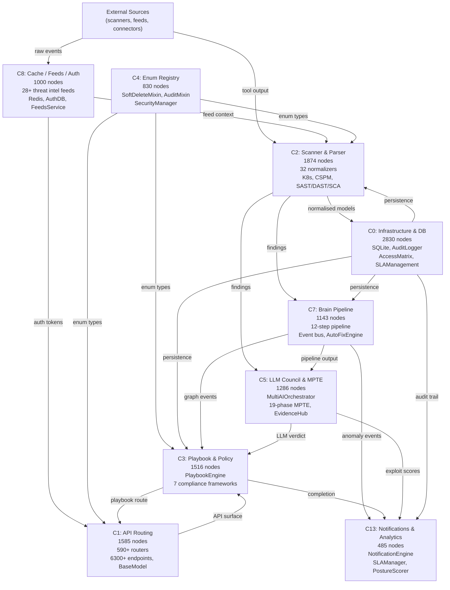

# ALDECI Architecture Diagrams — 10,000-Foot View

Generated 2026-04-27 from graphify community analysis.
Graph: 121,878 nodes / 416,234 edges / 1,706 communities detected.

---

## Subsystem Index

| File | Community | Nodes | Subsystem |
|------|-----------|-------|-----------|
| [community0_infrastructure_2026-04-27.md](community0_infrastructure_2026-04-27.md) | 0 | 2830 | Infrastructure & Database Layer |
| [community2_scanner_parser_2026-04-27.md](community2_scanner_parser_2026-04-27.md) | 2 | 1874 | Scanner & Parser Subsystem |
| [community1_api_routing_2026-04-27.md](community1_api_routing_2026-04-27.md) | 1 | 1585 | API Routing & Schema Layer |
| [community3_playbook_policy_2026-04-27.md](community3_playbook_policy_2026-04-27.md) | 3 | 1516 | Playbook & Policy Engine |
| [community5_llm_pentest_2026-04-27.md](community5_llm_pentest_2026-04-27.md) | 5 | 1286 | LLM Council & Micro-PenTest Engine (MPTE) |
| [community7_brain_pipeline_2026-04-27.md](community7_brain_pipeline_2026-04-27.md) | 7 | 1143 | Brain Pipeline & Event Bus |
| [community8_cache_feeds_2026-04-27.md](community8_cache_feeds_2026-04-27.md) | 8 | 1000 | Cache, Feeds & Auth Layer |
| [community4_enum_models_2026-04-27.md](community4_enum_models_2026-04-27.md) | 4 | 830 | Enum Registry & Domain Models |
| [community13_notifications_analytics_2026-04-27.md](community13_notifications_analytics_2026-04-27.md) | 13 | 485 | Notifications, SLA & Analytics |

---

## 10,000-Foot System Map

---

## Key Architectural Observations

**God nodes by degree (cross-cutting concerns):**
- `.execute()` (degree 5094, C0) — all DB writes funnel here
- `.get()` (degree 3522, C2) — JSON/dict transforms dominate scanner parsing
- `BaseModel` (degree 3149, C1) — Pydantic v2 is the API contract root
- `str` (degree 5082, C3) — string-key dispatch drives playbook step routing
- `Enum` (degree 840, C4) — all domain types inherit from this single root

**Dominant cross-community coupling (top 5 by edge count):**
1. C0 ↔ C2: 1982 edges — infrastructure is the write sink for every scanner
2. C1 ↔ C3: 959 edges — API layer and policy engine are tightly co-evolved
3. C2 ↔ C7: 675 edges — scanner output is the primary Brain Pipeline feed
4. C0 ↔ C3: 644 edges — playbook state is the most-persisted domain object
5. C2 ↔ C5: 549 edges — every finding is LLM-triaged

**Architectural pattern:** ALDECI follows a hub-and-spoke model where Community 0 (Infrastructure) is the universal persistence sink, Community 2 (Scanner) is the primary data producer, and Communities 5/7 (LLM + Brain Pipeline) are the enrichment pipeline sitting between raw findings and actionable output. Community 1 (API Routing) is the only consumer-facing layer — it delegates everything downward and never owns business logic.

---

## Communities Not Diagrammed (node count reference)

| Community | Nodes | Likely domain |
|-----------|-------|---------------|
| 6 | 528 | Router utilities (to_dict, _generate_id, _now, audit_router) |
| 10 | 326 | Secondary analytics |
| 11 | 370 | Extended engine integrations |
| 12 | ~207 (by cross-edge) | Correlation / ML analytics |
| 14 | 444 | Additional API modules |
| 19 | 338 | ML / extended LLM analytics |
| 21 | 352 | Graph analytics extensions |
