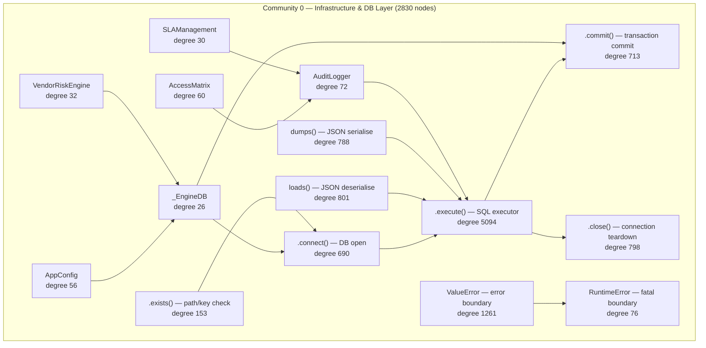

# Community 0 — Infrastructure & Database Layer

**Graphify community:** 0 | **Nodes:** 2830 | **Status:** Largest community in the graph

## Role in ALDECI

Community 0 is the shared infrastructure backbone. It owns every SQLite persistence primitive, the universal audit logger, access-control matrix, vendor-risk scoring, and SLA management. It is the foundation every other subsystem writes to — no engine can persist state without passing through this layer's `.execute()`, `.connect()`, `.commit()`, and `.close()` patterns.

ALDECI feature powered: multi-tenant data isolation, audit trails, API-key enforcement, SLA breach alerting, vendor scorecard persistence.

## Architecture Diagram

## Cross-Community Edges

| Neighbour Community | Edge Count | Nature of coupling |
|---------------------|------------|--------------------|
| Community 2 (Scanner/Parser) | 1982 | Scanner results written to shared DB primitives |
| Community 3 (Playbook/Policy) | 644 | Playbook state persisted via _EngineDB |
| Community 5 (LLM/PenTest) | 486 | LLM provider results stored; MPTE findings committed |
| Community 10 | 485 | Secondary analytics write path |
| Community 4 (Enum/Models) | 379 | Enum types resolved against DB schema |
| Community 7 (Brain Pipeline) | 371 | BrainPipeline checkpoints written here |
| Community 11 | 343 | Supplementary engine persistence |
| Community 8 (Cache/Feeds) | 292 | Cache invalidation and feed state |
| Community 13 (Notifications) | 263 | SLA breach events emitted to NotificationEngine |
