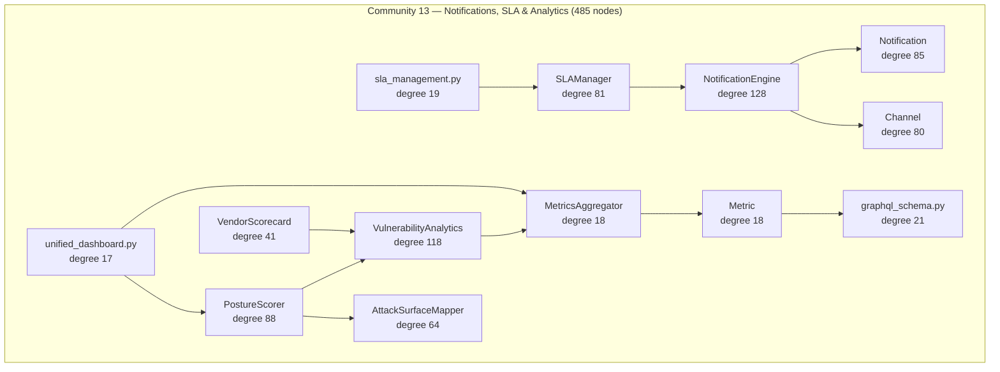

# Community 13 — Notifications, SLA & Analytics

**Graphify community:** 13 | **Nodes:** 485 | **Status:** Tenth-largest community

## Role in ALDECI

Community 13 is the observability and alerting layer. `NotificationEngine` (degree 128) dispatches alerts across `Channel` types (Slack, PagerDuty, email, webhook). `VulnerabilityAnalytics` (degree 118) aggregates finding trends over time. `PostureScorer` (degree 88) computes rolling security posture scores per tenant. `SLAManager` (degree 81) tracks breach risk against configured SLA thresholds and escalates via `NotificationEngine`. `AttackSurfaceMapper` (degree 64) continuously recomputes exposed attack surface from scanner/pipeline data. `VendorScorecard` (degree 41) aggregates vendor risk scores for executive dashboards. `MetricsAggregator` and `Metric` (degree 18 each) feed the unified dashboard and GraphQL endpoint.

ALDECI feature powered: real-time SLA breach alerting, vulnerability trend analytics, posture scoring, attack surface mapping, vendor scorecards, unified dashboard, GraphQL metrics API.

## Architecture Diagram

## Cross-Community Edges

| Neighbour Community | Edge Count | Nature of coupling |
|---------------------|------------|--------------------|
| Community 0 (Infrastructure) | 263 | SLA breach events logged via AuditLogger; scores persisted to _EngineDB |
| Community 2 (Scanner/Parser) | 130 | High-severity findings drive NotificationEngine triggers |
| Community 3 (Playbook/Policy) | 80 | Playbook completion updates SLA timers |
| Community 7 (Brain Pipeline) | 54 (via C21) | BrainPipeline outputs feed VulnerabilityAnalytics |
| Community 5 (LLM/PenTest) | 83 (via C19) | MPTE exploit results feed PostureScorer |
