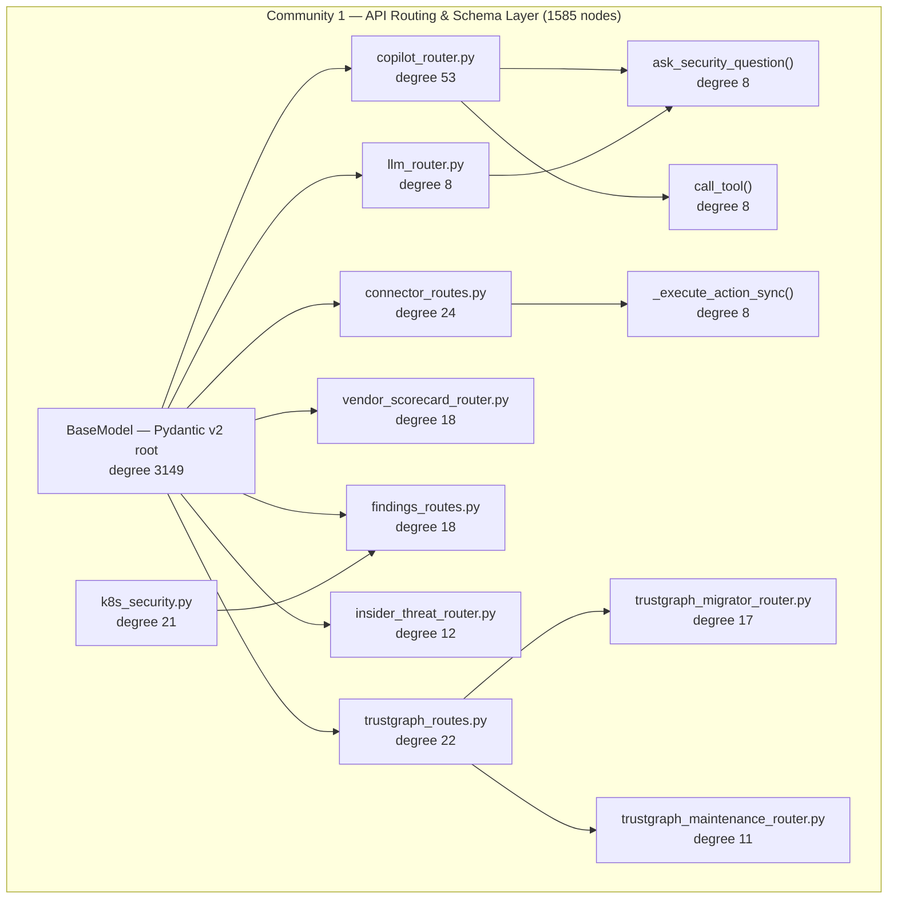

# Community 1 — API Routing & Schema Layer

**Graphify community:** 1 | **Nodes:** 1585 | **Status:** Third-largest community

## Role in ALDECI

Community 1 is the FastAPI surface layer. The dominant hub is `BaseModel` (Pydantic v2), which anchors every request/response schema in the system. Around it cluster the 590+ `*_router.py` files that mount to FastAPI's `create_app()`. Key routers include `copilot_router.py`, `connector_routes.py`, `trustgraph_routes.py`, `llm_router.py`, and `insider_threat_router.py`. This community represents the API contract — the set of endpoints 30 personas interact with.

ALDECI feature powered: 6300+ mounted API routes, RBAC enforcement, connector management, TrustGraph API, copilot AI assistant surface.

## Architecture Diagram

## Cross-Community Edges

| Neighbour Community | Edge Count | Nature of coupling |
|---------------------|------------|--------------------|
| Community 3 (Playbook/Policy) | 959 | Policy/playbook schemas are Pydantic BaseModels routed via C1 |
| Community 6 (Router Utilities) | 217 | Shared helper functions (.to_dict, _generate_id, _now) |
| Community 4 (Enum/Models) | 188 | Enum types referenced in request/response schemas |
| Community 9 | 71 | Supplementary schema definitions |
| Community 20 | 69 | Extended router mounts |
| Community 17 | 61 | Additional API surface modules |
| Community 0 (Infrastructure) | 87 | Auth DB queries for API key validation |
