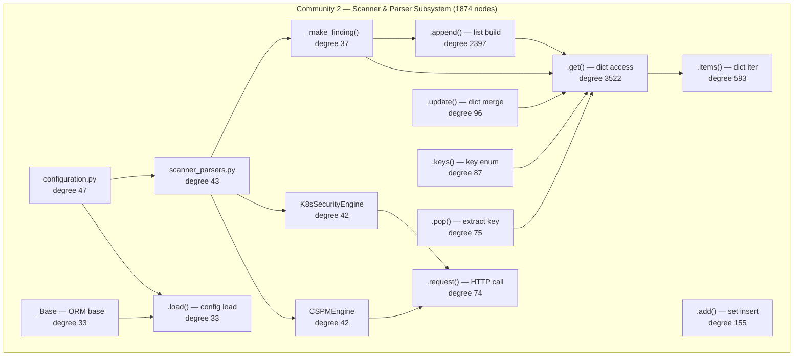

# Community 2 — Scanner & Parser Subsystem

**Graphify community:** 2 | **Nodes:** 1874 | **Status:** Second-largest community

## Role in ALDECI

Community 2 owns the ingestion and normalisation plane. It contains the 32 scanner normaliser implementations, K8s security checks, CSPM posture assessment, and the `_make_finding()` factory that converts raw tool output into ALDECI's unified finding format. The `configuration.py` and `scanner_parsers.py` hubs act as registries — every new scanner plugs in here. All dict/list manipulation primitives (`.get()`, `.append()`, `.items()`) that dominate this community reflect the heavy JSON-to-finding transformation workload.

ALDECI feature powered: SAST, DAST, SCA, container security, K8s posture, CSPM cloud posture, 32-normaliser pipeline.

## Architecture Diagram

## Cross-Community Edges

| Neighbour Community | Edge Count | Nature of coupling |
|---------------------|------------|--------------------|
| Community 0 (Infrastructure) | 1982 | All scanner DB writes route through C0 SQL primitives |
| Community 7 (Brain Pipeline) | 675 | Findings emitted to BrainPipeline for enrichment |
| Community 5 (LLM/PenTest) | 549 | Scanner findings trigger LLM triage/MPTE correlation |
| Community 3 (Playbook/Policy) | 476 | Policy engine consumes normalised findings |
| Community 8 (Cache/Feeds) | 476 | Feed data drives scanner enrichment |
| Community 4 (Enum/Models) | 311 | Finding types resolved against enum registry |
| Community 12 | 207 | Secondary analytics correlation |
| Community 11 | 193 | Extended engine integrations |
| Community 15 | 185 | Supplementary parser hooks |
| Community 13 (Notifications) | 130 | High-severity findings trigger alerts |
