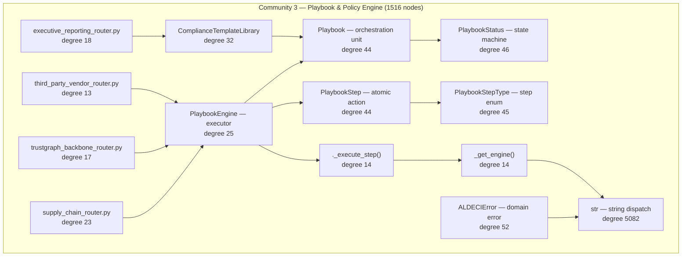

# Community 3 — Playbook & Policy Engine

**Graphify community:** 3 | **Nodes:** 1516 | **Status:** Fourth-largest community

## Role in ALDECI

Community 3 is the orchestration and compliance-policy layer. The dominant types — `Playbook`, `PlaybookStep`, `PlaybookStatus`, `PlaybookStepType`, and `PlaybookEngine` — implement ALDECI's 9-phase automated remediation playbooks. `ComplianceTemplateLibrary` anchors the 7 compliance frameworks (SOC2, ISO27001, PCI-DSS, HIPAA, NIST, CIS, GDPR). Routers like `supply_chain_router.py`, `executive_reporting_router.py`, and `trustgraph_backbone_router.py` expose these capabilities externally. The `str` god-node (degree 5082) reflects the heavy string-key dispatch pattern used throughout playbook step resolution.

ALDECI feature powered: automated remediation playbooks, compliance framework enforcement, executive reporting, supply-chain risk policy, TrustGraph backbone policy broadcasting.

## Architecture Diagram

## Cross-Community Edges

| Neighbour Community | Edge Count | Nature of coupling |
|---------------------|------------|--------------------|
| Community 1 (API Routing) | 959 | Playbook models are Pydantic BaseModels; routers mount here |
| Community 0 (Infrastructure) | 644 | Playbook state persisted to _EngineDB / AuditLogger |
| Community 2 (Scanner/Parser) | 476 | Normalised findings trigger playbook execution |
| Community 4 (Enum/Models) | 223 | PlaybookStatus / StepType resolved from Enum base |
| Community 7 (Brain Pipeline) | 161 | BrainPipeline step outputs feed playbook decisions |
| Community 8 (Cache/Feeds) | 145 | Threat feed signals escalate playbook severity |
| Community 5 (LLM/PenTest) | 122 | LLM verdict selects playbook branch |
| Community 6 (Router Utils) | 102 | Shared _generate_id / _now helpers |
| Community 13 (Notifications) | 80 | Playbook completion triggers SLA/notification events |
| Community 10 | 89 | Analytics consume playbook execution metrics |
