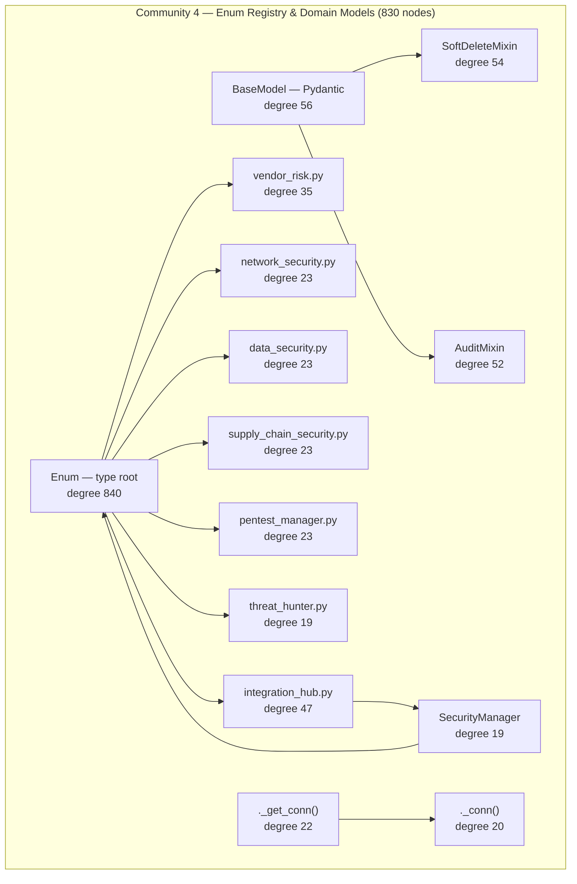

# Community 4 — Enum Registry & Domain Models

**Graphify community:** 4 | **Nodes:** 830 | **Status:** Eighth-largest community

## Role in ALDECI

Community 4 is the shared type-system layer. The `Enum` god-node (degree 840) anchors every security-domain enumeration — finding severity, risk level, connector type, integration status, network zone, supply-chain tier, and more. `SoftDeleteMixin` and `AuditMixin` are the two ORM mixins attached to every persistent model, enforcing soft-delete semantics and automatic audit timestamps. The file cluster (`integration_hub.py`, `vendor_risk.py`, `network_security.py`, `data_security.py`, `supply_chain_security.py`, `pentest_manager.py`, `threat_hunter.py`) each contribute their domain-specific enum sets. `SecurityManager` (degree 19) is the unified RBAC policy enforcer that references these enums.

ALDECI feature powered: type-safe domain model for all 30 personas, RBAC enforcement, integration hub type registry, soft-delete audit trail on all models.

## Architecture Diagram

## Cross-Community Edges

| Neighbour Community | Edge Count | Nature of coupling |
|---------------------|------------|--------------------|
| Community 0 (Infrastructure) | 379 | Enum types resolved against DB schema; SoftDeleteMixin writes via _EngineDB |
| Community 2 (Scanner/Parser) | 311 | Finding types, severity enums consumed by scanner normaliser |
| Community 3 (Playbook/Policy) | 223 | PlaybookStatus / StepType inherit from Enum base here |
| Community 1 (API Routing) | 188 | Request/response schemas reference these enums |
| Community 7 (Brain Pipeline) | 62 | Entity/edge taxonomy enums (EntityType, EdgeType) sourced here |
| Community 8 (Cache/Feeds) | 96 | Feed category and severity enums |
