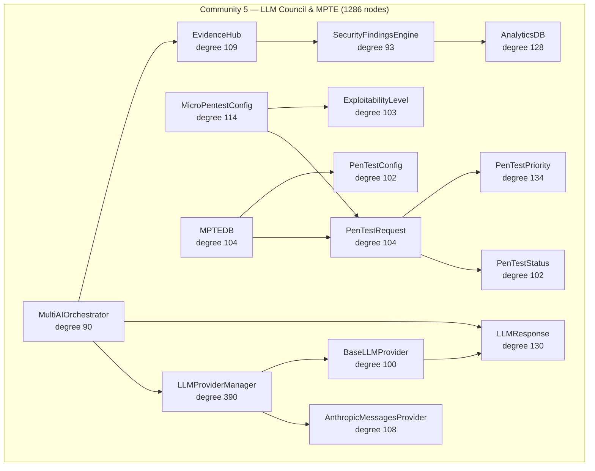

# Community 5 — LLM Council & Micro-PenTest Engine (MPTE)

**Graphify community:** 5 | **Nodes:** 1286 | **Status:** Fifth-largest community

## Role in ALDECI

Community 5 is the AI decision and offensive-security layer. `LLMProviderManager` (degree 390) brokers multi-model consensus across Anthropic, OpenRouter/Qwen, and fallback providers. `AnthropicMessagesProvider` and `BaseLLMProvider` form the provider abstraction. `MultiAIOrchestrator` runs the Karpathy-style 4-model consensus voting. On the offensive side, `MicroPentestConfig`, `PenTestRequest`, `PenTestStatus`, `PenTestPriority`, and `ExploitabilityLevel` implement ALDECI's 19-phase MPTE framework. `EvidenceHub` stores quantum-safe attestation evidence. `AnalyticsDB` and `SecurityFindingsEngine` bridge AI verdicts back into persistent findings.

ALDECI feature powered: multi-LLM consensus (4 free models + Opus escalation), 19-phase MPTE, DPO self-learning loop (5196 pairs), evidence hub, exploitability scoring.

## Architecture Diagram

## Cross-Community Edges

| Neighbour Community | Edge Count | Nature of coupling |
|---------------------|------------|--------------------|
| Community 2 (Scanner/Parser) | 549 | Scanner findings consumed for LLM triage + MPTE correlation |
| Community 7 (Brain Pipeline) | 321 | LLM verdicts fed into 12-step BrainPipeline |
| Community 0 (Infrastructure) | 486 | LLM response persistence + MPTE state in _EngineDB |
| Community 8 (Cache/Feeds) | 125 | Threat feed context enriches LLM prompts |
| Community 3 (Playbook/Policy) | 122 | LLM verdict selects remediation playbook branch |
| Community 19 | 83 | Extended ML analytics outputs |
| Community 11 | 73 | Additional LLM provider hooks |
