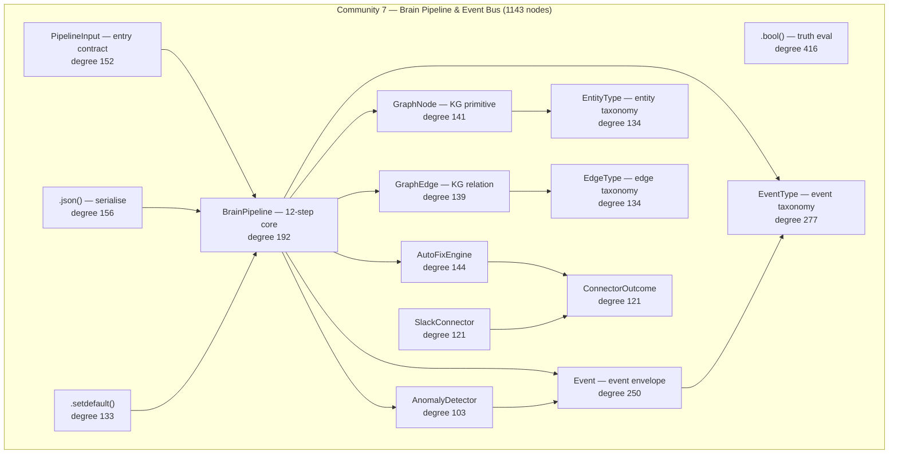

# Community 7 — Brain Pipeline & Event Bus

**Graphify community:** 7 | **Nodes:** 1143 | **Status:** Sixth-largest community

## Role in ALDECI

Community 7 is the streaming orchestration core. `BrainPipeline` (degree 192) implements the 12-step AI enrichment pipeline from raw findings to actionable intelligence. `PipelineInput` defines what enters; `GraphNode` / `GraphEdge` / `EntityType` / `EdgeType` define the knowledge-graph primitives that the pipeline constructs and emits to TrustGraph. `EventType` and `Event` (degrees 277 / 250) implement the event bus used by all 378+ TrustGraph emit-sites. `AutoFixEngine` (degree 144) attaches automated remediation directly to pipeline output. `SlackConnector` (degree 121) and `ConnectorOutcome` (degree 121) represent the bidirectional connector framework's output layer. `AnomalyDetector` (degree 103) runs streaming ML anomaly detection on pipeline telemetry.

ALDECI feature powered: 12-step Brain Pipeline, TrustGraph event bus (378+ emit-sites), AutoFix engine, bidirectional connector outcomes, streaming anomaly detection.

## Architecture Diagram

## Cross-Community Edges

| Neighbour Community | Edge Count | Nature of coupling |
|---------------------|------------|--------------------|
| Community 2 (Scanner/Parser) | 675 | Normalised findings enter BrainPipeline as PipelineInput |
| Community 5 (LLM/PenTest) | 321 | LLM verdicts enrich pipeline steps 7-10 |
| Community 0 (Infrastructure) | 371 | Pipeline checkpoints written to _EngineDB |
| Community 8 (Cache/Feeds) | 125 | Feed signals injected at pipeline step 2 |
| Community 3 (Playbook/Policy) | 161 | Pipeline output triggers PlaybookEngine selection |
| Community 21 | 54 | Extended graph analytics outputs |
| Community 4 (Enum/Models) | 62 | Entity/edge taxonomy enums sourced from C4 |
