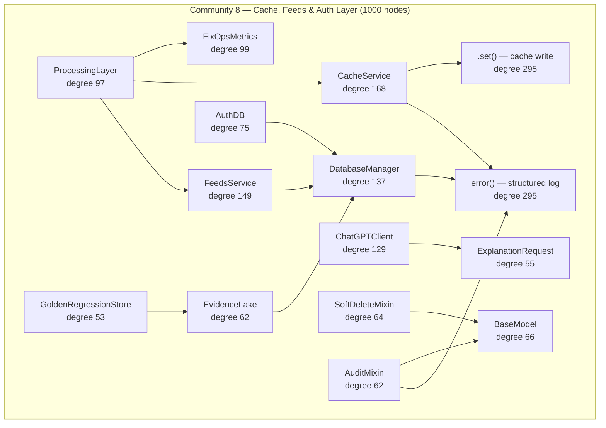

# Community 8 — Cache, Feeds & Auth Layer

**Graphify community:** 8 | **Nodes:** 1000 | **Status:** Seventh-largest community

## Role in ALDECI

Community 8 is the operational support layer: caching, threat intelligence ingestion, authentication persistence, and observability. `CacheService` (degree 168) provides the Redis-backed response cache shared by all API routers. `FeedsService` (degree 149) manages the 28+ threat intelligence feed subscriptions (NVD, EPSS, OSV, Shodan, VirusTotal, etc.). `DatabaseManager` (degree 137) is the top-level connection-pool manager referenced by higher-level engines. `ChatGPTClient` (degree 129) bridges to OpenAI-compatible endpoints. `AuthDB` (degree 75) persists API keys, tokens, and RBAC assignments. `FixOpsMetrics` (degree 99) and `ProcessingLayer` (degree 97) instrument the processing pipeline for Prometheus scraping. `EvidenceLake` (degree 62) and `GoldenRegressionStore` (degree 53) support the evidence chain and regression testing framework.

ALDECI feature powered: 28+ threat intel feeds, Redis caching, Prometheus metrics, authentication database, evidence lake, ChatGPT/OpenAI bridge.

## Architecture Diagram

## Cross-Community Edges

| Neighbour Community | Edge Count | Nature of coupling |
|---------------------|------------|--------------------|
| Community 2 (Scanner/Parser) | 476 | Feed data enriches scanner context; cache accelerates repeat scans |
| Community 0 (Infrastructure) | 292 | Cache invalidation hooks into _EngineDB; AuthDB shares AuditLogger |
| Community 7 (Brain Pipeline) | 125 | Feed signals injected at pipeline ingestion step |
| Community 5 (LLM/PenTest) | 125 | Threat intel context enriches LLM prompts |
| Community 3 (Playbook/Policy) | 145 | Feed severity triggers playbook escalation |
| Community 4 (Enum/Models) | 96 | Feed category enums sourced from C4 |
| Community 19 | 88 | Extended analytics pipeline integrations |
