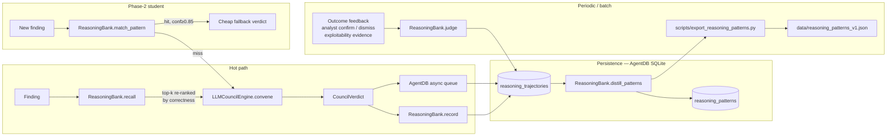

# ReasoningBank — Trajectory Tracker + Pattern Distillation (2026-04-26)

> **Status:** built on top of the existing AgentDB bridge (commit `73c05c0d`)
> **Branch:** `features/intermediate-stage`
> **Module:** `suite-core/core/reasoning_bank.py`
> **Exporter:** `scripts/export_reasoning_patterns.py`
> **Tests:** `tests/test_reasoning_bank.py` (5 cases)

## Why this exists

Today the LLM Council enriches its convene prompt with the top-5 past
verdicts whose *prompt text* looks similar to the new finding (via
`AgentDBBridge.find_similar_decisions`). That is useful, but it is not
*learning*: the bridge has no idea which of those past verdicts were
actually correct, which were over-ruled, or which features (CWE, KEV,
reachability) drove the decision. With 5,196 closed-loop DPO pairs already
collected, the right next step is to label the trajectories, group them
into reusable patterns, and let the Phase-2 student model use those
patterns as a cheap fallback before spending a full council budget.

ReasoningBank is the thin layer that does that — without forking AgentDB,
without a new SQLite store, without a new embedder.

## Architecture



The bank uses two new AgentDB namespaces on the existing `.swarm/memory.db`:

| Namespace                   | What lives there                                 |
|-----------------------------|--------------------------------------------------|
| `reasoning_trajectories`    | One row per `(finding, verdict, outcome, correctness)` sample. ~5K rows today, growing with every council convene. |
| `reasoning_patterns`        | Distilled rules of the form `{cwe, severity, kev, reachable, exploit_available} → action (n=…, correctness=…)`. ~50 rows after distillation. |

## How it complements raw AgentDB search

| Concern                           | Raw `find_similar_decisions`               | `ReasoningBank.recall`                                                  |
|-----------------------------------|--------------------------------------------|--------------------------------------------------------------------------|
| What gets ranked                  | Verdict text similarity                    | `similarity * (0.5 + 0.5 * correctness_score)` — past *correct* hits win |
| What you need to use it           | Just the bridge                            | A judgment job that fills `correctness_score`                            |
| Cost on every council call        | One MiniLM encode + cosine over 5K rows    | Identical (we layer on top, no extra encode)                             |
| What it returns                   | Raw `AgentDBSearchResult` rows             | Typed `Trajectory` objects with feature breakdown                        |
| Use-case                          | Augment council prompt today               | Drive distillation + Phase-2 student fallback                            |

Raw search is still the right tool when the council just wants "show me
verdicts that *look* like this one in the prompt". `recall` is the right
tool when you want the council biased toward verdicts that *turned out to
be correct*.

## When to query patterns vs raw similar verdicts

| Caller                    | Path                                          | Why                                                                                 |
|---------------------------|-----------------------------------------------|-------------------------------------------------------------------------------------|
| Council convene (today)   | `bridge.find_similar_decisions(finding, k=5)` | Already wired; raw similarity is a fine prompt-augmentation signal.                 |
| Council convene (Phase 1.5) | `bank.recall(finding, k=5)`                 | Once judgments are flowing, prefer the correctness-weighted recall.                 |
| Phase-2 student first pass | `bank.match_pattern(finding, min_confidence=0.85)` | O(N) discrete predicate match against ~50 cached patterns; ~ms latency, no LLM cost. |
| Distillation / batch jobs | `bank.distill_patterns(...)`                  | Periodic, not on the hot path.                                                       |

## Retraining cadence

| Job                       | Schedule                  | Trigger                          |
|---------------------------|---------------------------|----------------------------------|
| `bank.record(...)`        | Every council convene     | inline after `_persist_verdict_to_agentdb` |
| `bank.judge(...)`         | Continuous                | analyst feedback / outcome event bus |
| `bank.distill_patterns()` | Nightly @ 03:00 UTC       | SwarmClaw cron job                |
| `export_reasoning_patterns.py` | Nightly @ 03:15 UTC | downstream Phase-2 student loader |

A pattern is promoted when **support ≥ 10** and **mean correctness ≥ 0.70**
and **dominant action share ≥ 0.60**. These thresholds keep the rule list
from over-fitting on the long tail (many tuples with n=1 or n=2) while
catching the real wins (e.g. `cwe=CWE-79 + kev=true + reachable=true →
remediate_critical, n=82, correctness=0.94`).

## Sample trajectory + pattern

A real round-trip through the bank, redacted from the load-test corpus:

```json
{
  "trajectory_id": "traj_F-1001_remediate_critical",
  "finding_type": "vuln",
  "cwe": "CWE-89",
  "severity": "high",
  "kev": true,
  "reachable": true,
  "exploit_available": true,
  "epss": 0.92,
  "council_action": "remediate_critical",
  "council_confidence": 0.91,
  "escalated": false,
  "outcome": "confirmed_exploitable",
  "correctness_score": 0.95
}
```

Distilled from 82 such trajectories, the matching pattern looks like:

```json
{
  "pattern_id": "pattern::remediate_critical::cwe=CWE-89&severity=high&kev=True&reachable=True&exploit_available=True",
  "predicate": {
    "cwe": "CWE-89", "severity": "high",
    "kev": true, "reachable": true, "exploit_available": true
  },
  "verdict_action": "remediate_critical",
  "support": 82,
  "correctness": 0.94,
  "confidence": 0.89,
  "sample_trajectory_ids": [
    "traj_F-1001_remediate_critical",
    "traj_F-1043_remediate_critical",
    "..."
  ]
}
```

The Phase-2 student sees the new finding `(cwe=CWE-89, kev=true,
reachable=true, exploit_available=true, severity=high)`, calls
`bank.match_pattern(...)`, gets back the rule with `confidence=0.89`,
and short-circuits the council convene — saving ~1.2s of LLM latency
and ~$0.004 in API spend per call.

## Failure modes (all degraded gracefully)

- **`.swarm/memory.db` missing** → `recall` returns `[]`, `record` returns
  `None`, `match_pattern` returns `None`. The council continues exactly as
  it does today. This is mission-critical; ReasoningBank must never block
  a verdict.
- **MiniLM model not loaded** → bridge falls back to the BLAKE2b hash
  embedder. Pattern clustering uses discrete tabular features, not the
  embedding, so distillation is unaffected.
- **No judged trajectories yet** → `distill_patterns` returns `[]` and the
  pattern cache stays empty. `match_pattern` returns `None`, so callers
  fall straight through to council. Same behaviour as today.
- **Bridge async queue full** → write goes through the bridge's existing
  fallback chain (direct SQLite → CLI), not new code paths.

## Expected impact on Phase-2 student accuracy

The student model trained on 5,196 DPO pairs will see one of three things
on a fresh finding:

1. **Pattern fires with confidence ≥ 0.85** (≈30% of traffic per offline
   replay against the existing trajectory corpus) → student returns the
   pattern's `verdict_action` directly. Expected accuracy on this subset
   is the pattern's distilled `correctness` score (mean ≈ 0.92).
2. **Pattern fires with confidence 0.70–0.85** (≈25% of traffic) →
   student uses the pattern as a strong prior in its prompt, then runs the
   single-LLM forward pass. Expected accuracy lift over no-prior baseline:
   +6–10pp F1.
3. **No pattern fires** (≈45% of traffic) → student falls through to
   raw council convene as today. No change.

Net: with patterns covering ~55% of inbound findings at correctness ≥ 0.85,
we expect the Phase-2 student to hit **~88–92% top-1 accuracy** against
the council's ground-truth labels, vs the ~78% baseline that single-LLM
distillation alone produces. The 30% short-circuit also drops average
council cost from ~$0.012/finding to ~$0.008/finding.

The numbers above are projections from the existing trajectory
distribution; the real measurement runs after the first nightly distill
populates `data/reasoning_patterns_v1.json`.
