# Reference Architecture Whitepaper — ALdeci CTEM+ Platform

> **Audience**: Industry analysts (Gartner, Forrester, IDC), enterprise architects, CISO offices
> **Date**: 2026-04-26 | **Length target**: ~2,000 words
> **Branch**: `features/intermediate-stage` | **Source-of-truth**: `docs/CTEM_PLUS_IDENTITY.md` v3.0

---

## Abstract

ALdeci is a CTEM+ (Continuous Threat Exposure Management, plus AI-Native Decision Intelligence) platform whose architecture rejects the prevailing "single-LLM, single-mode, single-source" pattern of incumbent ASPM/CSPM tools. This paper documents the four pillars of the architecture — TrustGraph as a second brain, the multi-LLM Council, the 12-step Brain Pipeline, and the MCP Gateway — and explains the closed-loop self-learning system that makes ALdeci the first ASPM platform to improve from production analyst verdicts in real time.

---

## 1. Architecture Overview

```mermaid
flowchart LR
  subgraph IN[Inputs]
    SCN[32 Scanner Parsers]
    NTV[8 Native Engines]
    CON[13 PULL + 7 Bidirectional Connectors]
    FED[28+ Threat-Intel Feeds]
  end

  subgraph BRN[12-Step Brain Pipeline]
    P1[1. Connect] --> P2[2. Normalize] --> P3[3. Resolve Identity] --> P4[4. Deduplicate] --> P5[5. Build Graph]
    P5 --> P6[6. Enrich] --> P7[7. Score Risk] --> P8[8. Apply Policy]
    P8 --> P9[9. AI Consensus]
    P9 --> P10[10. Verify Exploitability]
    P10 --> P11[11. Remediate]
    P11 --> P12[12. Generate Evidence]
  end

  subgraph TG[TrustGraph - Second Brain]
    KS[Knowledge Store - 119k nodes / 425k edges]
    KC[5 Knowledge Cores]
    GR[GraphRAG]
  end

  subgraph LLM[LLM Council - 5 Members, 3 Stages, 85% Consensus]
    L1[Member 1: Conservative]
    L2[Member 2: Aggressive]
    L3[Member 3: Specialist]
    L4[Member 4: Devil's Advocate]
    L5[Member 5: Synthesis]
  end

  subgraph LL[Closed-Loop Learning]
    SUB[Subscriber: llm_learning_loop.py]
    DB[(learning_signals.db - 703 DPO pairs)]
    DST[Phase 2 Distill: dataset curator + training + inference router]
  end

  subgraph OUT[Outputs]
    ISS[Single Issues Queue]
    AF[AutoFix - 10 fix types, confidence-gated]
    EV[Quantum-Secure Evidence Vault - FIPS 204 ML-DSA]
    MCP[MCP Gateway - 650+ tools]
  end

  IN --> BRN
  BRN <--> TG
  P9 <--> LLM
  P10 --> AF
  P12 --> EV
  EV --> SUB --> DB --> DST
  DST -.distilled checkpoint.-> LLM
  BRN --> ISS
  TG --> MCP
```

## 2. The Unified-Platform Thesis

The ASPM/CTEM market has fragmented into seven adjacent silos: SAST/SCA (Snyk, Sonatype), CSPM/CNAPP (Wiz, Prisma), CTEM/EASM (XM Cyber, Tenable One), Risk Graph (Apiiro), unified-scanner UX (Aikido), and emerging AI-SPM. Customers running 2,000+ engineers typically spend $500K–$1M annually maintaining four to six of these tools, each with its own data model, its own consensus mechanism (usually none), and its own evidence chain. The integration burden is the moat — each vendor benefits from the cost of switching away.

ALdeci's unified-platform thesis: every category in this market shares the same five primitives — *ingest*, *normalize*, *correlate*, *decide*, *prove*. A single substrate that handles all five eliminates the integration tax. The 12-step Brain Pipeline (`suite-core/core/brain_pipeline.py`) is that substrate. Whether a finding originates in a Snyk webhook, a Wiz Cloud Issue, or ALdeci's own native SAST engine, it enters the pipeline at step 1 and emerges at step 12 with the same shape: a risk-scored, exploit-verified, ownership-assigned, remediation-ready case with cryptographic evidence.

This is what permits ALdeci's "Switzerland positioning" — *day-one*, ALdeci ingests the customer's existing Snyk/Wiz/Tenable output and adds value by deduplicating, prioritizing with consensus, and verifying exploitability. *Day-N*, the customer's contracts with point vendors expire and ALdeci's eight native engines (`docs/CTEM_PLUS_IDENTITY.md` §Native) silently take over coverage. The platform feels the same throughout — no rip-and-replace event.

## 3. Why Agents Need a Second Brain (TrustGraph)

LLMs hallucinate. The cost of an LLM hallucinating a security verdict — "this CVE-2024-X is unreachable, deprioritize" — is unbounded. ALdeci's solution is to deny the LLM Council a private worldview. Every prompt sent into the Council is grounded in TrustGraph (`suite-core/core/trustgraph_backbone.py`, `graphrag_engine.py`).

TrustGraph stores **119k nodes and 425k edges** representing assets, components, dependencies, controls, threats, attack paths, and findings. Five **Knowledge Cores** segment this graph by domain (security, compliance, code, runtime, threat-intel). When the Council is asked to vote on a finding's severity, the question is not "what do you think?" but "given this subgraph (the affected component, its blast radius, its CISA-KEV/EPSS context, the attack paths it sits on), what is your verdict?"

This grounding is mechanically enforced by the GraphRAG layer: the Council literally cannot answer without a TrustGraph subgraph in its context window. If TrustGraph cannot find a relevant subgraph, the Council escalates to a human. The result is verifiable, auditable AI decisioning — every Council verdict ships with the exact subgraph that informed it, replayable for audit.

## 4. Why Council > Single Model

Most "AI security" products today wrap a single LLM (typically GPT-4 or Claude) behind a UI and call the output a recommendation. This pattern fails in adversarial settings: the model is biased toward its training distribution, and there is no observable failure mode if it is wrong. Worse, the customer cannot defend the verdict in an audit — "the AI said so" is not a SOC 2 control.

ALdeci's **5-member LLM Council** (`suite-core/core/llm_council.py`, `llm_consensus.py`) implements the Karpathy 3-stage debate architecture:

- **Stage 1 — Independent Verdict**: Each of the 5 members (with deliberately different system prompts and temperatures, optionally different model families) emits an independent verdict on the finding given the same TrustGraph-grounded context.
- **Stage 2 — Critique Round**: Members read each others' verdicts and produce critiques. A "devil's advocate" role is reserved for at least one member to produce a contrarian view.
- **Stage 3 — Synthesis**: A synthesis member integrates the critiques and produces a final verdict, which is then voted on. The Council emits a verdict only if **≥ 85% of members agree** after synthesis.

If consensus is not reached, the finding is escalated to the Issues queue with an explicit "AI dissent" tag and routed to a human reviewer. This makes ALdeci's AI verdicts *defensibly conservative* — the Council declines to decide rather than guess, which is the correct behavior in a security-of-record system.

## 5. Self-Learning Closed Loop

This is the architectural feature with no peer in the competitive set. When a human analyst reviews an AI-emitted verdict in the Issues queue and either confirms (thumbs-up) or overrides (thumbs-down with corrected verdict), `suite-core/core/llm_learning_loop.py` (commit `cbd01c4d`, ~430 LOC) intercepts the event and writes a **DPO (Direct Preference Optimization)** pair to `data/learning_signals.db`:

- **Chosen**: the verdict the human approved (or corrected to).
- **Rejected**: the verdict the Council emitted, if it was overridden.

As of commit `d326da7b`, **703 verdicts → 703 DPO pairs** have been collected from real fleet scans. Phase 2 — the distillation pipeline (`suite-core/core/llm_distill_router.py`, commit `4904309a`) — adds a **dataset curator**, a **training scaffold** (LoRA fine-tuning of the smaller Council members), and an **inference router** that switches the Council to the distilled checkpoints once a training round meets quality gates.

The closed loop means: every analyst hour spent reviewing an AI verdict in production *permanently improves* the model. After a few thousand DPO pairs, the customer-specific Council is materially better calibrated to that customer's risk appetite, code patterns, and policy stance than any generic model. This is a moat that compounds with usage — competitors shipping single-LLM wrappers cannot replicate it without rebuilding their stack.

No vendor in `docs/competitive_validation_2026-04-26.md` (Snyk, Apiiro, Aikido, Sonatype, Tenable, XM, Wiz) ships a production self-learning DPO loop today.

## 6. SCIF / FedRAMP-High Positioning

ALdeci is engineered for environments where the public internet does not exist and where every artifact must be cryptographically attestable.

- **Air-gap deployment**: Signed offline bundle (GAP-001), 2-machine deployment topology, offline CVE/EPSS/KEV bundles refreshed via sneakernet (GAP-002).
- **FIPS-140 mode**: `fips_compliance_mode_engine` (GAP-042) restricts crypto primitives to validated providers.
- **Quantum-secure evidence**: Every evidence record signed with FIPS 204 (ML-DSA) hybrid signatures, complementing classical ECDSA. Stored append-only WORM (`evidence_chain_engine`).
- **SLSA + in-toto + DSSE provenance** (GAP-018) on every artifact, so a defense prime can prove the build chain to its government customer.
- **NIST 800-53 control mapping**: Pre-built matrix in `docs/scif/nist_800-53_control_matrix_2026-04-26.csv`.
- **STIG-hardened deployment checklist**: `docs/scif/stig_hardening_checklist_2026-04-26.md`.
- **SSP + POA&M templates**: `docs/scif/SSP_aldeci_2026-04-26.md`, `docs/scif/POAM_aldeci_2026-04-26.md`.
- **Image signing**: cosign-signed container images shipped (commit `aba22ff`, *beast-mode(scif-stage1): cosign image signing — closes SCIF Stage 1 blocker #2*).

This stack is unmatched in the competitive set: only Sonatype SAGE and Tenable approach air-gap maturity, and neither ships post-quantum evidence.

## 7. OSS Substitutes — Defense Against Vendor-Hostage Scenarios

Enterprises increasingly demand an exit ramp from any single vendor — including ALdeci. The architecture is designed to support this:

- **Native engines wrap OSS**: `iac_scanner_engine.py` wraps Checkov/tfsec; `container_scanner.py` wraps Trivy/Grype/Dockle; `dast_scanner.py` wraps OWASP ZAP. If a customer disables ALdeci, they retain visibility into the underlying OSS.
- **Universal Finding Format (UFF)**: All findings normalize to a documented JSON schema. Customer can export the entire finding history at any time as UFF JSONL.
- **GraphRAG over open Neo4j-compatible substrate**: TrustGraph is portable; `trustgraph_migrator.py` exists for export.
- **Self-hosted LLM (vLLM)**: `vllm_autofix_adapter.py` permits the customer to host the entire Council on their own GPUs with their own models — no ALdeci-managed inference required.

This OSS-substitutability story is, in our experience, the most underrated trust-builder in CISO conversations.

## 8. MCP Gateway — Why ALdeci Is the Right Substrate for Agents

ALdeci's `suite-core/core/mcp_server.py` exposes the entire platform — every TrustGraph query, every Council vote, every AutoFix generation, every evidence emission — as a Model Context Protocol service with 650+ tools. This means an enterprise's internal AI agents (security copilots, dev-portal assistants, audit bots) can call ALdeci as a substrate rather than re-implement the underlying capabilities.

This is the AI-native enterprise architecture pattern Gartner is naming "Agent Platform." ALdeci is the only entrant in the ASPM/CTEM competitive set shipping it today.

## 9. Conclusion

The ALdeci reference architecture is best summarized as: **a graph-grounded, council-decided, self-learning, cryptographically-provable substrate for security exposure decisions.** Every word in that phrase points to a primitive missing from at least four of the seven competitors in the matrix. The architecture is not incremental; it is what the next decade of CTEM will look like, shipped in a self-hosted monorepo today.

---

*Footnoted citations throughout reference exact files in `DevOpsMadDog/Fixops` on branch `features/intermediate-stage`. Architecture diagram is rendered Mermaid; viewable in any Mermaid-capable Markdown reader.*
