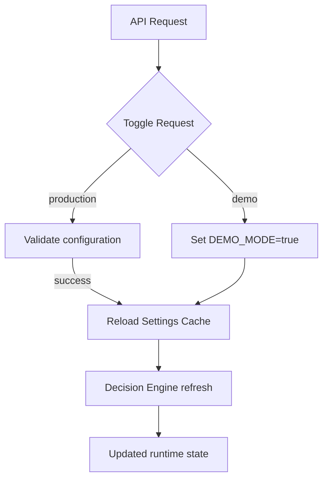

# FixOps Runtime Modes

This guide explains how the FixOps Blended Enterprise stack pivots between **demo** and **production** runtime modes after the refactor.

## Mode Overview

| Mode        | Description | Data Sources |
|-------------|-------------|--------------|
| Demo        | Ships with synthetic datasets for deterministic demos and unit tests. | Golden regression fixtures, synthetic decision contexts, in-memory cache. |
| Production  | Activates real integrations and external dependencies. | Jira, Confluence, Emergent LLM, pgvector, threat intel, Open Policy Agent. |

## Switching Modes

1. Call `POST /system-mode/toggle` with `{"target_mode": "demo"}` or `{"target_mode": "production"}`.
2. The API validates configuration through `Settings.missing_production_requirements()`.
3. When toggling succeeds, the process refreshes cached settings and re-initialises the decision engine with the new mode.

The API answers `400 Bad Request` if you attempt to enable production mode without fulfilling the minimum configuration. Supply `"force": true` to override this behaviour for dry-runs; the response marks `restart_required=true` while listing the missing prerequisites.

## Runtime Flow

## Production Checklist

| Requirement | Why it matters |
|-------------|----------------|
| `EMERGENT_LLM_KEY` | Enables the multi-LLM consensus engine. |
| `JIRA_*` | Provides business context enrichment for risk scoring. |
| `CONFLUENCE_*` | Pulls threat models into decision evidence. |
| `PGVECTOR_DSN` + `PGVECTOR_ENABLED` | Powers semantic retrieval over the evidence lake. |
| `THREAT_INTEL_API_KEY` | Streams live threat indicators for context-aware scoring. |
| `OPA_SERVER_URL` | Activates production policy enforcement via Open Policy Agent. |

Use `GET /system-mode/current` to inspect the current posture and missing requirements at any time.

## Related Modules

* `src/config/settings.py` — encapsulates runtime configuration and exposes helpers for readiness checks.
* `src/api/v1/system_mode.py` — FastAPI router responsible for mode queries and toggles.
* `src/services/decision_engine.py` — Reconfigures the decision engine when the runtime mode changes.
