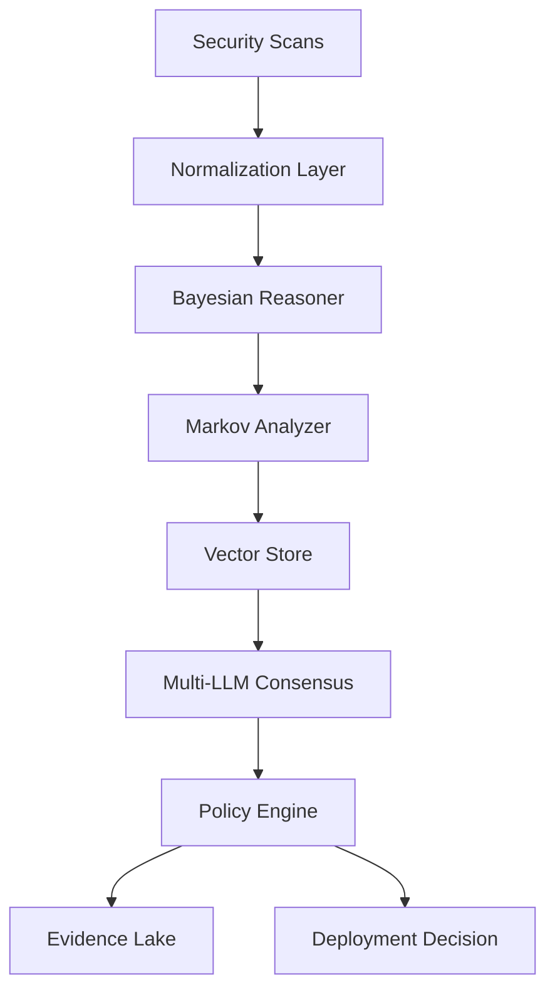

# FixOps Reference Architecture

The FixOps platform combines deterministic reasoning and multi-model intelligence to deliver production-ready deployment decisions.

## Core Pillars

- **Bayesian Risk Engine** – Calibrates historical incidents and current findings to weight evidence.
- **Markov Transition Matrix** – Tracks service state transitions and predicts failure likelihood.
- **Multi-LLM Consensus** – Synthesizes guidance from GPT-5, Claude, Gemini, and Emergent specialist models.
- **Policy Orchestration** – Enforces enterprise guardrails through Open Policy Agent rego bundles.
- **Evidence Lake** – Maintains immutable audit trails for seven-year retention.

## Data Flow

## Deployment Topology

- Kubernetes with multi-AZ node pools
- Horizontal pod autoscaling for API, consensus, and vector store workloads
- Redis or NATS for decision queueing
- PostgreSQL with point-in-time recovery for audit evidence
- Prometheus, Loki, and Grafana for observability

## High Availability Targets

| Tier | SLA | Notes |
|------|-----|-------|
| Decision API | 99.95% | Multi-region active/active |
| Evidence Lake | 99.9% | Cross-region replication |
| Policy Engine | 99.9% | Blue/green rollouts |
| Vector Store | 99.5% | Automatic sharding |

## Security Controls

- mTLS enforced across all services
- Hardware-backed secret storage (HSM or KMS)
- Continuous scanning for SBOM drift and CVEs
- Automated red-team exercises through synthetic adversarial testing

## Scaling Playbook

1. Enable dedicated GPU pool for complex consensus workloads.
2. Activate policy canary environments for progressive deployments.
3. Integrate ServiceNow/Jira connectors for closed-loop remediation.
4. Expand evidence lake retention to 10 years for regulated industries.

> The public portal ships with simulated telemetry. Connect to the FixOps API to activate real-time metrics and decisioning.
