# FixOps Platform Deep Reference

> Use this as the authoritative guide for onboarding, architecture reviews, compliance audits, and CI/CD dry runs. It extends the root README with diagrams, capability maps, and end-to-end validation recipes.

## Table of contents
- [Feature index & usage map](#feature-index--usage-map)
- [Executive summary](#executive-summary)
- [Orientation](#orientation)
- [Repository topology](#repository-topology)
- [Quick start (CLI & demo)](#quick-start-cli--demo)
- [Runtime architecture](#runtime-architecture)
- [Capability matrix](#capability-matrix)
- [End-to-end data flow](#end-to-end-data-flow)
- [Feature deep dives](#feature-deep-dives)
  - [SBOM normalisation & quality scoring](#sbom-normalisation--quality-scoring)
  - [Risk intelligence & FixOpsRisk](#risk-intelligence--fixopsrisk)
  - [Provenance attestations & signing](#provenance-attestations--signing)
  - [Provenance graph service](#provenance-graph-service)
  - [Reproducible build verification](#reproducible-build-verification)
  - [Evidence bundles & CI agent](#evidence-bundles--ci-agent)
  - [SSDLC lifecycle evaluation](#ssdlc-lifecycle-evaluation)
  - [Probabilistic forecasting, Markov & Bayesian analytics](#probabilistic-forecasting-markov--bayesian-analytics)
  - [Multi-LLM consensus](#multi-llm-consensus)
  - [Observability & demo stack](#observability--demo-stack)
  - [Security posture & compliance guardrails](#security-posture--compliance-guardrails)
- [CLI entry points](#cli-entry-points)
- [API surface](#api-surface)
- [CI/CD automation](#cicd-automation)
- [Setup & verification checklists](#setup--verification-checklists)
  - [Stage-by-stage CLI workflow](#stage-by-stage-cli-workflow)
- [Reference documents](#reference-documents)

## Feature index & usage map
The table below links every FixOps capability to its primary use cases, when teams should prefer the CLI versus the API, and
where to find the backing implementation and documentation. Use it as a quick index before diving deeper into individual
sections.

| Capability | Primary use cases | Preferred CLI commands | Relevant API endpoints | When to choose CLI vs API | Core modules & docs |
| --- | --- | --- | --- | --- | --- |
| SBOM normalisation & quality | Merge SBOMs from Syft/Trivy, produce deterministic quality metrics for audits. | `fixops-sbom normalize --in …`<br>`fixops-sbom quality --in …` | `GET /api/v1/sbom/quality` *(if published via backend)* | Use CLI for local/air-gapped triage and CI steps; expose API when dashboards or downstream services need JSON outputs. | `lib4sbom/normalizer.py`, `docs/SBOM-QUALITY.md` |
| Risk scoring (FixOpsRisk) | Prioritise remediation via EPSS/KEV, quantify release posture. | `fixops-risk score --sbom …` | `GET /api/v1/risk/component/{id}`<br>`GET /api/v1/risk/cve/{id}` | CLI is ideal for pipeline gating and artefact generation; API powers portals and integrations that need on-demand lookups. | `risk/feeds/*`, `risk/scoring.py`, `docs/RISK-SCORING.md` |
| Provenance attestations & signing | Generate SLSA v1 provenance, verify releases before consumption. | `fixops-provenance attest --artifact …`<br>`fixops-provenance verify --artifact …` | `GET /api/v1/provenance/{artifact}` | Run CLI inside CI or local validation loops; surface API to external auditors who only need attestation JSON. | `services/provenance/attestation.py`, `docs/PROVENANCE.md`, `docs/SIGNING.md` |
| Provenance graph analytics | Trace lineage, find KEV regressions, detect downgrades across releases. | `fixops-ci graph lineage --artifact …` *(via CI agent)* | `GET /api/v1/graph/lineage`<br>`GET /api/v1/graph/kev`<br>`GET /api/v1/graph/anomalies` | Use API for interactive queries and UI dashboards; invoke CLI during automated compliance checks or scheduled reports. | `services/graph/graph.py`, `backend/api/graph/router.py`, `docs/PROVENANCE-GRAPH.md` |
| Reproducible build verification | Rebuild tagged releases and compare digests to prove reproducibility. | `fixops-repro verify --tag … --plan build/plan.yaml` | `GET /api/v1/repro/{tag}` *(if enabled)* | CLI runs hermetic jobs on builders; API publishes attestation status to stakeholders. | `services/repro/verifier.py`, `docs/REPRO-BUILDS.md` |
| Evidence bundles & policy agent | Package SBOM, risk, provenance, and repro artefacts into signed bundles. | `fixops-ci evidence bundle --release …` | `GET /api/v1/evidence/{release}` | Prefer CLI to generate bundles inside release pipelines; API exposes ready-made bundles to auditors. | `evidence/packager.py`, `cli/fixops_ci.py`, `docs/EVIDENCE-BUNDLES.md` |
| Observability & dashboards | Demo FixOps posture with OTEL traces and dashboard visualisations. | `docker compose -f docker-compose.demo.yml up` | `GET /api/v1/metrics/*` *(exported via collector)* | CLI/docker commands spin up demo stacks; APIs feed dashboards/collectors. | `telemetry/`, `ui/dashboard/`, `docs/DEMO.md` |
| Probabilistic forecasting, Markov & Bayesian analytics | Model remediation timelines, predict drift, and justify roadmap commitments. | `fixops-ci analytics forecast --plan …` *(where configured)* | `GET /api/v1/analytics/forecast` | CLI enables batched planning; API supports UI overlays and stakeholder queries. | `core/`, `simulations/`, `docs/ARCHITECTURE.md` |
| Multi-LLM consensus | Cross-validate vulnerability triage or policy decisions via multiple LLMs. | `fixops-ci ai review --input …` | `POST /api/v1/ai/consensus` | CLI gives offline reviewers reproducible prompts; API integrates with ticketing/chatops. | `fixops-enterprise/`, `docs/ARCHITECTURE.md` |

**Choosing between surfaces:** Pick the CLI when you need deterministic artefacts inside CI/CD, when working air-gapped, or when
running scheduled governance jobs. Use the API when interactive tooling, dashboards, or external auditors require live data.

## Executive summary
- **Who it serves**: Release managers, compliance teams, SOC analysts, and platform engineers needing verifiable supply-chain provenance.
- **What you can do quickly**: Normalise SBOMs, score risk, issue SLSA attestations, verify reproducible builds, assemble signed evidence bundles, and visualise posture via dashboards.
- **Why it matters**: Reduces audit prep to minutes, proves build provenance, prioritises remediation with EPSS/KEV intel, and demonstrates continuous controls across CI/CD.

## Orientation
FixOps unifies SBOM intelligence, exploit scoring, provenance evidence, reproducible builds, observability, and audit automation into a single DevSecOps workflow. The platform ships both a FastAPI surface and parity CLIs that read overlay-driven configuration and deliver:

- Deterministic artefact processing (SBOM, SARIF, CVE) with reproducible outputs.
- Risk-first guardrails enriched with EPSS/KEV feeds, version lag heuristics, and exposure flags.
- Signed provenance, reproducible build attestations, and policy-driven evidence bundles for downstream verification.
- A provenance graph that connects commits, CI runs, artefacts, components, and CVEs across releases.
- Observability dashboards and demo automation that compress compliance reviews from days to minutes.

## Repository topology
The table highlights the directories most practitioners touch during integrations and demos. Refer to the linked modules for implementation specifics.

| Path | Purpose |
| --- | --- |
| `apps/api/app.py` | FastAPI application wiring provenance, risk, graph, and evidence routers with telemetry hooks.【F:apps/api/app.py†L1-L172】 |
| `backend/api/*` | Modular API routers exposing provenance, risk, graph, and evidence JSON responses.【F:backend/api/provenance/router.py†L1-L120】【F:backend/api/risk/router.py†L1-L160】【F:backend/api/graph/router.py†L1-L200】【F:backend/api/evidence/router.py†L1-L140】 |
| `cli/` | Executable entrypoints (`fixops-sbom`, `fixops-risk`, `fixops-provenance`, `fixops-repro`, `fixops-ci`) mirroring the API capabilities for air-gapped or local workflows.【F:cli/fixops_sbom.py†L1-L200】【F:cli/fixops_risk.py†L1-L200】【F:cli/fixops_provenance.py†L1-L220】【F:cli/fixops_repro.py†L1-L180】【F:cli/fixops_ci.py†L1-L320】 |
| `lib4sbom/normalizer.py` | Normalises CycloneDX/SPDX inputs, deduplicates components, and emits coverage metrics consumed by downstream risk and evidence stages.【F:lib4sbom/normalizer.py†L1-L330】 |
| `risk/` | Feed updaters (EPSS, CISA KEV) and FixOpsRisk scoring engine mapping SBOM components to composite risk.【F:risk/feeds/epss.py†L1-L200】【F:risk/feeds/kev.py†L1-L200】【F:risk/scoring.py†L1-L360】 |
| `services/provenance/` | SLSA v1 attestation model, hashing utilities, and verification helpers shared by CLI, API, and CI workflows.【F:services/provenance/attestation.py†L1-L320】 |
| `services/graph/` | SQLite-backed provenance graph builder plus query helpers for lineage, KEV regressions, and downgrade anomalies.【F:services/graph/graph.py†L1-L560】 |
| `services/repro/` | Hermetic rebuild planner and verifier that generates reproducible build attestations.【F:services/repro/verifier.py†L1-L320】 |
| `evidence/packager.py` | Evidence bundle assembler that signs manifest metadata and zips SBOM, risk, provenance, and repro results.【F:evidence/packager.py†L1-L320】 |
| `telemetry/` | OpenTelemetry integrations with graceful fallbacks for offline environments.【F:telemetry/__init__.py†L1-L160】【F:telemetry/_noop.py†L1-L160】 |
| `docker-compose.demo.yml` & `config/otel-collector-demo.yaml` | One-command demo stack bundling backend, graph worker, dashboard UI, and collector for investor/CISO walk-throughs.【F:docker-compose.demo.yml†L1-L80】【F:config/otel-collector-demo.yaml†L1-L80】 |
| `.github/workflows/` | Release, provenance, reproducible build, signing, and QA pipelines producing signed, attestable artefacts.【F:.github/workflows/provenance.yml†L1-L120】【F:.github/workflows/release-sign.yml†L1-L200】【F:.github/workflows/repro-verify.yml†L1-L120】【F:.github/workflows/qa.yml†L1-L160】 |

## Quick start (CLI & demo)
Use this checklist to bootstrap local environments, reproduce the original README quick-start path, and launch canonical demos.

1. **Prepare environment**
   ```bash
   cp .env.example .env  # populate secrets before starting services
   pip install -r requirements.txt
   pip install -r requirements.dev.txt  # linters, tests, typing helpers
   export PYTHONPATH=$(pwd)
   ```
2. **Run the bootstrap helper (optional but recommended)**
   ```bash
   ./scripts/bootstrap.sh
   ```
3. **Execute core quality gates**
   ```bash
   make fmt lint typecheck test
   ```
4. **Launch demo stacks**
   ```bash
   make demo             # local parity experience
   make demo-enterprise  # hardened overlay profile
   docker compose -f docker-compose.demo.yml up --build  # dashboard + OTEL collector
   ```
5. **Play through curated walkthroughs**
   ```bash
   python -m core.cli demo --mode demo --output out/demo.json --pretty
   python -m core.cli demo --mode enterprise --output out/enterprise.json --pretty
   ```
   These commands seed deterministic fixtures (design, SBOM, SARIF, CVE) and emit artefacts identical to the API surface, including compliance summaries and automation payload previews saved under `out/`.
6. **Iterate with your artefacts**
   ```bash
   python -m core.cli run --stage build --input path/to/sbom.json
   python -m core.cli show-overlay --pretty
   ```
7. **Re-run the regression suite**
   ```bash
   pytest
   ```

> **Tip:** When running the enterprise stack with Docker Compose, copy `enterprise/.env.example` to `.env`, rotate secrets, and keep `FIXOPS_AUTH_DISABLED=false` to enforce API-key authentication.

## Runtime architecture

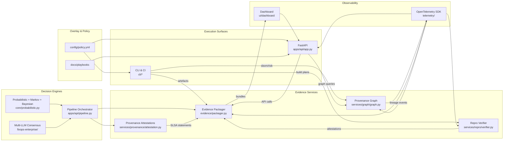

### Component interaction (ASCII)
The original README included an ASCII view showing how overlay configuration, FastAPI ingestion, and downstream automations connect. Keep it handy when whiteboarding with teams that prefer text-based diagrams.

```
┌────────────┐   auth/token   ┌───────────────────┐    artefact cache     ┌───────────────────────┐
│ CLI runner │──────────────▶│ FastAPI ingestion │──────────────────────▶│ Storage + evidence    │
│ core.cli   │               │  apps/api/app.py  │◀──────────────────────│ data/uploads/*        │
└────────────┘               └────────┬──────────┘     archive bundles    └──────────┬────────────┘
        ▲                              │                                   decrypt/compress │
        │ module toggles               │ orchestrate()                      ▼                │
        │                              ▼                            ┌─────────────┐        │
        │                      ┌───────────────────┐                │ Destinations│◀───────┘
        ├────────────────────▶│ Pipeline modules  │───────────────▶│ Jira/Slack │   automation manifests
        │                      │ context/guardrail │ ROI & telemetry │ GRC repos │
        │                      └────────┬──────────┘                └─────────────┘
        │                               │ enhanced_run()
        │                               ▼
        │                      ┌───────────────────┐
        └────────────────────▶│ Enhanced decision │
                               │ multi-LLM + KG   │
                               │ explanations     │
                               └───────────────────┘
```

## Capability matrix

| Capability | Primary modules | Why it exists | Inputs | Outputs | CI job | CLI / API |
| --- | --- | --- | --- | --- | --- | --- |
| SBOM normalisation & quality | `lib4sbom/normalizer.py`, `cli/fixops-sbom`, `reports/sbom_quality_report.html` | Standardise multi-generator SBOMs so risk, evidence, and audits consume deterministic data. | CycloneDX/SPDX files | `artifacts/sbom/normalized.json`, HTML report | `qa.yml` | `cli/fixops-sbom normalize`, `/sbom/quality` (HTML via evidence) |
| FixOpsRisk scoring | `risk/scoring.py`, `risk/feeds/*`, `backend/api/risk` | Blend EPSS, KEV, version lag, and exposure context to prioritise remediation. | Normalised SBOM + feeds | `artifacts/risk.json` | `qa.yml` | `cli/fixops-risk score`, `/risk/*` |
| Provenance attestations | `services/provenance/attestation.py`, `cli/fixops-provenance`, `.github/workflows/provenance.yml` | Provide verifiable SLSA v1 provenance for every release artefact. | Build metadata, materials | `artifacts/attestations/*.json` | `provenance.yml`, `release-sign.yml` | `cli/fixops-provenance attest/verify`, `/provenance/*` |
| Provenance graph | `services/graph/graph.py`, `backend/api/graph` | Answer lineage, KEV exposure, and downgrade anomaly questions quickly. | Git, attestations, SBOM, risk, releases | SQLite graph DB | `graph worker (scripts/graph_worker.py)` | `/graph/*` |
| Reproducible builds | `services/repro/verifier.py`, `cli/fixops-repro`, `.github/workflows/repro-verify.yml` | Prove binaries match source by re-building hermetically. | `build/plan.yaml`, release tags | `artifacts/repro/attestations/*.json` | `repro-verify.yml` | `cli/fixops-repro verify` |
| Evidence bundles | `evidence/packager.py`, `cli/fixops-ci`, `config/policy.yml` | Bundle signed proof (SBOM, risk, provenance, repro) for auditors. | Normalised artefacts, policies | Signed `evidence/*.zip` with `MANIFEST.yaml` | `release-sign.yml` | `cli/fixops-ci evidence bundle`, `/evidence/{release}` |
| Observability & demo | `telemetry/*`, `ui/dashboard`, `docker-compose.demo.yml` | Showcase posture to execs/CISOs with live metrics and dashboards. | Service telemetry, artefact metadata | Traces, metrics, demo UI | `qa.yml` | Dashboard, demo compose |
| Probabilistic & Bayesian analytics | `core/probabilistic.py`, `simulations/*` | Model remediation timelines and control health using Markov chains + Bayesian updates. | Risk outputs, historical incidents | Forecast JSON, dashboards | `qa.yml` | Consumed by orchestrator |
| Multi-LLM consensus | `fixops-enterprise/llm/*` | Provide AI-assisted triage and policy recommendations with consensus voting. | Risk + provenance context | Recommendations, summarised alerts | Enterprise workflows | API/CLI plug-ins |

## End-to-end data flow

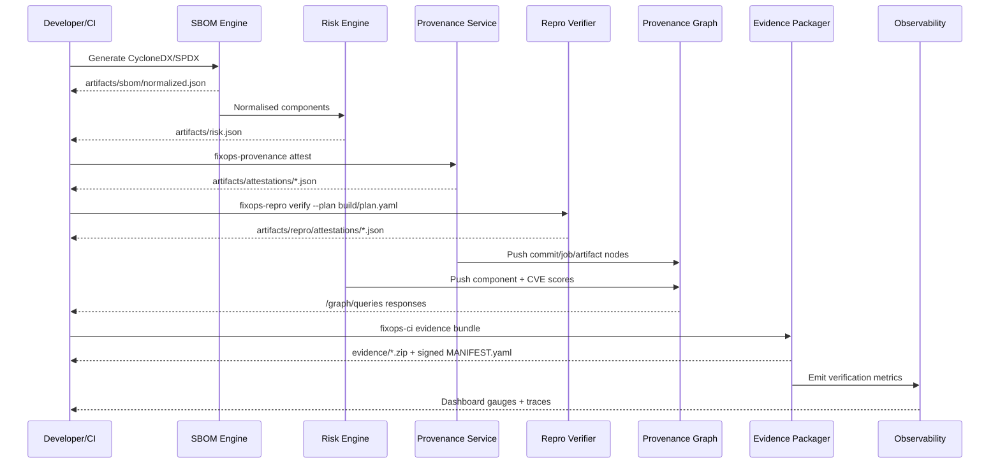

## Feature deep dives
Each subsection captures the “why / what / how / CI-CD fit / setup” rubric requested by reviewers in a consistent template.

### SBOM normalisation & quality scoring
#### 1. Why it exists
Harmonise heterogeneous SBOMs for deterministic downstream risk, evidence, and compliance pipelines.

#### 2. Primary implementation
- `lib4sbom/normalizer.py` ingests CycloneDX & SPDX, deduplicates components, and computes quality metrics.【F:lib4sbom/normalizer.py†L1-L330】
- `cli/fixops-sbom` exposes `normalize` and `quality` subcommands for CLI/CI usage.【F:cli/fixops_sbom.py†L1-L200】
- `tests/test_sbom_quality.py` guards parsing, dedupe, and HTML rendering regressions.【F:tests/test_sbom_quality.py†L1-L220】

#### 3. Data flow
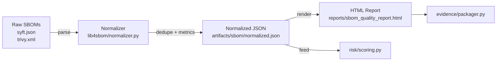

#### 4. Usage & setup
- **CLI**
  ```bash
  cli/fixops-sbom normalize --in fixtures/sbom/cyclonedx.json fixtures/sbom/spdx.json --out artifacts/sbom/normalized.json
  cli/fixops-sbom quality --in artifacts/sbom/normalized.json --html reports/sbom_quality_report.html
  ```
- **API**: HTML report surfaced through evidence bundle downloads.
- **CI/CD**: `qa.yml` runs SBOM tests; `release-sign.yml` bundles outputs for releases.【F:.github/workflows/qa.yml†L30-L160】【F:evidence/packager.py†L120-L220】

#### 5. Sample artefacts
| Input | Processing | Output |
| --- | --- | --- |
| `fixtures/sbom/cyclonedx.json` | Parsed CycloneDX → component keyed by `(purl, version, hash)` | `artifacts/sbom/normalized.json` component entry with merged generators |
| `fixtures/sbom/spdx.json` | SPDX ingestion → normalised license IDs | `analysis/sbom_quality_report.json` coverage metrics |
| Normalised JSON | Gauge rendering with Jinja templates | `reports/sbom_quality_report.html` interactive dashboard |

### Risk intelligence & FixOpsRisk
#### 1. Why it exists
Prioritise remediation by blending exploit probability (EPSS), KEV status, version lag, and exposure hints into a composite score.

#### 2. Primary implementation
- Feed updaters populate `data/feeds/epss.json` and `data/feeds/kev.json` from upstream sources.【F:risk/feeds/epss.py†L1-L200】【F:risk/feeds/kev.py†L1-L200】
- `risk/scoring.py` joins feeds with the normalised SBOM and emits FixOpsRisk metrics consumed by API, CLI, and evidence flows.【F:risk/scoring.py†L1-L360】
- CLI command `cli/fixops-risk score` automates scoring; API routers expose `/risk/component/{id}` and `/risk/cve/{id}`.【F:cli/fixops_risk.py†L1-L200】【F:backend/api/risk/router.py†L1-L160】

#### 3. Data flow
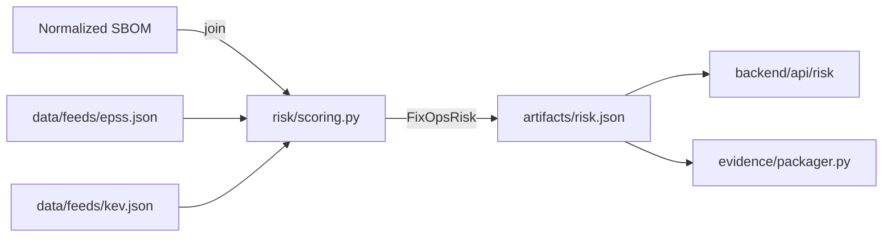

#### 4. Usage & setup
- **CLI**
  ```bash
  cli/fixops-risk score --sbom artifacts/sbom/normalized.json --out artifacts/risk.json
  ```
- **API**: `GET /risk/component/{purl}` or `GET /risk/cve/{cve_id}`.
- **CI/CD**: `qa.yml` runs unit tests; evidence bundler captures JSON; dashboard visualises EPSS/KEV tables.【F:tests/test_risk_scoring.py†L1-L200】【F:evidence/packager.py†L180-L260】【F:ui/dashboard/script.js†L1-L180】

#### 5. Sample artefacts
| Input | Processing | Output |
| --- | --- | --- |
| `data/feeds/epss.json` | EPSS updater fetches CSV → cached JSON with score percentile | Feed timestamp in risk payload |
| `data/feeds/kev.json` | CISA KEV importer marks exploited CVEs | `risk_summary.kev_present = true` |
| `artifacts/sbom/normalized.json` | Component map merged with feed metrics | `artifacts/risk.json` per-component `fixops_risk` score |

### Provenance attestations & signing
#### 1. Why it exists
Guarantee downstream consumers can verify the supply-chain lineage for every build artefact.

#### 2. Primary implementation
- `services/provenance/attestation.py` models SLSA statements and validation logic.【F:services/provenance/attestation.py†L1-L320】
- `cli/fixops-provenance` provides `attest` and `verify` subcommands for local or CI workflows.【F:cli/fixops_provenance.py†L1-L220】
- GitHub Actions workflows emit attestations and cosign signatures on tagged releases; docs explain schema and verification flows.【F:.github/workflows/provenance.yml†L1-L120】【F:.github/workflows/release-sign.yml†L1-L200】【F:docs/PROVENANCE.md†L1-L180】【F:docs/SIGNING.md†L1-L160】

#### 3. Data flow
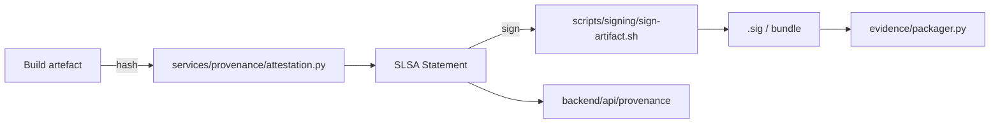

#### 4. Usage & setup
- **CLI**
  ```bash
  cli/fixops-provenance attest --artifact dist/fixops.tar.gz --out artifacts/attestations/fixops.json
  cli/fixops-provenance verify --artifact dist/fixops.tar.gz --attestation artifacts/attestations/fixops.json
  ```
- **API**: `GET /provenance/artifacts/{name}` returns SLSA statements.【F:backend/api/provenance/router.py†L1-L120】
- **CI/CD**: `provenance.yml` attaches attestations; `release-sign.yml` signs and verifies bundles.【F:.github/workflows/provenance.yml†L1-L120】【F:.github/workflows/release-sign.yml†L1-L200】

#### 5. Sample artefacts
| Input | Processing | Output |
| --- | --- | --- |
| `dist/fixops.tar.gz` | SHA-256 digest + metadata capture | `artifacts/attestations/fixops.json` SLSA predicate |
| `COSIGN_PRIVATE_KEY` (secret) | Detached signature via cosign script | `dist/fixops.tar.gz.sig` |
| Attestation + signature | Verification CLI ensures digest parity | `verify` exit code 0 |

### Provenance graph service
#### 1. Why it exists
Provide a queryable knowledge graph linking commits, CI jobs, artefacts, SBOM components, and CVEs to speed investigations.

#### 2. Primary implementation
- `services/graph/graph.py` builds a SQLite database and NetworkX overlay from git metadata, attestations, SBOM components, and risk scores.【F:services/graph/graph.py†L1-L560】
- FastAPI router `backend/api/graph` exposes lineage, KEV regression, and anomaly queries; docs describe schema and usage.【F:backend/api/graph/router.py†L1-L200】【F:docs/PROVENANCE-GRAPH.md†L1-L160】
- Worker `scripts/graph_worker.py` orchestrates ingestion; tests validate graph building and query correctness.【F:scripts/graph_worker.py†L1-L160】【F:services/graph/tests/test_graph.py†L1-L160】

#### 3. Data flow
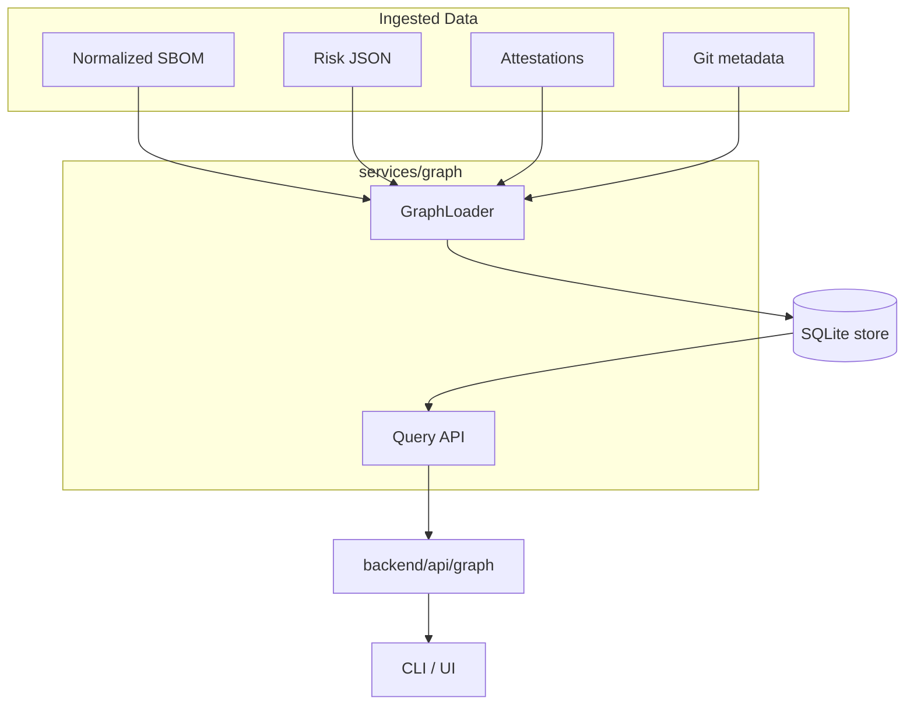

#### 4. Usage & setup
- **Worker**
  ```bash
  python -m scripts.graph_worker --sbom artifacts/sbom/normalized.json --risk artifacts/risk.json --attestations artifacts/attestations/
  ```
- **API**: `GET /graph/lineage?artifact=...`, `GET /graph/kev-components?n=3`, `GET /graph/anomalies` return JSON payloads with nodes/edges and anomaly explanations.【F:backend/api/graph/router.py†L1-L200】
- **CI/CD**: QA tests assert lineage + KEV behaviours; evidence bundles embed query snapshots; telemetry traces ingestion success.【F:services/graph/tests/test_graph.py†L1-L160】【F:evidence/packager.py†L220-L280】【F:telemetry/__init__.py†L80-L140】

#### 5. Sample artefacts
| Input | Processing | Output |
| --- | --- | --- |
| `git rev-list --max-count=50` | Commit metadata parsed into nodes | `graph.db` release lineage |
| `artifacts/risk.json` | KEV flags mark high-risk components | Query result JSON with `kev_alerts` |
| `/graph/anomalies?limit=5` | Semantic diff vs previous release | API payload with downgraded versions |

### Reproducible build verification
#### 1. Why it exists
Ensure published artefacts can be recreated byte-for-byte from source via hermetic rebuilds.

#### 2. Primary implementation
- `services/repro/verifier.py` executes hermetic build plans, diffs digests, and emits attestations.【F:services/repro/verifier.py†L1-L320】
- CLI `cli/fixops-repro verify` orchestrates local rebuilds; workflow `repro-verify.yml` can run nightly; docs cover configuration & troubleshooting.【F:cli/fixops_repro.py†L1-L180】【F:.github/workflows/repro-verify.yml†L1-L120】【F:docs/REPRO-BUILDS.md†L1-L160】
- `build/plan.yaml` declares deterministic commands and expected artefacts.【F:build/plan.yaml†L1-L80】

#### 3. Data flow
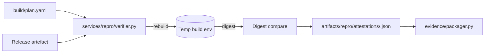

#### 4. Usage & setup
- **CLI**
  ```bash
  cli/fixops-repro verify --tag v1.2.3 --plan build/plan.yaml
  ```
- **API**: Repro status surfaced in FastAPI router (`apps/api/app.py`).【F:apps/api/app.py†L1-L172】
- **CI/CD**: QA suite includes pass/fail toy plans; `repro-verify.yml` enables scheduled rebuild validation.【F:services/repro/tests/test_verifier.py†L1-L160】【F:.github/workflows/repro-verify.yml†L1-L120】

#### 5. Sample artefacts
| Input | Processing | Output |
| --- | --- | --- |
| `build/plan.yaml` | Hermetic steps executed in temp dir | `artifacts/repro/tmp/<tag>/` scratch workspace |
| `dist/fixops.tar.gz` | Digest computed with SHA-256 | `attestation.predicate.subject[].digest.sha256` |
| Rebuild digest | DSSE envelope created | `artifacts/repro/attestations/<tag>.json` |

### Evidence bundles & CI agent
#### 1. Why it exists
Offer a single command to package SBOM, risk, provenance, and repro evidence, sign it, and hand it to auditors.

#### 2. Primary implementation
- `cli/fixops-ci` aggregates SBOM normalisation, quality scoring, risk scoring, provenance, and reproducible build verification while applying `config/policy.yml` thresholds.【F:cli/fixops_ci.py†L1-L320】【F:config/policy.yml†L1-L160】
- `evidence/packager.py` assembles signed ZIP bundles with `MANIFEST.yaml`; API exposes `/evidence/{release}` for retrieval.【F:evidence/packager.py†L1-L320】【F:backend/api/evidence/router.py†L1-L140】
- Docs outline auditor workflows and CI secrets required for signing.【F:docs/EVIDENCE-BUNDLES.md†L1-L200】【F:docs/CI-SECRETS.md†L1-L120】

#### 3. Data flow
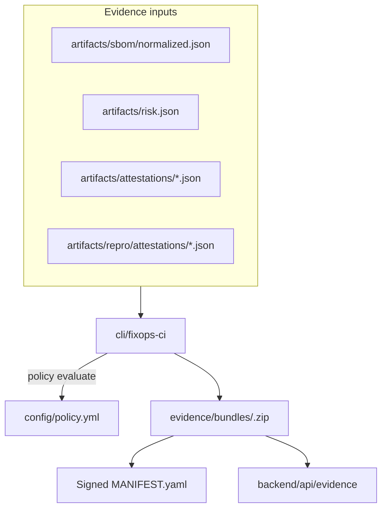

#### 4. Usage & setup
- **CLI**
  ```bash
  cli/fixops-ci sbom normalize --in fixtures/sbom/cyclonedx.json fixtures/sbom/spdx.json --out artifacts/sbom/normalized.json
  cli/fixops-ci risk score --sbom artifacts/sbom/normalized.json --out artifacts/risk.json
  cli/fixops-ci evidence bundle --release v1.2.3
  ```
- **API**: `GET /evidence/{release}` streams signed bundle ZIP.【F:backend/api/evidence/router.py†L1-L140】
- **CI/CD**: Release workflow generates bundles; QA tests assert manifest signing and policy evaluation.【F:.github/workflows/release-sign.yml†L120-L200】【F:tests/test_evidence_bundle.py†L1-L220】

#### 5. Sample artefacts
| Input | Processing | Output |
| --- | --- | --- |
| `config/policy.yml` | Threshold evaluation (coverage ≥ 70%, risk ceilings) | CLI exit codes & policy report |
| `artifacts/sbom/normalized.json` + `artifacts/risk.json` | Aggregated by `fixops-ci` | `evidence/workdir/<release>/` staging area |
| Staged artefacts + cosign key | Manifest hashed & signed | `evidence/bundles/<release>.zip` |

### SSDLC lifecycle evaluation
#### 1. Why it exists
Demonstrate secure software development lifecycle coverage with deterministic artefacts that auditors can diff across releases. The SSDLC evaluator transforms raw design, control, SBOM, SARIF, infrastructure-as-code, and exploit-signal inputs into stage-specific JSON payloads for downstream dashboards and the enterprise API.

#### 2. Primary implementation
- `apps/fixops_cli/__main__.py` exposes the canonical stage runner (`python -m apps.fixops_cli stage-run`) that orchestrates SSDLC processing with signing/verification toggles for CI pipelines.【F:apps/fixops_cli/__main__.py†L1-L118】
- `core/ssdlc.py` parses overlay-defined lifecycle requirements and evaluates them against pipeline artefacts, returning per-stage status summaries.【F:core/ssdlc.py†L1-L170】
- `apps/api/pipeline.py` invokes the evaluator when the overlay enables SSDLC checks, wiring results into the broader decision pipeline response.【F:apps/api/pipeline.py†L835-L863】
- `simulations/ssdlc/run.py` provides the CLI used during demos and tests to materialise canonical stage outputs with optional overlays.【F:simulations/ssdlc/run.py†L1-L239】
- `tests/test_ssdlc_runner.py` ensures every stage command emits the correct filenames and supports `--stage all` generation.【F:tests/test_ssdlc_runner.py†L35-L59】

#### 3. Data flow
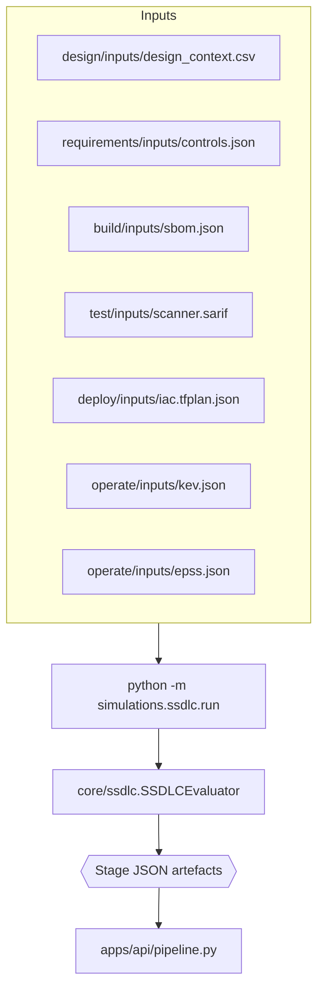

#### 4. Usage & stage-by-stage inputs/outputs
- **CLI skeleton**
  ```bash
  python -m simulations.ssdlc.run --stage <stage> --out artifacts/ssdlc
  python -m simulations.ssdlc.run --stage all --out artifacts/ssdlc --overlay config/ssdlc.overlay.json
  ```
- **Stage matrix**

| Stage (`--stage …`) | Required inputs | Generated output | What the payload captures |
| --- | --- | --- | --- |
| `design` | `simulations/ssdlc/design/inputs/design_context.csv` | `design_crosswalk.json` | Service exposure summary plus any overlay-injected risk annotations for architecture reviews.【F:simulations/ssdlc/run.py†L85-L101】 |
| `requirements` | `simulations/ssdlc/requirements/inputs/controls.json` | `policy_plan.json` | Normalised control map detailing satisfied vs. in-progress guardrails.【F:simulations/ssdlc/run.py†L104-L117】 |
| `build` | `simulations/ssdlc/build/inputs/sbom.json` | `component_index.json` | Component manifest aligned to SBOM entries for dependency governance.【F:simulations/ssdlc/run.py†L119-L141】 |
| `test` | `simulations/ssdlc/test/inputs/scanner.sarif` | `normalized_findings.json` | Tool list and severity histogram derived from SARIF scanners for QA sign-off.【F:simulations/ssdlc/run.py†L144-L174】 |
| `deploy` | `simulations/ssdlc/deploy/inputs/iac.tfplan.json` | `iac_posture.json` | Terraform change analysis showing exposed ports and internet-facing resources.【F:simulations/ssdlc/run.py†L177-L205】 |
| `operate` | `simulations/ssdlc/operate/inputs/kev.json`, `simulations/ssdlc/operate/inputs/epss.json` | `exploitability.json` | KEV/EPSS fusion that flags urgent operational response priorities.【F:simulations/ssdlc/run.py†L207-L231】 |

#### 5. Sample artefacts & downstream usage
- `python -m apps.fixops_cli stage-run --stage <stage> --input <artefact> --app <name>` mirrors the API execution path, ensuring canonical artefacts land in `artefacts/<app>/<stage>/` for SSDLC evidence, signing, and transparency index capture.【F:apps/fixops_cli/__main__.py†L48-L118】【F:core/stage_runner.py†L214-L413】
- `--stage all` prints a JSON map of every generated file, which can be zipped into evidence bundles or imported into dashboards.【F:simulations/ssdlc/run.py†L234-L239】【F:tests/test_ssdlc_runner.py†L45-L59】
- The pipeline API surfaces `ssdlc_assessment.summary` counts so CI gates and overlays can assert minimum lifecycle coverage.【F:apps/api/pipeline.py†L846-L860】
- Evidence bundles embed each stage artefact alongside provenance, risk, and repro proof, giving auditors lifecycle-to-release traceability.【F:evidence/packager.py†L180-L260】

### Probabilistic forecasting, Markov & Bayesian analytics
#### 1. Why it exists
Quantify future severity drift and escalation pressure with explainable probabilistic models for leadership planning.

#### 2. Primary implementation
- `core/probabilistic.py.ProbabilisticForecastEngine` implements Dirichlet priors, Markov transitions, and Bayesian posteriors.【F:core/probabilistic.py†L1-L360】
- Tests calibrate forecasting accuracy; pipeline integrates outputs for decisioning surfaces.【F:tests/test_probabilistic.py†L1-L120】【F:apps/api/pipeline.py†L850-L950】

#### 3. Data flow
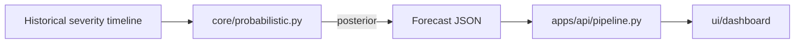

#### 4. Usage & setup
- **Script**
  ```python
  from core.probabilistic import ProbabilisticForecastEngine
  engine = ProbabilisticForecastEngine()
  forecast = engine.evaluate(history=[{"component": "service-a", "severities": ["medium", "high"]}])
  ```
- **CI/CD**: QA runs probabilistic tests; dashboards visualise escalation signals; docs provide transparency for regulators.【F:tests/test_probabilistic.py†L1-L120】【F:ui/dashboard/script.js†L80-L180】【F:docs/ARCH-INVENTORY.md†L20-L120】

#### 5. Sample artefacts
| Input | Processing | Output |
| --- | --- | --- |
| Severity history JSON | Transition calibration | Forecast posterior JSON |
| Incident CSV | Bayesian update | Updated risk trajectory |
| Forecast output | Dashboard ingestion | Executive readiness gauges |

### Multi-LLM consensus
#### 1. Why it exists
Blend deterministic heuristics with LLM reasoning while capturing audit trails for AI-assisted decisions.

#### 2. Primary implementation
- Enterprise enhancements call optional OpenAI/Anthropic/Gemini providers via `fixops-enterprise/src/services/enhanced_decision_engine.py`; results are reconciled with deterministic context and logged for transparency.【F:fixops-enterprise/src/services/enhanced_decision_engine.py†L1-L200】【F:fixops-enterprise/src/api/v1/enhanced.py†L1-L200】

#### 3. Data flow
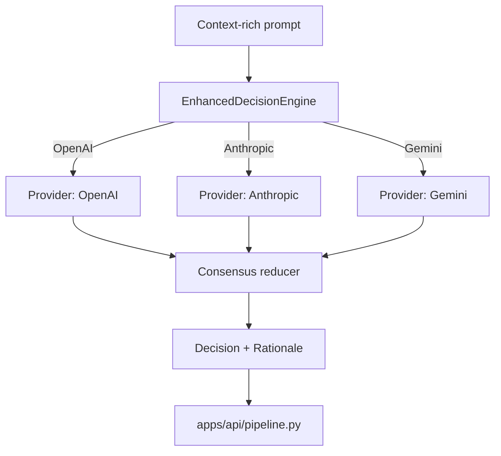

#### 4. Usage & setup
- Configure provider keys in environment variables referenced by enterprise overlay.
- Call enterprise API endpoints or CLI overlays to obtain consensus responses.
- Evidence bundles archive LLM rationales when policy requires.【F:docs/EVIDENCE-BUNDLES.md†L120-L200】

#### 5. Sample artefacts
| Input | Processing | Output |
| --- | --- | --- |
| Risk + provenance context | Prompt enrichment across providers | Consensus rationale |
| Reviewer query | LLM fan-out + voting | Ranked recommendation |
| Policy template | Completion with citations | Draft report |

### Observability & demo stack
#### 1. Why it exists
Provide investors and CISOs with a one-command experience to view risk posture, provenance status, and reproducible build health.

#### 2. Primary implementation
- OpenTelemetry wiring with no-op fallbacks in `telemetry/` ensures metrics even in air-gapped runs.【F:telemetry/__init__.py†L1-L160】
- Dashboard UI under `ui/dashboard/` visualises SBOM quality, EPSS/KEV tables, provenance, and repro status.【F:ui/dashboard/script.js†L1-L180】【F:ui/dashboard/index.html†L1-L160】
- `docker-compose.demo.yml` orchestrates backend, graph worker, dashboard, and collector; docs include screenshots and tour script.【F:docker-compose.demo.yml†L1-L80】【F:docs/DEMO.md†L1-L200】

#### 3. Data flow
- Telemetry spans flow to `config/otel-collector-demo.yaml` collector when environment variables are set.【F:config/otel-collector-demo.yaml†L1-L80】
- Dashboard polls API endpoints for SBOM quality, risk, provenance, and repro status visualisations.【F:ui/dashboard/script.js†L40-L180】

#### 4. Usage & setup
```bash
docker compose -f docker-compose.demo.yml up
open http://localhost:8080  # dashboard
```

#### 5. Sample artefacts
| Input | Processing | Output |
| --- | --- | --- |
| Telemetry spans | Export via OTLP collector | Grafana/Jaeger traces |
| API metrics | Dashboard polling | Gauges + tables |
| Demo compose file | docker compose up | Running investor demo stack |

### Security posture & compliance guardrails
#### 1. Why it exists
Align engineering, security, and audit teams on operational procedures, signed releases, and branch protections.

#### 2. Primary implementation
- Playbooks for developers, security, and auditors plus overarching security posture guide.【F:docs/PLAYBOOK-DEV.md†L1-L160】【F:docs/PLAYBOOK-SEC.md†L1-L160】【F:docs/PLAYBOOK-AUDIT.md†L1-L120】【F:docs/SECURITY-POSTURE.md†L1-L160】
- CI enforcing formatting, linting, typing, and coverage ≥ 70% with QA workflow; changelog capturing Phase 1–10 milestones.【F:.github/workflows/qa.yml†L1-L160】【F:CHANGELOG.md†L1-L160】
- Release workflows attach provenance and evidence for auditors.【F:.github/workflows/release-sign.yml†L1-L200】

#### 3. Usage & setup
- Follow playbooks for role-specific response steps.
- Enable branch protection + signed commits per `docs/SECURITY-POSTURE.md`.
- Provision Dependabot and required secrets listed in `docs/CI-SECRETS.md`.

#### 4. Sample artefacts
| Input | Processing | Output |
| --- | --- | --- |
| QA workflow | Run lint, type, coverage gates | ≥70% coverage + green checks |
| Signed commit policy | GitHub branch protection | Enforced review gates |
| Evidence manifest | Embedded signed artefact references | Audit-ready bundle |

## CLI entry points
| Command | Capabilities | Notes |
| --- | --- | --- |
| `python -m apps.fixops_cli stage-run` | SSDLC stage canonicalisation (`requirements`→`decision`) | Wraps `core.stage_runner.StageRunner` to normalise inputs, mint run IDs, optionally sign outputs, and emit canonical artefacts reused by downstream pipelines.【F:apps/fixops_cli/__main__.py†L1-L118】【F:core/stage_runner.py†L214-L413】 |
| `cli/fixops-sbom` | `normalize`, `quality` | Normalises SBOMs and generates HTML/JSON quality artefacts.【F:cli/fixops_sbom.py†L1-L200】 |
| `cli/fixops-risk` | `score` | Emits `artifacts/risk.json` from normalised SBOMs and cached feeds.【F:cli/fixops_risk.py†L1-L200】 |
| `cli/fixops-provenance` | `attest`, `verify` | Generates and validates SLSA v1 provenance statements.【F:cli/fixops_provenance.py†L1-L220】 |
| `cli/fixops-repro` | `verify` | Runs hermetic rebuild plans and writes reproducible build attestations.【F:cli/fixops_repro.py†L1-L180】 |
| `cli/fixops-ci` | `attest`, `bundle`, `evidence`, etc. | Aggregates SBOM, risk, provenance, and repro tasks with policy enforcement.【F:cli/fixops_ci.py†L1-L320】 |

## API surface
| Endpoint | Description | Router |
| --- | --- | --- |
| `GET /provenance/{artifact}` | Return stored SLSA attestation JSON for the requested artefact.【F:backend/api/provenance/router.py†L1-L120】 | `backend/api/provenance/router.py` |
| `GET /risk/component/{component_id}` | Fetch FixOpsRisk breakdown for a component ID.【F:backend/api/risk/router.py†L60-L120】 | `backend/api/risk/router.py` |
| `GET /risk/cve/{cve_id}` | Fetch FixOpsRisk breakdown for a CVE ID.【F:backend/api/risk/router.py†L120-L160】 | `backend/api/risk/router.py` |
| `GET /graph/lineage` | Resolve provenance lineage for an artefact path.【F:backend/api/graph/router.py†L80-L140】 | `backend/api/graph/router.py` |
| `GET /graph/kev-components` | List components with KEV CVEs across recent releases.【F:backend/api/graph/router.py†L140-L180】 | `backend/api/graph/router.py` |
| `GET /graph/anomalies` | Surface downgrade/version drift anomalies detected in the graph.【F:backend/api/graph/router.py†L180-L200】 | `backend/api/graph/router.py` |
| `GET /evidence/{release}` | Retrieve evidence bundle metadata for a release tag.【F:backend/api/evidence/router.py†L80-L140】 | `backend/api/evidence/router.py` |

## CI/CD automation
| Workflow | Trigger | Outputs |
| --- | --- | --- |
| `provenance.yml` | Tag pushes/releases | Generates and uploads SLSA v1 attestation JSON to release assets.【F:.github/workflows/provenance.yml†L1-L120】 |
| `release-sign.yml` | Release publishing | Builds artefacts, signs them with cosign, verifies bundles, uploads signatures and evidence.【F:.github/workflows/release-sign.yml†L1-L200】 |
| `repro-verify.yml` | Nightly/cron optional | Runs hermetic rebuilds and uploads reproducible build attestations.【F:.github/workflows/repro-verify.yml†L1-L120】 |
| `qa.yml` | Pull requests & pushes | Formats, lints, type-checks, runs targeted tests, enforces ≥70% coverage, uploads reports.【F:.github/workflows/qa.yml†L1-L160】 |

## Setup & verification checklists
1. **Bootstrap dependencies**
   ```bash
   pip install -r requirements.txt
   pip install -r requirements.dev.txt
   export PYTHONPATH=$(pwd)
   ```
2. **Provision environment variables**
   - Copy `.env.example` → `.env` for local stacks; configure optional OpenTelemetry, LLM, and signing secrets as needed.【F:docs/PLAYBOOK-DEV.md†L40-L120】
3. **Run end-to-end demo**
   ```bash
   docker compose -f docker-compose.demo.yml up --build
   ```
4. **Generate artefacts locally**
   ```bash
   cli/fixops-sbom normalize --in fixtures/sbom/demo.json --out artifacts/sbom/normalized.json
   cli/fixops-sbom quality --in artifacts/sbom/normalized.json --html reports/sbom_quality_report.html
   cli/fixops-risk score --sbom artifacts/sbom/normalized.json --out artifacts/risk.json
   cli/fixops-provenance attest --artifact dist/fixops.tar.gz --out artifacts/attestations/fixops.json
   cli/fixops-repro verify --tag v1.2.3 --plan build/plan.yaml
   cli/fixops-ci bundle --release v1.2.3 --output evidence/bundles/v1.2.3.zip
   ```
5. **Validate quality gates**
   ```bash
   pytest
   ```
6. **Review artefacts**
   - Inspect `reports/sbom_quality_report.html`, `artifacts/risk.json`, provenance attestations, reproducible build outputs, and evidence bundles before releasing.

### Stage-by-stage CLI workflow
Reproduced from the root README, this table maps canonical SSDLC artefacts to the CLI stage runner and highlights which processor handles each stage.

| Stage | Demo input | Command | Processor |
| --- | --- | --- | --- |
| Requirements | `simulations/demo_pack/requirements-input.csv` | `python -m apps.fixops_cli stage-run --stage requirements --input simulations/demo_pack/requirements-input.csv --app life-claims-portal` | `_process_requirements` parses CSV/JSON, mints `Requirement_ID`, and applies SSVC anchoring. |
| Design | `simulations/demo_pack/design-input.json` | `python -m apps.fixops_cli stage-run --stage design --input simulations/demo_pack/design-input.json --app life-claims-portal` | `_process_design` hydrates IDs via `ensure_ids` and annotates component risk. |
| Build | `simulations/demo_pack/sbom.json` | `python -m apps.fixops_cli stage-run --stage build --input simulations/demo_pack/sbom.json --app life-claims-portal` | `_process_build` normalises with `apps.api.normalizers.InputNormalizer` and flags risky components. |
| Test | `simulations/demo_pack/scanner.sarif` | `python -m apps.fixops_cli stage-run --stage test --input simulations/demo_pack/scanner.sarif --app life-claims-portal` | `_process_test` ingests SARIF, folds in coverage, and derives drift metrics. |
| Deploy | `simulations/demo_pack/tfplan.json` | `python -m apps.fixops_cli stage-run --stage deploy --input simulations/demo_pack/tfplan.json --app life-claims-portal` | `_process_deploy` accepts Terraform/Kubernetes manifests and extracts guardrail evidence. |
| Operate | `simulations/demo_pack/ops-telemetry.json` | `python -m apps.fixops_cli stage-run --stage operate --input simulations/demo_pack/ops-telemetry.json --app life-claims-portal` | `_process_operate` blends telemetry with KEV/EPSS feeds to compute pressure. |
| Decision | *(auto-discovers prior outputs)* | `python -m apps.fixops_cli stage-run --stage decision --app life-claims-portal` | `_process_decision` synthesises stage outputs, bundles evidence, and emits explainable verdicts. |

### Automated verification matrix

| Capability | Command | Validates | Sample Output |
| --- | --- | --- | --- |
| SBOM quality | `cli/fixops-sbom normalize ... && cli/fixops-sbom quality ...` | Normalisation, dedupe, metric computation, HTML reporting | `reports/sbom_quality_report.html` (gauge ≥ 0.85 coverage) |
| Risk scoring | `cli/fixops-risk score ...` | Feed ingestion, FixOpsRisk calculation, API-ready JSON | `artifacts/risk.json` with `fixops_risk: 0.72` sample |
| Provenance | `cli/fixops-provenance attest ... && cli/fixops-provenance verify ...` | SLSA v1 schema correctness, hash parity, verification | `verify` exit `0`, `materials[*].uri` populated |
| Evidence bundle | `cli/fixops-ci bundle ...` | Policy enforcement, manifest signing, bundle assembly | `evidence/bundles/v1.2.3.zip` containing `MANIFEST.yaml.sig` |
| Repro builds | `cli/fixops-repro verify ...` | Hermetic rebuild, digest parity, attestation emission | `artifacts/repro/attestations/v1.2.3.json` with `result: "verified"` |
| Graph queries | `python -m scripts.graph_worker ...` + `curl /graph/...` | Lineage, KEV regression, anomaly detection | `/graph/kev-components?releases=3` returns CVE list |
| Demo stack | `docker compose -f docker-compose.demo.yml up` | Backend + dashboard + OTEL collector health | Dashboard cards green, OTEL collector logs spans |

## Reference documents
For further context dive into:
- Architecture inventory (`docs/ARCH-INVENTORY.md`)
- Provenance schema (`docs/PROVENANCE.md`)
- Risk scoring formula (`docs/RISK-SCORING.md`)
- SBOM quality guide (`docs/SBOM-QUALITY.md`)
- Evidence bundles (`docs/EVIDENCE-BUNDLES.md`)
- Demo walkthrough (`docs/DEMO.md`)
- Playbooks & security posture (`docs/PLAYBOOK-*.md`, `docs/SECURITY-POSTURE.md`)
- CHANGELOG for the Phase 1–10 delivery narrative (`CHANGELOG.md`)
